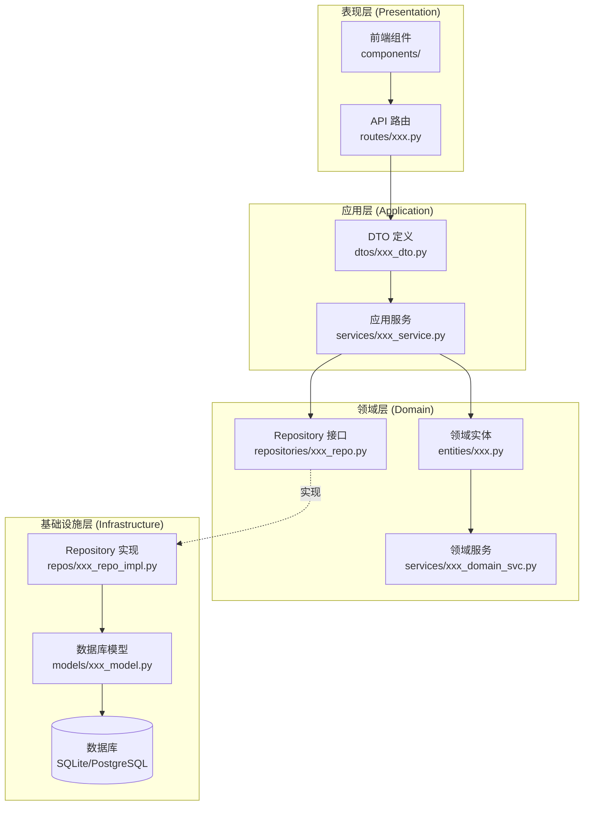
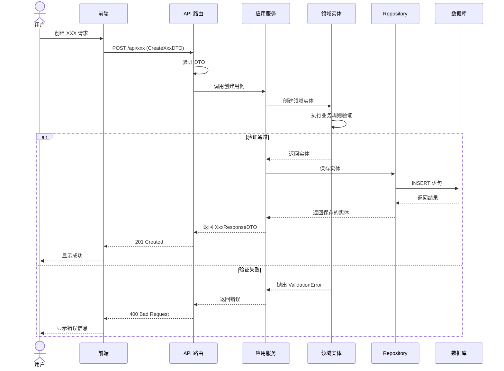
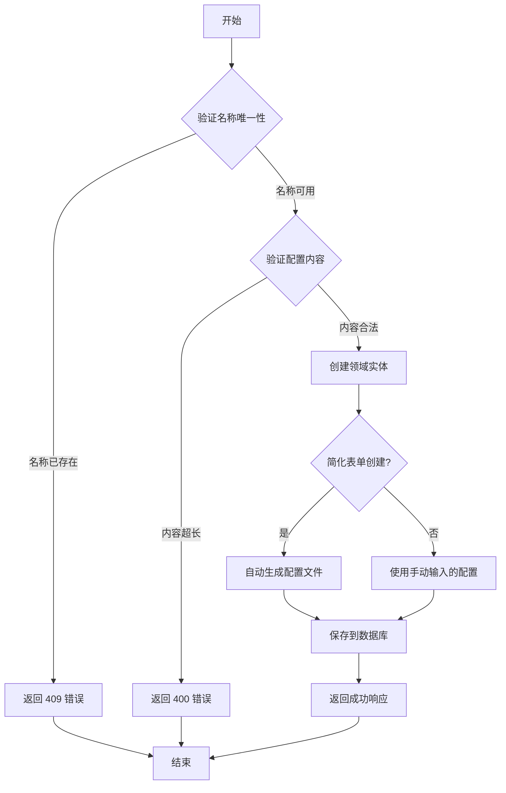

# DDD 模块技术方案设计器

用于指导如何为 DDD 项目中的功能模块编写完整的技术方案文档。

## 使用场景

- 设计新功能模块
- 编写技术方案文档
- 规划 DDD 模块实现
- 新功能开发前的架构设计

## 设计流程

### 步骤 1: 明确模块范围

首先明确模块的边界和职责：

```markdown
## 1. 范围

本模块负责 [功能描述]，聚焦于 [领域概念]：
- [功能点 1]
- [功能点 2]
- [功能点 3]

**不包含**：
- [明确排除的功能]
- [后续迭代的功能]
- [其他模块负责的功能]
```

**关键问题：**
- 这个模块属于定义域还是运行域？
- 与其他模块的职责边界在哪里？
- 哪些功能明确不包含在当前迭代？

### 步骤 2: 概要设计

#### 2.1 主流程

**要求：** 必须包含模块架构图，并根据需要使用 Mermaid 时序图、流程图来说明主流程以及各个模块之间的关系。

##### 2.1.1 模块架构图

使用 Mermaid 图形展示模块之间的依赖关系：

````markdown

````

**依赖关系说明：**
- 表现层 → 应用层：API 路由调用应用服务
- 应用层 → 领域层：应用服务依赖领域实体和 Repository 接口
- 基础设施层 → 领域层：Repository 实现依赖领域接口（依赖倒置）
- 领域层不依赖任何其他层（纯业务逻辑）

##### 2.1.2 主流程时序图

使用 Mermaid 时序图展示核心业务流程：

````markdown

````

##### 2.1.3 关键流程图

对于复杂业务，使用流程图展示决策流程：

````markdown

````

**图表使用指南：**
- **模块架构图**：必须包含，展示四层架构和依赖关系
- **时序图**：用于展示 API 请求的完整生命周期，特别是涉及多层交互的场景
- **流程图**：用于展示包含分支、条件判断的复杂业务流程

#### 2.2 功能模块设计

按**功能模块**划分（不是代码分层）：

```markdown
### 2.2 模块说明

#### 2.2.1 [功能模块 A]

**职责**：[模块的主要功能]

**功能**：
- [功能点 1]
- [功能点 2]

**涉及文件**：
- 后端：`backend/src/domain/entities/xxx.py`
- 后端：`backend/src/application/dtos/xxx_dto.py`
- 前端：`frontend/src/presentation/components/Xxx.tsx`

#### 2.2.2 [功能模块 B]
...
```

**功能模块划分原则：**
- 按业务功能划分，不是按代码层划分
- 每个模块有明确的职责
- 列出涉及的关键文件路径

### 步骤 3: 详细设计 - 接口设计

#### 3.1 API 端点

使用表格列出所有 API：

```markdown
#### 3.1.1 API 端点

| 方法 | 路径 | 说明 | 请求体 | 响应体 | 状态码 |
|------|------|------|--------|--------|--------|
| POST | /api/xxx | 创建 XXX | CreateXxxDTO | XxxResponseDTO | 201/409 |
| GET | /api/xxx | XXX 列表 | - | XxxListResponseDTO | 200 |
| GET | /api/xxx/{id} | XXX 详情 | - | XxxResponseDTO | 200/404 |
| PUT | /api/xxx/{id} | 更新 XXX | UpdateXxxDTO | XxxResponseDTO | 200/404 |
| DELETE | /api/xxx/{id} | 删除 XXX | - | - | 204/404 |
```

#### 3.2 DTO 定义

为每个 API 定义数据传输对象：

```python
class CreateXxxDTO(BaseModel):
    field1: str = Field(..., min_length=1, max_length=100)
    field2: Optional[str] = Field(None, max_length=500)
    
class UpdateXxxDTO(BaseModel):
    # PATCH 语义，所有字段可选
    field1: Optional[str] = Field(None, min_length=1, max_length=100)
    
class XxxResponseDTO(BaseModel):
    id: str
    field1: str
    created_at: str
    updated_at: Optional[str]
```

**DTO 设计原则：**
- 使用 Pydantic 进行数据验证
- 明确必填字段和可选字段
- 设置合理的长度限制
- CreateDTO 和 UpdateDTO 分离（Update 所有字段可选）

### 步骤 4: 详细设计 - 数据库设计

#### 4.1 表结构设计

根据需求选择单表或多表设计：

```sql
CREATE TABLE xxx (
    -- 主键
    id VARCHAR(36) PRIMARY KEY,
    
    -- 基本信息
    name VARCHAR(100) NOT NULL UNIQUE,
    description TEXT NOT NULL DEFAULT '',
    
    -- 业务字段
    status VARCHAR(50) NOT NULL DEFAULT 'active',
    
    -- 时间戳
    created_at DATETIME NOT NULL DEFAULT (datetime('now')),
    updated_at DATETIME NOT NULL DEFAULT (datetime('now'))
);
```

#### 4.2 字段说明

| 字段 | 类型 | 默认值 | 说明 |
|------|------|--------|------|
| `id` | VARCHAR(36) | UUID | 主键，使用 UUID |
| `name` | VARCHAR(100) | - | 名称，唯一索引 |
| `status` | VARCHAR(50) | 'active' | 状态枚举 |
| `created_at` | DATETIME | now() | 创建时间 |
| `updated_at` | DATETIME | now() | 更新时间 |

#### 4.3 索引设计

```sql
-- 唯一索引
CREATE UNIQUE INDEX idx_xxx_name ON xxx(name);

-- 查询索引
CREATE INDEX idx_xxx_status ON xxx(status);
CREATE INDEX idx_xxx_created_at ON xxx(created_at DESC);
```

#### 4.4 SQLAlchemy 模型

```python
class XxxModel(Base):
    __tablename__ = "xxx"
    
    id = Column(String(36), primary_key=True)
    name = Column(String(100), unique=True, nullable=False, index=True)
    description = Column(Text, nullable=False, default="")
    status = Column(String(50), nullable=False, default="active")
    
    created_at = Column(DateTime, nullable=False, server_default=func.datetime('now'))
    updated_at = Column(DateTime, nullable=False, server_default=func.datetime('now'), onupdate=func.datetime('now'))
```

#### 4.5 领域实体

```python
@dataclass
class Xxx:
    id: str
    name: str
    description: str = ""
    status: str = "active"
    created_at: datetime = field(default_factory=datetime.utcnow)
    updated_at: Optional[datetime] = None
    
    def activate(self) -> None:
        """领域行为：激活"""
        self.status = "active"
```

#### 4.6 Repository 接口

```python
class IXxxRepository(ABC):
    @abstractmethod
    async def create(self, entity: Xxx) -> Xxx:
        pass
    
    @abstractmethod
    async def get_by_id(self, id: str) -> Optional[Xxx]:
        pass
    
    @abstractmethod
    async def list(self, page: int = 1, page_size: int = 20) -> tuple[List[Xxx], int]:
        pass
    
    @abstractmethod
    async def update(self, entity: Xxx) -> Xxx:
        pass
    
    @abstractmethod
    async def delete(self, id: str) -> bool:
        pass
```

### 步骤 5: 详细设计 - 前端设计

#### 5.1 页面结构

```markdown
#### 5.1.1 页面结构

**XxxManagementPage**（/xxx）
- 列表表格
- 创建按钮
- 搜索和过滤
- 操作按钮（编辑、删除）

**XxxEditPage**（/xxx/new, /xxx/:id/edit）
- 基本信息表单
- 保存/取消按钮
```

#### 5.2 组件清单

| 组件 | 职责 |
|------|------|
| XxxList | 列表表格展示 |
| XxxForm | 基本信息表单 |
| DeleteXxxDialog | 删除确认对话框 |

#### 5.3 API 客户端

```typescript
// frontend/src/infrastructure/api/xxxApi.ts

export const xxxApi = {
  list: async (params?: { page?: number; pageSize?: number }) => 
    axios.get('/api/xxx', { params }),
  
  get: async (id: string) => 
    axios.get(`/api/xxx/${id}`),
  
  create: async (data: CreateXxxRequest) => 
    axios.post('/api/xxx', data),
  
  update: async (id: string, data: UpdateXxxRequest) => 
    axios.put(`/api/xxx/${id}`, data),
  
  delete: async (id: string) => 
    axios.delete(`/api/xxx/${id}`),
};
```

### 步骤 6: 错误处理设计

```markdown
### 3.x 错误处理

| 场景 | HTTP 状态码 | 错误码 | 说明 |
|------|-------------|--------|------|
| 名称重复 | 409 | DUPLICATE_XXX_NAME | 创建或更新时名称已存在 |
| 不存在 | 404 | XXX_NOT_FOUND | 操作的 XXX 不存在 |
| 参数错误 | 422 | VALIDATION_ERROR | 请求参数验证失败 |
```

### 步骤 7: 测试计划

#### 7.1 功能测试

```markdown
### 功能测试计划

#### 测试场景 1: 创建 XXX - 正常流程
- **前置条件**: [条件]
- **测试步骤**:
  1. [步骤 1]
  2. [步骤 2]
- **预期结果**: [结果]
- **验收标准**: [标准]

#### 测试场景 2: 创建 XXX - 异常流程
- **前置条件**: [条件]
- **测试步骤**:
  1. [步骤 1]
- **预期结果**: [结果]
- **验收标准**: [标准]

#### 测试场景 3: 边界条件
- **前置条件**: [条件]
- **测试步骤**:
  1. [步骤 1]
- **预期结果**: [结果]
- **验收标准**: [标准]
```

#### 7.2 单元测试

```markdown
### 单元测试计划

#### 测试模块: Xxx Entity

def test_xxx_activate():
    # Arrange
    xxx = Xxx(name="Test", status="inactive")
    
    # Act
    xxx.activate()
    
    # Assert
    assert xxx.status == "active"

def test_xxx_create_with_valid_data():
    # Arrange
    data = CreateXxxDTO(name="Test")
    
    # Act
    xxx = Xxx(**data.dict())
    
    # Assert
    assert xxx.name == "Test"
    assert xxx.status == "active"
```

#### 7.3 回归测试

```markdown
### 回归测试计划

#### 受影响的现有功能
- [ ] 功能 A: [影响范围]
- [ ] 功能 B: [影响范围]

#### 自动化验证
```bash
uv run pytest tests/ -k "xxx_module"
```
```

## 完整文档模板

```markdown
# [模块名称] 技术方案

## 1. 范围

[模块职责和功能点列表]

## 2. 概要设计

### 2.1 主流程

[流程图]

### 2.2 模块说明

[功能模块划分和说明]

## 3. 详细设计

### 3.1 接口设计

#### 3.1.1 API 端点

[API 表格]

#### 3.1.2 DTO 定义

[DTO 代码]

### 3.2 数据库设计

#### 3.2.1 表结构

[CREATE TABLE 语句]

#### 3.2.2 字段说明

[字段说明表格]

#### 3.2.3 索引设计

[索引 SQL]

#### 3.2.4 SQLAlchemy 模型

[模型代码]

#### 3.2.5 领域实体

[实体代码]

#### 3.2.6 Repository 接口

[接口代码]

### 3.3 前端设计

#### 3.3.1 页面结构

[页面描述]

#### 3.3.2 组件清单

[组件表格]

#### 3.3.3 API 客户端

[API 客户端代码]

### 3.4 错误处理

[错误处理表格]

## 4. 测试计划

### 4.1 功能测试

[功能测试场景]

### 4.2 单元测试

[单元测试代码]

### 4.3 回归测试

[回归测试说明]

## 5. 验收标准

- [ ] 所有功能测试通过
- [ ] 所有单元测试通过
- [ ] 回归测试通过
- [ ] 测试覆盖率 ≥ 80%
```

## DDD 架构检查清单

设计方案完成后，检查：

- [ ] 领域层：定义了 Entity 和 Repository 接口
- [ ] 领域层：包含核心业务逻辑和规则
- [ ] 领域层：不依赖任何其他层（纯 Python/TypeScript）
- [ ] 应用层：定义了 DTO
- [ ] 应用层：编排业务流程
- [ ] 基础设施层：实现了 Repository 接口
- [ ] 基础设施层：定义了数据库模型
- [ ] 表现层：定义了 API 路由
- [ ] 表现层：处理请求/响应
- [ ] 依赖关系正确：Presentation → Application → Domain ← Infrastructure

## 关键原则

1. **领域驱动**：先设计领域实体和业务规则，再设计其他层
2. **单一职责**：每个模块、每个类、每个函数只做一件事
3. **依赖倒置**：高层模块不依赖低层模块，都依赖抽象
4. **接口隔离**：Repository 接口只包含必要的方法
5. **显式边界**：明确模块包含和不包含的内容

## 常见错误

- ❌ 按代码分层写模块说明（领域层、应用层...），应该按功能模块划分
- ❌ 领域层包含框架代码或数据库操作
- ❌ DTO 缺少验证规则或长度限制
- ❌ 数据库表缺少索引设计
- ❌ API 端点没有状态码说明
- ❌ 测试计划只包含正常流程，缺少异常和边界情况
