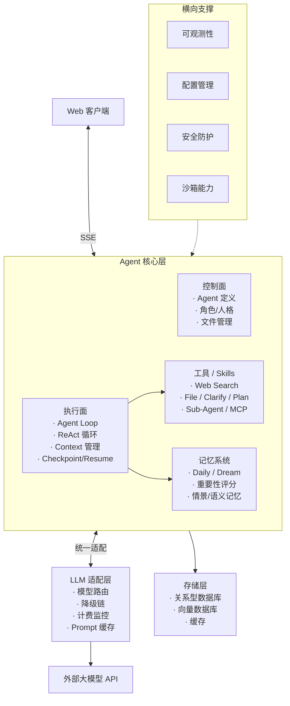

# WordLite Agent

一个开源、可扩展的 AI Agent 框架。后端基于 Python + FastAPI + LangGraph，前端基于 TypeScript + React，采用 DDD 分层架构，面向长期演进的通用 Agent 能力建设。

> 完整系统蓝图与各子模块设计参见 [design/0_outline.md](design/0_outline.md)。

## 🎯 项目定位

WordLite Agent 不只是"调用 LLM 的应用"，而是围绕**可控、可观测、可扩展**三个目标构建的 Agent 基础设施：

- **可控**：Agent 身份、角色、工具授权、用户边界均通过配置文件显式声明，行为可预测、可审计。
- **可观测**：Agent Loop 中的思考、工具调用、状态流转通过 SSE 实时推送，节点级指标可追踪。
- **可扩展**：工具注册表 + LLM 适配层，新增工具、模型、能力模块不侵入核心流程。

## 🧭 系统总览

框架围绕一条主干链路展开：**客户端 ⇄ SSE 通信层 ⇄ Agent 核心层 ⇄ LLM 适配层 ⇄ 外部大模型**，由存储层与横向支撑（可观测性、配置、安全、沙箱）提供基础能力。



完整架构图与数据流见 [design/0_outline.md](design/0_outline.md#系统架构总览)。

## 🧩 核心模块

下列模块均对应 `design/` 下的独立设计文档，按主干能力 → 支撑能力分层展开：

### 1. Agent 核心

- **Agent 定义**（OpenClaw 七文件）：`IDENTITY / SOUL / AGENTS / BOOTSTRAP / MEMORY / TOOLS / USER`，将身份、人格、SOP、工具授权、用户画像等显式配置化 — 详见 [1.1_agent-design.md](design/1.1_agent-design.md)
- **Prompt Builder**：分层构建、Schema 约束、动态组装、Prompt 缓存边界 — 详见 [1.2_prompt-builder.md](design/1.2_prompt-builder.md)
- **Agent Loop**：基于 LangGraph 的 ReAct 循环，包含上下文管理（4 级 Token 水位压缩）、Checkpoint/Resume、Cancel 处理、LLM 错误处理工厂、Harness 兜底 — 详见 [1.3_agent-loop-design.md](design/1.3_agent-loop-design.md) 和 [1.3.1_context-management.md](design/1.3.1_context-management.md)
- **Tools**：工具注册与发现、Web Search / Web Fetch / File / Clarify / Plan、MCP 集成、Skills 系统、Sub-Agent，附带超时、沙箱、限流 — 详见 [1.4_tools-design.md](design/1.4_tools-design.md) 和 [skills-module-design.md](design/skills-module-design.md)
- **Memory**：本地记忆系统、Daily / Dream Memory、重要性评分、情景/语义记忆
- **Multi-Agent**：Supervisor 模式、Agent 注册发现、编排协作

### 2. LLM 适配层

统一适配器、模型路由、降级链、结构化输出、Prompt 缓存、计费监控 — 详见 [7_llm-adaptor.md](design/7_llm-adaptor.md)

### 3. 通信协议

SSE 流式通信、事件 Schema、流式背压、断线重连与事件溯源 — 详见 [8_communication-protocol.md](design/8_communication-protocol.md)

### 4. 横向支撑

- **配置管理**：环境变量、Pydantic Settings、热更新、Feature Flags
- **数据持久化**：关系型数据库 + 向量数据库
- **错误处理**：分层异常、统一错误格式、指数退避重试
- **监控与日志**：结构化日志、Prometheus 指标、LangGraph 节点追踪、成本仪表盘
- **会话管理**：会话生命周期、状态持久化、事件溯源
- **安全防护**：Prompt 注入防护、内容安全过滤、工具访问控制、API 安全
- **人机协作 (HITL)**：高风险审批、澄清中断、手动干预、反馈闭环

> 各模块的范围、接口、数据结构与测试计划请直接查阅 [design/](design/) 目录。

## 🏗️ 技术栈

### 后端
- Python 3.12+ / FastAPI / LangGraph / LangChain
- Pydantic / SQLAlchemy（SQLite / PostgreSQL）
- uv 作为统一包管理器

### 前端
- React 18 / TypeScript / Vite
- Axios / SSE

### 架构
- DDD 四层分层：Domain / Application / Infrastructure / Presentation
- 依赖方向：`Presentation → Application → Domain ← Infrastructure`

## 🚀 快速开始

### 前置要求

- Python 3.12+
- Node.js 18+
- [uv](https://docs.astral.sh/uv/)（Python 包管理器）

### 一键启动

```bash
git clone <repository-url>
cd backend && cp .env.example .env   # 配置 LLM API Key
./bootstrap.sh start                 # 一键拉起前后端
```

启动后：
- 后端：`http://localhost:8000`（API 文档位于 `/docs`）
- 前端：`http://localhost:3000`

### 常用命令

```bash
# 后端
cd backend
uv sync                                           # 安装依赖
uv run uvicorn src.presentation.app:app --reload  # 开发服务器
uv run pytest tests/                              # 运行测试
uv run ruff check src/ && uv run ruff format src/ # 代码检查与格式化

# 前端
cd frontend
npm install
npm run dev
npm run build
```

## 📚 文档

| 文档 | 说明 |
|------|------|
| [design/0_outline.md](design/0_outline.md) | 系统架构总览与模块划分 |
| [design/1.1_agent-design.md](design/1.1_agent-design.md) | Agent 定义设计 |
| [design/1.2_prompt-builder.md](design/1.2_prompt-builder.md) | Prompt 组装架构 |
| [design/1.3_agent-loop-design.md](design/1.3_agent-loop-design.md) | Agent Loop 工作流设计 |
| [design/1.3.1_context-management.md](design/1.3.1_context-management.md) | 上下文管理（4 级 Token 水位压缩） |
| [design/1.4_tools-design.md](design/1.4_tools-design.md) | 工具系统设计 |
| [design/7_llm-adaptor.md](design/7_llm-adaptor.md) | LLM 适配层设计 |
| [design/8_communication-protocol.md](design/8_communication-protocol.md) | SSE 通信协议设计 |
| [design/skills-module-design.md](design/skills-module-design.md) | Skills 系统设计 |
| [docs/langgraph-workflow.md](docs/langgraph-workflow.md) | LangGraph 工作流实现说明 |

## 🤝 贡献

欢迎通过 Issue / PR 参与共建。提交前请先阅读 `.qoder/rules/` 下的项目约定与架构规则。

## 📄 许可证

MIT License
