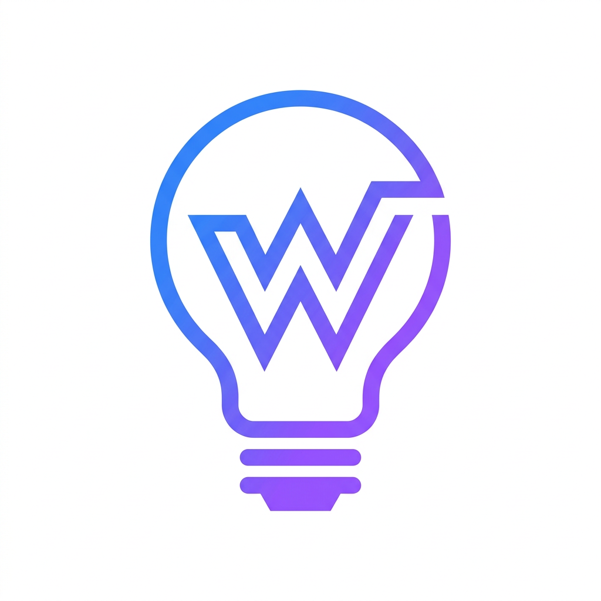
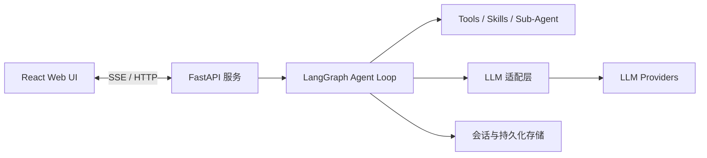

<p align="center">
  
</p>

# WordLight Agent

> 一个面向可控、可观测与可扩展工作流的 AI Agent 平台。它结合 LangGraph 的 Agent Loop、FastAPI 的流式服务与 React 管理界面，用于定义、运行和协作管理 Agent。


WordLight Agent 适合希望将 Agent 身份、工具权限、会话状态和执行过程显式化的开发者。它不是单一模型调用界面，而是一套可继续扩展的 Agent 基础设施。

## 为什么使用 WordLight Agent

- **可控的 Agent 定义**：将身份、行为、工具和用户边界配置化，降低隐式 Prompt 和权限带来的不确定性。
- **可追踪的执行过程**：通过 SSE 将思考、工具调用和状态变化实时推送到客户端。
- **可扩展的能力边界**：使用工具注册表、Skills、LLM 适配层和子 Agent 编排来扩展能力，而不侵入核心执行链路。
- **面向长期会话**：Agent Loop 支持上下文压缩、检查点恢复、取消处理与循环检测。

## 当前能力

| 能力 | 状态 | 说明 |
| --- | --- | --- |
| Agent 创建与会话管理 | 已实现 | 在 Web UI 中创建、编辑和运行 Agent。 |
| LangGraph Agent Loop | 已实现 | ReAct 执行、上下文管理、取消与检查点恢复。 |
| 流式交互 | 已实现 | FastAPI + SSE 推送执行阶段、文本和工具事件。 |
| 内置工具与 Skills | 已实现 | 包含搜索、抓取、文件、澄清、计划、Skills 与子 Agent 能力。 |
| 团队协作 | 已实现 | 可创建团队并执行协作任务。 |
| 向量记忆、MCP、完整可观测性 | 部分实现 / 规划中 | 详细边界见[系统设计总览](design/0_outline.md)。 |

## 快速开始

### 前置要求

- Python 3.12+
- Node.js 18+
- 可访问至少一个 LLM Provider 的 API Key

### 安装与启动

```bash
git clone https://github.com/solarest/yanyun-agent.git
cd yanyun-agent

cp backend/.env.example backend/.env
bash setup.sh
./bootstrap.sh start
```

在启动前，请编辑 `backend/.env`。默认配置使用 `openai` / `gpt-4`，因此只需填写 `OPENAI_API_KEY`。若使用其他 Provider，除填写对应 API Key 外，还必须同步设置匹配的 `LLM_DEFAULT_PROVIDER` 和 `LLM_DEFAULT_MODEL`；例如 DashScope 使用 `qwen` Provider。可用 Provider 与模型映射见 [LLM 适配层设计](design/7_llm-adaptor.md)。`setup.sh` 会安装后端 Python 依赖与前端依赖；若系统未安装 `uv`，脚本会尝试安装它。

启动完成后访问：

- Web UI：http://localhost:3000
- 后端 API 文档：http://localhost:8000/docs

常用服务管理命令：

```bash
./bootstrap.sh status
./bootstrap.sh logs
./bootstrap.sh stop
```

### 创建第一个 Agent

1. 打开 Web UI，进入 **Agent** 页面并选择“创建第一个 Agent”。
2. 设置 Agent 的名称、身份与可用工具；模型由 `backend/.env` 中的全局默认配置决定。
3. 创建完成后点击“对话”，输入任务并观察流式输出、工具调用和执行状态。
4. 需要协作执行时，在 **团队** 页面创建团队并分配成员 Agent。

## 架构概览

系统主链路为：客户端通过 SSE 与 Agent 核心交互；Agent Loop 调用工具、Skills 与 LLM 适配层；存储、配置、安全与可观测性能力作为横向支撑。


```mermaid
graph LR
    UI["React Web UI"] <-->|"SSE / HTTP"| API["FastAPI 服务"]
    API --> Loop["LangGraph Agent Loop"]
    Loop --> Tools["Tools / Skills / Sub-Agent"]
    Loop --> LLM["LLM 适配层"]
    LLM --> Provider["LLM Providers"]
    Loop --> Store["会话与持久化存储"]
```

架构边界、实现状态与数据流见[系统设计总览](design/0_outline.md)，Agent 执行节点的详细行为见[LangGraph 工作流文档](docs/langgraph-workflow.md)。

## 技术栈

- 后端：Python 3.12+、FastAPI、LangGraph、LangChain、Pydantic、SQLAlchemy
- 前端：React 18、TypeScript、Vite、Tailwind CSS
- 通信：SSE
- 工程：`uv`、pytest、Ruff、npm

## 文档导航

| 主题 | 文档 |
| --- | --- |
| 整体架构与实现状态 | [design/0_outline.md](design/0_outline.md) |
| Agent 定义与 Prompt 构建 | [Agent 设计](design/1_agent-design.md) · [Prompt Builder](design/2_prompt-builder.md) |
| Agent Loop 与上下文管理 | [Agent Loop](design/3_agent-loop-design.md) · [上下文管理](design/4_context-management.md) |
| 工具与 Skills | [工具设计](design/5_tools-design.md) · [Skills 设计](design/6_skills-design.md) |
| LLM 与流式协议 | [LLM 适配层](design/7_llm-adaptor.md) · [SSE 通信协议](design/8_communication-protocol.md) |
| 实现工作流 | [LangGraph 工作流](docs/langgraph-workflow.md) · [上下文管理实现](docs/context-management-design.md) |

## 本地开发

```bash
# 后端
cd backend
uv sync
uv run uvicorn src.presentation.app:app --reload --port 8000
uv run pytest tests/
uv run ruff check src/
uv run ruff format src/

# 前端
cd frontend
npm install
npm run dev
npm run type-check
npm run build
```

> [!NOTE]
> 当前测试基线中，`backend/tests/unit/infrastructure/llm/test_token_counter.py` 仍引用已移除的 `src.infrastructure.llm.middleware.token_counter` 模块，运行完整 pytest 收集会在该处失败；这与 README 和启动流程无关。

## 项目状态与反馈

项目处于活跃开发阶段。已实现、部分实现和规划中的能力以[系统设计总览](design/0_outline.md)为准；进行中的规格变更位于 [openspec/changes](openspec/changes)。

欢迎通过 GitHub Issues 提交问题或建议，并通过 Pull Request 参与改进。仓库当前尚未提供 `LICENSE` 文件，因此尚未授予复用、修改或分发许可；在对外开源发布前，请补充根目录的 MIT `LICENSE` 文件。
