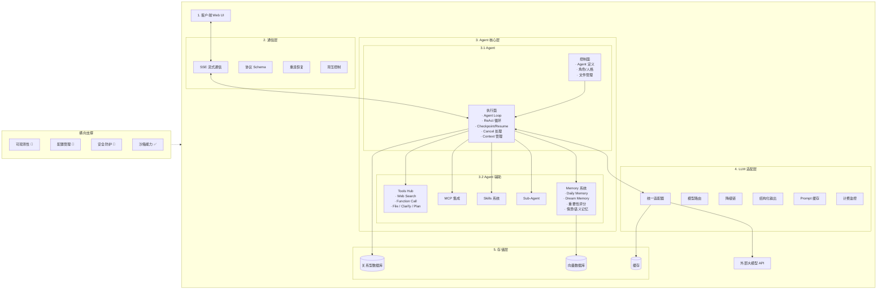
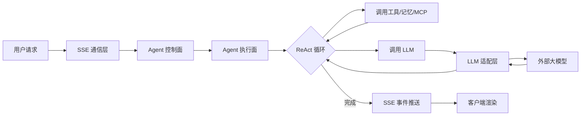

# wordlight-agent 项目大纲

> **实现状态图例**: ✅ 已实现 | 🚧 部分实现 | ❌ 未实现
>
> 最后更新: 2026-05-31

## 系统架构总览

### 核心数据流

---

## 1. agent 🚧 部分实现

### 1.1 agent 定义 🚧

> 详细技术方案：[1.1-agent-design.md](./1.1-agent-design.md)

采用 OpenClaw 模式，Agent 定义由七个配置文件组成：

- **IDENTITY.md** — 代理身份定义与系统边界约束
  - 说明：定义 Agent 的名称、版本、能力描述、职责范围、权限边界
  - 注意：明确"能做什么"和"不能做什么"；与安全规范对齐

- **SOUL.md** — 响应语气、行为特征及输出格式配置
  - 说明：定义 Agent 的语言风格、性格特征、交互偏好、输出格式
  - 注意：使用正向描述；避免模糊的性格定义

- **AGENTS.md** — 代理调度规则与标准作业程序
  - 说明：定义任务处理流程、决策规则、SOP
  - 注意：规则可量化，避免歧义；与 IDENTITY.md 边界定义配合

- **BOOTSTRAP.md** — 初始化序列与核心系统提示词
  - 说明：定义启动配置、系统级提示词模板、安全约束
  - 注意：精简长度，避免浪费 Token；安全约束必须在最高优先级

- **MEMORY.md** — 长期上下文数据与既定规则的持久化存储
  - 说明：初始为空，运行时积累长期记忆与既定规则
  - 注意：属于 Agent 定义域；创建时为空字符串，随运行逐步填充

- **TOOLS.md** — 工具授权注册表及调用参数规范
  - 说明：定义可用工具列表、调用权限、参数约束
  - 注意：遵循最小权限原则；高风险工具需单独标记

- **USER.md** — 用户画像数据与交互限制配置
  - 说明：定义目标用户特征、偏好设定、交互规则
  - 注意：保护用户隐私；偏好设定可动态调整

### 1.2 prompt builder ✅ (11层架构已实现, Pydantic validation 待补)
> 详细设计文档：[2_prompt-builder.md](./2_prompt-builder.md)

- **分层构建** — 按层次组装 Prompt
  - 说明：系统提示词、角色提示词、任务提示词分层组装
  - 注意：各层职责清晰，避免耦合；支持热插拔

  - **前缀固定** — 系统级不变内容
    - 说明：安全约束、格式要求等固定前缀
    - 注意：精简长度，避免浪费 Token；定期评估有效性

  - **schema 定义** — 输出格式约束
    - 说明：定义 Agent 输出的 JSON Schema 或结构化格式
    - 注意：使用 Pydantic 定义，与领域层 DTO 对齐；严格验证输出格式

  - **动态组装策略** — 按需组装 Prompt
    - 说明：根据任务类型、上下文动态选择 prompt 组件
    - 注意：组装逻辑可配置；避免组合爆炸；性能可控

### 1.3 agent-loop ✅

- **核心循环** — Agent 思考-行动-观察的主循环 ✅
  - 说明：基于 LangGraph 实现状态机驱动的执行循环
  - 注意：状态管理清晰；支持中断与恢复；错误处理完善

#### 1.3.1 context 管理 ✅ (2026-05-31 完成 4 级 Token 水位压缩)
- **裁剪策略** — 控制上下文长度
  - 说明：根据 Token 限制裁剪过长的对话历史
  - 注意：保留关键信息；优先保留最近对话；避免截断中间关键内容

- **压缩策略** — 上下文摘要压缩
  - 说明：对历史对话进行摘要，减少 Token 消耗
  - 注意：摘要质量影响后续推理；定期评估压缩效果

- **注入策略** — 动态信息注入
  - 说明：将记忆、工具结果、外部信息按需注入上下文
  - 注意：注入位置固定；避免信息过载；控制注入频率

#### 1.3.2 ReAct 实现 ✅

- **loop 主流程** — Reason + Act 循环 ✅
  - 说明：思考 → 选择工具 → 观察结果 → 继续思考的循环
  - 注意：每个步骤有明确的输入输出；支持并行工具调用；异常时优雅降级

- **Checkpoint/Resume** — 状态检查点与恢复 ✅
  - 说明：LangGraph checkpoint 机制，支持暂停→恢复执行

- **Cancel 信号处理** — 取消与中断 ✅
  - 说明：`agent_loop_runner.py` 有 `CancelledError` 捕获与 `TASK_CANCELLED` 事件

- **Node 级可观测性** — 图节点级别监控 🚧 (BaseNode 日志存在; Prometheus/LangSmith 未集成)
  - 说明：每个 LangGraph node 的执行时间、输入输出、异常追踪

#### 1.3.3 Harness 工程 ✅

- **卡主策略** — 处理 Agent 卡住的情况 ✅ (`stuck_detection` 状态字段)
  - 说明：检测 Agent 长时间无进展时的干预机制
  - 注意：超时阈值合理设置；干预方式渐进式（提醒 → 引导 → 终止）

- **防死循环** — 避免无限循环 ✅ (`loop_detect_node`: 精确匹配 + A-B-A-B交替 + 无效调用)
- **兜底策略** — 异常情况下的安全措施 ✅ (global correction budget + turn budget)

### 1.4 tools ✅ (核心工具全部实现)

- **工具注册与发现** — 工具的统一管理机制 ✅ (`ToolRegistry`)
  - 说明：工具注册表、能力描述、参数 Schema
  - 注意：遵循 DDD 架构，工具接口定义在领域层，实现在基础设施层

- **web search** ✅ (`tavily` 集成) | **web fetch** ✅ | **file** ✅ (read/write/search)
- **clarify** ✅ (用户澄清提问) | **plan** ✅ (闭包工具, 任务分解)
- **mcp** ❌ (仅在 `ToolDef.category` 枚举中预留)
- **skills** ✅ (`SkillRepository`, `PromptAssembleService` Layer 8, markdown 解析)
- **sub-agent** ✅ (`SubAgentOrchestrator`, `session_spawn` 工具)
- **工具执行超时** ✅ (`ToolPolicy.timeout_ms`) | **沙箱执行** ✅ (`SandboxMiddleware`) | **调用限流** ✅ (`RateLimitMiddleware`)

### 1.5 memory 系统 🚧 (仅 prompt injection 占位; 向量数据库/记忆评分未实现)

- **本地记忆系统（存储+召回）** — Agent 的持久化记忆
  - 说明：基于向量数据库的记忆存储和语义召回
  - 注意：存储格式统一；召回相关性排序；定期清理过期记忆

- **daily memory** — 每日记忆汇总
  - 说明：每天结束时自动汇总当天重要交互和决策
  - 注意：汇总质量评估；避免信息冗余；支持按需查询

- **dream memory** — 深度记忆整合
  - 说明：定期对记忆进行深度整理和关联建立
  - 注意：整理频率合理设置；避免过度整理丢失细节；保留原始记忆

- **记忆重要性评分** — 记忆优先级机制
  - 说明：根据交互频率、交互深度、用户显式标记等维度评分
  - 注意：评分算法透明可调；高优先级记忆不被裁剪；衰减曲线可配置

- **情景记忆与语义记忆** — 记忆类型区分
  - 说明：区分"什么时间发生了什么"（情景）和"通用知识"（语义）
  - 注意：两种记忆分别存储和召回；语义记忆支持知识图谱关联

- **记忆整合触发** — 整合时机与调度
  - 说明：定义 dream memory 和 daily memory 的触发条件
  - 注意：避免高峰时段整合；支持手动触发；整合进度可观测

### 1.6 multi-agent 系统 🚧 (sub-agent 委派已实现; Supervisor/注册发现未实现)

- **多 Agent 协作** 🚧 — sub-agent 委派 ✅ (`SubAgentOrchestrator`, `session_spawn`); 多 Agent 通信 ❌
- **Supervisor 模式** ❌ | **Agent 注册与发现** ❌

## 2. llm adaptor 🚧 (适配器/计费 ✅; 路由/降级/缓存 ❌)

- **大模型对接适配** ✅ — `LLMProvider` 接口, OpenAI-compatible + Anthropic providers
- **计费与监控** ✅ — `CostTracker`, `LLMUsageCallbackHandler`, `calculate_cost()`
- **调用优化** 🚧 — `astream` 流式 ✅; 批量调用/缓存 ❌
- **结构化输出** 🚧 — `OutputSchema` entity + prompt text; API 级 `json_schema` 强制 ❌
- **模型路由** ❌ | **模型降级链** ❌ | **Prompt 缓存** 🚧 (boundary marker 存在; 无实际缓存存储)

## 3. 通信协议 🚧 (SSE/事件/Schema/重连 ✅; 背压 ❌)

- **SSE 实现** ✅ | **Schema/事件定义** ✅ (20+ event types) | **重连状态恢复** ✅ (`last-event-id`)
- **流式背压** ❌ (无推送速率控制)

## 4. 配置管理 🚧 (环境变量/Pydantic ✅; 热更新/功能开关 ❌)

- **环境变量** ✅ (`LLMSettings(BaseSettings)`) | **热更新** ❌ | **功能开关** ❌

## 5. 数据持久化 🚧 (RDB ✅; 向量数据库 ❌)

- **关系型数据库** ✅ (SQLAlchemy + SQLite) | **向量数据库** ❌

## 6. 错误处理 ✅ (基础异常层次/重试 ✅)

- **异常层次** ✅ (`domain/exceptions.py`) | **错误响应** ✅ (统一 JSON 格式)
- **重试策略** ✅ (`tenacity` 依赖)

## 7. 监控与日志 🚧 (结构化日志 ✅; 指标/追踪/仪表盘 ❌)

- **结构化日志** ✅ (logger 分级) | **指标监控** ❌ (无 Prometheus)
- **链路追踪** ❌ | **LangGraph 追踪** ❌ (无 LangSmith) | **成本仪表盘** ❌

## 8. 会话管理 ✅

- **会话生命周期** ✅ | **会话持久化** ✅ | **多轮对话上下文** ✅
- **会话事件溯源** 🚧 (事件通过 SSE 推送, 非持久化存储)

## 9. 安全防护 🚧 (工具级安全 ✅; 注入防护/内容过滤 ❌)

- **工具访问控制** ✅ (`SecurityMiddleware`: path validation, whitelist)
- **Prompt 注入防护** ❌ | **内容安全过滤** ❌ | **API 安全** 🚧 (CORS ✅; JWT ❌)

## 10. 人机协作 (HITL) 🚧 (clarify ✅; 审批/干预/反馈 ❌)

- **澄清中断** ✅ (`clarify` tool) | **审批流程** ❌ | **手动干预** ❌ (cancel ✅; pause/resume ❌) | **反馈闭环** ❌