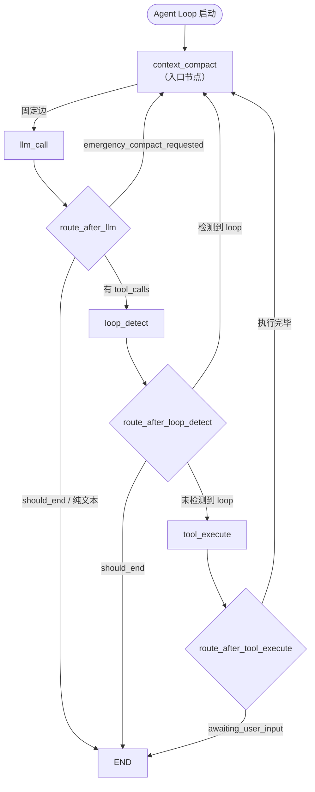

# Agent Loop 上下文管理设计

> 最后更新: 2026-05-31

## 1. 概述

### 1.1 设计定位

上下文管理模块是 Agent 执行循环的**前置守门**机制，不是事后清理工具。它在**每一轮 LLM 调用之前**执行，确保消息历史的 Token 量始终控制在模型上下文窗口可接受的范围内。

核心特征：

1. **主动守门**：`context_compact` 是 LangGraph StateGraph 的入口节点，所有路径在进入 `llm_call` 之前都必须经过它。
2. **水位触发**：基于 Token 估算值与模型上下文窗口的比例，执行 4 级渐进式压缩策略。
3. **Baseline 校准**：利用 LLM 返回的真实 `prompt_tokens` 进行增量 Token 估算，避免每次全量重算。
4. **不修改持久层**：`tool_results`（持久化的工具执行结果）始终保持完整，仅压缩 `messages`（发送给 LLM 的上下文）。

### 1.2 与 Agent Loop 的关系

上下文管理与 Agent Loop 主文档的关系：

- [1.3_agent-loop-design.md](./1.3_agent-loop-design.md) 定义了完整的 Agent 执行循环（节点、路由、状态、可观测性），上下文管理是其 4 个核心节点之一。
- 本文档聚焦于上下文管理的内部设计：Token 估算系统、4 级压缩策略、错误处理集成、路由配合。

### 1.3 核心设计原则

| 原则 | 说明 |
|------|------|
| **守门前置** | 入口设为 `context_compact`，每次 LLM 调用前强制执行水位检查 |
| **渐进式压缩** | 从轻量裁剪到深度摘要，根据水位逐步升级，不越级处理 |
| **Baseline 校准** | 利用 LLM 真实 usage 数据驱动增量估算，提升估算精度 |
| **不丢关键信息** | SystemMessage 和最近消息窗口永远保留，工具结果仅裁剪不删除 |
| **降级兜底** | 摘要 LLM 不可用时降级为纯 trim，不阻断主流程 |

---

## 2. 架构

### 2.1 工作流拓扑

`context_compact` 作为 StateGraph 入口节点，与 `llm_call` 之间是**固定边**，其他节点通过条件路由回到 `context_compact`。



### 2.2 节点注册与边定义

核心代码（`workflow_builder.py`）：

```python
workflow = StateGraph(AgentState)

workflow.add_node("llm_call", llm_call_node)
workflow.add_node("tool_execute", tool_execute_node)
workflow.add_node("loop_detect", loop_detect_node)
workflow.add_node("context_compact", context_compact_node)

# 入口改为 context_compact，每轮 LLM 调用前都经过上下文守门
workflow.set_entry_point("context_compact")

# context_compact → llm_call 固定边
workflow.add_edge("context_compact", "llm_call")

# 其他节点的条件路由最终都回到 context_compact
workflow.add_conditional_edges("llm_call", route_after_llm, {
    "loop_detect": "loop_detect",
    "context_compact": "context_compact",
    END: END,
})
workflow.add_conditional_edges("loop_detect", route_after_loop_detect, {
    "tool_execute": "tool_execute",
    "context_compact": "context_compact",
    END: END,
})
workflow.add_conditional_edges("tool_execute", route_after_tool_execute, {
    "context_compact": "context_compact",
    END: END,
})
```

### 2.3 流转路径

| 流转路径 | 触发条件 | 说明 |
|---------|---------|------|
| **context_compact -> llm_call** | 每轮 ReAct 开始（固定边） | 水位判断/压缩完成后进 LLM |
| **llm_call -> context_compact** | LLM 返回上下文超限错误 | 紧急压缩路径 |
| **llm_call -> loop_detect** | LLM 返回 tool_calls | 正常工具调用路径 |
| **loop_detect -> context_compact** | 检测到循环（反馈或压缩） | 注入纠正反馈后先做水位检查 |
| **tool_execute -> context_compact** | 工具执行完毕 | 工具结果加入后先做水位检查 |

---

## 3. Token 估算系统

Token 估算系统位于 `domain/services/token_utils.py`，提供纯函数用于 Token 计数、消息渲染、上下文窗口解析和超限识别。

### 3.1 `count_tokens()` -- 字符级 Token 估算

采用混合加权策略，对中文字符和其他字符使用不同权重：

```python
def count_tokens(text: str) -> int:
    chinese_chars = sum(1 for c in text if '一' <= c <= '鿿')
    other_chars = len(text) - chinese_chars
    return int(chinese_chars * 1.5 + other_chars * 0.25)
```

| 字符类型 | 权重 | 说明 |
|---------|------|------|
| 中文字符 (U+4E00 至 U+9FFF) | 1.5 tokens/char | 中文 token 效率较低 |
| 其他字符 (英文、标点、空白) | 0.25 tokens/char | 近似 char/4 估算 |

### 3.2 `render_message()` -- 消息规范文本化

将 LangChain 消息对象或 dict 渲染为统一的文本表示，便于 Token 估算：

```python
def render_message(message: Any) -> str:
    # 提取 role、content、name、tool_call_id、tool_calls
    parts = []
    parts.append(f"[{role_label}]")          # [HUMAN] / [AI] / [TOOL] / [SYSTEM]
    if name:
        parts.append(f"[tool:{name}]")       # [tool:read_file]
    if tool_call_id:
        parts.append(f"[call_id:{tool_call_id}]")
    if tool_calls:
        parts.append(f"[tool_calls:{','.join(tc_names)}]")
    if content:
        parts.append(content)
    return " ".join(parts)
```

渲染格式包含 role、tool name、call_id、tool_calls 等元信息，帮助 Token 估算覆盖消息的完整开销。

### 3.3 `estimate_context_tokens()` -- Baseline 感知的增量估算

支持两种估算模式，根据是否持有有效的 LLM usage baseline 自动切换：

```python
def estimate_context_tokens(
    messages: list,
    baseline: int | None = None,
    baseline_message_count: int = 0,
) -> int:
    current_count = len(messages)

    if baseline is not None and baseline_message_count > 0 and current_count >= baseline_message_count:
        # 增量估算：baseline + 新增消息
        new_messages = messages[baseline_message_count:]
        new_tokens = sum(count_tokens(render_message(msg)) for msg in new_messages)
        return baseline + new_tokens

    # 全量估算
    return sum(count_tokens(render_message(msg)) for msg in messages)
```

**两种模式对比**：

| 模式 | 触发条件 | 计算方式 | 精度 |
|------|---------|---------|------|
| **增量估算** | baseline 有效 且 消息数>=baseline_message_count（无 RemoveMessage） | `baseline + sum(count_tokens(render_message(new_msg)))` | 高（baseline 来自 LLM 真实 usage） |
| **全量估算** | baseline 为 None，或消息数<baseline_message_count（发生 RemoveMessage/裁剪） | `sum(count_tokens(render_message(msg)))` | 低（纯 char/4 估算） |

**Baseline 失效规则**：

| 操作 | 对 baseline 的影响 |
|------|-------------------|
| `llm_call` 成功返回 | `context_token_baseline = prompt_tokens`，`baseline_message_count = 发送消息数` |
| `soft_prune` 裁剪消息内容 | `context_token_baseline = None` |
| `micro_compact` / `emergency_compact` 执行 RemoveMessage | `context_token_baseline = None`，`baseline_message_count = 0` |
| loop 纠正注入反馈 | baseline 保持有效（新增消息走增量估算） |

### 3.4 `resolve_max_context_tokens()` -- 模型上下文窗口解析

根据模型名称子串匹配解析最大上下文窗口 Token 数：

```python
_MODEL_CONTEXT_WINDOWS: list[tuple[str, int]] = [
    ("gemini-3-pro", 2_000_000),
    ("gpt-5.5", 1_000_000),
    ("gpt-5.4", 1_000_000),
    ("claude-opus-4.7", 1_000_000),
    ("claude-opus-4.6", 1_000_000),
    ("qwen3", 1_000_000),
    ("deepseek-v4", 1_000_000),
]

_DEFAULT_CONTEXT_WINDOW = 128_000
```

| 模型族 | 默认上下文窗口 | 说明 |
|--------|-------------|------|
| `gemini-3-pro` | 2,000,000 | Gemini 3 Pro |
| `gpt-5.5` / `gpt-5.4` | 1,000,000 | GPT 5 系列 |
| `claude-opus-4.7` / `claude-opus-4.6` | 1,000,000 | Claude Opus 4 系列 |
| `qwen3` | 1,000,000 | Qwen3 |
| `deepseek-v4` | 1,000,000 | DeepSeek V4 |
| 未匹配 | 128,000 | 兜底默认值 |

> 这些值是本系统的策略默认值，不作为外部供应商规格真值。实际接入时以配置覆盖为准。解析结果写入 `AgentState.max_context_tokens`。

### 3.5 Baseline 校准流程

每次 LLM 调用成功后，`llm_call_node` 从 `AIMessageChunk` 的 usage metadata 中提取真实 `prompt_tokens`，写回 AgentState：

```python
def _extract_prompt_tokens(accumulated) -> int | None:
    # LangChain 0.3+: usage_metadata on AIMessageChunk
    if hasattr(accumulated, "usage_metadata") and accumulated.usage_metadata:
        usage = accumulated.usage_metadata
        if isinstance(usage, dict):
            return usage.get("input_tokens")

    # 旧版 LangChain: response_metadata.token_usage
    if hasattr(accumulated, "response_metadata") and accumulated.response_metadata:
        token_usage = accumulated.response_metadata.get("token_usage", {})
        if isinstance(token_usage, dict):
            return token_usage.get("prompt_tokens")

    return None  # 提取失败，降级为全量 char/4 估算
```

写回 AgentState 的字段：

```python
# llm_call_node 正常返回时
{
    "context_token_baseline": prompt_tokens,
    "context_token_baseline_message_count": message_count,
    "context_token_estimate": prompt_tokens,
}
# 无法提取 prompt_tokens 时降级：
{
    "context_token_estimate": sum(count_tokens(render_message(m)) for m in messages),
}
```

### 3.6 `is_context_limit_error()` -- 上下文超限识别

通过异常文本中的关键字判断是否为上下文超限错误：

```python
_CONTEXT_LIMIT_MARKERS = [
    "context_length_exceeded",
    "maximum context length",
    "context window",
    "input too long",
    "prompt is too long",
    "token limit",
    "request too large",
]
```

---

## 4. 四级压缩策略

### 4.1 策略总览

| 优先级 | 策略名 | 触发条件 | 处理方式 | 保留内容 |
|--------|--------|---------|---------|---------|
| **P1** | `emergency_compact` | `emergency_compact_requested=True` 或上下文超限 | 摘要旧消息 + RemoveMessage | SystemMessage + 最近 3 条 |
| **P2** | `micro_compact` | Token > 60% * max_context_tokens | 摘要旧消息 + RemoveMessage | SystemMessage + 最近 10 条 |
| **P3** | `soft_prune` | Token > 40% * max_context_tokens | 裁剪超长 ToolMessage 内容 | 所有消息（内容被裁剪） |
| **P4** | `skip` | Token <= 40% * max_context_tokens | 不处理，记录事件 | 全部保留 |

### 4.2 执行流程图

```mermaid
flowchart TD
    Start([context_compact 入口]) --> ResolveMax[解析 max_context_tokens]
    ResolveMax --> Estimate[estimate_context_tokens<br/>baseline-aware 增量估算]
    Estimate --> Emergency{emergency_compact_requested<br/>或 compression_strategy=emergency?}
    
    Emergency -->|Yes| EmergencyCompact["P1: emergency_compact<br/>保留最近 3 条 + SystemMessage<br/>摘要旧消息 (最多 90 条)"]
    Emergency -->|No| Over60{token > 0.6 * max?}
    
    Over60 -->|Yes| MicroCompact["P2: micro_compact<br/>保留最近 10 条 + SystemMessage<br/>摘要旧消息 (最多 90 条)"]
    Over60 -->|No| Over40{token > 0.4 * max?}
    
    Over40 -->|Yes| SoftPrune["P3: soft_prune<br/>裁剪 >20000 字符的 ToolMessage<br/>head(4000) + notice + tail(4000)<br/>目标: token <= 0.25 * max"]
    Over40 -->|No| Skip["P4: skip<br/>不处理"]
    
    MicroCompact --> Summarize[调用 LLM 生成摘要]
    EmergencyCompact --> Summarize
    
    Summarize --> LLMAvail{LLM 可用?}
    LLMAvail -->|Yes| InjectSummary[RemoveMessage 旧消息<br/>注入 HumanMessage [Context Summary]]
    LLMAvail -->|No| FallbackTrim[降级: 仅 RemoveMessage<br/>不做摘要]
    
    InjectSummary --> InvalidateBaseline[baseline = None]
    FallbackTrim --> InvalidateBaseline
    SoftPrune -->|曾裁剪| InvalidateBaseline
    
    InvalidateBaseline --> Emit[emit context:compacting]
    Skip --> Emit
    SoftPrune -->|未裁剪| Emit
    
    Emit --> End([固定边 → llm_call])
```

### 4.3 P4: Skip (< 40%)

**触发条件**：

```python
current_tokens <= int(max_context_tokens * 0.4)
```

**处理逻辑**：

- 不做任何消息修改
- 记录 WATERMARK 日志
- 发射 `context:compacting` 事件，strategy = `skip`
- 写入 `last_context_strategy = "skip"`

**事件 Payload**：

```python
{
    "strategy": "skip",
    "beforeTokens": current_tokens,
    "afterTokens": current_tokens,
    "maxContextTokens": max_tokens,
    "beforeCount": len(messages),
    "afterCount": len(messages),
    "removedCount": 0,
    "reason": "below_watermark",
}
```

**AgentState 写入**：

```python
{
    "phase": "context_compacting",
    "context_token_estimate": current_tokens,
    "last_context_strategy": "skip",
}
```

### 4.4 P3: Soft-Pruning (40%-60%)

**触发条件**：

```python
current_tokens > int(max_context_tokens * 0.4)
# 且 current_tokens <= int(max_context_tokens * 0.6)
```

**处理逻辑**：

1. 只处理 `ToolMessage`（含 dict 形式的 tool 消息），不触碰普通用户/助手消息。
2. 单条 tool result 内容长度 <= 20000 字符时跳过。
3. 对超长 ToolMessage 裁剪：保留前 4000 字符和后 4000 字符，中间替换为省略标记。
4. 从旧到新顺序处理，每裁剪一条后重新估算 Token。
5. 当 `new_estimate <= int(max_context_tokens * 0.25)`（目标 25% 水线）时停止。
6. 遍历完所有消息仍不达标也停止（避免误删语义内容）。

**裁剪规则**：

```python
head = content[:4000]
tail = content[-4000:]
pruned_content = (
    f"{head}\n\n"
    f"[... tool result soft-pruned; middle omitted ...]\n\n"
    f"{tail}"
)
# 使用相同 msg_id 构造 ToolMessage，LangGraph add_messages reducer 自动替换
```

**关键设计**：

- 不调用 LLM，纯文本裁剪，零额外成本
- 同 id 的 ToolMessage 替换，`tool_results`（持久层）不受影响
- 基线被修改后 `context_token_baseline` 设为 `None`，后续走全量估算

**事件 Payload**：

```python
{
    "strategy": "soft_prune",
    "beforeTokens": current_tokens,
    "afterTokens": after_tokens,
    "maxContextTokens": max_tokens,
    "beforeCount": len(messages),
    "afterCount": len(modified_messages),
    "removedCount": 0,
    "prunedToolResults": pruned_count,
    "reason": "watermark_40",
}
```

**AgentState 写入**：

```python
{
    "messages": modified_messages,              # 裁剪后的消息列表
    "phase": "context_compacting",
    "context_token_estimate": after_tokens,
    "last_context_strategy": "soft_prune",
    "context_token_baseline": None,             # 仅当发生裁剪时
}
```

### 4.5 P2: Micro-Compact (> 60%)

**触发条件**：

```python
current_tokens > int(max_context_tokens * 0.6)
```

**处理逻辑**：

1. 识别 SystemMessage（如果消息列表第一条为 SystemMessage，索引记为 0；否则为 -1）。
2. 消息数不足 `preserve_start + keep_recent + 1` 时跳过压缩。
3. 保留：SystemMessage + 最近 10 条消息。
4. 中间消息取最近 90 条做 LLM 摘要（优先保留时间局部性）。
5. 中间消息超过 90 条时，更老的消息只做 `RemoveMessage`，不加入摘要输入。
6. 摘要注入为 `HumanMessage(content="[Context Summary]\n...", id=first_compacted_id)`。
7. 对被压缩消息执行 `RemoveMessage(id=msg_id)`。

**压缩范围示意**：

```
[SystemMessage] ... [old_msg_0] ... [old_msg_N] ... [last_10...]
                     ^--- Remove 和/或 摘要 ---^        ^--- 保留 ---^
```

**AgentState 写入**：

```python
{
    "messages": [
        RemoveMessage(id=very_old_msg_id),      # 超 90 条的旧消息仅删除
        ...,
        HumanMessage(                            # 摘要注入
            content="[Context Summary]\n{summary_text}",
            id=first_compacted_id
        ),
        RemoveMessage(id=compacted_msg_id),      # 被摘要的消息删除
        ...,
        # SystemMessage + 最近 10 条
    ],
    "phase": "context_compacting",
    "context_token_estimate": after_tokens,
    "context_token_baseline": None,
    "context_token_baseline_message_count": 0,
    "last_context_strategy": "micro_compact",
}
```

### 4.6 P1: Emergency-Compact (上下文超限)

**触发来源**：

```
llm_call → LLM 返回 context window exceeded
    → LLMErrorHandlerRegistry
        → ContextLimitErrorHandler 识别
            → 设置 emergency_compact_requested=True, compression_strategy="emergency_compact"
                → route_after_llm 检测到标志 → 路由到 context_compact
                    → P1: emergency_compact 执行
```

**处理逻辑**：

与 `micro_compact` 相似，但有三个关键区别：

1. **保留窗口更小**：保留最近 3 条消息（vs micro 的 10 条）。
2. **计数追踪**：`context_compaction_attempts += 1`，防止无限紧急压缩。
3. **标志清零**：执行后设置 `emergency_compact_requested = False`，`compression_strategy = None`，避免循环触发。

**失败处理**（两次超限规则）：

- 第一次上下文超限（`context_compaction_attempts == 0`）：执行 emergency-compact，再次尝试 llm_call。
- 第二次上下文超限（`context_compaction_attempts >= 1`）：`ContextLimitErrorHandler` 直接设置 `should_end=True`，终止任务。

**AgentState 写入**：

```python
{
    "messages": [RemoveMessage(...), HumanMessage(...), ...],
    "phase": "context_compacting",
    "context_token_estimate": after_tokens,
    "context_token_baseline": None,
    "context_token_baseline_message_count": 0,
    "last_context_strategy": "emergency_compact",
    # 额外写入：
    "context_compaction_attempts": attempts + 1,
    "emergency_compact_requested": False,
    "compression_strategy": None,
}
```

### 4.7 关键信息保留规则

所有压缩策略共同遵守：

| 保留内容 | micro_compact | emergency_compact | soft_prune |
|---------|--------------|-------------------|------------|
| SystemMessage（首条） | 始终保留 | 始终保留 | 始终保留 |
| 最近消息窗口 | 10 条 | 3 条 | 全部保留（内容可能被裁剪） |
| 用户原始需求 | 在摘要中显式保留 | 在摘要中显式保留 | 保留（非 ToolMessage） |
| 工具执行结论 | 在摘要中保留 | 在摘要中保留 | 裁剪超长内容 |
| 当前待办 | 在摘要中保留 | 在摘要中保留 | 保留 |

> `tool_results`（持久层字段）不被压缩节点修改，仅 `messages`（LLM 上下文）被压缩。这确保持久化的工具结果始终完整，供后续节点或外部系统使用。

### 4.8 配置常量

```python
SOFT_PRUNE_WATERMARK = 0.4         # 轻量裁剪水线
MICRO_COMPACT_WATERMARK = 0.6      # 摘要压缩水线
SOFT_PRUNE_TARGET = 0.25           # 裁剪目标水线
SOFT_PRUNE_MIN_CONTENT_LENGTH = 20000  # 最小裁剪阈值 (字符)
SOFT_PRUNE_HEAD_TAIL = 4000        # 保留头尾长度 (字符)
MICRO_COMPACT_KEEP_RECENT = 10     # 微压缩保留最近消息数
EMERGENCY_COMPACT_KEEP_RECENT = 3  # 紧急压缩保留最近消息数
MICRO_COMPACT_SUMMARY_MAX_MSGS = 90  # 摘要最大处理消息数
SUMMARY_MAX_INPUT_CHARS = 32000    # 摘要输入字符上限
SUMMARY_MAX_TOKEN_FRACTION = 0.05  # 摘要输入占上下文窗口比例上限
```

---

## 5. 摘要 Prompt

### 5.1 Prompt 全文

`_COMPACTION_SUMMARY_PROMPT` 聚焦任务连续性，通用摘要 Prompt 已被替换：

```text
You are compacting an agent execution context.

Summarize the older messages so the agent can continue the same task
without losing operational state.

Focus on:
1. What has already been completed.
2. What is currently in progress.
3. Files, paths, commands, tools, and external resources that were
read, created, or modified.
4. Important tool results, including success/failure and exact error
messages when relevant.
5. User constraints, preferences, and explicit instructions that still apply.
6. What the agent should do next.

Rules:
- Preserve concrete filenames, IDs, function names, command outputs,
and decisions.
- Do not invent work that was not done.
- If something is uncertain, label it as uncertain.
- Keep the summary concise but operationally complete.
- Output only the summary.
```

### 5.2 摘要输入构建

**字符预算控制**：

```python
summary_budget = min(
    SUMMARY_MAX_INPUT_CHARS,                     # 上限 32000 字符
    int(max_tokens * SUMMARY_MAX_TOKEN_FRACTION * 4),  # 上下文窗口 5% 的字符估算
)
```

以 deepseek-v4（1,000,000 Token）为例：
- 5% Token 预算：50,000 Token
- 字符估算：50,000 * 4 = 200,000 字符
- 实际取 min(32,000, 200,000) = **32,000 字符**

**消息渲染**：

摘要输入使用 `render_message()` 渲染每条消息，包含 role、tool name、tool_call_id、content 等元信息。渲染格式帮助摘要 LLM 理解消息结构和来源：

```
[AI] [tool_calls:read_file,search]    # AIMessage with tool calls
[TOOL] [tool:read_file] [call_id:xxx] file content...  # ToolMessage with result
```

**截断策略**：

从最近的消息开始向后组装，字节预算用尽时截断最后一条，并追加 `\n...(truncated)` 标记。

### 5.3 LLM 调用

```python
response = await llm.ainvoke([
    SystemMessage(content=_COMPACTION_SUMMARY_PROMPT),
    HumanMessage(content=f"Messages to compact:\n\n{summary_input}"),
])
summary_text = response.content if hasattr(response, "content") else str(response)
```

**降级策略**：

- LLM 不可用（config 无 llm）：返回 `None`，压缩降级为纯 `RemoveMessage`（trim）。
- LLM 调用异常：捕获所有异常，返回 `None`，同样降级为纯 trim。

降级行为保证上下文压缩不成为主流程的阻塞点。

---

## 6. LLM 错误处理器工厂

### 6.1 职责链模式

`llm_call_node` 不直接处理异常，而是委托给 `LLMErrorHandlerRegistry`（职责链模式），将错误分类处理逻辑与节点调用逻辑解耦。

**接口定义**（`domain/interfaces/llm_error_handler.py`）：

```python
class ILLMErrorHandler(ABC):
    def can_handle(self, error: BaseException) -> bool:
        """判断是否能处理该错误"""
        ...

    def handle(self, error: BaseException, state: dict, context: Any) -> dict:
        """处理错误并返回状态更新 dict"""
        ...

class LLMErrorHandlerRegistry:
    def __init__(self, handlers: list[ILLMErrorHandler] | None = None):
        self._handlers = list(handlers or [])

    def handle(self, error, state, context) -> dict:
        for handler in self._handlers:
            if handler.can_handle(error):
                return handler.handle(error, state, context)
        raise error  # 所有 handler 都不匹配时 re-raise
```

### 6.2 处理器列表

按注册顺序遍历，第一个 `can_handle()` 返回 `True` 的处理器处理错误：

| 序号 | 处理器 | 匹配条件 | 处理策略 |
|------|--------|---------|---------|
| 1 | `ContextLimitErrorHandler` | `is_context_limit_error()` 返回 True | 首次: 设置 `emergency_compact_requested=True`；二次: `should_end=True` |
| 2 | `TimeoutErrorHandler` | `asyncio.TimeoutError` 或 `TimeoutError` | 设置 `should_end=True`，保留已收到的 partial text |
| 3 | `DefaultErrorHandler` | 始终匹配（兜底） | re-raise 异常，由 `BaseNode._handle_error` 统一处理 |

### 6.3 ContextLimitErrorHandler

```python
class ContextLimitErrorHandler(ILLMErrorHandler):
    def can_handle(self, error: BaseException) -> bool:
        return is_context_limit_error(error)

    def handle(self, error, state, context) -> dict:
        attempts = state.get("context_compaction_attempts", 0)

        if attempts == 0:
            # 第一次超限：给一次紧急压缩机会
            return {
                "emergency_compact_requested": True,
                "should_end": False,
                "compression_strategy": "emergency_compact",
                "context_compaction_attempts": 1,
                "error": str(error),
                "phase": "context_overflow",
            }

        # 第二次超限：紧急压缩失败，终止
        return {
            "should_end": True,
            "is_complete": False,
            "error": f"Context window exceeded after emergency compaction: {error}",
            "phase": "error",
        }
```

**两次超限规则**：

| 次数 | `context_compaction_attempts` | 行为 |
|------|------------------------------|------|
| 第 1 次 | 0 (处理前) / 1 (处理后) | 设置 `emergency_compact_requested=True`，路由到 `context_compact` 执行紧急压缩 |
| 第 2 次 | >= 1 | 设置 `should_end=True`，终止任务 |

### 6.4 TimeoutErrorHandler

```python
class TimeoutErrorHandler(ILLMErrorHandler):
    def __init__(self, timeout_sec: int = 300):
        self.timeout_sec = timeout_sec

    def can_handle(self, error: BaseException) -> bool:
        return isinstance(error, TimeoutError) or isinstance(error, asyncio.TimeoutError)

    def handle(self, error, state, context) -> dict:
        full_text = state.get("current_llm_text", "")
        return {
            "messages": [AIMessage(content=full_text or "LLM call timed out.")],
            "pending_tool_calls": [],
            "error": f"LLM streaming timed out after {self.timeout_sec}s",
            "should_end": True,
            ...
        }
```

将已有 partial text 保存为 AIMessage，避免完全丢失已生成的文本。

### 6.5 DefaultErrorHandler

```python
class DefaultErrorHandler(ILLMErrorHandler):
    def can_handle(self, error: BaseException) -> bool:
        return True  # 兜底，始终返回 True

    def handle(self, error, state, context) -> dict:
        raise error  # re-raise 给 BaseNode._handle_error 处理
```

### 6.6 注入方式

在 `AgentLoopRunner` 中通过 `graph_config` 注入：

```python
graph_config = {
    "configurable": {
        "llm": llm,
        # ...
        "llm_error_handlers": LLMErrorHandlerRegistry([
            ContextLimitErrorHandler(),
            TimeoutErrorHandler(timeout_sec=300),
            DefaultErrorHandler(),
        ]),
    }
}
```

`llm_call_node` 通过 config 获取：

```python
error_registry = config.get("configurable", {}).get("llm_error_handlers")
# ...
except Exception as e:
    if error_registry:
        return error_registry.handle(e, state, context)
    raise
```

---

## 7. AgentState 上下文管理字段

### 7.1 字段定义

| 字段 | 类型 | 描述 | 写入节点 |
|------|------|------|---------|
| `max_context_tokens` | `int` | 当前模型上下文窗口 Token 数上限 | 应用层初始化 (`resolve_max_context_tokens`) |
| `context_token_estimate` | `int` | 当前 messages 的 Token 估算值 | `context_compact`、`llm_call` |
| `context_token_baseline` | `Optional[int]` | 最近一次成功 LLM 调用返回的 `prompt_tokens` | `llm_call` |
| `context_token_baseline_message_count` | `int` | baseline 对应的消息数量，用于判断增量/全量估算 | `llm_call` |
| `context_compaction_attempts` | `int` | 连续紧急压缩次数，防止无限 emergency loop | `context_compact`、`ContextLimitErrorHandler` |
| `emergency_compact_requested` | `bool` | LLM 调用发生上下文超限后置为 True | `ContextLimitErrorHandler` |
| `last_context_strategy` | `Optional[str]` | 最近一次实际执行的压缩策略 | `context_compact` |

### 7.2 字段交互关系

```
llm_call (正常返回)                        llm_call (上下文超限异常)
    │                                           │
    │ 写入 baseline + baseline_message_count       │ ContextLimitErrorHandler
    │                                           │
    ├──> context_token_baseline = prompt_tokens  ├──> emergency_compact_requested = True
    ├──> context_token_baseline_message_count = N ├──> context_compaction_attempts = 1
    └──> context_token_estimate = prompt_tokens   └──> compression_strategy = "emergency_compact"
                                                    │
context_compact (下一轮)                               │ route_after_llm
    │                                           │
    │ estimate_context_tokens(messages,            └──> context_compact (P1: emergency)
    │     baseline, baseline_count)                    │
    │                                           │
    │ 有 baseline 且消息数 >= baseline_count          ├──> context_compaction_attempts += 1
    │   → 增量估算 (高精度)                        ├──> emergency_compact_requested = False
    │                                           └──> compression_strategy = None
    │
    │ 执行压缩 (soft_prune / micro / emergency)
    │   → context_token_baseline = None (失效)
    │   → 下一轮走全量估算
```

**核心交互规则**：

- `context_token_baseline` 和 `context_token_baseline_message_count` 成对使用，共同决定增量/全量估算模式。
- 一旦消息内容被修改（裁剪、RemoveMessage），baseline 即失效，强制全量重算。
- `context_compaction_attempts` 防止紧急压缩无限循环（>= 1 时 ContextLimitErrorHandler 直接终止）。
- `emergency_compact_requested` 是跨节点通信标志，由 error handler 设置，路由函数读取，`context_compact` 执行后清零。

### 7.3 应用层初始化

在 `AgentLoopRunner._build_initial_state()` 中：

```python
initial_state = {
    # ...
    "max_context_tokens": resolve_max_context_tokens(model),
    "context_token_estimate": 0,
    "context_token_baseline": None,
    "context_token_baseline_message_count": 0,
    "context_compaction_attempts": 0,
    "emergency_compact_requested": False,
    "last_context_strategy": None,
}
```

---

## 8. 路由集成

### 8.1 路由函数与 context_compact 的配合

三个路由函数中，`context_compact` 是核心枢纽：

**`route_after_llm`**：

```python
def route_after_llm(state: AgentState) -> str:
    # 优先级最高：上下文超限后紧急压缩
    if state.get("emergency_compact_requested"):
        return "context_compact"

    if state.get("should_end"):
        return END

    messages = state.get("messages", [])
    last_msg = messages[-1]
    tool_calls = _extract_tool_calls(last_msg)

    if tool_calls:
        return "loop_detect"       # → loop_detect → tool_execute → context_compact
    return END                      # 纯文本完成
```

| 状态 | 路由目标 | 如何回到 context_compact |
|------|---------|------------------------|
| `emergency_compact_requested=True` | `context_compact` | 直接进入紧急压缩 |
| 有 tool_calls | `loop_detect` | 经 loop_detect/tool_execute 回到 context_compact |
| should_end / 纯文本 | END | 不经过（已终止） |

**`route_after_loop_detect`**：

```python
def route_after_loop_detect(state: AgentState) -> str:
    if not state.get("loop_detected"):
        return "tool_execute"          # → tool_execute → context_compact
    if state.get("should_end"):
        return END
    return "context_compact"           # loop 纠正统一走守门
```

| 状态 | 路由目标 | 如何回到 context_compact |
|------|---------|------------------------|
| 未检测到 loop | `tool_execute` | 工具执行后回到 context_compact |
| loop_detected (count 1/2) | `context_compact` | 直接进入（注入反馈后重试） |
| should_end (count >=3) | END | 不经过（已终止） |

**`route_after_tool_execute`**：

```python
def route_after_tool_execute(state: AgentState) -> str:
    if state.get("awaiting_user_input"):
        return END
    return "context_compact"           # 工具结果加入后先守门
```

### 8.2 紧急压缩完整路径

```
llm_call → LLM 抛出 context window exceeded
    → LLMErrorHandlerRegistry.handle()
        → ContextLimitErrorHandler.can_handle() = True
        → handle() 返回:
            emergency_compact_requested = True
            compression_strategy = "emergency_compact"
            context_compaction_attempts = 1

→ route_after_llm(state):
    state["emergency_compact_requested"] is True
    → return "context_compact"

→ context_compact.execute():
    is_emergency = True (emergency_compact_requested 或 compression_strategy)
    → _emergency_compact():
        keep_recent = 3
        context_compaction_attempts = attempts + 1 (= 2)
        emergency_compact_requested = False
        compression_strategy = None

→ 固定边 → llm_call (使用压缩后的 messages 重试)
    → 如果仍超限:
        ContextLimitErrorHandler: context_compaction_attempts >= 1
        → should_end = True (终止)
    → 如果成功:
        继续正常循环
```

---

## 9. 初始历史预算

### 9.1 设计变更

初始历史消息的 Token 预算从硬编码的 `8000` 改为基于模型上下文窗口的动态计算：

```python
max_context_tokens = resolve_max_context_tokens(model)
initial_history_budget = int(max_context_tokens * 0.25)
```

| 模型 | 上下文窗口 | 历史预算 (25%) | 旧值 (8000) |
|------|----------|--------------|-----------|
| `deepseek-v4` | 1,000,000 | 250,000 | 8,000 |
| `claude-opus-4.7` | 1,000,000 | 250,000 | 8,000 |
| `gpt-5.5` | 1,000,000 | 250,000 | 8,000 |
| `qwen3` | 1,000,000 | 250,000 | 8,000 |
| `gemini-3-pro` | 2,000,000 | 500,000 | 8,000 |
| 未匹配 | 128,000 | 32,000 | 8,000 |

### 9.2 设计理由

选择 25% 作为历史预算占比的原因：

1. **系统提示词空间**：系统提示词通常占用 10%-15% 的上下文窗口，25% 的历史预算留出足够头部空间。
2. **工具 Schema 空间**：工具定义（name、description、parameters schema）在每次 LLM 调用时都会携带，大型工具集可能占用数千 Token。
3. **输出 Token 余量**：LLM 的输出也需要在上下文窗口内，25% 的历史预算不会挤占输出空间。
4. **后续压缩容错**：即使初始历史偏大，`context_compact` 的 `soft_prune`（40% 水线）会在第一轮 LLM 调用前介入裁剪。

### 9.3 使用方式

```python
# AgentLoopRunner._build_initial_state() 中
api_messages = await self.prompt_context.build_messages(
    system_message=system_prompt,
    history=conversation_history,
    max_tokens=initial_history_budget,  # max_context_tokens * 0.25
)
messages = LangChainAdapter.dict_messages_to_langchain(api_messages)
```

`PromptContextInterface.build_messages()` 使用 `max_tokens` 参数进行历史消息的 Token 预算裁剪，超过预算的旧消息被裁剪或丢弃。

---

## 附录 A：文件清单

```
backend/src/
├── domain/
│   ├── aggregates/agent/agent_state.py          # AgentState (7 个上下文管理字段)
│   ├── services/
│   │   ├── token_utils.py                       # count_tokens, render_message, estimate_context_tokens, resolve_max_context_tokens, is_context_limit_error
│   │   └── agent_routing.py                     # route_after_llm, route_after_loop_detect, route_after_tool_execute
│   └── interfaces/
│       └── llm_error_handler.py                 # ILLMErrorHandler, LLMErrorHandlerRegistry
├── infrastructure/agent/
│   ├── nodes/
│   │   ├── context_compact_node.py              # ContextCompactNode (4 级压缩, 摘要 Prompt)
│   │   └── llm_call_node.py                     # LLMCallNode (baseline 写回, 错误委托)
│   ├── error_handlers/
│   │   ├── __init__.py                          # 模块导出
│   │   ├── context_limit.py                     # ContextLimitErrorHandler
│   │   ├── timeout.py                           # TimeoutErrorHandler
│   │   └── default_handler.py                   # DefaultErrorHandler
│   └── workflow_builder.py                      # AgentWorkflowBuilder (入口 context_compact)
└── application/services/
    └── agent_loop_runner.py                     # AgentLoopRunner (graph_config 注入, 初始历史预算)
```

## 附录 B：事件 Payload 汇总

| 策略 | 事件类型 | 关键字段 |
|------|---------|---------|
| skip | `context:compacting` | strategy=skip, beforeTokens, afterTokens, reason=below_watermark |
| soft_prune | `context:compacting` | strategy=soft_prune, beforeTokens, afterTokens, prunedToolResults, reason=watermark_40 |
| micro_compact | `context:compacting` | strategy=micro_compact, beforeTokens, afterTokens, removedCount, summaryLength, reason=watermark_60 |
| emergency_compact | `context:compacting` | strategy=emergency_compact, beforeTokens, afterTokens, removedCount, summaryLength, reason=context_overflow |

## 附录 C：日志格式汇总

```
# Skip
[NODE:context_compact] WATERMARK | task_id=... | turn=... | tokens=100000/1000000 | strategy=skip | reason=below_watermark

# Soft-prune
[NODE:context_compact] SOFT_PRUNE_COMPLETE | task_id=... | before_tokens=... | after_tokens=... | pruned=3 | target=250000

# Micro-compact
[NODE:context_compact] MICRO_COMPACT_COMPLETE | task_id=... | before_count=50 | after_count=12 | removed=38 | before_tokens=... | after_tokens=... | summary_length=1200

# Emergency-compact
[NODE:context_compact] EMERGENCY_COMPACT | task_id=... | attempt=2 | before_tokens=...
[NODE:context_compact] EMERGENCY_COMPACT_COMPLETE | task_id=... | before_count=80 | after_count=6 | removed=74 | summary_length=800

# Compact skip (too few messages)
[NODE:context_compact] COMPACT_SKIP | task_id=... | reason=too_few_messages | count=5

# LLM summarize
[NODE:context_compact] LLM_SUMMARIZE_INPUT | task_id=... | input_length=15000 | messages_to_summarize=45 | budget=32000
[NODE:context_compact] LLM_SUMMARIZE_OUTPUT | task_id=... | summary_length=1200
[NODE:context_compact] LLM_UNAVAILABLE | task_id=... | fallback=trim
[NODE:context_compact] LLM_SUMMARIZE_ERROR | task_id=... | error=... | fallback=trim

# Context limit errors (in llm_call)
[NODE:llm_call] CONTEXT_OVERFLOW | task_id=... | error=... | action=emergency_compact
[NODE:llm_call] CONTEXT_OVERFLOW_FATAL | task_id=... | error=... | attempts=2
```
