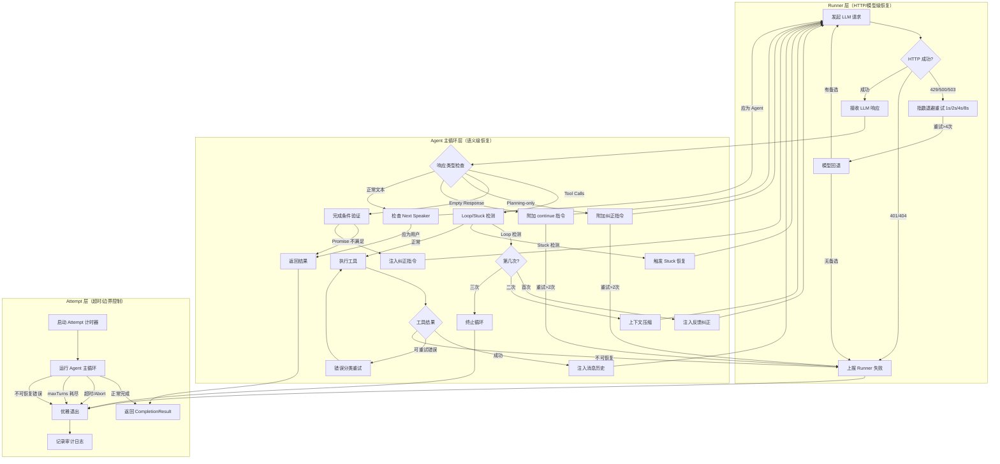
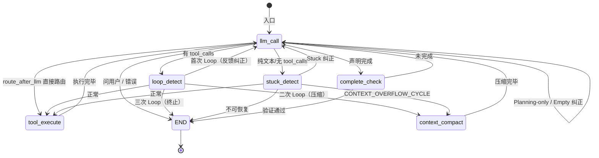

# 1.3 Agent-Loop 详细设计

## 1. 概述

### 1.1 设计目标

本文档定义基于 LangGraph 的 Agent ReAct 循环的详细设计方案，目标是构建一个生产级的、高稳定性的 Agent 执行引擎，具备以下核心能力：

1. **可靠的自驱循环**：Agent 能自主推理、调用工具、观察结果，直到任务完成
2. **多层错误恢复**：HTTP 级重试、语义级自我纠正、边界级兜底策略
3. **智能 Harness 工程**：Loop/Stuck 检测与自动恢复，防止死循环和卡住
4. **高效上下文管理**：三层压缩策略，在 Token 限制内最大化保留关键信息
5. **完整的可观测性**：Node 级执行追踪、事件发射、成本监控

### 1.2 设计原则

| 原则 | 说明 |
|------|------|
| 渐进式增强 | 基于现有 6 节点 LangGraph 实现演进，非重写 |
| 纵深防御 | Loop/Stuck/超时/错误多层保护，任何一层失效都有下一层兜底 |
| 语义恢复优先 | 遇到问题时优先通过 Prompt 引导模型自我纠正，而非直接终止 |
| 可观测性内建 | 每个节点必须发射事件，支持外部监控和调试 |
| Token 效率 | 上下文管理以 Token 而非消息数为度量单位 |

### 1.3 与大纲关系

本文档对应 `0_outline.md` 的 **1.3 agent-loop** 节及其子节：

- **1.3.1 context 管理** → 第 7 章「Context 管理」
- **1.3.2 ReAct 实现** → 第 2-5 章「系统架构、AgentState、节点设计、Prompt 构建」
- **1.3.3 Harness 工程** → 第 6 章「Harness 工程」

### 1.4 与现有实现的关系

**当前已实现**：
- 6 个 LangGraph 节点骨架（llm_call_node、tool_execute_node、loop_detect_node、stuck_detect_node、context_compact_node、complete_check_node）
- 基础 AgentState TypedDict
- 基础路由逻辑（route_after_llm、route_after_loop_detect、route_after_complete_check）
- SSE 事件发射框架

**当前局限**：
- Loop 检测仅有简化版精确匹配 + Jaccard 相似度
- Stuck 检测仅实现 MONOLOGUE 一种模式（连续无工具调用）
- 上下文压缩仅基于消息计数截断，无 Token 计数和 LLM 摘要
- 完成检查仅关键词匹配，无 Promise 验证
- 无 Runner 层 HTTP 重试和模型回退
- 无 Token 计数支持

**演进路径**：本文档设计在现有节点文件和状态结构基础上扩展，保持接口兼容，通过增量字段和新增节点实现增强。

---

## 2. 系统架构

### 2.1 三层循环架构

Agent Loop 采用三层嵌套架构，每层处理不同类型的问题：

| 层级 | 职责范围 | 处理的问题类型 | 恢复策略 |
|------|---------|--------------|---------|
| **Runner 层** | HTTP/模型级恢复 | 网络超时、API 限流、模型不可用 | 指数退避重试 + 模型回退链 |
| **Agent 主循环层** | 语义级恢复 | Planning-only、Empty Response、Loop、Stuck | Prompt 引导自我纠正 |
| **Attempt 层** | 超时/边界控制 | 整体超时、用户 Cancel、maxTurns 耗尽 | 优雅退出 + Autosubmission |



**各层边界**：

- **Runner 层** 封装在 LLM 调用内部（利用 LangChain 的 retry 机制或自定义 LLM 包装器），对上层透明
- **Agent 主循环层** 即 LangGraph StateGraph 的执行流程，所有节点和路由属于此层
- **Attempt 层** 通过 LangGraph 的 `stream()` 超时参数和外部 Cancel 信号实现

### 2.2 LangGraph 节点拓扑

#### 2.2.1 完整状态图定义

```python
from langgraph.graph import END, StateGraph
from src.domain.entities.agent_state import AgentState

# 节点函数（详见第4章）
from src.infrastructure.agent.nodes.llm_call_node import llm_call_node
from src.infrastructure.agent.nodes.loop_detect_node import loop_detect_node
from src.infrastructure.agent.nodes.stuck_detect_node import stuck_detect_node
from src.infrastructure.agent.nodes.tool_execute_node import tool_execute_node
from src.infrastructure.agent.nodes.context_compact_node import context_compact_node
from src.infrastructure.agent.nodes.complete_check_node import complete_check_node

# 路由函数（应用层）
from src.application.use_cases.agent_workflow import (
    route_after_llm,
    route_after_loop_detect,
    route_after_stuck_detect,
    route_after_complete_check,
)

workflow = StateGraph(AgentState)

# === 注册所有节点 ===
workflow.add_node("llm_call", llm_call_node)
workflow.add_node("loop_detect", loop_detect_node)
workflow.add_node("stuck_detect", stuck_detect_node)
workflow.add_node("tool_execute", tool_execute_node)
workflow.add_node("context_compact", context_compact_node)
workflow.add_node("complete_check", complete_check_node)

# === 入口点 ===
workflow.set_entry_point("llm_call")

# === llm_call 后条件路由 ===
workflow.add_conditional_edges(
    "llm_call",
    route_after_llm,
    {
        "loop_detect": "loop_detect",
        "stuck_detect": "stuck_detect",
        "complete_check": "complete_check",
        "tool_execute": "tool_execute",
        "llm_call": "llm_call",       # 纠正后重试
        "context_compact": "context_compact",
        END: END,
    },
)

# === loop_detect 后条件路由 ===
workflow.add_conditional_edges(
    "loop_detect",
    route_after_loop_detect,
    {
        "tool_execute": "tool_execute",       # 正常，无 Loop
        "llm_call": "llm_call",               # 首次：注入反馈纠正
        "context_compact": "context_compact", # 二次：压缩上下文
        END: END,                             # 三次：终止
    },
)

# === stuck_detect 后条件路由 ===
workflow.add_conditional_edges(
    "stuck_detect",
    route_after_stuck_detect,
    {
        "tool_execute": "tool_execute",       # 正常，未卡住
        "llm_call": "llm_call",               # 注入 Stuck 纠正反馈
        "context_compact": "context_compact", # CONTEXT_OVERFLOW_CYCLE 模式
        END: END,                             # 不可恢复 Stuck
    },
)

# === 工具执行后回到 llm_call ===
workflow.add_edge("tool_execute", "llm_call")

# === 上下文压缩后回到 llm_call ===
workflow.add_edge("context_compact", "llm_call")

# === 完成检查后条件路由 ===
workflow.add_conditional_edges(
    "complete_check",
    route_after_complete_check,
    {
        "llm_call": "llm_call",  # 未完成，继续
        END: END,                # 真正完成
    },
)

compiled = workflow.compile()
```

#### 2.2.2 Mermaid 状态图



#### 2.2.3 入口点和终止条件

**入口点**：
- `workflow.set_entry_point("llm_call")` — 每次用户提交任务后，从 LLM 调用开始
- 初始状态由应用层构造（包含 user_message、system_prompt、task_id 等）

**终止条件**（到达 `END` 的触发路径）：

| 触发源 | 条件 | 最终状态 |
|--------|------|---------|
| route_after_llm | LLM 主动问用户问题（以 `?` 结尾） | final_result = LLM 文本 |
| route_after_llm | 不可恢复错误 | error = 错误信息 |
| route_after_loop_detect | Loop 检测 count >= 3 | error = "Loop detected" |
| route_after_stuck_detect | Stuck 不可恢复 | error = "Stuck detected" |
| route_after_complete_check | Promise 验证通过 | final_result = 结果文本 |
| Attempt 层 | maxTurns >= max_turns | error = "max_turns reached" |
| Attempt 层 | 用户 Cancel | error = "cancelled" |
| Attempt 层 | 全局超时 | error = "timeout" |

---

## 3. AgentState 设计

### 3.1 状态字段定义

在现有 AgentState 基础上扩展，新增 Token 计数、成本追踪、检测器详情等字段：

```python
"""领域层 - AgentState (LangGraph State)"""

from typing import Annotated, Any, Dict, List, Optional
from typing_extensions import TypedDict
from langgraph.graph.message import add_messages


class AgentState(TypedDict):
    """Agent 运行状态 — 在节点间传递的共享数据

    设计约束：
    - 纯数据结构，无方法逻辑
    - 所有字段有默认值或允许 Optional
    - LangGraph 通过 add_messages 自动合并 messages 字段
    """

    # ============================================================
    # 1. 消息历史 (LangGraph 自动合并)
    # ============================================================
    messages: Annotated[list, add_messages]
    """完整消息历史，包含 system/user/assistant/tool 消息。
    使用 Annotated[list, add_messages] 让 LangGraph 自动追加而非替换。"""

    # ============================================================
    # 2. 任务上下文
    # ============================================================
    task_id: str
    """任务唯一标识，用于事件路由和日志追踪。"""

    workspace: str
    """工作目录绝对路径，工具执行在此目录下。"""

    user_message: str
    """用户原始输入消息，作为任务目标始终保留。"""

    # ============================================================
    # 3. 控制流
    # ============================================================
    current_turn: int
    """当前轮次计数，每次 LLM 调用后 +1。默认 0。"""

    max_turns: int
    """最大允许轮次，达到后 Attempt 层强制终止。默认 100。"""

    phase: str
    """当前阶段标识：idle/thinking/tool_executing/loop_detecting/stuck_detecting/
    context_compacting/completing/completed/error。用于前端展示。"""

    should_end: bool
    """终止标志，任何节点设置 True 后路由到 END。"""

    # ============================================================
    # 4. 工具调用
    # ============================================================
    pending_tool_calls: List[Dict[str, Any]]
    """待执行的工具调用列表，由 LLM 响应解析得到。
    每个元素格式：{"id": str, "name": str, "input": dict}"""

    tool_results: Dict[str, str]
    """工具执行结果映射，key=tool_call_id, value=结果文本。"""

    tool_call_history: List[Dict[str, Any]]
    """工具调用完整历史（包含参数和结果），用于 Loop/Stuck 检测。"""

    # ============================================================
    # 5. Loop 检测器状态
    # ============================================================
    loop_detection_count: int
    """连续检测到 Loop 的次数（0=未检测到）。每次连续检测+1，正常轮次重置为0。"""

    loop_detected: bool
    """当前轮次是否检测到 Loop（由 loop_detect_node 设置）。"""

    loop_type: Optional[str]
    """Loop 类型：exact_tool_repeat / content_repeat / llm_detected。"""

    # ============================================================
    # 6. Stuck 检测器状态
    # ============================================================
    stuck_detection_count: int
    """连续检测到 Stuck 的次数。"""

    stuck_detected: bool
    """当前轮次是否检测到 Stuck。"""

    stuck_type: Optional[str]
    """Stuck 类型：repeated_action_observation / repeated_action_error /
    monologue / alternating / context_overflow_cycle。"""

    # ============================================================
    # 7. 流式输出
    # ============================================================
    current_llm_text: str
    """当前轮次 LLM 输出的累积文本（不含历史）。用于内容相似度检测。"""

    # ============================================================
    # 8. 系统提示词
    # ============================================================
    system_prompt: str
    """完整的系统提示词文本，由 PromptBuilder 生成。
    llm_call_node 将其包装为 SystemMessage 注入消息列表头部。"""

    # ============================================================
    # 9. 上下文管理
    # ============================================================
    context_window: Dict[str, Any]
    """上下文窗口使用统计：
    {
        "used_tokens": int,      # 已使用 Token 数
        "total_tokens": int,     # 模型最大 Token 限制
        "ratio": float,          # 使用率 (0.0-1.0)
        "compression_level": int # 当前压缩级别 0=L1未触发, 1=L1, 2=L2, 3=L3
    }"""

    # ============================================================
    # 10. 结果
    # ============================================================
    final_result: Optional[str]
    """任务最终结果文本，完成时填充。"""

    error: Optional[str]
    """错误信息，终止时填充。"""

    # ============================================================
    # 11. 成本追踪（新增）
    # ============================================================
    cost_tracker: Dict[str, Any]
    """成本统计：
    {
        "total_input_tokens": int,
        "total_output_tokens": int,
        "total_cost_usd": float,
        "llm_calls": int,
        "tool_calls": int
    }"""
```

### 3.2 状态流转

**正常成功流程的状态变化**：

| 阶段 | 节点 | 关键状态变化 |
|------|------|------------|
| 初始化 | — | current_turn=0, phase="idle", messages=[user_msg] |
| 思考 | llm_call | phase="thinking", current_turn+=1, current_llm_text=累积文本 |
| 路由 | route_after_llm | pending_tool_calls=解析出的工具调用 |
| 检测 | loop_detect | loop_detected=False |
| 检测 | stuck_detect | stuck_detected=False |
| 执行 | tool_execute | phase="tool_executing", tool_results=执行结果, messages+=tool_msgs |
| 循环 | — | 回到 llm_call |
| 完成 | complete_check | is_complete=True, phase="completed", final_result=文本 |
| 终止 | END | should_end=True |

**Loop 检测触发流程的状态变化**：

| 阶段 | 节点 | 关键状态变化 |
|------|------|------------|
| 第1次 Loop | loop_detect | loop_detected=True, loop_type="exact_tool_repeat", loop_detection_count=1 |
| 纠正 | route_after_loop_detect | messages+=纠正反馈, loop_detection_count 保留 |
| 重试 | llm_call | 正常执行 |
| 第2次 Loop | loop_detect | loop_detected=True, loop_detection_count=2 |
| 压缩 | route_after_loop_detect | 路由到 context_compact |
| 压缩 | context_compact | messages=压缩后列表, context_window.compression_level+=1 |
| 重试 | llm_call | 正常执行 |
| 第3次 Loop | loop_detect | loop_detected=True, loop_detection_count=3 |
| 终止 | route_after_loop_detect | error="Loop detected", should_end=True |

---

## 4. 节点详细设计

### 4.1 llm_call 节点

**职责**：调用 LLM，流式输出文本，收集 tool_calls，发射事件。

#### 4.1.1 输入/输出

- **输入**：AgentState（特别是 messages、system_prompt、current_turn、task_id）
- **输出**：状态更新字典
  ```python
  {
      "messages": [AIMessage(content=..., tool_calls=...)],
      "current_llm_text": str,
      "phase": "thinking",
      "current_turn": state["current_turn"] + 1,
      "cost_tracker": {...},  # 更新 Token 计数
  }
  ```

#### 4.1.2 处理流程

```python
async def llm_call_node(state: AgentState, config: RunnableConfig) -> dict:
    llm = config["configurable"]["llm"]
    event_svc = config["configurable"]["event_service"]
    task_id = state["task_id"]
    current_turn = state["current_turn"] + 1

    # 1. 发射阶段变更事件
    await event_svc.emit(task_id, "phase-changed",
        {"phase": "thinking", "turn": current_turn})

    # 2. SystemMessage 注入逻辑
    messages = _prepare_messages(state)

    # 3. Token 计数与上下文检查（触发压缩前置条件）
    token_info = _estimate_context_usage(messages, llm)
    if token_info["ratio"] > 0.9:
        # 紧急：即使不经过压缩节点也先触发警告
        await event_svc.emit(task_id, "context-warning", token_info)

    # 4. 流式调用 LLM
    full_text = ""
    tool_calls_list = []
    input_tokens = 0
    output_tokens = 0

    async for chunk in llm.astream(messages):
        # 4a. 发射流式 token
        if chunk.content:
            full_text += chunk.content
            await event_svc.emit(task_id, "llm-chunk",
                {"turn": current_turn, "text": chunk.content})

        # 4b. 收集工具调用
        if hasattr(chunk, "tool_calls") and chunk.tool_calls:
            tool_calls_list.extend(chunk.tool_calls)

        # 4c. 收集 usage（如果 provider 支持）
        if hasattr(chunk, "usage_metadata"):
            input_tokens = chunk.usage_metadata.get("input_tokens", 0)
            output_tokens = chunk.usage_metadata.get("output_tokens", 0)

    # 5. 发射 LLM 完成事件
    await event_svc.emit(task_id, "llm-complete",
        {"turn": current_turn, "fullText": full_text,
         "toolCalls": tool_calls_list})

    # 6. 返回状态更新
    return {
        "messages": [AIMessage(content=full_text,
                               tool_calls=tool_calls_list or None)],
        "current_llm_text": full_text,
        "phase": "thinking",
        "current_turn": current_turn,
        "cost_tracker": update_cost(state, input_tokens, output_tokens, model=getattr(llm, "model", "default")),
        "context_window": token_info,
    }
```

#### 4.1.3 SystemMessage 注入逻辑

```python
def _prepare_messages(state: AgentState) -> list:
    """准备发送给 LLM 的消息列表

    规则：
    1. 如果 state["system_prompt"] 非空，包装为 SystemMessage 放头部
    2. 如果 messages 头部已有 SystemMessage，比较内容，不同则替换
    3. 保留所有其他消息不变
    """
    messages = list(state["messages"])
    system_prompt = state.get("system_prompt", "")

    if not system_prompt:
        return messages

    system_msg = SystemMessage(content=system_prompt)

    if messages and isinstance(messages[0], SystemMessage):
        if messages[0].content != system_prompt:
            messages[0] = system_msg  # 替换
        # 否则保持不变（避免重复对象创建）
    else:
        messages = [system_msg] + messages

    return messages
```

#### 4.1.4 异常处理

| 异常类型 | 处理策略 | 所在层级 |
|---------|---------|---------|
| HTTP 429/500/503 | Runner 层指数退避重试 | Runner |
| HTTP 401/404 | 直接上报，不可重试 | Runner |
| 模型响应格式错误 | 尝试解析，失败则附加纠正指令 | Agent |
| Token 超限 | 触发紧急上下文压缩后重试 | Agent |
| 流式中断 | 保留已输出内容，尝试续接 | Runner |

### 4.2 route_after_llm 路由节点

**职责**：分析 LLM 响应，决定下一步路由。

#### 4.2.1 Next Speaker 判断逻辑

```python
def route_after_llm(state: AgentState) -> str:
    """LLM 调用后的路由决策

    判定优先级（从高到低）：
    1. 有 tool_calls -> 工具执行路径
    2. 声明完成 -> 完成检查路径
    3. Planning-only / Empty -> 纠正重试
    4. 问用户问题 -> 终止
    5. 其他纯文本 -> stuck_detect（检测是否卡住）
    """
    messages = state["messages"]
    if not messages:
        return END

    last_msg = messages[-1]
    text, tool_calls = _extract_msg_content(last_msg)

    # 1. 有工具调用 -> loop_detect
    if tool_calls:
        state["pending_tool_calls"] = tool_calls
        return "loop_detect"

    # 2. 声明完成 -> complete_check
    if is_claiming_complete(text):
        return "complete_check"

    # 3. Empty Response 检测
    if _is_empty_response(text):
        _inject_empty_correction(state)
        return "llm_call"

    # 4. Planning-only 检测
    if _is_planning_only(text):
        _inject_planning_correction(state)
        return "llm_call"

    # 5. 问用户问题（以问号结尾且有疑问词）
    if _is_asking_user(text):
        state["final_result"] = text
        return END

    # 6. 纯文本响应 -> stuck_detect（检测是否卡住）
    return "stuck_detect"
```

#### 4.2.2 5 种路由分支的判定条件

| 路由目标 | 判定条件 | 状态副作用 |
|---------|---------|----------|
| `loop_detect` | `tool_calls` 非空 | pending_tool_calls = tool_calls |
| `complete_check` | 文本匹配完成关键词 | — |
| `llm_call`（Empty 纠正） | 文本为空或仅空白 | messages += 纠正反馈 |
| `llm_call`（Planning-only 纠正） | 文本含计划关键词且无 tool_calls | messages += 执行指令 |
| `stuck_detect` | 纯文本响应，非完成声明、非问用户 | — |
| END | 文本以问号结尾，明显问用户 | final_result = 文本 |

#### 4.2.3 Planning-only / Empty Response 纠正逻辑

```python
EMPTY_MAX_RETRY = 2
PLANNING_MAX_RETRY = 2

# 记录到状态中（新增字段）
# empty_retry_count: int
# planning_retry_count: int

def _is_empty_response(text: str) -> bool:
    return not text or not text.strip()

def _is_planning_only(text: str) -> bool:
    """检测是否只输出计划/分析但没有行动"""
    indicators = [
        "here's a plan", "my plan is", "i will", "let me think",
        "first, i need to", "i should", "the approach is",
    ]
    text_lower = text.lower()
    has_planning = any(ind in text_lower for ind in indicators)
    # 如果有工具调用则不算 planning-only（已由前面分支处理）
    return has_planning

def _inject_empty_correction(state: AgentState) -> None:
    count = state.get("empty_retry_count", 0) + 1
    state["empty_retry_count"] = count

    if count > EMPTY_MAX_RETRY:
        state["error"] = "Empty response persists after correction"
        state["should_end"] = True
        return

    state["messages"].append({
        "role": "user",
        "content": (
            "Your previous response was empty. Please continue working on the task. "
            "If you're unsure about the next step, read relevant files first."
        ),
    })

def _inject_planning_correction(state: AgentState) -> None:
    count = state.get("planning_retry_count", 0) + 1
    state["planning_retry_count"] = count

    if count > PLANNING_MAX_RETRY:
        state["error"] = "Planning-only persists after correction"
        state["should_end"] = True
        return

    state["messages"].append({
        "role": "user",
        "content": (
            "You outlined a plan but haven't taken action yet. "
            "Please proceed with executing the plan using the available tools."
        ),
    })

def _inject_act_now(state: AgentState) -> None:
    state["messages"].append({
        "role": "user",
        "content": (
            "Please use the available tools to make progress on this task. "
            "Analysis alone is not sufficient."
        ),
    })
```

### 4.3 loop_detect 节点

**职责**：检测 Agent 是否陷入重复行为模式。

#### 4.3.1 三重检测算法详细设计

**检测器 1：精确工具重复检测**

```python
def _detect_exact_tool_repeat(messages: list, threshold: int = 3, window: int = 5) -> tuple:
    """精确工具重复检测

    算法：
    1. 从消息历史中提取最近 window 轮的 assistant 消息
    2. 对每轮的工具调用计算签名：(tool_name, param_hash)
    3. 检查最近 threshold 轮的签名是否完全相同

    复杂度：O(window * avg_tools_per_turn)
    """
    recent_tool_calls = _extract_recent_tool_calls(messages, window)

    if len(recent_tool_calls) < threshold:
        return False, None

    signatures = []
    for tc_list in recent_tool_calls[:threshold]:
        if not tc_list:
            break
        sig = tuple(
            (tc.get("name"), _hash_params(tc.get("arguments", {})))
            for tc in tc_list
        )
        signatures.append(sig)

    if len(signatures) == threshold and len(set(signatures)) == 1:
        return True, "exact_tool_repeat"

    return False, None


def _hash_params(params: dict) -> str:
    """参数哈希，使用 sorted keys + json 保证一致性"""
    import hashlib, json
    canonical = json.dumps(params, sort_keys=True, ensure_ascii=False)
    return hashlib.sha256(canonical.encode()).hexdigest()[:8]
```

**检测器 2：内容相似度检测**

```python
def _detect_content_repeat(messages: list, threshold_sim: float = 0.85,
                           window: int = 4, consecutive: int = 2) -> tuple:
    """内容相似度检测（TF-IDF 余弦相似度）

    算法：
    1. 提取最近 window 轮的 assistant 文本响应
    2. 对每轮文本做简单分词 + 词频统计
    3. 计算相邻轮次的 Jaccard/余弦相似度
    4. 连续 consecutive 轮相似度 > threshold_sim 则判定 Loop

    注意：使用简单词袋模型而非完整 TF-IDF（减少依赖），
    后续可升级为 sklearn 的 TfidfVectorizer。
    """
    from collections import Counter

    texts = _extract_recent_assistant_texts(messages, window)
    if len(texts) < consecutive + 1:
        return False, None

    similarities = []
    for i in range(len(texts) - 1):
        words1 = Counter(texts[i].lower().split())
        words2 = Counter(texts[i + 1].lower().split())

        # 余弦相似度（词袋向量）
        dot = sum(words1[w] * words2[w] for w in set(words1) & set(words2))
        norm1 = sum(c * c for c in words1.values()) ** 0.5
        norm2 = sum(c * c for c in words2.values()) ** 0.5

        sim = dot / (norm1 * norm2) if norm1 * norm2 > 0 else 0
        similarities.append(sim)

    # 检查是否存在连续 consecutive 轮都超过阈值
    for i in range(len(similarities) - consecutive + 1):
        if all(s >= threshold_sim for s in similarities[i:i + consecutive]):
            return True, "content_repeat"

    return False, None
```

**检测器 3：LLM 辅助检测（可选扩展）**

```python
async def _detect_llm_loop(messages: list, llm, threshold_conf: float = 0.7) -> tuple:
    """LLM 辅助 Loop 检测

    算法：
    1. 构建最近 6 轮的轨迹摘要
    2. 发送给轻量模型（如 Haiku/Flash）判断是否为 Loop
    3. 解析模型返回的置信度分数

    触发条件：前两个检测器有争议或置信度不足时启用。
    成本：一次轻量 LLM 调用（~500 input tokens）。
    """
    trajectory = _build_trajectory_summary(messages, turns=6)

    prompt = f"""Analyze the following agent execution trajectory and determine if the agent is stuck in a loop.

Trajectory:
{trajectory}

Respond with a JSON object:
{{"is_loop": true/false, "confidence": 0.0-1.0, "reason": "brief explanation"}}
"""
    response = await llm.ainvoke([{"role": "user", "content": prompt}])
    result = _parse_json_response(response.content)

    if result.get("is_loop") and result.get("confidence", 0) >= threshold_conf:
        return True, "llm_detected"

    return False, None
```

#### 4.3.2 三级响应机制

| 阶段 | loop_detection_count | 动作 | 路由目标 |
|------|---------------------|------|---------|
| 首次 | 1 | 注入 Loop 纠正反馈到消息历史 | `llm_call` |
| 二次 | 2 | 执行 L2/L3 上下文压缩 + 重新聚焦 | `context_compact` |
| 三次 | >= 3 | 终止循环，返回错误 | `END` |

#### 4.3.3 Loop 纠正 Prompt 说明

Loop 纠正 Prompt 的完整模板参见第 5.2.1 节，本节仅描述注入时机和关键参数。

**注入时机**：首次检测到 Loop 时，由 `route_after_loop_detect` 路由到 `llm_call` 前注入。

**关键参数**：
- `n`：检测窗口轮数
- `recent_action_summary`：最近动作摘要
- `recent_result_summary`：最近结果摘要

### 4.4 stuck_detect 节点

**职责**：检测 Agent 是否卡住（无法推进任务进展）。

#### 4.4.1 五种 Stuck 模式检测

```python
class StuckType:
    REPEATED_ACTION_OBSERVATION = "repeated_action_observation"
    REPEATED_ACTION_ERROR = "repeated_action_error"
    MONOLOGUE = "monologue"
    ALTERNATING = "alternating"
    CONTEXT_OVERFLOW_CYCLE = "context_overflow_cycle"
```

**模式 1：REPEATED_ACTION_OBSERVATION**

```python
def _detect_repeated_action_observation(history: list, threshold: int = 3,
                                         window: int = 8) -> tuple:
    """相同工具 + 相同参数 + 相同结果 反复出现

    签名：(tool_name, param_hash, result_hash)
    如果连续 threshold 次签名相同，判定 Stuck。
    """
    recent = history[-window:]
    signatures = []
    for h in recent:
        sig = (h["name"], h["param_hash"], h["result_hash"])
        signatures.append(sig)

    max_repeat = _max_consecutive_repeat(signatures)
    if max_repeat >= threshold:
        return True, StuckType.REPEATED_ACTION_OBSERVATION
    return False, None
```

**模式 2：REPEATED_ACTION_ERROR**

```python
def _detect_repeated_action_error(history: list, threshold: int = 3,
                                   window: int = 8) -> tuple:
    """相同工具 + 相同参数 + 相同错误 反复出现

    签名：(tool_name, param_hash, error_type, error_prefix_100chars)
    """
    recent = [h for h in history[-window:] if h.get("status") == "error"]
    if len(recent) < threshold:
        return False, None

    signatures = []
    for h in recent:
        error_text = h.get("error", "")[:100]
        sig = (h["name"], h["param_hash"], h.get("error_type"), error_text)
        signatures.append(sig)

    max_repeat = _max_consecutive_repeat(signatures)
    if max_repeat >= threshold:
        return True, StuckType.REPEATED_ACTION_ERROR
    return False, None
```

**模式 3：MONOLOGUE**

```python
def _detect_monologue(messages: list, threshold: int = 5,
                       window: int = 10) -> tuple:
    """连续多轮无工具调用（只说话不行动）

    检查最近 window 轮 assistant 消息中 tool_calls 为空的连续次数。
    """
    assistant_msgs = _extract_recent_assistant_messages(messages, window)

    consecutive_no_tools = 0
    for msg in reversed(assistant_msgs):
        if not msg.get("tool_calls"):
            consecutive_no_tools += 1
        else:
            break

    if consecutive_no_tools >= threshold:
        return True, StuckType.MONOLOGUE
    return False, None
```

**模式 4：ALTERNATING**

```python
def _detect_alternating(history: list, threshold: int = 3,
                         window: int = 10) -> tuple:
    """A->B->A->B 交替模式

    将每轮的主要 action 提取为签名序列，检测 ABAB 子串。
    threshold=3 表示 ABABAB（A 和 B 各出现 3 次）。
    """
    recent = history[-window:]
    signatures = [h["action_signature"] for h in recent]

    # 检测最小周期为 2 的重复
    for period in [2, 3]:
        if len(signatures) < period * threshold:
            continue
        pattern = signatures[-period:]
        matches = 0
        for i in range(len(signatures) // period):
            chunk = signatures[-(i + 1) * period:-i * period or None]
            if chunk == pattern:
                matches += 1
            else:
                break
        if matches >= threshold:
            return True, StuckType.ALTERNATING

    return False, None
```

**模式 5：CONTEXT_OVERFLOW_CYCLE**

```python
def _detect_context_overflow_cycle(state: AgentState, threshold: int = 2) -> tuple:
    """压缩后仍然 Loop/Stuck

    如果 compression_level >= 1 且本轮仍检测到 Loop 或 Stuck，
    判定为上下文溢出导致的恶性循环。
    """
    compression_level = state.get("context_window", {}).get("compression_level", 0)
    loop_detected = state.get("loop_detected", False)

    # 需要结合 Loop 检测结果
    if compression_level >= 1 and loop_detected:
        return True, StuckType.CONTEXT_OVERFLOW_CYCLE
    return False, None
```

#### 4.4.2 各模式的检测窗口、阈值、算法汇总

| 模式 | 检测窗口 | 阈值 | 算法复杂度 | 误报率 |
|------|---------|------|----------|--------|
| REPEATED_ACTION_OBSERVATION | 最近 8 轮 | 连续 3 次相同 | O(window) | 低 |
| REPEATED_ACTION_ERROR | 最近 8 轮 | 连续 3 次相同错误 | O(window) | 低 |
| MONOLOGUE | 最近 10 轮 | 连续 5 轮无工具 | O(window) | 中 |
| ALTERNATING | 最近 10 轮 | ABAB 模式 >=3 次 | O(window * periods) | 低 |
| CONTEXT_OVERFLOW_CYCLE | 整个会话 | 压缩后仍 Loop | O(1) | 低 |

#### 4.4.3 各模式的纠正条件

五种 Stuck 模式的纠正 Prompt 完整模板参见第 5.2.2 节，本节仅描述各模式的注入条件。

| 模式 | 注入条件 | 路由目标 |
|------|---------|---------|
| REPEATED_ACTION_OBSERVATION | 检测到相同工具+参数+结果重复 | `llm_call`（注入纠正反馈） |
| REPEATED_ACTION_ERROR | 检测到相同工具+参数+错误重复 | `llm_call`（注入纠正反馈） |
| MONOLOGUE | 连续多轮无工具调用 | `llm_call`（注入纠正反馈） |
| ALTERNATING | 检测到 ABAB 交替模式 | `llm_call`（注入纠正反馈） |
| CONTEXT_OVERFLOW_CYCLE | 压缩后仍检测到 Loop/Stuck | `context_compact` |

### 4.5 tool_execute 节点

**职责**：执行待处理的工具调用，处理错误，发射事件。

#### 4.5.1 工具执行流程

```python
async def tool_execute_node(state: AgentState, config: RunnableConfig) -> dict:
    tool_registry = config["configurable"]["tool_registry"]
    security_chain = config["configurable"].get("security_chain")
    event_svc = config["configurable"]["event_service"]
    task_id = state["task_id"]

    pending_tools = state.get("pending_tool_calls", [])
    results = {}
    tool_messages = []

    for tc in pending_tools:
        tool_call_id = tc.get("id", "")
        tool_name = tc.get("name", "")
        tool_input = tc.get("input", {})

        # 1. 发射开始事件
        await event_svc.emit(task_id, "tool-call",
            {"toolCallId": tool_call_id, "toolName": tool_name, "input": tool_input})

        # 2. 安全检查链
        if security_chain:
            check = await security_chain.execute(tc, state)
            if check.status == "block":
                results[tool_call_id] = f"Blocked: {check.reason}"
                await event_svc.emit(task_id, "tool-blocked",
                    {"toolCallId": tool_call_id, "reason": check.reason})
                continue
            if check.status == "require_approval":
                # 发射审批请求事件，等待前端响应
                approved = await _wait_for_approval(tool_call_id, event_svc, task_id)
                if not approved:
                    results[tool_call_id] = "User denied approval"
                    continue

        # 3. 执行工具（带超时）
        try:
            result = await asyncio.wait_for(
                tool_registry.execute(tool_name, tool_input),
                timeout=tc.get("timeout", 30)
            )
            results[tool_call_id] = result.get("output", "")
            status = "success"
            error_info = None
        except asyncio.TimeoutError:
            results[tool_call_id] = "Error: Tool execution timed out"
            status = "timeout"
            error_info = "timeout"
        except Exception as e:
            results[tool_call_id] = f"Error: {str(e)}"
            status = "error"
            error_info = str(e)

        # 4. 发射结果事件
        await event_svc.emit(task_id, "tool-result",
            {"toolCallId": tool_call_id, "toolName": tool_name,
             "status": status, "output": results[tool_call_id], "error": error_info})

        # 5. 构建 tool 消息
        tool_messages.append({
            "role": "tool",
            "tool_call_id": tool_call_id,
            "content": results[tool_call_id],
        })

    return {
        "messages": tool_messages,
        "tool_results": results,
        "pending_tool_calls": [],
        "phase": "tool_executing",
        "tool_call_history": _append_tool_history(state, pending_tools, results),
    }
```

#### 4.5.2 错误分类与重试

| 错误类型 | 分类 | 处理策略 |
|---------|------|---------|
| 命令未找到 | recoverable | 检查 PATH，尝试绝对路径重试 |
| 权限拒绝 | recoverable | 尝试 sudo/chmod 或报告用户 |
| 文件不存在 | recoverable | 检查路径，尝试创建父目录 |
| 网络超时 | recoverable | 指数退避重试 |
| 语法错误 | fatal | 不可重试，注入错误信息 |
| 段错误 | fatal | 不可重试，报告用户 |
| 执行超时 | timeout | 返回部分输出，标记超时 |

### 4.6 context_compact 节点

**职责**：当上下文接近 Token 限制时，压缩对话历史。

#### 4.6.1 三层压缩策略设计

```python
class CompressionLevel:
    L1_VISIBILITY_FILTER = 1    # 可见性过滤
    L2_TOOL_PAIR_SUMMARY = 2    # 工具对摘要
    L3_LLM_FULL_COMPRESSION = 3 # LLM 全文压缩
```

**触发条件与阈值**：

| 上下文使用率 | 触发动作 | 压缩级别 | 预估耗时 |
|------------|---------|---------|---------|
| < 60% | 无 | 0 | 0ms |
| 60% - 70% | L1 可见性过滤 | 1 | < 1ms |
| 70% - 80% | L2 工具对摘要 | 2 | < 50ms |
| 80% - 90% | L3 LLM 全文压缩 | 3 | ~500-2000ms |
| > 90% | 紧急压缩（L3 + 激进截断） | 3 | ~2000ms |

**L1: 可见性过滤**

```python
def _l1_visibility_filter(messages: list) -> list:
    """L1 压缩：过滤掉 agent_visible 的消息

    保留规则：
    - user_visible 消息保留
    - system 消息保留
    - 最近的 3 轮保留（无论可见性）
    - user 原始消息保留
    """
    result = []
    recent_count = 0

    for msg in reversed(messages):
        if recent_count < 3:
            result.append(msg)
            recent_count += 1
            continue

        visibility = msg.get("visibility", "user_visible")
        role = msg.get("role", "")

        if role == "system" or role == "user" or visibility == "user_visible":
            result.append(msg)

    return list(reversed(result))
```

**L2: 工具对摘要**

```python
def _l2_tool_pair_summary(messages: list) -> list:
    """L2 压缩：将工具调用 + 工具结果对摘要为单行描述

    转换规则：
    - read_file(path) -> "Read file {path}: {line_count} lines"
    - write_file(path) -> "Wrote file {path}"
    - run_command(cmd) -> "Ran command: {cmd[:50]}... (exit={code})"
    - grep_search(pattern) -> "Searched for '{pattern[:30]}...': {match_count} matches"
    """
    result = []
    i = 0
    while i < len(messages):
        msg = messages[i]

        # 检测 tool_call + tool_result 对
        if msg.get("role") == "assistant" and msg.get("tool_calls"):
            tc = msg["tool_calls"][0]
            tc_id = tc.get("id")

            # 查找对应的 tool result
            result_msg = None
            for j in range(i + 1, len(messages)):
                if messages[j].get("role") == "tool" and messages[j].get("tool_call_id") == tc_id:
                    result_msg = messages[j]
                    break

            if result_msg:
                summary = _summarize_tool_pair(tc, result_msg)
                result.append({
                    "role": "assistant",
                    "content": summary,
                    "visibility": "agent_visible",
                })
                i = j + 1  # 跳过已摘要的消息
                continue

        result.append(msg)
        i += 1

    return result
```

**L3: LLM 全文压缩**

```python
async def _l3_llm_compression(messages: list, task_description: str,
                               llm, keep_recent: int = 5) -> list:
    """L3 压缩：使用 LLM 将历史对话压缩为结构化摘要

    保留区：最近 keep_recent 轮不压缩
    压缩区：更早的消息交给 LLM 生成摘要
    """
    # 保留最近消息
    preserved = messages[-keep_recent:]
    to_compress = messages[:-keep_recent]

    if not to_compress:
        return messages

    # 构建压缩 Prompt
    history_text = _format_messages_for_compression(to_compress)
    prompt = _build_compression_prompt(task_description, history_text)

    # 调用轻量模型生成摘要
    response = await llm.ainvoke([{"role": "user", "content": prompt}])
    summary = response.content

    # 构造摘要消息
    summary_msg = {
        "role": "assistant",
        "content": f"[Context Summary]\n{summary}",
        "visibility": "agent_visible",
    }

    return [summary_msg] + preserved
```

#### 4.6.2 关键信息保留规则

在任意级别的压缩中，以下信息**必须保留**：

1. **用户原始消息** — 永不压缩
2. **System Prompt** — 永不压缩
3. **最近 3-5 轮完整消息** — 根据压缩级别决定
4. **错误信息** — 保留最近 3 个错误的完整内容
5. **文件创建/修改结果** — 保留文件路径和操作类型
6. **任务目标** — 始终在 system prompt 中保留

#### 4.6.3 压缩 Prompt 模板

```markdown
## Context Compression Prompt

You are summarizing a conversation between a user and an AI coding assistant.

The user's original task was: {task_description}

Below is the conversation history. Please create a concise summary that preserves
all information needed to continue the task.

**Summary requirements:**
1. What files were read and what was learned from each
2. What changes were made (file paths and brief description)
3. What errors were encountered and how they were resolved (or not)
4. What is the current state of the task (completed vs remaining)
5. Any important context that the next turns will need

**Conversation to summarize:**
{conversation_history}

Provide the summary in a structured format that can replace the full history.
Keep the summary under 800 tokens if possible.
```

### 4.7 complete_check 节点

**职责**：验证 LLM 声明的任务完成是否真实成立。

#### 4.7.1 完成条件检查

```python
async def complete_check_node(state: AgentState, config: RunnableConfig) -> dict:
    """完成检查节点

    检查策略（优先级从高到低）：
    1. 关键词匹配：文本包含完成声明关键词
    2. Promise 验证：提取 <promise> 标签，验证条件是否满足
    3. LLM 辅助验证（可选）：调用轻量模型验证
    """
    messages = state["messages"]
    if not messages:
        return {"is_complete": False}

    last_msg = messages[-1]
    text = _extract_text(last_msg)

    # 1. 关键词检测
    if not is_claiming_complete(text):
        return {"is_complete": False}

    # 2. Promise 验证
    promises = _extract_promises(text)
    if promises:
        all_met = await _verify_promises(promises, state)
        if not all_met:
            return {
                "is_complete": False,
                "unmet_promises": [p for p, met in zip(promises, all_met) if not met],
            }

    # 3. 可选：LLM 辅助验证
    # if config.get("enable_llm_completion_verify"):
    #     verified = await _llm_verify_completion(text, state)
    #     if not verified:
    #         return {"is_complete": False}

    return {
        "is_complete": True,
        "final_result": text,
        "phase": "completed",
    }
```

#### 4.7.2 Promise 机制

LLM 在声明完成时，应在响应中包含 `<promise>` 标签说明完成条件：

```markdown
I have completed the task.

<promise>
1. Created file hello.py with greeting function
2. Added unit tests in test_hello.py
3. All tests pass
</promise>
```

框架侧验证每个 Promise：
- 文件存在性检查
- 内容匹配检查
- 测试运行状态检查

#### 4.7.3 纠正反馈注入

如果验证不通过：

```python
def _inject_completion_feedback(state: AgentState, unmet_promises: list = None) -> None:
    text = "You claimed the task is complete, but it appears there is still work to do."
    if unmet_promises:
        text += "\n\nThe following promises were not verified:\n"
        for p in unmet_promises:
            text += f"- {p}\n"
    text += "\nPlease continue working on the task."

    state["messages"].append({"role": "user", "content": text})
```

---

## 5. Prompt 构建逻辑

### 5.1 系统提示词组装

Agent Loop 中的 System Prompt 由 PromptBuilder 生成（详见 `1.2_prompt-builder.md`），在 `llm_call_node` 中注入。

**组装时机**：
1. 每次进入 `llm_call_node` 时，调用 `PromptBuilder.build(state)` 生成 system_prompt
2. 如果 system_prompt 与上一轮相同，可缓存避免重复生成
3. 上下文压缩后，system_prompt 中的 conversation_history section 自动更新

**与 11 层架构的关系**：

| Layer | 内容 | 在 Loop 中的变化 |
|-------|------|----------------|
| 1-6 (stable) | 角色定义、行为规则、安全约束、工具描述 | 不变，最大化缓存命中 |
| 7-10 (dynamic) | 项目上下文、对话历史、工具结果、当前任务 | 每轮更新 |

### 5.2 链路中的 Prompt 模板

本节列出 Agent Loop 各节点使用的完整 Prompt 模板。

#### 5.2.1 Loop 纠正 Prompt

```markdown
I notice you seem to be repeating the same action without making progress.

Here's what you've done in the last {n} turns:
{recent_action_summary}

The results have been:
{recent_result_summary}

Please try a different approach. Consider:
1. Reading more files to understand the codebase
2. Using a different tool or command
3. Breaking the problem into smaller steps
4. Checking if the task requirements have changed

What would you like to do next?
```

#### 5.2.2 Stuck 纠正 Prompt（5 种）

**REPEATED_ACTION_OBSERVATION**：
```markdown
You have been executing `{tool_name}` repeatedly with the same parameters,
and getting the same result each time ({repeat_count} times).

This action is not advancing the task. Please:
1. Analyze why this result is expected or unhelpful
2. Try a completely different approach
3. Consider whether the task assumptions need revisiting
```

**REPEATED_ACTION_ERROR**：
```markdown
The command `{tool_name}` has failed {fail_count} times with the same error:
```
{error_message}
```

Instead of retrying the same command, consider:
1. What is the root cause of this error?
2. Is there an alternative approach?
3. Do you need to read more context first?
4. Is the command syntax correct for this environment?
```

**MONOLOGUE**：
```markdown
You have been providing analysis without taking action for {turn_count} turns.
Analysis is helpful, but now it's time to act.

Please use an appropriate tool to make progress on the task.
If you need more information, use read_file or grep_search first.
```

**ALTERNATING**：
```markdown
You seem to be alternating between:
- Action A: {action_a_description}
- Action B: {action_b_description}

This pattern has repeated {cycle_count} times without progress.
Please break out of this cycle and try a different approach.

Consider: What is the underlying problem that causes you to keep switching?
```

**CONTEXT_OVERFLOW_CYCLE**：
```markdown
The conversation context has been compressed due to length limits,
but you still seem to be repeating actions.

This often happens when important context was lost during compression.

Please:
1. Re-read the original task description carefully
2. Re-examine the current state of files
3. Take a fresh approach rather than continuing the previous pattern
```

#### 5.2.3 上下文压缩 Prompt

```markdown
You are summarizing a conversation between a user and an AI coding assistant.

The user's original task was: {task_description}

Below is the conversation history. Please create a concise summary that preserves
all information needed to continue the task.

Summary requirements:
1. What files were read and what was learned from each
2. What changes were made (file paths and brief description)
3. What errors were encountered and how they were resolved (or not)
4. What is the current state of the task (completed vs remaining)
5. Any important context that the next turns will need

Conversation to summarize:
{conversation_history}

Provide the summary in a structured format that can replace the full history.
Keep under 800 tokens.
```

#### 5.2.4 完成验证 Prompt

```markdown
The AI assistant claims the task is complete.

Original task: {task_description}
Assistant's final statement: {assistant_statement}

Files that were modified (based on tool call history):
{modified_files_list}

Please verify:
1. Does the assistant's statement address the original task?
2. Were all requested changes actually made?
3. Are there any obvious issues or incomplete work?

Respond with: COMPLETE if the task is truly done, or INCOMPLETE with explanation.
```

#### 5.2.5 Planning-only 纠正 Prompt

```markdown
You outlined a plan but haven't taken action yet. Please proceed with executing
the plan using the available tools. If a step requires reading files, use read_file.
If it requires writing, use write_file. If it requires searching, use grep_search.

Do not output more analysis — execute the next step now.
```

#### 5.2.6 Empty Response 纠正 Prompt

```markdown
Your previous response was empty. Please continue working on the task.
If you're unsure about the next step, read relevant files first.
```

---

## 6. Harness 工程

### 6.1 防死循环

**Loop 检测 + 三级响应**：

```
┌─────────────────────────────────────────────────────────┐
│  检测层：精确工具重复 + 内容相似度 + LLM 辅助（可选）      │
│            ↓                                            │
│  第1次检测 ──→ 注入反馈纠正 ──→ 继续循环（重置计数）      │
│            ↓                                            │
│  第2次检测 ──→ 上下文压缩 ──→ 重新聚焦 ──→ 继续循环      │
│            ↓                                            │
│  第3次检测 ──→ 终止循环 ──→ 返回错误                     │
└─────────────────────────────────────────────────────────┘
```

**maxTurns 硬限制**：
- `max_turns` 默认 100，可在 AgentConfig 中配置
- 每轮 `llm_call` 后 `current_turn += 1`
- `route_after_llm` 在每次路由前检查：`if current_turn >= max_turns: return END`

### 6.2 防卡住

**Stuck 五种模式 + 恢复策略**：

| 模式 | 检测触发 | 恢复策略 | 最大纠正次数 |
|------|---------|---------|------------|
| REPEATED_ACTION_OBSERVATION | 相同工具+参数+结果 >=3 次 | 注入反馈 + 建议换方法 | 2 次 |
| REPEATED_ACTION_ERROR | 相同工具+参数+错误 >=3 次 | 注入反馈 + 错误根因分析 | 2 次 |
| MONOLOGUE | 连续 5 轮无工具调用 | 附加"请调用工具"指令 | 2 次 |
| ALTERNATING | ABAB 模式 >=3 周期 | 任务重新聚焦 + 建议新方法 | 2 次 |
| CONTEXT_OVERFLOW_CYCLE | 压缩后仍 Loop | 硬重置 + 重新规划 | 1 次 |

**恢复策略实现**：

```python
def route_after_stuck_detect(state: AgentState) -> str:
    if not state.get("stuck_detected"):
        return "tool_execute"  # 未卡住，继续正常流程

    stuck_type = state.get("stuck_type")
    count = state.get("stuck_detection_count", 0)

    # CONTEXT_OVERFLOW_CYCLE 直接进入压缩
    if stuck_type == StuckType.CONTEXT_OVERFLOW_CYCLE:
        return "context_compact"

    # 其他模式超过最大纠正次数则终止
    if count >= 2:
        state["error"] = f"Stuck detected ({stuck_type}), unrecoverable"
        return END

    # 注入对应模式的纠正反馈
    correction = _build_stuck_correction(state, stuck_type)
    state["messages"].append({"role": "user", "content": correction})
    return "llm_call"
```

### 6.3 兜底策略

**Attempt 层控制**：

```python
async def run_with_attempt_control(graph, state, config):
    """Attempt 层：超时控制 + Cancel + maxTurns"""
    import asyncio

    timeout = config.get("timeout", 300)  # 默认 5 分钟
    abort_signal = config.get("abort_signal")

    try:
        async for event in graph.astream(state, config, timeout=timeout):
            # 检查 Cancel 信号
            if abort_signal and abort_signal.is_set():
                return {"error": "cancelled", "status": "aborted"}

            # 事件已自动发射到前端
            pass

    except asyncio.TimeoutError:
        return {"error": "timeout", "status": "timeout",
                "final_result": _extract_best_effort_result(state)}

    except Exception as e:
        return {"error": str(e), "status": "error"}
```

**Autosubmission 机制**：

当任务因边界条件（maxTurns/超时/Cancel）终止时，返回当前最佳结果：

```python
def _extract_best_effort_result(state: AgentState) -> str:
    """提取当前最佳努力结果"""
    # 1. 如果有 final_result，直接返回
    if state.get("final_result"):
        return state["final_result"]

    # 2. 返回最近一轮的 LLM 文本
    messages = state.get("messages", [])
    for msg in reversed(messages):
        if msg.get("role") == "assistant" and msg.get("content"):
            return msg["content"]

    # 3. 兜底
    return "Task terminated before completion."
```

### 6.4 Runner 层恢复

**HTTP 重试（指数退避）**：

```python
from langchain_core.runnables import RunnableRetry

# 包装 LLM 调用，添加重试逻辑
llm_with_retry = llm.with_retry(
    retry_if_exception_type=(RateLimitError, InternalServerError),
    wait_exponential_jitter=True,
    stop_after_attempt=4,
)

# 退避序列：1s, 2s, 4s, 8s（加上 jitter）
```

**模型回退链**：

```python
MODEL_FALLBACK_CHAIN = [
    "claude-3-opus-20240229",
    "claude-3-sonnet-20240229",
    "claude-3-haiku-20240307",
]

async def call_with_fallback(messages, primary_model, fallback_chain):
    """模型回退调用"""
    models = [primary_model] + fallback_chain
    last_error = None

    for model in models:
        try:
            llm = get_llm(model)
            return await llm.ainvoke(messages)
        except (AuthenticationError, NotFoundError) as e:
            # 不可重试，直接抛
            raise
        except Exception as e:
            last_error = e
            continue

    raise last_error
```

---

## 7. Context 管理

### 7.1 裁剪策略

**可见性过滤（L1）**：
- 始终运行，零成本
- 过滤 `visibility="agent_visible"` 的消息（框架内部消息）
- 保留 `user_visible`、system、user 消息
- 保留最近 3 轮完整消息（无论可见性）

**消息数量裁剪**：
- 当消息数超过 `max_messages`（默认 100）时，触发数量裁剪
- 保留 system + 最近 20 条，中间消息进入 L2/L3 压缩

### 7.2 压缩策略

详见 [4.6 context_compact 节点](#46-context_compact-节点)。

三层压缩递进关系：

```
ratio < 60%     → 无压缩
ratio 60%-70%   → L1 可见性过滤
ratio 70%-80%   → L1 + L2 工具对摘要
ratio 80%-90%   → L1 + L2 + L3 LLM 压缩
ratio > 90%     → 紧急：L1 + L2 + L3 + 激进截断
```

### 7.3 注入策略

**动态信息注入时机**：

| 信息类型 | 注入位置 | 注入时机 |
|---------|---------|---------|
| 项目上下文 | system prompt project_context section | 每轮 llm_call 前 |
| 工具结果 | messages 尾部（tool role） | tool_execute 后 |
| Loop/Stuck 纠正反馈 | messages 尾部（user role） | 检测后路由前 |
| 上下文摘要 | 替换被压缩的消息 | context_compact 后 |
| 完成验证反馈 | messages 尾部（user role） | complete_check 失败后 |

**注入位置固定规则**：
- 系统级信息 → System Prompt（消息列表头部）
- 用户输入 → user role 消息
- 框架反馈 → user role 消息（模拟系统反馈）
- 工具结果 → tool role 消息

---

## 8. 可观测性

### 8.1 事件类型定义

```python
EVENT_TYPES = {
    # 阶段变更
    "phase-changed": {"phase": str, "previousPhase": str, "turn": int},

    # LLM 相关
    "llm-chunk": {"turn": int, "text": str, "delta": bool},
    "llm-complete": {"turn": int, "fullText": str, "toolCalls": list},
    "llm-error": {"turn": int, "error": str, "recoverable": bool},

    # 工具相关
    "tool-call": {"toolCallId": str, "toolName": str, "input": dict},
    "tool-result": {"toolCallId": str, "toolName": str, "status": str, "output": str},
    "tool-blocked": {"toolCallId": str, "reason": str},

    # 检测器
    "loop-detected": {"type": str, "count": int, "details": str},
    "stuck-detected": {"type": str, "count": int, "details": str},

    # 上下文
    "context-compacting": {"beforeTokens": int, "afterTokens": int, "level": int},
    "context-warning": {"ratio": float, "usedTokens": int, "totalTokens": int},

    # 完成
    "completion-check": {"isComplete": bool, "verifiedPromises": list},
}
```

### 8.2 Node 级监控

每个 LangGraph 节点的执行数据：

```python
{
    "node_name": str,           # 节点名称
    "task_id": str,             # 任务 ID
    "turn": int,                # 当前轮次
    "start_time": float,        # 开始时间戳
    "end_time": float,          # 结束时间戳
    "duration_ms": float,       # 执行耗时
    "input_state_keys": list,   # 输入状态字段
    "output_state_keys": list,  # 输出状态字段
    "error": str,               # 异常信息（如有）
}
```

### 8.3 成本追踪

实时成本计算：

```python
def update_cost(state: AgentState, input_tokens: int, output_tokens: int,
                model: str = "default") -> dict:
    """更新成本追踪"""
    tracker = state.get("cost_tracker", {
        "total_input_tokens": 0,
        "total_output_tokens": 0,
        "total_cost_usd": 0.0,
        "llm_calls": 0,
        "tool_calls": 0,
    })

    # Token 价格表（每 1K tokens）
    PRICES = {
        "claude-3-opus": {"input": 0.015, "output": 0.075},
        "claude-3-sonnet": {"input": 0.003, "output": 0.015},
        "claude-3-haiku": {"input": 0.00025, "output": 0.00125},
        "gpt-4o": {"input": 0.005, "output": 0.015},
    }

    price = PRICES.get(model, PRICES["claude-3-sonnet"])
    cost = (input_tokens / 1000 * price["input"] +
            output_tokens / 1000 * price["output"])

    tracker["total_input_tokens"] += input_tokens
    tracker["total_output_tokens"] += output_tokens
    tracker["total_cost_usd"] += cost
    tracker["llm_calls"] += 1

    return tracker
```

---

## 9. Checkpoint/Resume 与 Cancel

### 9.1 LangGraph Checkpoint 机制

**Checkpoint 保存**：

```python
from langgraph.checkpoint.sqlite import SqliteSaver

# 使用 SQLite 持久化检查点
memory = SqliteSaver.from_conn_string(":memory:")
workflow = StateGraph(AgentState)
# ... 添加节点和边 ...
compiled = workflow.compile(checkpointer=memory)

# 每次 graph 执行后自动保存 checkpoint
```

**Resume 恢复**：

```python
# 通过 thread_id 恢复执行
config = {"configurable": {"thread_id": task_id}}

# 检查是否有未完成的检查点
state = compiled.get_state(config)
if state and state.values.get("phase") not in ("completed", "error"):
    # 恢复执行
    async for event in compiled.astream(None, config):
        pass
```

### 9.2 Cancel 信号处理

**实现方式**：

```python
import asyncio

class CancelSignal:
    def __init__(self):
        self._event = asyncio.Event()

    def cancel(self):
        self._event.set()

    def is_set(self):
        return self._event.is_set()

# 在 AgentState 中传递
# config["configurable"]["cancel_signal"] = CancelSignal()

# 在 llm_call_node 中检查
async def llm_call_node(state, config):
    cancel = config["configurable"].get("cancel_signal")
    async for chunk in llm.astream(messages):
        if cancel and cancel.is_set():
            # 优雅中断：返回已收集的内容
            break
        # ... 处理 chunk ...
```

**Cancel 后的状态**：
- `phase` = "cancelled"
- `error` = "cancelled by user"
- `should_end` = True
- 保留已生成的 `final_result`（如果有）

---

## 10. 与现有实现的差异与演进路径

### 10.1 当前实现 vs 设计的差距

| 模块 | 当前实现 | 设计目标 | 差距 |
|------|---------|---------|------|
| AgentState | 17 个字段 | 25+ 字段（含 cost_tracker、loop/stuck_type、context_window 等） | 需要扩展 TypedDict |
| loop_detect | 精确匹配 + Jaccard | 三重检测（精确 + TF-IDF + LLM辅助） | 算法升级 |
| stuck_detect | 仅 MONOLOGUE | 五种模式 | 需新增 4 种检测 |
| context_compact | 消息计数截断 | 三层压缩（L1+L2+L3） | 需 Token 计数 + LLM 摘要 |
| complete_check | 关键词匹配 | Promise + Hook + LLM 验证 | 需新增验证机制 |
| route_after_llm | 4 种分支 | 5+ 种分支（含 Empty/Planning 纠正） | 需新增纠正逻辑 |
| Runner 层 | 无 | HTTP 重试 + 模型回退 | 需新增 LLM 包装器 |
| 成本追踪 | 无 | 实时 Token/Cost 统计 | 需新增计数器 |

### 10.2 分阶段实现建议

**阶段 1：AgentState 扩展 + 路由增强（1-2 天）**
- [ ] 扩展 AgentState，新增 loop_type、stuck_type、context_window、cost_tracker 等字段
- [ ] 完善 route_after_llm，实现 Empty/Planning-only 纠正逻辑
- [ ] 在 llm_call_node 中集成 Token 计数（估算）

**阶段 2：Loop/Stuck 检测升级（2-3 天）**
- [ ] 升级 loop_detect_node：实现 TF-IDF 余弦相似度
- [ ] 重构 stuck_detect_node：实现全部 5 种模式
- [ ] 新增 route_after_stuck_detect 路由函数

**阶段 3：上下文压缩（2-3 天）**
- [ ] 实现 L1 可见性过滤
- [ ] 实现 L2 工具对摘要
- [ ] 实现 L3 LLM 全文压缩（含 Prompt 模板）
- [ ] 集成 Token 计数触发逻辑

**阶段 4：完成检查增强（1-2 天）**
- [ ] 实现 Promise 提取和验证
- [ ] 完善 complete_check_node
- [ ] 新增完成验证 Prompt 模板

**阶段 5：Runner 层恢复（2-3 天）**
- [ ] 实现 LLM HTTP 重试（指数退避）
- [ ] 实现模型回退链
- [ ] 集成到现有 LLM 调用流程

**阶段 6：可观测性完善（1-2 天）**
- [ ] 补全所有节点的事件发射
- [ ] 实现成本追踪
- [ ] 集成 Checkpoint 持久化

---

## 附录 A：文件变更清单

实现本设计需要修改/新增的文件：

```
backend/src/
├── domain/entities/agent_state.py          # 扩展 TypedDict
├── infrastructure/agent/nodes/
│   ├── llm_call_node.py                    # 增强 Token 计数、SystemMessage 注入
│   ├── loop_detect_node.py                 # 升级三重检测
│   ├── stuck_detect_node.py                # 升级五种模式
│   ├── tool_execute_node.py                # 增强安全检查、错误分类
│   ├── context_compact_node.py             # 升级三层压缩
│   └── complete_check_node.py              # 增强 Promise 验证
├── application/use_cases/agent_workflow.py  # 新增路由、更新 StateGraph
└── infrastructure/llm/
    └── retry_wrapper.py                    # 新增：Runner 层重试包装
```

## 附录 B：Prompt 模板索引

| Prompt 名称 | 使用节点 | 模板位置 |
|------------|---------|---------|
| LLM 主调用 Prompt | llm_call_node | PromptBuilder (1.2_prompt-builder.md) |
| Loop 纠正 Prompt | route_after_loop_detect | 5.2.1 节 |
| Stuck 纠正 Prompt (5种) | route_after_stuck_detect | 5.2.2 节 |
| 上下文压缩 Prompt | context_compact_node | 5.2.3 节 |
| 完成验证 Prompt | complete_check_node | 5.2.4 节 |
| Planning-only 纠正 | route_after_llm | 5.2.5 节 |
| Empty Response 纠正 | route_after_llm | 5.2.6 节 |
