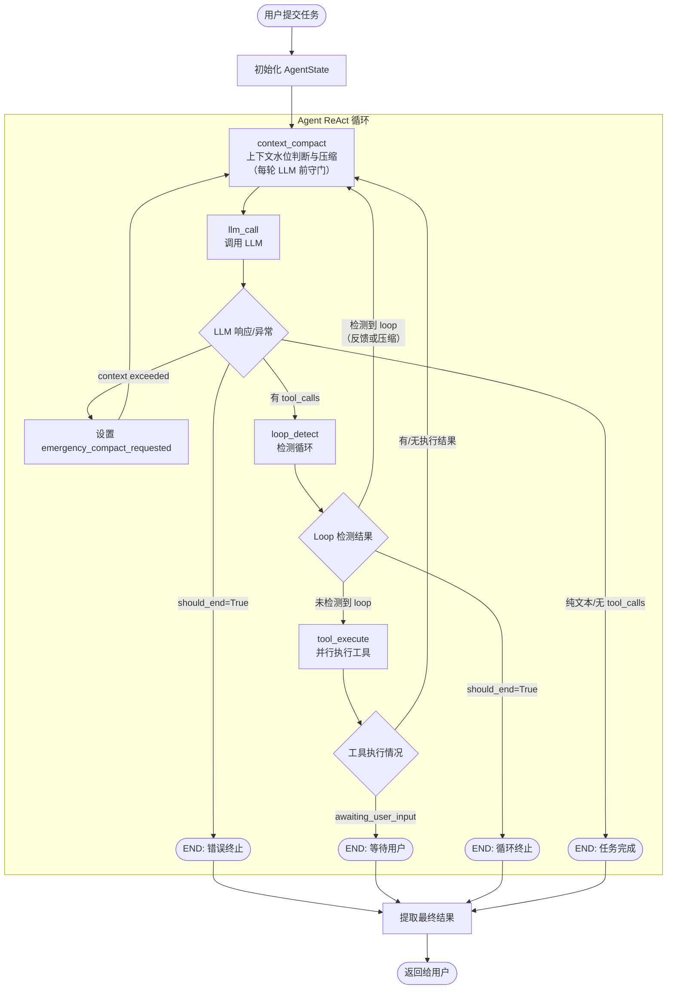
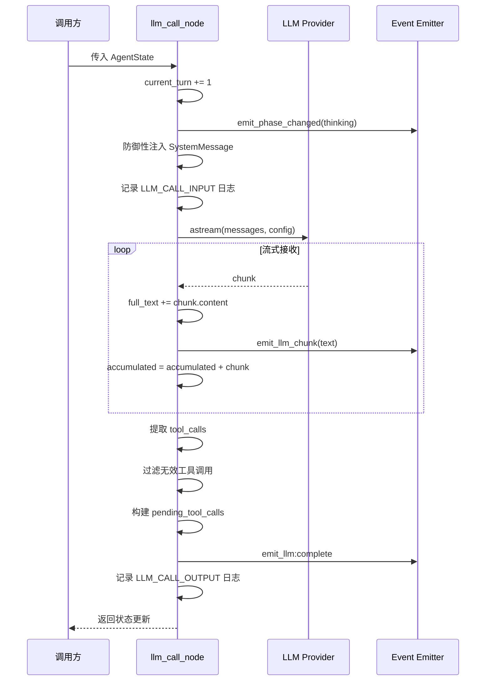
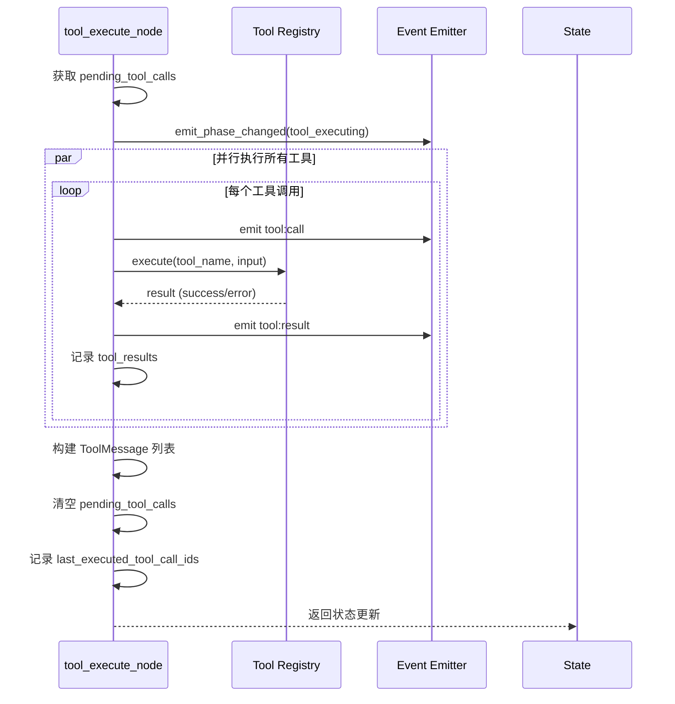
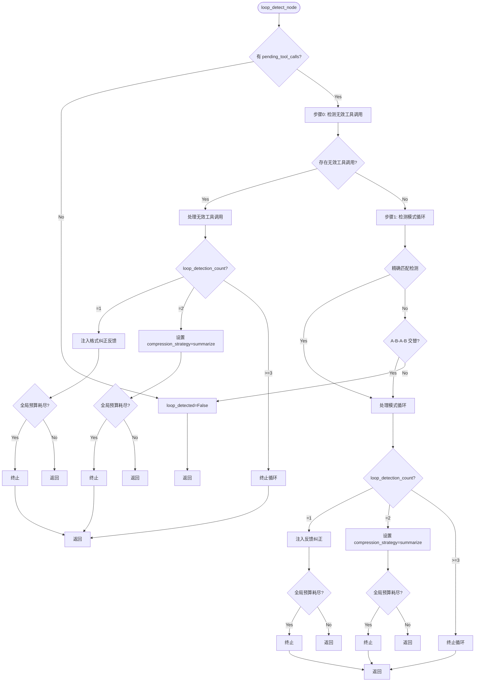
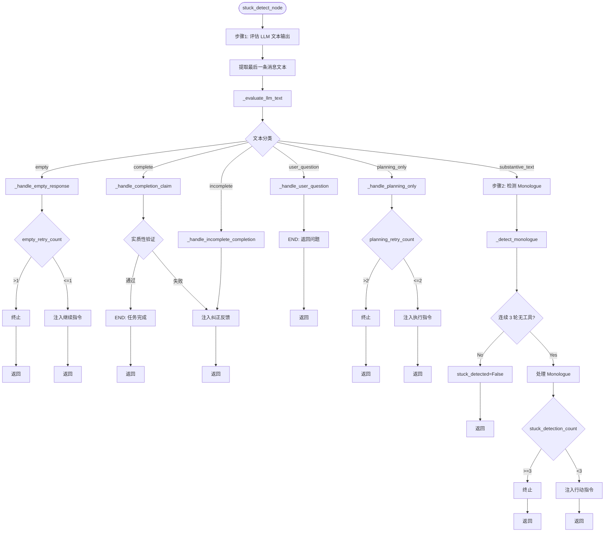

# 1.3 Agent-Loop 详细设计

> 最后更新: 2026-05-31 (上下文管理重构完成)

## 1. 概述

### 1.1 设计目标

本文档定义基于 LangGraph 的 Agent ReAct 循环的终局实现方案，目标是构建一个生产级的、高稳定性的 Agent 执行引擎，具备以下核心能力：

1. **可靠的自驱循环**：Agent 能自主推理、调用工具、观察结果，直到任务完成
2. **多层错误恢复**：HTTP 级重试、语义级自我纠正、边界级兜底策略
3. **智能观察与检测**：Loop/Stuck 检测与自动恢复，防止死循环和卡住
4. **高效上下文管理**：每轮 ReAct 前置上下文守门，支持 soft-prune、micro-compact、emergency-compact 多层压缩
5. **完整的可观测性**：Node 级执行追踪、事件发射、结构化日志

### 1.2 设计原则

| 原则 | 说明 |
|------|------|
| 纵深防御 | Loop/Stuck/超时/错误多层保护，任何一层失效都有下一层兜底 |
| 语义恢复优先 | 遇到问题时优先通过 Prompt 引导模型自我纠正，而非直接终止 |
| 可观测性内建 | 每个节点必须发射事件+记录日志，支持外部监控和调试 |
| 路由极简 | 路由函数只做二元/三元判断，复杂评估在节点内完成 |

### 1.3 核心设计哲学

本文档的设计基于以下 5 条核心哲学：

| 哲学 | 说明 | 实现策略 |
|------|------|----------|
| **不要信任 LLM 的自控能力，但要给它一次机会** | LLM 可能不知道自己陷入了循环 | 统一给予 2 次纠正机会，每次明确告知剩余次数 |
| **检测要快（前置拦截），处理要渐进（先软后硬）** | 不要等工具执行完才发现循环 | LLM 调用后立即检测 + 三级响应（反馈→压缩→终止） |
| **覆盖所有循环模式** | 包括 AAAA、ABAB、无效工具调用 | 精确匹配 + A-B-A-B 交替 + 无效工具调用检测 |
| **区分"重复"和"无进展的重复"** | 相同工具调用不一定有问题 | 精确匹配 + Jaccard 语义相似度（>0.92） |
| **可观测性优先** | 让外部系统能看到检测状态，而不是静默终止 | 检测事件 + 结构化日志 + 阶段变更追踪 |

### 1.4 与现有实现的关系

**当前已实现**：
- ✅ 4 个 LangGraph 核心节点（context_compact、llm_call、loop_detect、tool_execute），入口为 context_compact
- ✅ 完整 AgentState TypedDict（~40 个字段，含上下文管理、Sub-Agent 支持等）
- ✅ 精简路由逻辑（3 个路由函数，纯判定不修改 state）
- ✅ SSE 事件发射框架（IEventEmitter 抽象）
- ✅ 结构化日志（Node 级/LLM 调用/工具调用三级日志）
- ✅ 4 级 token 水位上下文压缩（skip / soft_prune / micro_compact / emergency_compact）
- ✅ LLM usage 基准校准（prompt_tokens → baseline → 增量估算）
- ✅ LLM 错误处理器工厂（职责链模式，ContextLimit / Timeout / Default 处理器）
- ✅ 模型上下文窗口注册表（resolve_max_context_tokens）

**当前局限**：
- Loop 检测仅基于工具调用模式（无法检测工具结果质量、空结果等问题）
- Loop 检测在工具执行前进行（优势：提前拦截；限制：无法检查结果）
- ~~Stuck 检测仅实现 MONOLOGUE 一种模式（连续无工具调用）~~ stuck_detect 节点已从主工作流中移除
- ~~上下文压缩需要演进为 token 水位触发的多层策略~~ 已于 2026-05-31 完成重构
- ~~完成检查已集成到 stuck_detect_node 中~~ stuck_detect 节点已移除
- Runner 层 HTTP 重试依赖和错误处理已通过 LLMErrorHandlerRegistry 职责链增强
- 无实时成本追踪

---

## 2. Agent Loop 整体架构

### 2.1 完整流程图



### 2.2 节点流转说明

| 流转路径 | 触发条件 | 说明 |
|---------|---------|------|
| **context_compact → llm_call** | 每轮 ReAct 开始（固定边） | token 水位判断完成或压缩完成 |
| **llm_call → context_compact** | LLM 返回上下文超限错误 | 设置 emergency_compact_requested 后进入紧急压缩 |
| **llm_call → loop_detect** | LLM 返回 tool_calls | 需要检测是否循环 |
| **llm_call → END** | should_end=True 或无 tool_calls（纯文本完成） | 异常终止或任务完成 |
| **loop_detect → tool_execute** | 未检测到 loop | 正常工具调用路径 |
| **loop_detect → context_compact** | 检测到 loop（首次反馈或二次压缩） | 统一路由到上下文守门 |
| **loop_detect → END** | should_end=True（三次检测或预算耗尽） | 终止循环 |
| **tool_execute → context_compact** | 工具执行完毕（无论有无结果） | 每轮 LLM 前先做上下文管理 |
| **tool_execute → END** | awaiting_user_input=True | 等待用户确认 |

> **拓扑变化（2026-05-31）**：`context_compact` 现在是整个工作流的入口节点，每轮 LLM 调用前都必须经过上下文守门。主循环为 `context_compact → llm_call → loop_detect → tool_execute → context_compact`。`stuck_detect` 节点已从主工作流中移除，其文本评估、完成验证等功能迁移至其他模块处理。

### 2.3 三层防护架构

| 层级 | 职责范围 | 处理的问题类型 | 恢复策略 |
|------|---------|--------------|---------|
| **LLM Error Handler 层** | 模型级错误分类处理 | 上下文超限、网络超时、API 限流、未知错误 | 职责链模式，ContextLimitErrorHandler / TimeoutErrorHandler / DefaultErrorHandler |
| **Agent 主循环层** | 语义级恢复 | Loop 检测、循环纠正 | Prompt 引导自我纠正 + 上下文压缩 |
| **Attempt 层** | 超时/边界控制 | 整体超时、用户 Cancel、maxTurns 耗尽 | 优雅退出 + 最佳结果提取 |

**核心机制**：
- **全局纠正预算**：loop_detection_count >= 3 时强制终止
- **max_turns 硬限制**：默认 100 轮，每轮 llm_call 后 current_turn += 1
- **超时保护**：LLM 流式调用默认 300 秒超时
- **LLMErrorHandlerRegistry**：llm_call_node 中的异常委托给职责链处理，解耦错误处理与节点逻辑

---

## 3. AgentState 设计

### 3.1 状态字段定义

```python
"""领域层 - AgentState (LangGraph State)"""

from typing import Annotated, Any, Dict, List, Optional

from typing_extensions import TypedDict
from langgraph.graph.message import add_messages


class AgentState(TypedDict):
    """Agent 运行状态 — 在节点间传递的共享数据

    这是纯数据结构定义，无框架依赖，符合 DDD 领域层规范。
    LangGraph 的 StateGraph 使用此 TypedDict 作为状态传递。
    """

    # === 消息历史 (LangGraph 自动合并) ===
    messages: Annotated[list, add_messages]

    # === 任务上下文 ===
    task_id: str
    workspace: str
    user_message: str
    task_start_message_count: int
    model: str
    """LLM 模型名称（如 gpt-4, deepseek-v4-pro 等），用于解析上下文窗口"""

    # === 控制流 ===
    current_turn: int
    max_turns: int
    phase: str
    should_end: bool
    is_complete: bool

    # === 工具调用 ===
    pending_tool_calls: List[Dict[str, Any]]
    tool_results: Dict[str, Dict[str, Any]]
    awaiting_user_input: bool
    last_executed_tool_call_ids: List[str]

    # === Loop 检测器状态 ===
    loop_detection_count: int
    loop_detected: bool
    loop_type: Optional[str]

    # === Stuck 检测器状态 ===
    stuck_detection_count: int
    stuck_detected: bool

    # === 流式输出 ===
    current_llm_text: str
    empty_retry_count: int

    # === 系统提示词 ===
    system_prompt: str

    # === 深度思考 ===
    thinking_text: str
    """LLM 深度思考/推理内容（如 DeepSeek reasoning_content）"""

    # === 结果 ===
    final_result: Optional[str]
    error: Optional[str]

    # === 压缩策略 ===
    compression_strategy: Optional[str]
    """context_compact 使用的压缩策略：trim / summarize"""

    # === 上下文管理 ===
    max_context_tokens: int
    """当前模型上下文窗口 Token 数上限。由 resolve_max_context_tokens() 解析。"""
    context_token_estimate: int
    """当前 messages 的 Token 估算值"""
    context_token_baseline: Optional[int]
    """最近一次成功 LLM 调用返回的 prompt_tokens"""
    context_token_baseline_message_count: int
    """baseline 对应的消息数量，用于增量估算"""
    context_compaction_attempts: int
    """连续紧急压缩次数"""
    emergency_compact_requested: bool
    """LLM 调用发生上下文超限后置为 True"""
    last_context_strategy: Optional[str]
    """最近一次实际执行的压缩策略：skip / soft_prune / micro_compact / emergency_compact"""

    # === Sub-Agent 状态 ===
    is_sub_agent: bool
    """是否为子Agent"""

    parent_task_id: Optional[str]
    """父Agent的task_id(子Agent用)"""
```

### 3.2 字段分组说明

| 分组 | 字段 | 写入节点 | 说明 |
|------|------|---------|------|
| **消息历史** | messages | 所有节点 | LangGraph 自动合并（add_messages reducer） |
| **任务上下文** | task_id, workspace, user_message | 应用层初始化 | 任务基本信息，只读 |
| **控制流** | current_turn, phase, should_end, is_complete | llm_call, loop_detect | 控制循环执行 |
| **工具调用** | pending_tool_calls, tool_results | llm_call, tool_execute | 工具调用生命周期 |
| **Loop 检测** | loop_detection_count, loop_detected | loop_detect | Loop 检测状态 |
| **Stuck 检测** | stuck_detection_count, stuck_detected | ~~stuck_detect（已从工作流中移除）~~ | Stuck 检测状态（字段保留用于全局纠正预算计算） |
| **上下文管理** | compression_strategy, max_context_tokens, context_token_estimate, context_token_baseline, context_token_baseline_message_count, context_compaction_attempts, emergency_compact_requested, last_context_strategy | context_compact, llm_call | token 水位判断、usage 基准校准、紧急压缩 |

### 3.3 状态流转示例

**正常成功流程**：

| 阶段 | 节点 | 关键状态变化 |
|------|------|------------|
| 初始化 | — | current_turn=0, phase="idle", messages=[user_msg], max_context_tokens=已解析 |
| 上下文守门 | context_compact | context_token_estimate=估算值, last_context_strategy="skip" |
| 思考 | llm_call | phase="thinking", current_turn+=1, current_llm_text=累积文本, context_token_baseline=prompt_tokens |
| 路由 | route_after_llm | pending_tool_calls=解析出的工具调用 |
| 循环检测 | loop_detect | loop_detected=False |
| 执行 | tool_execute | phase="tool_executing", tool_results=执行结果, messages+=tool_msgs |
| 上下文守门 | context_compact | token 水位检查后路由回 llm_call |
| 重复 | — | 回到 llm_call 继续 |
| 完成 | llm_call | is_complete=True, should_end=True (无 tool_calls), phase="complete" |
| 终止 | END | should_end=True |

**Loop 检测触发流程**：

| 阶段 | 节点 | 关键状态变化 |
|------|------|------------|
| 第1次 Loop | loop_detect | loop_detected=True, loop_type="exact_tool_repeat", loop_detection_count=1, messages+=SystemMessage 纠正反馈 |
| 纠正 | route_after_loop_detect | 路由到 context_compact（注入反馈后重试） |
| 上下文守门 | context_compact | token 水位检查（通常 skip），phase="context_compacting" |
| 重试 | llm_call | 正常执行 |
| 第2次 Loop | loop_detect | loop_detected=True, loop_detection_count=2, compression_strategy="summarize" |
| 压缩 | route_after_loop_detect | 路由到 context_compact |
| 压缩 | context_compact | messages=RemoveMessage+摘要, phase="context_compacting", last_context_strategy="micro_compact" |
| 重试 | llm_call | 正常执行 |
| 第3次 Loop | loop_detect | loop_detected=True, loop_detection_count=3 |
| 终止 | route_after_loop_detect | error="Loop detected, terminating after 3 attempts", should_end=True |

---

## 4. 节点详细设计

### 4.1 llm_call 节点

**职责**：调用 LLM，流式输出文本，收集 tool_calls，发射事件。

#### 4.1.1 流程图



#### 4.1.2 AgentState 操作转换

**输入字段**（读取）：
- `messages` — 消息历史
- `system_prompt` — 系统提示词
- `task_id` — 任务 ID
- `phase` — 当前阶段

**输出字段**（写入）：
```python
{
    "messages": [AIMessage(content=full_text, tool_calls=tool_calls_list)],
    "pending_tool_calls": [{"id": ..., "name": ..., "input": ...}],  # 可能包含不完整的工具调用
    "last_executed_tool_call_ids": [],  # 清空上一轮工具 ID
    "current_llm_text": full_text,
    "thinking_text": thinking_text,     # LLM 深度思考/推理内容（如 DeepSeek reasoning_content）
    "phase": "complete" if no_tool_calls else "thinking",
    "current_turn": current_turn + 1,
    "should_end": len(pending_tool_calls) == 0,  # 无 tool_calls 时完成
    "is_complete": len(pending_tool_calls) == 0,
    # Token 基准校准（如果提取到 prompt_tokens）
    "context_token_baseline": prompt_tokens,
    "context_token_baseline_message_count": message_count,
    "context_token_estimate": prompt_tokens,
}
```

**说明**：
- `pending_tool_calls` 可能包含不完整的工具调用（缺少 name 或 id）
- 这些无效工具调用会在 loop_detect 节点中被检测和处理
- loop_detect 会识别"无效工具调用循环"并注入纠正反馈

**异常处理**（写入）：
```python
# 异常委托给 LLMErrorHandlerRegistry（职责链模式）
{
    # ContextLimitErrorHandler:
    "emergency_compact_requested": True,
    "phase": "context_compacting",
    "error": str(e),
    # 不设置 should_end，给 context_compact 一次紧急压缩机会

    # TimeoutErrorHandler:
    "should_end": True,
    "error": f"LLM streaming timed out after {llm_timeout_sec}s",
    "messages": [AIMessage(content=full_text or "LLM call timed out.")],

    # DefaultErrorHandler: re-raise，由 BaseNode._handle_error 兜底
}
```

**Token 基准校准**（正常返回时写入）：
```python
# 从 AIMessageChunk.usage_metadata 提取 prompt_tokens
{
    "context_token_baseline": prompt_tokens,        # LLM 返回的真实 prompt_tokens
    "context_token_baseline_message_count": message_count,  # 发送给 LLM 的消息数
    "context_token_estimate": prompt_tokens,        # 与 baseline 同步
}
# 如果无法提取 prompt_tokens，则降级为全量 char/4 估算写入 context_token_estimate
```

#### 4.1.3 核心逻辑说明

**1. 防御性 SystemMessage 注入**：
```python
if system_prompt and (not messages or not isinstance(messages[0], SystemMessage)):
    messages = [SystemMessage(content=system_prompt)] + messages
```
- 确保消息头部始终有 SystemMessage
- 避免重复注入（检查内容是否相同）

**2. 流式调用聚合**：
```python
accumulated: AIMessageChunk | None = None
async for chunk in llm.astream(messages):
    if accumulated is None:
        accumulated = chunk
    else:
        accumulated = accumulated + chunk  # LangChain 自动合并 tool_call_chunks
```
- 使用 AIMessageChunk 正确合并流式 tool_call_chunks
- 避免手动拼接导致的工具调用信息丢失

**3. 工具调用完整性保留**：
```python
# 不再过滤无效工具调用，保留给 loop_detect 检测
tool_calls_list = accumulated.tool_calls if accumulated.tool_calls else []
```
- **不静默过滤**：LLM 返回的不完整工具调用（缺少 name 或 id）应该保留
- **交给 loop_detect 检测**：在工具执行前检测是否为"无效工具调用循环"
- **纠正机制**：如果连续出现无效工具调用，loop_detect 会注入纠正反馈
- **避免资源浪费**：防止将无效工具调用传递给 tool_execute 节点

**4. 超时保护**：
```python
async with asyncio.timeout(llm_timeout_sec):  # 默认 300 秒
    async for chunk in llm.astream(messages):
        ...
```
- 防止网络异常导致 task 永久挂起
- 超时后由 `TimeoutErrorHandler` 处理，设置 should_end=True

#### 4.1.4 LLM 错误处理器工厂

`llm_call_node` 不直接处理异常，而是委托给 `LLMErrorHandlerRegistry`（职责链模式），将错误处理逻辑与节点逻辑解耦。

**架构**：

```
ILLMErrorHandler (interface)
    ├── ContextLimitErrorHandler   # 上下文超限 → 设置 emergency_compact_requested
    ├── TimeoutErrorHandler        # 网络超时 → 设置 should_end
    └── DefaultErrorHandler        # 未匹配 → re-raise（由 BaseNode 兜底）
```

**接口定义**（`domain/interfaces/llm_error_handler.py`）：

```python
class ILLMErrorHandler(ABC):
    def can_handle(self, error: BaseException) -> bool: ...
    def handle(self, error: BaseException, state: dict, context: NodeContext) -> dict: ...

class LLMErrorHandlerRegistry:
    """职责链：按注册顺序遍历，第一个 can_handle 返回 True 的处理器处理"""
    def __init__(self, handlers: list[ILLMErrorHandler] | None = None): ...
    def register(self, handler: ILLMErrorHandler) -> None: ...
    def handle(self, error, state, context) -> dict: ...
```

**ContextLimitErrorHandler**（`infrastructure/agent/error_handlers/context_limit.py`）：
- 通过 `is_context_limit_error()` 识别上下文超限异常
- 识别标记：`context_length_exceeded` / `maximum context length` / `context window` / `input too long` 等
- 返回：`emergency_compact_requested=True`，不设置 `should_end`（给紧急压缩一次机会）

**TimeoutErrorHandler**（`infrastructure/agent/error_handlers/timeout.py`）：
- 识别 `asyncio.TimeoutError` 及 `TimeoutError`
- 返回：`should_end=True`

**DefaultErrorHandler**（`infrastructure/agent/error_handlers/default_handler.py`）：
- `can_handle()` 始终返回 `True`（兜底）
- re-raise 异常，由 `BaseNode._handle_error()` 统一处理

---

### 4.2 tool_execute 节点

**职责**：并行执行工具调用，处理错误，发射事件。

#### 4.2.1 流程图



#### 4.2.2 AgentState 操作转换

**输入字段**（读取）：
- `pending_tool_calls` — 待执行工具列表
- `tool_results` — 已有工具结果（合并）
- `task_id` — 任务 ID
- `workspace` — 工作目录

**输出字段**（写入）：
```python
{
    "messages": [ToolMessage(content=..., tool_call_id=...)],
    "tool_results": {tool_call_id: {"tool_name": ..., "status": ..., "output": ..., "error": ...}},
    "pending_tool_calls": [],  # 清空
    "awaiting_user_input": bool,  # 是否有工具需要用户确认
    "last_executed_tool_call_ids": [tool_call_id1, tool_call_id2, ...],
    "final_result": result_output,  # 如果 awaiting_user_input=True
    "phase": "tool_executing",
}
```

#### 4.2.3 核心逻辑说明

**1. 并行执行**：
```python
tasks = [_execute_single_tool(tool_registry, event_emitter, task_id, tc, context) 
         for tc in pending_tools]
results = await asyncio.gather(*tasks, return_exceptions=True)
```
- 使用 `asyncio.gather` 并发执行多个工具
- `return_exceptions=True` 确保单个工具失败不影响其他工具

**2. 结构化结果存储**：
```python
result_dict = {
    "tool_name": tool_name,
    "status": "success" or "error",
    "output": result.output,
    "error": result.error,
    "metadata": result.metadata,
}
structured_results[tool_call_id] = result_dict
```
- 统一工具结果格式，便于后续评估
- metadata 包含 awaiting_user_input 等特殊标志

**3. ToolMessage 构建**：
```python
content = result_entry.get("output") or result_entry.get("error") or "No result"
if not isinstance(content, str):
    content = str(content)  # 防御性转换
tool_messages.append(ToolMessage(content=content, tool_call_id=tool_call_id))
```
- 确保 content 不为 None（LLM provider 不接受）
- 优先使用 output，失败时使用 error

**4. awaiting_user_input 处理**：
```python
if result_dict.get("metadata", {}).get("awaiting_user_input"):
    awaiting_user_input = True
    final_result = result_dict.get("output")
```
- 支持需要用户确认的工具（如文件写入确认）
- 设置 awaiting_user_input=True 触发路由到 END

---

### 4.3 loop_detect 节点

**职责**：检测 Agent 是否陷入重复行为模式（整合了 tool_observe 功能）。

**触发时机**：仅在 `llm_call` 之后、`tool_execute` 之前执行，在工具调用前拦截已知的循环模式。

#### 4.3.1 流程图



#### 4.3.2 AgentState 操作转换

**输入字段**（读取）：
- `pending_tool_calls` — 即将执行的工具调用列表
- `loop_detection_count` — 当前 Loop 检测次数
- `empty_retry_count`, `stuck_detection_count` — 全局预算计算
- `messages` — 消息历史（模式循环检测）
- `task_start_message_count` — 消息起始位置

**输出字段**（写入）：

**场景 1：未检测到循环**：
```python
{
    "loop_detected": False,
    "loop_type": None,
    "loop_detection_count": 0,
}
```

**场景 2：检测到模式循环**（精确匹配或 A-B-A-B 交替）：

首次（count=1）：
```python
{
    "loop_detected": True,
    "loop_detection_count": 1,
    "loop_type": "exact_tool_repeat" | "alternating_pattern",
    "phase": "loop_correcting",
    "messages": [SystemMessage(content="[SYSTEM CORRECTION] You seem to be repeating the same actions...")],
}
```

二次（count=2）：
```python
{
    "loop_detected": True,
    "loop_detection_count": 2,
    "loop_type": "exact_tool_repeat" | "alternating_pattern",
    "phase": "loop_correcting",
    "compression_strategy": "summarize",
}
```

三次（count>=3）或预算耗尽：
```python
{
    "loop_detected": True,
    "loop_detection_count": 3,
    "loop_type": "exact_tool_repeat" | "alternating_pattern",
    "phase": "loop_correcting",
    "error": "Loop detected, terminating after 3 attempts",
    "should_end": True,
}
```

**场景 2.5：检测到无效工具调用**（INVALID_TOOL_CALL）：

首次（count=1）：
```python
{
    "loop_detected": True,
    "loop_detection_count": 1,
    "loop_type": "invalid_tool_call",
    "phase": "loop_correcting",
    "messages": [SystemMessage(content="[SYSTEM CORRECTION] You provided invalid tool calls with missing information...")],
}
```

二次（count=2）：
```python
{
    "loop_detected": True,
    "loop_detection_count": 2,
    "loop_type": "invalid_tool_call",
    "phase": "loop_correcting",
    "compression_strategy": "summarize",
}
```

三次（count>=3）或预算耗尽：
```python
{
    "loop_detected": True,
    "loop_detection_count": 3,
    "loop_type": "invalid_tool_call",
    "phase": "loop_correcting",
    "error": "Invalid tool calls loop, terminating after 3 attempts",
    "should_end": True,
}
```

**场景 3：全局纠正预算耗尽**：
```python
{
    "loop_detected": True,
    "loop_detection_count": count,
    "loop_type": "exact_tool_repeat" | "alternating_pattern",
    "phase": "loop_correcting",
    "error": "Global correction budget exhausted",
    "should_end": True,
}
```

#### 4.3.3 核心逻辑说明

**设计原则**：在工具执行前，基于历史消息检测 LLM 是否要重复之前的工具调用模式。

**优势**：
- 提前拦截已知的循环模式，避免无效的工具执行
- 节省时间、Token 成本和 API 调用
- 在工具调用前就给 LLM 纠正机会

**限制**：
- 无法检测工具结果质量问题（如空结果、错误、partial 等）
- 无法检测空结果循环（需要工具执行后才能知道）
- 依赖历史消息的准确性（如果上下文被压缩可能影响检测）

**检测范围**：基于历史消息中的工具调用签名，不依赖工具执行结果。

**新增：无效工具调用检测**（INVALID_TOOL_CALL）：

**检测逻辑**：
```python
# 检查 pending_tool_calls 中是否存在无效工具调用
invalid_calls = [
    tc for tc in pending_tool_calls
    if not tc.get("name") or not tc.get("id")
]

if invalid_calls:
    loop_detected = True
    loop_type = "invalid_tool_call"
    # 注入纠正反馈
    correction_prompt = (
        "[SYSTEM CORRECTION] You provided invalid tool calls with missing information. "
        "Each tool call must include a valid tool name, tool call ID, and proper input arguments. "
        "Please fix the tool call format and try again."
    )
```

**为什么需要检测无效工具调用**：
- LLM 可能返回格式错误的工具调用（缺少 name、id 或 input）
- 如果不在工具执行前拦截，会导致 tool_execute 节点崩溃或产生无意义错误
- 连续出现无效工具调用说明 LLM 不理解工具调用格式，需要明确纠正
- 避免将无效数据传递给下游节点

**纠正策略**：
- 首次检测：注入格式纠正反馈，给 LLM 一次机会
- 二次检测：压缩上下文（可能上下文中有混淆的格式示例）
- 三次检测：终止循环

#### 精确匹配检测（EXACT_TOOL_REPEAT）
```python
# 提取最近 3 轮工具调用签名
signatures = [
    (tc["name"], _hash_tool_args(tc["args"]))
    for tc in tool_calls
]
if len(set(signatures)) == 1:  # 完全相同
    loop_detected = True
    loop_type = "exact_tool_repeat"
```

#### A-B-A-B 交替检测（ALTERNATING_PATTERN）
```python
# 检测周期为 2 的重复模式
# 例如：read_file(A) → grep_search(B) → read_file(A) → grep_search(B)
if len(recent_tool_calls) >= 4:
    sig_1 = recent_tool_calls[3]  # 最远
    sig_2 = recent_tool_calls[2]
    sig_3 = recent_tool_calls[1]
    sig_4 = recent_tool_calls[0]  # 最近
    
    # 检查是否 A-B-A-B 模式
    if sig_4 == sig_2 and sig_3 == sig_1 and sig_4 != sig_3:
        loop_detected = True
        loop_type = "alternating_pattern"
```

#### 为什么需要 A-B-A-B 检测
- 精确匹配只能检测 AAAA 模式，无法检测 ABAB 模式
- ABAB 是最常见的隐性循环（反复在两个工具间切换）
- 典型场景：`read_file` → `grep_search` → `read_file` → `grep_search`（反复读取和搜索）


**2. 全局纠正预算**：
```python
GLOBAL_CORRECTION_BUDGET = 3

correction_total = (
    empty_retry_count + loop_detection_count + stuck_detection_count
)
if correction_total >= GLOBAL_CORRECTION_BUDGET:
    # 强制终止，防止各类纠正相互叠加导致无限循环
    should_end = True
    error = "Global correction budget exhausted"
```

---

### ~~4.4 stuck_detect 节点~~ (已从主工作流中移除)

> **2026-05-31 变更**：`stuck_detect` 节点已从 LangGraph StateGraph 主工作流中移除。`route_after_llm` 中纯文本（无 tool_calls）直接路由到 END，完成验证逻辑不在主循环中执行。以下内容为历史设计，保留供参考。

**~~职责~~**：检测 Agent 是否卡住（整合了 answer_observe 功能）。

**~~触发时机~~**：仅在 `llm_call` 返回纯文本（无 tool_calls）时执行。

#### 4.4.1 流程图



#### 4.4.2 AgentState 操作转换

**输入字段**（读取）：
- `messages` — 消息历史
- `empty_retry_count` — 空响应重试次数
- `planning_retry_count` — 纯规划重试次数
- `stuck_detection_count` — Stuck 检测次数
- `loop_detection_count` — 全局预算计算
- `task_start_message_count` — 消息起始位置

**输出字段**（写入）：

**场景 1：空响应处理**（empty）：

首次重试（count=1）：
```python
{
    "empty_retry_count": 1,
    "messages": [SystemMessage(content="[SYSTEM CORRECTION] Your previous response was empty...")],
    "phase": "thinking",
}
```

超过限制（count>1）或预算耗尽：
```python
{
    "empty_retry_count": 2,
    "should_end": True,
    "error": "Empty response persists after correction",
    "final_result": extract_final_result(state),
    "phase": "complete",
}
```

**场景 2：完成声明验证**（complete）：

验证通过：
```python
{
    "phase": "complete",
    "final_result": text,
    "is_complete": True,
    "should_end": True,
}
```

**场景 3：完成声明缺少实质内容**（incomplete）：
```python
{
    "messages": [HumanMessage(content="You claimed the task is complete, but it appears there is still work to do...")],
    "phase": "thinking",
}
```

**场景 4：用户提问**（user_question）：
```python
{
    "phase": "complete",
    "final_result": text,
    "is_complete": True,
    "should_end": True,
}
```

#### 4.4.3 核心逻辑说明

> **注意**：LLM 文本输出评估、纯规划检测、Monologue 检测等逻辑已在 `v2.0` 重构中移除。
> 当前 `loop_detect_node` 仅负责工具调用循环检测和全局纠正预算管理，不评估 LLM 文本质量。
> 详情参见 [loop_detect_node.py](../../backend/src/infrastructure/agent/nodes/loop_detect_node.py)。

---

### 4.5 context_compact 节点

**职责**：作为整个 Agent 工作流的**入口节点**，在每一轮 LLM 调用前执行上下文守门。根据当前 token 水位执行 4 级压缩策略，保证模型请求尽量落在目标上下文窗口内。

> 设计调整（2026-05-31）：`context_compact` 现在是 LangGraph StateGraph 的 `entry_point`，不再是 loop 检测后的兜底节点。主循环为：
> `context_compact → llm_call → loop_detect → tool_execute → context_compact`。
> 所有 feedback 路径（loop 纠正、工具结果反馈）统一路由回 `context_compact`，确保每次 LLM 调用前都完成 token 水位判断。

#### 4.5.1 4 级 Token 水位策略

优先级从高到低：

| 级别 | 策略名 | 触发条件 | 处理方式 |
|------|--------|---------|---------|
| **P1** | `emergency_compact` | `emergency_compact_requested=True` 或 `compression_strategy="emergency_compact"` | 保留 SystemMessage + 最近 3 条，摘要旧消息（最多 90 条） |
| **P2** | `micro_compact` | `token > 60% * max_context_tokens` | 保留 SystemMessage + 最近 10 条，摘要旧消息（最多 90 条） |
| **P3** | `soft_prune` | `token > 40% * max_context_tokens` | 裁剪长度 > 20000 字符的 ToolMessage，目标降到 25% |
| **P4** | `skip` | 低于 40% 水线 | 不处理，直接放行 |

流程图：

```mermaid
flowchart TD
    Start([context_compact_node<br/>工作流入口点]) --> ResolveMax[解析 max_context_tokens<br/>via resolve_max_context_tokens]
    ResolveMax --> Estimate[estimate_context_tokens<br/>baseline-aware 增量估算]
    Estimate --> Emergency{emergency_compact_requested<br/>或 compression_strategy=emergency_compact?}
    
    Emergency -->|Yes| EmergencyCompact[emergency_compact<br/>保留最近 3 条 + SystemMessage<br/>摘要旧消息最多 90 条]
    Emergency -->|No| Over60{token > 0.6 * max_context?}
    
    Over60 -->|Yes| MicroCompact[micro_compact<br/>保留最近 10 条 + SystemMessage<br/>摘要旧消息最多 90 条]
    Over60 -->|No| Over40{token > 0.4 * max_context?}
    
    Over40 -->|Yes| SoftPrune[soft_prune<br/>从旧到新裁剪超长 ToolMessage<br/>head(4000) + notice + tail(4000)<br/>目标: token <= 25% max_context]
    Over40 -->|No| Skip[skip<br/>无需处理]
    
    MicroCompact --> SummarizeOld[调用 LLM 生成摘要<br/>_COMPACTION_SUMMARY_PROMPT]
    EmergencyCompact --> SummarizeOld
    
    SummarizeOld --> LLMAvail{LLM 可用?}
    LLMAvail -->|Yes| InjectSummary[RemoveMessage 旧消息<br/>注入 HumanMessage[Context Summary]]
    LLMAvail -->|No| FallbackTrim[降级: 仅 RemoveMessage<br/>不做摘要]
    
    InjectSummary --> InvalidateBaseline[baseline 失效<br/>context_token_baseline=None]
    FallbackTrim --> InvalidateBaseline
    
    SoftPrune --> IfPruned{有裁剪发生?}
    IfPruned -->|Yes| InvalidateBaseline
    IfPruned -->|No| SetStrategy
    
    InvalidateBaseline --> SetStrategy[写入 last_context_strategy]
    Skip --> SetStrategy
    
    SetStrategy --> Emit[emit context:compacting]
    Emit --> End([固定边 → llm_call])
```

**关键设计**：
- 每个策略分支都写入 `last_context_strategy` 字段（`skip` / `soft_prune` / `micro_compact` / `emergency_compact`），便于可观测性
- 一旦消息内容被修改（裁剪或摘要），`context_token_baseline` 设为 `None`，强制后续走全量 char/4 估算
- 摘要失败时降级为纯 `RemoveMessage`（trim），不阻断主流程
- `emergency_compact` 完成后清零 `emergency_compact_requested` 和 `compression_strategy`，防止循环触发

#### 4.5.2 AgentState 操作转换

**输入字段**（读取）：
- `messages` — 消息历史
- `max_context_tokens` — 当前模型上下文窗口上限（由 resolve_max_context_tokens 解析）
- `compression_strategy` — 外部指定压缩策略（loop_detect 可设置）
- `emergency_compact_requested` — LLM 请求超上下文后的紧急压缩标记
- `context_token_estimate` — 当前估算的上下文 token 数
- `context_token_baseline` — 最近一次 LLM usage 返回的 prompt_tokens
- `context_token_baseline_message_count` — baseline 对应的消息数量
- `context_compaction_attempts` — 连续紧急压缩次数

**输出字段**（写入）：

**Skip 策略**：
```python
{
    "phase": "context_compacting",
    "context_token_estimate": current_tokens,  # 无变化
    "last_context_strategy": "skip",
}
```

**Soft-prune 策略**：
```python
{
    "messages": [pruned_tool_message, ...],  # 同 id ToolMessage，内容被裁剪
    "phase": "context_compacting",
    "context_token_estimate": new_estimate,
    "context_token_baseline": None,  # 消息内容被修改，baseline 失效
    "last_context_strategy": "soft_prune",
}
```

**Micro-compact / Emergency-compact 策略**：
```python
{
    "messages": [
        RemoveMessage(id=very_old_msg_id),
        ...,
        HumanMessage(content="[Context Summary]\n{summary_text}", id=first_compacted_id),
        RemoveMessage(id=compacted_msg_id),
        ...,
        # 保留 SystemMessage + 最近 N 条
    ],
    "phase": "context_compacting",
    "context_token_estimate": after_tokens,
    "context_token_baseline": None,   # 消息被移除，baseline 失效
    "context_token_baseline_message_count": 0,
    "last_context_strategy": "micro_compact" | "emergency_compact",
}

# Emergency-compact 额外写入：
{
    "emergency_compact_requested": False,
    "compression_strategy": None,
    "context_compaction_attempts": attempts + 1,
}
```

**紧急压缩后仍失败**（由 caller 处理）：
```python
{
    "phase": "failed",
    "should_end": True,
    "error": "Context window exceeded after emergency compaction",
}
```

#### 4.5.3 核心逻辑说明

**1. 模型上下文窗口解析**：

上下文窗口通过 `resolve_max_context_tokens(model_name)` 函数解析，不写死在节点逻辑里。该函数位于 `domain/services/token_utils.py`，使用子串匹配按注册表顺序匹配。

| 模型族 / 模型名匹配 | 默认窗口 |
|---------------------|----------|
| `gemini-3-pro` | 2,000,000 |
| `gpt-5.5`, `gpt-5.4` | 1,000,000 |
| `claude-opus-4.7`, `claude-opus-4.6` | 1,000,000 |
| `qwen3` | 1,000,000 |
| `deepseek-v4` | 1,000,000 |
| 未匹配模型 | 128,000 |

> 这些值是本系统的策略默认值，不作为外部供应商规格真值。实际接入时以 `LLMConfig.extra[“max_context_tokens”]` 覆盖为准。解析结果写入 `AgentState.max_context_tokens`。

**2. 当前 token 估算与校准**：

使用 `estimate_context_tokens(messages, baseline, baseline_message_count)` 函数（位于 `domain/services/token_utils.py`），支持两种估算模式：

- **有 baseline**（最近一次 LLM 调用返回了 `prompt_tokens` 且无 RemoveMessage）：`baseline + sum(count_tokens(render_message(m)) for m in new_messages)`
- **无 baseline** 或 baseline 失效（发生 RemoveMessage/裁剪）：全量 `sum(count_tokens(render_message(m)) for m in messages)`

`count_tokens()` 使用混合加权：中文字符 1.5 tokens/char，其他 0.25 tokens/char。

LLM 调用完成后（`llm_call_node`），通过 `_extract_prompt_tokens()` 从 `AIMessageChunk.usage_metadata` 或 `response_metadata.token_usage` 提取真实 `prompt_tokens`，写回 `context_token_baseline` 和 `context_token_baseline_message_count`。

**关键：baseline 失效规则**：
- context_compact 执行 `soft_prune`（修改了消息内容）：`context_token_baseline = None`
- context_compact 执行 `micro_compact`/`emergency_compact`（RemoveMessage + 注入摘要）：`context_token_baseline = None`，`context_token_baseline_message_count = 0`
- 失效后下一次估算自动回退到全量 char/4 模式

**3. Soft-prune：40% 水位轻量裁剪**：

触发条件：

```python
current_tokens > int(max_context_tokens * 0.4)
```

处理对象：
- 仅处理 `ToolMessage`（含 dict 形式的 tool 消息）。
- 单条 tool result 内容长度 `> 20000` 字符才裁剪。
- 从头到尾顺序处理，优先裁剪最先遇到的超长结果。

裁剪规则：

```python
head = content[:4000]
tail = content[-4000:]
pruned_content = f”{head}\n\n[... tool result soft-pruned; middle omitted ...]\n\n{tail}”
# 使用相同 msg_id 构造 ToolMessage，LangGraph add_messages reducer 自动替换
```

目标：
- 裁剪后实时用 `estimate_context_tokens` 重新估算。
- 当 `new_estimate <= int(max_context_tokens * 0.25)` 时停止。
- 如果遍历完所有消息仍不达标，也停止（避免误删语义内容）。
- soft-prune 不调用 LLM，不处理普通用户/助手消息。

**4. Micro-compact：60% 水位摘要压缩**：

触发条件：

```python
current_tokens > int(max_context_tokens * 0.6)
```

压缩范围：
- 永远保留首条 `SystemMessage`（如果存在）。
- 完整保留最近 10 条消息。
- 对中间的消息选取最多 90 条进入 summary 压缩。
- 如果中间消息超过 90 条，更老的只做 `RemoveMessage`（不加入摘要输入，避免摘要输入失控）。

处理结果：
- 对被压缩消息执行 `RemoveMessage(id=msg_id)`。
- 注入一条 `HumanMessage(content=”[Context Summary]\n...”, id=first_compacted_id)`，保持时间线位置。
- 摘要失败时降级为纯 `RemoveMessage`（trim），不阻断主流程。

**5. Emergency-compact：超上下文后的紧急压缩**：

触发来源：
- `llm_call_node` 中的 `LLMErrorHandlerRegistry` → `ContextLimitErrorHandler` 识别上下文超限错误。
- `ContextLimitErrorHandler` 设置 `emergency_compact_requested=True` 并路由到 `context_compact`。

处理范围：
- 完整保留首条 `SystemMessage`。
- 完整保留最近 3 条消息。
- 压缩最近 90 条旧消息为 summary。
- `context_compaction_attempts += 1`。

失败规则：
- 第一次超限：`ContextLimitErrorHandler` 设置 `emergency_compact_requested=True`，路由到 `context_compact`。
- 紧急压缩后再次调用 LLM 仍超限：返回失败，`should_end=True`。
- 摘要 LLM 本身超限或失败：降级为保守 trim；如果主调用仍失败，最终失败。

**6. Summary 压缩输入构建**：

```python
# 摘要输入预算控制
summary_budget = min(32000, int(max_tokens * 0.05 * 4))

# 从旧消息后面开始构建（最近的优先，摘要有时间局部性）
summary_candidates = to_compact[-90:]

# 逐步拼接，超过 budget 时截断
for msg in summary_candidates:
    rendered = render_message(msg)
    if total_chars + len(rendered) > summary_budget:
        summary_parts.append(rendered[:remaining] + “\n...(truncated)”)
        break
    summary_parts.append(rendered)
```

**关键设计**：
- 摘要输入受 budget 控制，防止摘要本身的 token 消耗过大。
- `render_message()` 渲染包含 role、tool name、call_id 等元信息，帮助 LLM 理解消息结构。
- 摘要 Prompt 聚焦任务连续性：已完成工作、进行中工作、文件/路径/工具信息、关键结果、用户约束、下一步。
- LLM 摘要失败时降级到 trim；trim 必须保留最近窗口。
- 摘要注入为 `HumanMessage`，避免混淆 `SystemMessage`。

**7. 关键信息保留规则**：
- ✅ SystemMessage（第 1 条）— 始终保留
- ✅ 最近消息窗口 — micro 保留 10 条，emergency 保留 3 条
- ✅ 当前用户原始需求 — 若不在最近窗口，摘要中必须显式保留
- ✅ 工具执行结论 — 成功/失败、错误、路径、修改文件必须保留
- ✅ 当前待办 — 哪些已经完成、正在做什么、下一步要做什么必须保留

---

## 5. 路由函数设计

### 5.1 route_after_llm

**职责**：LLM 调用后的路由决策（紧急压缩优先，三分支）。

**逻辑**：
```python
def route_after_llm(state: AgentState) -> str:
    # 紧急压缩优先：ContextLimitErrorHandler 设置了此标志
    if state.get("emergency_compact_requested"):
        return "context_compact"

    if state.get("should_end"):
        return END  # 超时/错误

    messages = state.get("messages", [])
    if not messages:
        return END

    last_msg = messages[-1]
    tool_calls = _extract_tool_calls(last_msg)

    if tool_calls:
        return "loop_detect"  # 有 tool_calls，先检测循环

    return END  # 纯文本（任务完成），终止
```

**路由决策**：

| 条件 | 路由目标 | 说明 |
|------|---------|------|
| emergency_compact_requested=True | context_compact | LLM 返回上下文超限，优先紧急压缩 |
| should_end=True | END | llm_call 超时/错误时设置 |
| 有 tool_calls | loop_detect | 先检测循环，再决定是否执行工具 |
| 纯文本（无 tool_calls） | END | 任务完成，直接终止 |

> **变更（2026-05-31）**：不再路由到 `stuck_detect` 节点。纯文本（无 tool_calls）直接终止。`stuck_detect` 的文本评估、完成验证等功能已从主工作流中移除。

### 5.2 route_after_loop_detect

**职责**：Loop 检测后路由（三分支——所有 feedback 路径统一走 context_compact）。

**逻辑**：
```python
def route_after_loop_detect(state: AgentState) -> str:
    if not state.get("loop_detected"):
        return "tool_execute"  # 未检测到 loop，执行工具

    if state.get("should_end"):
        return END  # count>=3 或预算耗尽

    # count==1（注入反馈后）和 count==2（需要压缩）统一走 context_compact
    return "context_compact"
```

**路由决策**：

| 条件 | 路由目标 | 说明 |
|------|---------|------|
| loop_detected=False | tool_execute | 正常，执行工具 |
| should_end=True | END | count>=3 或预算耗尽 |
| loop_detected=True | context_compact | 统一路由到上下文守门（count==1 重新估算 token + 后续 LLM 调用，count==2 触发压缩） |

> **变更（2026-05-31）**：不再区分 count==1（→ llm_call）和 count==2（→ context_compact）。所有 loop 检测后的 feedback 路径统一走 `context_compact`，确保每次 LLM 调用前都经过 token 水位检查。

### 5.3 route_after_tool_execute

**职责**：工具执行后路由（两分支 —— 回到 context_compact 守门）。

**逻辑**：
```python
def route_after_tool_execute(state: AgentState) -> str:
    if state.get("awaiting_user_input"):
        return END  # 等待用户确认

    # 工具执行完毕，回到上下文守门（而非直接进 llm_call）
    return "context_compact"
```

**路由决策**：

| 条件 | 路由目标 | 说明 |
|------|---------|------|
| awaiting_user_input=True | END | 工具需要用户确认 |
| 其他 | context_compact | 工具执行完毕，先做上下文守门再进 LLM |

> **变更（2026-05-31）**：不再直接路由到 `llm_call`。改为路由到 `context_compact`，确保工具结果加入 messages 后先进行 token 水位检查，再决定是否需要压缩。

### ~~5.4 route_after_stuck_detect~~ (已移除)

> **2026-05-31 变更**：`route_after_stuck_detect` 路由函数已移除。`stuck_detect` 节点不再作为工作流的一部分。`route_after_llm` 中纯文本（无 tool_calls）直接路由到 END。

~~**职责**：Stuck 检测后路由（两分支）。~~

~~**逻辑**：~~
```python
# def route_after_stuck_detect(state: AgentState) -> str:
#     if state.get("should_end"):
#         return END  # count>=3 或预算耗尽或完成
#     
#     return "llm_call"  # 已注入反馈或正常文本
```

~~**路由决策**：~~

| 条件 | 路由目标 | 说明 |
|------|---------|------|
| should_end=True | END | count>=3 或预算耗尽或完成验证通过 |
| 其他 | llm_call | 已注入反馈消息或正常文本继续 |

---

## 6. Prompt 模板

**Loop 纠正 Prompt**（模式循环）：
```markdown
[SYSTEM CORRECTION] You seem to be repeating the same actions. 
Please try a different approach to solve the task. 
Analyze what went wrong and propose a new strategy.
```

**Loop 纠正 Prompt**（无效工具调用）：
```markdown
[SYSTEM CORRECTION] You provided invalid tool calls with missing information. 
Each tool call must include a valid tool name, tool call ID, and proper input arguments. 
Please fix the tool call format and try again.
```

### ~~6.2 Stuck 纠正 Prompt~~ (已移除)

> **2026-05-31 变更**：stuck_detect 节点已从主工作流中移除，以下 Prompt 不再使用。

~~**Empty Response**：~~
```markdown
[SYSTEM CORRECTION] Your previous response was empty. 
Please continue working on the task. 
If you're unsure about the next step, read relevant files first.
```

~~**Planning-only**：~~
```markdown
[SYSTEM CORRECTION] You outlined a plan but haven't taken action yet. 
Please proceed with executing the plan using the available tools.
```

~~**Monologue**：~~
```markdown
[SYSTEM CORRECTION] You have been providing analysis without taking action. 
Please use an appropriate tool to make progress on the task. 
If you need more information, use the available tools first.
```

~~**Completion 缺少实质内容**：~~
```markdown
You claimed the task is complete, but it appears there is still work to do. 
Please continue working on the task and provide detailed results.
```

### 6.3 上下文压缩 Prompt

实际使用的摘要 prompt 为 `_COMPACTION_SUMMARY_PROMPT`（定义于 `context_compact_node.py`），聚焦任务连续性：

```markdown
You are compacting an agent execution context.

Summarize the older messages so the agent can continue the same task 
without losing operational state.

Focus on:
1. What has already been completed.
2. What is currently in progress.
3. Files, paths, commands, tools, and external resources that were 
   read, created, or modified.
4. Important tool results, including success/failure and exact error 
   messages when relevant.
5. User constraints, preferences, and explicit instructions that still apply.
6. What the agent should do next.

Rules:
- Preserve concrete filenames, IDs, function names, command outputs, 
  and decisions.
- Do not invent work that was not done.
- If something is uncertain, label it as uncertain.
- Keep the summary concise but operationally complete.
- Output only the summary.
```

~~旧通用 prompt（不再使用）：~~
```markdown
You are a conversation summarizer. Summarize the following conversation messages 
into a concise summary that preserves:
1. Key decisions and actions taken
2. Important tool call results (success/failure)
3. Error messages and what was tried
4. Current task progress

Be concise but preserve critical context. Output only the summary.
```

---

## 7. 可观测性

### 7.1 事件类型定义

| 事件类型 | 数据字段 | 触发节点 |
|---------|---------|---------|
| **phase:changed** | phase, previousPhase, turn | 所有节点 |
| **llm:chunk** | turn, text | llm_call |
| **llm:complete** | turn, fullText, toolCalls | llm_call |
| **tool:call** | toolCallId, toolName, input | tool_execute |
| **tool:result** | toolCallId, toolName, status, output | tool_execute |
| **loop:detected** | loopType, count, action | loop_detect |
| ~~**stuck:detected**~~ | ~~stuckType, count, action~~ | ~~stuck_detect（已移除）~~ |
| ~~**completion:validated**~~ | ~~turn, quality, summary~~ | ~~stuck_detect（已移除）~~ |
| **context:compacting** | strategy, beforeTokens, afterTokens, maxContextTokens, beforeCount, afterCount, removedCount, prunedToolResults (soft_prune), summaryLength (micro/emergency), reason | context_compact |

### 7.2 Node 级监控

每个 LangGraph 节点记录结构化日志：

**llm_call**：
```
[NODE:llm_call] SystemMessage injected | task_id=%s | turn=%d
[NODE:llm_call] LLM_CALL_INPUT | agent_id=%s | task_id=%s | turn=%d | message_count=%d | has_tool_calls=%s
[NODE:llm_call] LLM_CALL_OUTPUT | agent_id=%s | task_id=%s | turn=%d | response_length=%d | tool_call_count=%d | tool_calls=%s
[NODE:llm_call] COMPLETE | agent_id=%s | task_id=%s | turn=%d | phase=%s | pending_tools=%d | should_end=%s
# Token 基准校准通过 metadata/config 透传到 LLMCallLogger，不在 node 层独立记录
```

**loop_detect**：
```
[NODE:loop_detect] START | agent_id=%s | task_id=%s | turn=%d | pending_tools_count=%d
[NODE:loop_detect] PATTERN_LOOP_DETECTED | loop_type=%s | detection_count=%d | action=%s
[NODE:loop_detect] COMPLETE | loop_detected=%s | loop_type=%s
```

**tool_execute**：
```
[NODE:tool_execute] START | pending_tools_count=%d | pending_tools=%s
[NODE:tool_execute] TOOL_CALL_INPUT | tool_name=%s | input=%s
[NODE:tool_execute] TOOL_CALL_SUCCESS | status=%s | output_preview=%s
[NODE:tool_execute] COMPLETE | total_tools=%d | success=%d | error=%d | awaiting_user_input=%s
```

~~**stuck_detect**~~ (节点已从主工作流中移除)：
```
# [NODE:stuck_detect] — 不再执行
```

**context_compact**：
```
[NODE:context_compact] WATERMARK | tokens=%d/%d | strategy=skip | reason=below_watermark
[NODE:context_compact] SOFT_PRUNE_COMPLETE | before_tokens=%d | after_tokens=%d | pruned=%d
[NODE:context_compact] COMPACT_SKIP | reason=too_few_messages | count=%d
[NODE:context_compact] MICRO_COMPACT_COMPLETE | before_count=%d | after_count=%d | removed=%d | summary_length=%d
[NODE:context_compact] EMERGENCY_COMPACT_COMPLETE | before_count=%d | after_count=%d | removed=%d | summary_length=%d
[NODE:context_compact] EMERGENCY_COMPACT | attempt=%d | before_tokens=%d
[NODE:context_compact] LLM_SUMMARIZE_INPUT | input_length=%d | messages_to_summarize=%d | budget=%d
[NODE:context_compact] LLM_SUMMARIZE_OUTPUT | summary_length=%d
[NODE:context_compact] LLM_UNAVAILABLE | fallback=trim
[NODE:context_compact] LLM_SUMMARIZE_ERROR | error=%s | fallback=trim
[NODE:context_compact] COMPLETE | phase=context_compacting | last_context_strategy=%s
```

### 7.3 LLM 调用日志

由 `infrastructure.llm.callback.LLMCallLogger` 负责：

```
[LLM] START | agent_id=%s | task_id=%s | turn=%d | node_name=%s
[LLM] INPUT | message_count=%d | system_prompt=%s
[LLM] COMPLETE | response_length=%d | duration_ms=%d
```

### 7.4 工具调用日志

```
[TOOL] TOOL_CALL_INPUT | task_id=%s | tool_call_id=%s | tool_name=%s | input=%s
[TOOL] TOOL_CALL_SUCCESS | tool_name=%s | status=%s | output_preview=%s
[TOOL] TOOL_CALL_ERROR | tool_name=%s | error=%s
```

---

## 8. 与现有实现的差异与演进路径

### 8.1 已实现的核心能力

- ✅ 4 节点 LangGraph 工作流（context_compact 为入口节点）
- ✅ Loop 检测（前置拦截，在工具执行前检测）
  - ✅ 精确匹配检测（exact_tool_repeat）
  - ✅ A-B-A-B 交替检测（alternating_pattern）
  - ✅ 无效工具调用检测（INVALID_TOOL_CALL）
- ✅ 4 级 token 水位上下文压缩（skip / soft_prune / micro_compact / emergency_compact）
- ✅ LLM usage 基准校准（prompt_tokens → baseline → 增量估算）
- ✅ 模型上下文窗口注册表（resolve_max_context_tokens）
- ✅ LLM 错误处理器工厂（职责链模式：ContextLimit / Timeout / Default）
- ✅ 全局纠正预算（3 次）
- ✅ 结构化日志（Node/LLM/Tool）
- ✅ SSE 事件发射
- ✅ 超时保护
- ~~Stuck 检测（Monologue + Empty Response + Planning-only）~~ 节点已从主工作流中移除
- ~~完成检查（关键词 + 实质性验证）~~ stuck_detect 已移除

### 8.2 待增强的能力

**P0（高价值低成本）**：
- [x] ALTERNATING 检测代码实现（设计完成，待编码）
- [x] 无效工具调用检测（INVALID_TOOL_CALL）

**P1（高价值中成本）**：
- [x] Token 计数触发压缩（2026-05-31 完成：4 级水位策略 + baseline 校准）
- [ ] 实时成本追踪

**P2（中价值）**：
- [ ] LLM 辅助 Loop 检测（语义分析）
- [ ] Checkpoint 持久化
- [ ] 模型回退链

---

## 附录 A：文件清单

当前实现涉及的文件：

```
backend/src/
├── domain/
│   ├── aggregates/agent/agent_state.py          # AgentState TypedDict
│   ├── services/
│   │   ├── token_utils.py                       # Token 估算、模型窗口解析、超限识别
│   │   └── agent_routing.py                     # 路由函数（route_after_llm / loop_detect / tool_execute）
│   └── interfaces/
│       └── llm_error_handler.py                 # LLM 错误处理器接口（ILLMErrorHandler + Registry）
├── infrastructure/agent/
│   ├── nodes/
│   │   ├── llm_call_node.py                     # LLM 调用节点（含 baseline 校准 + 错误委托）
│   │   ├── loop_detect_node.py                  # Loop 检测（含 tool_observe）
│   │   ├── tool_execute_node.py                 # 工具执行节点
│   │   ├── context_compact_node.py              # 上下文压缩节点（入口节点，4 级水位策略）
│   │   └── base_node.py                         # BaseNode + NodeContext
│   ├── error_handlers/
│   │   ├── context_limit.py                     # ContextLimitErrorHandler
│   │   ├── timeout.py                           # TimeoutErrorHandler
│   │   └── default_handler.py                   # DefaultErrorHandler
│   └── workflow_builder.py                      # AgentWorkflowBuilder（StateGraph 编译，入口 context_compact）
└── infrastructure/llm/callback/
    └── llm_call_logger.py                       # LLM 调用日志回调
```

## 附录 B：Prompt 模板索引

| Prompt 名称 | 使用节点 | 模板位置 |
|------------|---------|---------|
| LLM 主调用 Prompt | llm_call_node | PromptBuilder (1.2_prompt-builder.md) |
| Loop 纠正 Prompt (模式循环) | loop_detect_node | 6 节 |
| Loop 纠正 Prompt (无效工具调用) | loop_detect_node | 6 节 |
| 上下文压缩 Prompt | context_compact_node | 6.3 节 |
| 上下文摘要 Prompt（任务聚焦） | context_compact_node | `_COMPACTION_SUMMARY_PROMPT` in context_compact_node.py |
| ~~Stuck 纠正 Prompt (Empty)~~ | ~~stuck_detect_node（已移除）~~ | ~~6.2 节~~ |
| ~~Stuck 纠正 Prompt (Planning)~~ | ~~stuck_detect_node（已移除）~~ | ~~6.2 节~~ |
| ~~Stuck 纠正 Prompt (Monologue)~~ | ~~stuck_detect_node（已移除）~~ | ~~6.2 节~~ |

## 附录 C：终止条件汇总

| 触发源 | 条件 | 最终状态 |
|--------|------|---------|
| llm_call | LLM 超时（TimeoutErrorHandler） | should_end=True, error = timeout |
| llm_call | 无 tool_calls（任务完成） | should_end=True, is_complete=True, final_result=LLM 文本 |
| llm_call | 未处理异常（DefaultErrorHandler re-raise） | 由 BaseNode._handle_error 兜底 |
| route_after_llm | emergency_compact_requested=True | 路由到 context_compact（非终止） |
| route_after_llm | should_end=True（llm_call 设置） | END |
| loop_detect | Invalid tool call loop count >= 3 | error = "Invalid tool calls loop, terminating after 3 attempts" |
| loop_detect | Pattern loop count >= 3 | error = "Loop detected, terminating after 3 attempts" |
| loop_detect | 全局纠正预算耗尽 | error = "Global correction budget exhausted" |
| context_compact | 紧急压缩后仍超限 | error = "Context window exceeded after emergency compaction" |
| tool_execute | awaiting_user_input=True | END, final_result = 工具输出 |

> **2026-05-31 变更**：所有 stuck_detect 相关的终止条件已移除。`route_after_llm` 中纯文本直接路由到 END。新增 context_compact 紧急压缩失败终止条件。

~~以下为已移除的 stuck_detect 终止条件（保留供参考）：~~

| ~~触发源~~ | ~~条件~~ | ~~最终状态~~ |
|--------|------|---------|
| ~~stuck_detect~~ | ~~Empty response > 1 次~~ | ~~error = "Empty response persists after correction"~~ |
| ~~stuck_detect~~ | ~~Planning-only > 2 次~~ | ~~error = "Planning-only persists after correction"~~ |
| ~~stuck_detect~~ | ~~Monologue count >= 3~~ | ~~error = "Stuck detected (monologue), unrecoverable"~~ |
| ~~stuck_detect~~ | ~~完成声明验证通过~~ | ~~final_result = LLM 文本, is_complete=True~~ |
| ~~stuck_detect~~ | ~~用户提问~~ | ~~final_result = LLM 文本, is_complete=True~~ |
