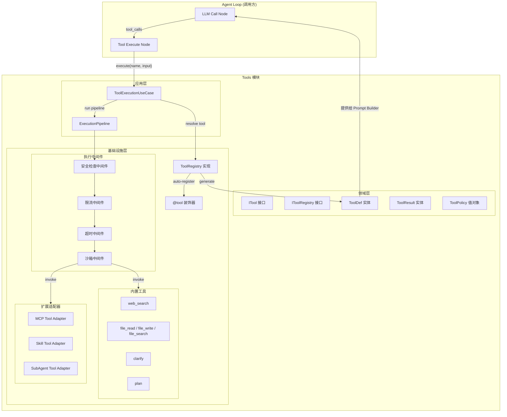
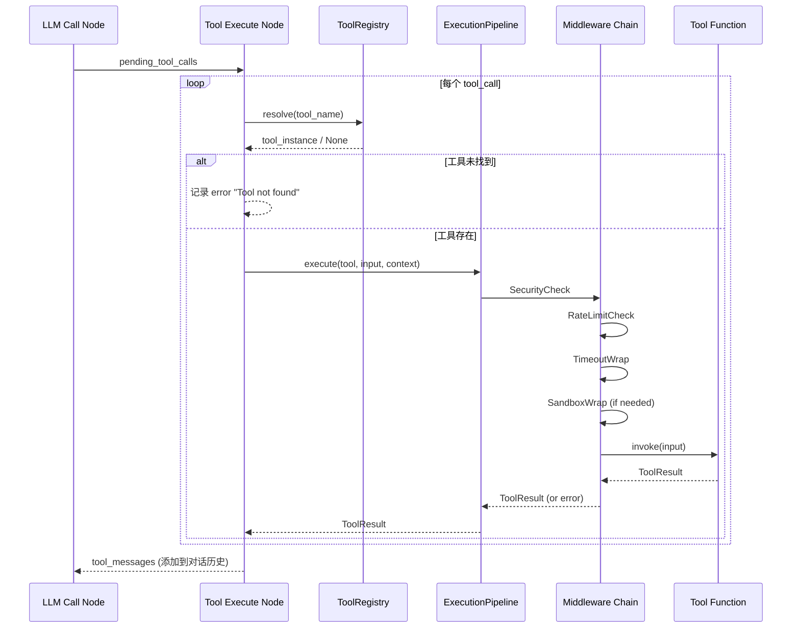

# 1.4 Tools 模块技术方案

## 1. 范围

本模块负责 Agent 工具系统的完整框架设计与实现，提供统一的工具定义、注册、发现和执行机制：

- **工具定义框架**：基于装饰器的工具声明式定义（参数 Schema、功能描述）
- **工具注册中心**：统一的工具注册表，支持动态注册和发现
- **工具执行管道**：安全检查 → 限流 → 超时控制 → 沙箱隔离 → 执行 → 结果返回
- **内置工具实现**：web_search、file（读写搜索）、clarify（澄清提问）、plan（任务规划）
- **扩展机制**：MCP 集成、Skills 系统、Sub-Agent 委派的工具化封装

**不包含**：
- MCP Server 的具体实现（属于 MCP 模块，本模块只定义 MCP 工具适配器接口）
- Skills 的具体业务逻辑实现（属于 Skills 模块，本模块只定义 Skill 工具包装器）
- Sub-Agent 的编排策略（属于 Multi-Agent 模块，本模块只定义委派接口）
- 前端工具管理 UI（后续迭代）
- 工具执行结果的持久化存储（属于会话管理模块）

**与其他模块的关系**：
- **Prompt Builder（1.2）**：本模块提供 `ToolDef` 列表，Prompt Builder 将其渲染到 Layer 5 Tooling Section
- **Agent Loop（1.3）**：`tool_execute_node` 节点通过 `ToolRegistry` 调用本模块执行工具
- **Memory 系统（1.5）**：部分工具可能读写 Memory，通过依赖注入获取 Memory 服务

---

## 2. 概要设计

### 2.1 核心设计理念

Tools 模块采用**声明式定义 + 管道式执行**的设计：

1. **声明式定义**：开发者通过 `@tool` 装饰器声明工具的名称、描述、参数 Schema，框架自动提取元数据
2. **自动注册**：装饰器标记的工具函数在模块加载时自动注册到全局 Registry
3. **管道式执行**：工具调用经过安全检查、限流、超时、沙箱等中间件管道后执行
4. **ToolDef 对齐**：从装饰器元数据自动生成 `ToolDef` 实体，供 Prompt Builder 使用

### 2.2 模块架构图



### 2.3 工具执行时序图



### 2.4 模块说明

#### 2.4.1 工具定义与注册模块

**职责**：提供 `@tool` 装饰器和 `ToolRegistry`，实现工具的声明式定义和自动注册。

**核心能力**：
- 装饰器解析函数签名，自动提取参数 Schema
- 支持类型注解到 JSON Schema 的映射
- 自动生成 `ToolDef` 供 Prompt Builder 使用
- 支持按类别（category）分组管理工具

**涉及文件**：
- `backend/src/domain/entities/tool/context.py` — ToolResult, ToolContext
- `backend/src/domain/entities/tool/definition.py` — ToolDef, ToolParameter
- `backend/src/domain/entities/tool/registered.py` — RegisteredTool
- `backend/src/domain/entities/tool/__init__.py` — 统一 re-export
- `backend/src/domain/repositories/tool_registry.py` — IToolRegistry 接口
- `backend/src/infrastructure/tools/registry.py` — ToolRegistry 实现
- `backend/src/infrastructure/tools/decorator.py` — @tool 装饰器

#### 2.4.2 工具执行管道模块

**职责**：提供中间件管道，对工具调用进行安全检查、限流、超时控制和沙箱隔离。

**核心能力**：
- 可插拔的中间件架构
- 安全策略（白名单/黑名单、参数校验）
- 令牌桶限流（per-tool 和 global）
- asyncio.wait_for 超时控制
- 可选的 subprocess 沙箱隔离

**涉及文件**：
- `backend/src/application/use_cases/tool_execution.py` — 执行用例
- `backend/src/infrastructure/tools/middleware/` — 中间件实现

#### 2.4.3 内置工具模块

**职责**：实现 Agent 核心内置工具集。

**工具清单**：
| 工具名 | 分类 | 默认提供商 | 说明 |
|--------|------|-----------|------|
| `web_search` | web_search | **Tavily** | 网络搜索，获取实时信息；针对 LLM/Agent 场景优化，返回结构化结果与 AI 摘要 |
| `file_read` | file | 本地 FS | 读取文件内容 |
| `file_write` | file | 本地 FS | 写入文件内容 |
| `file_search` | file | 本地 FS | 搜索文件（glob/grep） |
| `clarify` | clarify | — | 向用户发起澄清提问 |
| `plan` | plan | — | 生成/更新任务规划 |

> `web_search` 默认使用 [Tavily](https://tavily.com) 作为搜索提供商：为 LLM/Agent 专门设计，返回已清洗的结构化内容 + 可选 AI 摘要，LangChain 生态有原生适配。通过 `SEARCH_PROVIDER` 环境变量可扩展其他提供商（Serper、Brave、Exa 等）。

**涉及文件**：
- `backend/src/infrastructure/tools/builtin/web_search.py`
- `backend/src/infrastructure/tools/builtin/file_ops.py`
- `backend/src/infrastructure/tools/builtin/clarify.py`
- `backend/src/infrastructure/tools/builtin/plan.py`

#### 2.4.4 扩展适配器模块

**职责**：将 MCP 工具、Skills、Sub-Agent 包装为统一的 Tool 接口。

**涉及文件**：
- `backend/src/infrastructure/tools/adapters/mcp_adapter.py`
- `backend/src/infrastructure/tools/adapters/skill_adapter.py`
- `backend/src/infrastructure/tools/adapters/sub_agent_adapter.py`

---

## 3. 详细设计

### 3.1 领域层设计

#### 3.1.1 ITool 接口（工具协议）

```python
# backend/src/domain/entities/tool.py

from __future__ import annotations
from abc import ABC, abstractmethod
from dataclasses import dataclass, field
from typing import Any, Dict, Optional


@dataclass
class ToolResult:
    """工具执行结果
    
    所有工具执行后统一返回此结构。
    """
    output: str
    """文本输出（将作为 tool message content 返回给 LLM）"""
    
    success: bool = True
    """是否执行成功"""
    
    error: Optional[str] = None
    """错误信息（失败时填写）"""
    
    metadata: Dict[str, Any] = field(default_factory=dict)
    """附加元数据（如 token 消耗、执行耗时等，不返回给 LLM）"""


@dataclass
class ToolContext:
    """工具执行上下文
    
    传递给工具的运行时上下文信息，工具可按需使用。
    """
    task_id: str
    """当前任务 ID"""
    
    workspace: str = ""
    """工作目录路径"""
    
    user_id: Optional[str] = None
    """当前用户 ID"""
    
    agent_id: Optional[str] = None
    """当前 Agent ID"""
    
    extra: Dict[str, Any] = field(default_factory=dict)
    """扩展上下文（由具体工具自行解析）"""
```

#### 3.1.2 IToolRegistry 接口

```python
# backend/src/domain/repositories/tool_registry.py

from abc import ABC, abstractmethod
from typing import Dict, List, Optional

from src.domain.entities.tool_def import ToolDef
from src.domain.entities.tool import ToolContext, ToolResult


class IToolRegistry(ABC):
    """工具注册表接口
    
    定义工具注册、发现和执行的抽象接口。
    遵循 DDD 原则：接口在领域层，实现在基础设施层。
    """
    
    @abstractmethod
    def register(self, tool: "RegisteredTool") -> None:
        """注册一个工具"""
        ...
    
    @abstractmethod
    def unregister(self, name: str) -> bool:
        """取消注册一个工具"""
        ...
    
    @abstractmethod
    def resolve(self, name: str) -> Optional["RegisteredTool"]:
        """按名称查找工具"""
        ...
    
    @abstractmethod
    def list_tools(self, category: Optional[str] = None) -> List["RegisteredTool"]:
        """列出所有已注册工具（可按分类筛选）"""
        ...
    
    @abstractmethod
    def get_tool_defs(self, category: Optional[str] = None) -> List[ToolDef]:
        """获取所有工具的 ToolDef 定义（用于 Prompt Builder）"""
        ...
    
    @abstractmethod
    async def execute(self, name: str, input: Dict, context: Optional[ToolContext] = None) -> ToolResult:
        """执行指定工具"""
        ...
```

#### 3.1.3 ToolPolicy 值对象

```python
# backend/src/domain/entities/tool_policy.py

from dataclasses import dataclass, field
from typing import List, Optional


@dataclass(frozen=True)
class ToolPolicy:
    """工具执行策略（值对象）
    
    定义单个工具的执行约束。作为 RegisteredTool 的不可变属性。
    """
    
    timeout_ms: int = 30000
    """执行超时时间（毫秒），默认 30 秒"""
    
    max_calls_per_minute: int = 60
    """每分钟最大调用次数"""
    
    requires_approval: bool = False
    """是否需要用户审批才能执行"""
    
    sandboxed: bool = False
    """是否需要沙箱隔离执行"""
    
    allowed_paths: List[str] = field(default_factory=list)
    """允许访问的文件路径前缀（仅 file 类工具使用）"""
    
    risk_level: str = "low"
    """风险等级：low / medium / high"""
```

#### 3.1.4 RegisteredTool 实体

```python
# backend/src/domain/entities/registered_tool.py

from dataclasses import dataclass, field
from typing import Any, Callable, Coroutine, Dict, List, Optional

from src.domain.entities.tool import ToolContext, ToolResult
from src.domain.entities.tool_def import ToolDef, ToolParameter
from src.domain.entities.tool_policy import ToolPolicy


# 工具函数类型：接收 Dict 参数和可选 Context，返回 ToolResult
ToolFunction = Callable[..., Coroutine[Any, Any, ToolResult]]


@dataclass
class RegisteredTool:
    """已注册的工具实体
    
    将工具函数、元数据定义、执行策略绑定在一起。
    由 @tool 装饰器自动创建，或由适配器手动构建。
    """
    
    name: str
    """工具唯一名称"""
    
    description: str
    """功能描述（用于 LLM 理解何时调用）"""
    
    func: ToolFunction
    """实际执行函数"""
    
    parameters: List[ToolParameter] = field(default_factory=list)
    """参数定义列表"""
    
    returns: str = ""
    """返回值描述"""
    
    category: str = "general"
    """工具分类"""
    
    policy: ToolPolicy = field(default_factory=ToolPolicy)
    """执行策略"""
    
    def to_tool_def(self) -> ToolDef:
        """转换为 ToolDef 实体（供 Prompt Builder 使用）
        
        Returns:
            与 1.2_prompt-builder.md 定义的 ToolDef 结构对齐
        """
        return ToolDef(
            name=self.name,
            description=self.description,
            parameters=self.parameters,
            returns=self.returns,
            category=self.category,
        )
```

---

### 3.2 基础设施层设计 — 装饰器框架

#### 3.2.1 @tool 装饰器

这是整个工具系统的核心入口，开发者通过装饰器声明工具：

```python
# backend/src/infrastructure/tools/decorator.py

import asyncio
import inspect
import functools
from typing import Any, Callable, Dict, List, Optional, get_type_hints

from src.domain.entities.tool import ToolContext, ToolResult
from src.domain.entities.tool_def import ToolParameter
from src.domain.entities.tool_policy import ToolPolicy
from src.domain.entities.registered_tool import RegisteredTool


# 全局工具收集器（模块加载时收集，后由 Registry 统一注册）
_tool_collector: List[RegisteredTool] = []


def get_collected_tools() -> List[RegisteredTool]:
    """获取所有通过 @tool 装饰器收集的工具"""
    return list(_tool_collector)


def tool(
    name: Optional[str] = None,
    description: str = "",
    category: str = "general",
    returns: str = "",
    timeout_ms: int = 30000,
    max_calls_per_minute: int = 60,
    requires_approval: bool = False,
    sandboxed: bool = False,
    risk_level: str = "low",
) -> Callable:
    """工具定义装饰器
    
    使用方式：
    
        @tool(
            name="web_search",
            description="搜索网络获取实时信息",
            category="web_search",
            returns="搜索结果文本",
            timeout_ms=15000,
        )
        async def web_search(query: str, max_results: int = 5) -> ToolResult:
            '''
            Args:
                query: 搜索关键词
                max_results: 最大返回结果数
            '''
            ...
    
    装饰器自动完成：
    1. 从函数签名提取参数类型和默认值
    2. 从 docstring 提取参数描述
    3. 构建 ToolParameter 列表
    4. 创建 RegisteredTool 并加入收集器
    
    Args:
        name: 工具名称（默认使用函数名）
        description: 工具功能描述
        category: 工具分类
        returns: 返回值描述
        timeout_ms: 超时时间（毫秒）
        max_calls_per_minute: 每分钟最大调用次数
        requires_approval: 是否需要审批
        sandboxed: 是否沙箱执行
        risk_level: 风险等级
    """
    def decorator(func: Callable) -> Callable:
        tool_name = name or func.__name__
        tool_desc = description or (func.__doc__ or "").split("\n")[0].strip()
        
        # 解析参数
        parameters = _extract_parameters(func)
        
        # 构建策略
        policy = ToolPolicy(
            timeout_ms=timeout_ms,
            max_calls_per_minute=max_calls_per_minute,
            requires_approval=requires_approval,
            sandboxed=sandboxed,
            risk_level=risk_level,
        )
        
        # 包装为统一的异步调用签名
        wrapped = _wrap_tool_function(func)
        
        # 创建 RegisteredTool
        registered = RegisteredTool(
            name=tool_name,
            description=tool_desc,
            func=wrapped,
            parameters=parameters,
            returns=returns,
            category=category,
            policy=policy,
        )
        
        # 加入收集器
        _tool_collector.append(registered)
        
        # 保留原始函数的元信息
        @functools.wraps(func)
        async def wrapper(*args, **kwargs):
            return await wrapped(*args, **kwargs)
        
        # 在 wrapper 上附加元数据，便于测试和内省
        wrapper._registered_tool = registered
        
        return wrapper
    
    return decorator


def _extract_parameters(func: Callable) -> List[ToolParameter]:
    """从函数签名和 docstring 提取参数定义
    
    支持的类型映射：
    - str → "string"
    - int → "integer"
    - float → "number"
    - bool → "boolean"
    - list → "array"
    - dict → "object"
    """
    sig = inspect.signature(func)
    type_hints = get_type_hints(func)
    doc_params = _parse_docstring_params(func.__doc__ or "")
    
    parameters = []
    for param_name, param in sig.parameters.items():
        # 跳过 self、context 参数
        if param_name in ("self", "context", "ctx"):
            continue
        
        # 类型映射
        param_type = type_hints.get(param_name, str)
        type_str = _python_type_to_schema_type(param_type)
        
        # 是否必填
        required = param.default is inspect.Parameter.empty
        
        # 描述（从 docstring 提取）
        desc = doc_params.get(param_name, "")
        
        parameters.append(ToolParameter(
            name=param_name,
            type=type_str,
            description=desc,
            required=required,
        ))
    
    return parameters


def _python_type_to_schema_type(py_type: Any) -> str:
    """Python 类型到 JSON Schema 类型的映射"""
    type_map = {
        str: "string",
        int: "integer",
        float: "number",
        bool: "boolean",
        list: "array",
        dict: "object",
    }
    # 处理 Optional 等泛型
    origin = getattr(py_type, "__origin__", None)
    if origin is list:
        return "array"
    if origin is dict:
        return "object"
    return type_map.get(py_type, "string")


def _parse_docstring_params(docstring: str) -> Dict[str, str]:
    """从 Google-style docstring 解析 Args 段落"""
    params = {}
    in_args = False
    current_param = None
    
    for line in docstring.split("\n"):
        stripped = line.strip()
        if stripped.lower().startswith("args:"):
            in_args = True
            continue
        if in_args:
            if stripped and not stripped.startswith("-") and ":" in stripped:
                # 新参数行：param_name: description
                parts = stripped.split(":", 1)
                current_param = parts[0].strip()
                params[current_param] = parts[1].strip()
            elif stripped.startswith("returns:") or stripped.startswith("raises:"):
                break
            elif current_param and stripped:
                # 续行
                params[current_param] += " " + stripped
    
    return params


def _wrap_tool_function(func: Callable) -> Callable:
    """包装工具函数为统一的异步调用接口
    
    统一签名：async def(input: Dict, context: ToolContext) -> ToolResult
    """
    sig = inspect.signature(func)
    is_async = asyncio.iscoroutinefunction(func)
    
    # 检查函数是否接受 context 参数
    accepts_context = "context" in sig.parameters or "ctx" in sig.parameters
    
    async def wrapped(input: Dict[str, Any], context: Optional[ToolContext] = None) -> ToolResult:
        # 构建调用参数
        kwargs = dict(input)
        if accepts_context and context:
            ctx_name = "context" if "context" in sig.parameters else "ctx"
            kwargs[ctx_name] = context
        
        # 调用原始函数
        if is_async:
            result = await func(**kwargs)
        else:
            result = await asyncio.to_thread(func, **kwargs)
        
        # 规范化返回值
        if isinstance(result, ToolResult):
            return result
        elif isinstance(result, str):
            return ToolResult(output=result)
        elif isinstance(result, dict):
            return ToolResult(
                output=result.get("output", str(result)),
                success=result.get("success", True),
                metadata=result.get("metadata", {}),
            )
        else:
            return ToolResult(output=str(result))
    
    return wrapped
```

#### 3.2.2 使用示例

```python
# 示例：定义一个 web_search 工具

from src.infrastructure.tools.decorator import tool
from src.domain.entities.tool import ToolResult, ToolContext


@tool(
    name="web_search",
    description="搜索互联网获取实时信息。当需要获取最新资讯、查找事实或验证信息时使用。",
    category="web_search",
    returns="搜索结果摘要文本",
    timeout_ms=15000,
    max_calls_per_minute=20,
)
async def web_search(query: str, max_results: int = 5, context: ToolContext = None) -> ToolResult:
    """网络搜索工具
    
    Args:
        query: 搜索关键词或问题
        max_results: 最大返回结果数量（1-10）
    """
    # 具体实现...
    results = await _do_search(query, max_results)
    return ToolResult(
        output=_format_results(results),
        metadata={"result_count": len(results)},
    )
```

---

### 3.3 基础设施层设计 — ToolRegistry 实现

```python
# backend/src/infrastructure/tools/registry.py

import logging
from typing import Dict, List, Optional

from src.domain.entities.tool import ToolContext, ToolResult
from src.domain.entities.tool_def import ToolDef
from src.domain.entities.registered_tool import RegisteredTool
from src.domain.repositories.tool_registry import IToolRegistry
from src.infrastructure.tools.decorator import get_collected_tools
from src.infrastructure.tools.pipeline import ExecutionPipeline

logger = logging.getLogger(__name__)


class ToolRegistry(IToolRegistry):
    """工具注册表实现
    
    职责：
    1. 管理所有已注册工具
    2. 提供工具查找和发现
    3. 通过 ExecutionPipeline 执行工具
    """
    
    def __init__(self, pipeline: Optional[ExecutionPipeline] = None):
        self._tools: Dict[str, RegisteredTool] = {}
        self._pipeline = pipeline or ExecutionPipeline()
    
    def register(self, tool: RegisteredTool) -> None:
        """注册工具"""
        if tool.name in self._tools:
            logger.warning(f"Tool '{tool.name}' already registered, overwriting")
        self._tools[tool.name] = tool
        logger.info(f"Tool registered: {tool.name} (category={tool.category})")
    
    def unregister(self, name: str) -> bool:
        """取消注册"""
        if name in self._tools:
            del self._tools[name]
            logger.info(f"Tool unregistered: {name}")
            return True
        return False
    
    def resolve(self, name: str) -> Optional[RegisteredTool]:
        """按名称查找工具"""
        return self._tools.get(name)
    
    def list_tools(self, category: Optional[str] = None) -> List[RegisteredTool]:
        """列出工具"""
        tools = list(self._tools.values())
        if category:
            tools = [t for t in tools if t.category == category]
        return tools
    
    def get_tool_defs(self, category: Optional[str] = None) -> List[ToolDef]:
        """获取 ToolDef 列表（供 Prompt Builder Layer 5 使用）"""
        tools = self.list_tools(category)
        return [t.to_tool_def() for t in tools]
    
    async def execute(self, name: str, input: Dict, context: Optional[ToolContext] = None) -> ToolResult:
        """执行工具（经过中间件管道）"""
        tool = self.resolve(name)
        if not tool:
            return ToolResult(
                output=f"Error: Tool '{name}' not found",
                success=False,
                error=f"Tool '{name}' is not registered",
            )
        
        return await self._pipeline.execute(tool, input, context)
    
    def auto_register_collected(self) -> None:
        """自动注册所有通过 @tool 装饰器收集的工具"""
        for tool in get_collected_tools():
            self.register(tool)
    
    @property
    def tool_count(self) -> int:
        return len(self._tools)
```

---

### 3.4 应用层设计 — ExecutionPipeline

```python
# backend/src/infrastructure/tools/pipeline.py

import asyncio
import logging
import time
from typing import Any, Dict, List, Optional, Protocol

from src.domain.entities.tool import ToolContext, ToolResult
from src.domain.entities.registered_tool import RegisteredTool

logger = logging.getLogger(__name__)


class Middleware(Protocol):
    """中间件协议"""
    
    async def process(
        self,
        tool: RegisteredTool,
        input: Dict[str, Any],
        context: Optional[ToolContext],
        next_handler: "MiddlewareHandler",
    ) -> ToolResult:
        ...


MiddlewareHandler = Any  # Callable that takes (tool, input, context) -> ToolResult


class ExecutionPipeline:
    """工具执行管道
    
    按顺序执行中间件链：Security → RateLimit → Timeout → Sandbox → Invoke
    """
    
    def __init__(self, middlewares: Optional[List[Middleware]] = None):
        self._middlewares: List[Middleware] = middlewares or []
    
    def add_middleware(self, middleware: Middleware) -> None:
        """添加中间件"""
        self._middlewares.append(middleware)
    
    async def execute(
        self,
        tool: RegisteredTool,
        input: Dict[str, Any],
        context: Optional[ToolContext] = None,
    ) -> ToolResult:
        """执行工具（经过中间件链）"""
        start_time = time.time()
        
        # 构建中间件链（洋葱模型）
        async def final_handler(t: RegisteredTool, inp: Dict, ctx: Optional[ToolContext]) -> ToolResult:
            return await t.func(inp, ctx)
        
        handler = final_handler
        for mw in reversed(self._middlewares):
            handler = _make_next(mw, handler)
        
        try:
            result = await handler(tool, input, context)
            duration_ms = int((time.time() - start_time) * 1000)
            result.metadata["duration_ms"] = duration_ms
            logger.info(
                f"Tool executed: {tool.name}",
                extra={"tool": tool.name, "duration_ms": duration_ms, "success": result.success},
            )
            return result
        except Exception as e:
            duration_ms = int((time.time() - start_time) * 1000)
            logger.error(
                f"Tool execution failed: {tool.name}",
                extra={"tool": tool.name, "error": str(e), "duration_ms": duration_ms},
            )
            return ToolResult(
                output=f"Tool execution error: {str(e)}",
                success=False,
                error=str(e),
                metadata={"duration_ms": duration_ms},
            )


def _make_next(mw: Middleware, next_handler):
    """构建洋葱模型中间件调用链"""
    async def handler(tool, input, context):
        return await mw.process(tool, input, context, next_handler)
    return handler
```

---

### 3.5 中间件实现

#### 3.5.1 超时中间件

```python
# backend/src/infrastructure/tools/middleware/timeout.py

import asyncio
from typing import Any, Dict, Optional

from src.domain.entities.tool import ToolContext, ToolResult
from src.domain.entities.registered_tool import RegisteredTool


class TimeoutMiddleware:
    """超时控制中间件
    
    根据工具的 policy.timeout_ms 设置执行超时。
    超时后返回错误结果而非抛出异常。
    """
    
    async def process(
        self,
        tool: RegisteredTool,
        input: Dict[str, Any],
        context: Optional[ToolContext],
        next_handler,
    ) -> ToolResult:
        timeout_sec = tool.policy.timeout_ms / 1000.0
        
        try:
            return await asyncio.wait_for(
                next_handler(tool, input, context),
                timeout=timeout_sec,
            )
        except asyncio.TimeoutError:
            return ToolResult(
                output=f"Tool '{tool.name}' timed out after {tool.policy.timeout_ms}ms",
                success=False,
                error="timeout",
                metadata={"timeout_ms": tool.policy.timeout_ms},
            )
```

#### 3.5.2 限流中间件

```python
# backend/src/infrastructure/tools/middleware/rate_limit.py

import time
from collections import defaultdict
from typing import Any, Dict, Optional

from src.domain.entities.tool import ToolContext, ToolResult
from src.domain.entities.registered_tool import RegisteredTool


class RateLimitMiddleware:
    """令牌桶限流中间件
    
    基于滑动窗口实现 per-tool 限流。
    """
    
    def __init__(self, global_max_per_minute: int = 300):
        self._call_records: Dict[str, list] = defaultdict(list)
        self._global_max = global_max_per_minute
    
    async def process(
        self,
        tool: RegisteredTool,
        input: Dict[str, Any],
        context: Optional[ToolContext],
        next_handler,
    ) -> ToolResult:
        now = time.time()
        window_start = now - 60.0
        
        # 清理过期记录
        tool_records = self._call_records[tool.name]
        self._call_records[tool.name] = [t for t in tool_records if t > window_start]
        
        # 检查 per-tool 限流
        if len(self._call_records[tool.name]) >= tool.policy.max_calls_per_minute:
            return ToolResult(
                output=f"Tool '{tool.name}' rate limited: max {tool.policy.max_calls_per_minute} calls/min",
                success=False,
                error="rate_limited",
            )
        
        # 记录调用
        self._call_records[tool.name].append(now)
        
        return await next_handler(tool, input, context)
```

#### 3.5.3 安全检查中间件

```python
# backend/src/infrastructure/tools/middleware/security.py

import os
from typing import Any, Dict, List, Optional

from src.domain.entities.tool import ToolContext, ToolResult
from src.domain.entities.registered_tool import RegisteredTool


class SecurityMiddleware:
    """安全检查中间件
    
    职责：
    1. 检查工具是否在白名单中（如果启用白名单）
    2. 验证文件路径是否在允许范围内
    3. 检查是否需要审批
    """
    
    def __init__(self, allowed_tools: Optional[List[str]] = None):
        self._allowed_tools = allowed_tools  # None 表示不限制
    
    async def process(
        self,
        tool: RegisteredTool,
        input: Dict[str, Any],
        context: Optional[ToolContext],
        next_handler,
    ) -> ToolResult:
        # 白名单检查
        if self._allowed_tools is not None and tool.name not in self._allowed_tools:
            return ToolResult(
                output=f"Tool '{tool.name}' is not allowed in current context",
                success=False,
                error="permission_denied",
            )
        
        # 文件路径安全检查（file 类工具）
        if tool.category == "file" and tool.policy.allowed_paths:
            path = input.get("path", "") or input.get("file_path", "")
            if path and not self._is_path_allowed(path, tool.policy.allowed_paths):
                return ToolResult(
                    output=f"Access denied: path '{path}' is outside allowed directories",
                    success=False,
                    error="path_not_allowed",
                )
        
        # 审批检查（需要 HITL 支持）
        if tool.policy.requires_approval:
            # TODO: 集成 HITL 审批流程
            pass
        
        return await next_handler(tool, input, context)
    
    def _is_path_allowed(self, path: str, allowed_paths: List[str]) -> bool:
        """检查路径是否在允许的目录下"""
        abs_path = os.path.abspath(path)
        return any(abs_path.startswith(os.path.abspath(p)) for p in allowed_paths)
```

#### 3.5.4 沙箱中间件

```python
# backend/src/infrastructure/tools/middleware/sandbox.py

from typing import Any, Dict, Optional

from src.domain.entities.tool import ToolContext, ToolResult
from src.domain.entities.registered_tool import RegisteredTool


class SandboxMiddleware:
    """沙箱执行中间件
    
    对标记为 sandboxed=True 的工具，在受限环境中执行。
    当前实现为标记检查 + 资源限制预留接口。
    后续可扩展为 subprocess 隔离或容器沙箱。
    """
    
    async def process(
        self,
        tool: RegisteredTool,
        input: Dict[str, Any],
        context: Optional[ToolContext],
        next_handler,
    ) -> ToolResult:
        if not tool.policy.sandboxed:
            return await next_handler(tool, input, context)
        
        # 沙箱执行：限制资源访问
        # 当前阶段：直接执行 + 标记
        # 后续可扩展为 subprocess + seccomp 或 Docker 隔离
        result = await next_handler(tool, input, context)
        result.metadata["sandboxed"] = True
        return result
```

---

### 3.6 内置工具实现

#### 3.6.1 web_search

**默认提供商：Tavily**

Tavily 是专为 LLM / AI Agent 设计的搜索 API，具备以下特点：
- 返回已清洗、去噪的网页正文片段（Content），对 LLM 友好
- 可选 `include_answer=True` 直接返回 AI 生成的简明摘要
- 支持 `search_depth=basic|advanced` 控制检索深度与成本
- 提供 `include_domains` / `exclude_domains` 精确控制信源
- 每月 1000 次免费额度，适合开发与中小规模生产

**依赖与配置**：

```bash
# 添加依赖
uv add tavily-python
```

```bash
# .env 配置
SEARCH_PROVIDER=tavily
TAVILY_API_KEY=tvly-xxxxxxxxxxxxxxxxxxxxxxxxxxxx
TAVILY_SEARCH_DEPTH=basic          # basic | advanced
TAVILY_INCLUDE_ANSWER=true         # 是否返回 AI 摘要
```

**完整实现**：

```python
# backend/src/infrastructure/tools/builtin/web_search.py

import asyncio
import logging
import os
from typing import Any, Dict, List, Optional

from src.infrastructure.tools.decorator import tool
from src.domain.entities.tool import ToolResult, ToolContext

logger = logging.getLogger(__name__)


@tool(
    name="web_search",
    description="搜索互联网获取实时信息。当需要查找最新资讯、验证事实或获取不确定的知识时使用。",
    category="web_search",
    returns="搜索结果列表，包含标题、摘要、来源链接，可选 AI 摘要",
    timeout_ms=15000,
    max_calls_per_minute=20,
    risk_level="low",
)
async def web_search(
    query: str,
    max_results: int = 5,
    search_depth: str = "basic",
    include_domains: Optional[List[str]] = None,
    exclude_domains: Optional[List[str]] = None,
    context: Optional[ToolContext] = None,
) -> ToolResult:
    """网络搜索工具（默认使用 Tavily）
    
    Args:
        query: 搜索关键词或问题
        max_results: 最大返回结果数量（1-10）
        search_depth: 检索深度，basic（快速）或 advanced（更全面但更慢更贵）
        include_domains: 仅在这些域名中搜索（可选）
        exclude_domains: 排除这些域名（可选）
    """
    # 输入验证
    if not query.strip():
        return ToolResult(
            output="Error: query cannot be empty",
            success=False,
            error="invalid_input",
        )

    max_results = max(1, min(10, max_results))
    if search_depth not in ("basic", "advanced"):
        search_depth = "basic"

    provider = os.getenv("SEARCH_PROVIDER", "tavily").lower()

    try:
        if provider == "tavily":
            payload = await _tavily_search(
                query=query,
                max_results=max_results,
                search_depth=search_depth,
                include_domains=include_domains,
                exclude_domains=exclude_domains,
            )
            formatted = _format_tavily_results(payload)
            return ToolResult(
                output=formatted,
                metadata={
                    "provider": "tavily",
                    "result_count": len(payload.get("results", [])),
                    "has_answer": bool(payload.get("answer")),
                    "search_depth": search_depth,
                },
            )
        else:
            return ToolResult(
                output=f"Unsupported search provider: {provider}",
                success=False,
                error="unsupported_provider",
            )
    except _TavilyConfigError as e:
        logger.error("Tavily config error: %s", e)
        return ToolResult(
            output=f"Search not configured: {e}",
            success=False,
            error="config_missing",
        )
    except Exception as e:
        logger.exception("Web search failed")
        return ToolResult(
            output=f"Search failed: {str(e)}",
            success=False,
            error=str(e),
        )


# ---------------------------------------------------------------------------
# Tavily 提供商实现
# ---------------------------------------------------------------------------

class _TavilyConfigError(Exception):
    """Tavily 配置错误（如缺少 API Key）"""


async def _tavily_search(
    query: str,
    max_results: int,
    search_depth: str,
    include_domains: Optional[List[str]],
    exclude_domains: Optional[List[str]],
) -> Dict[str, Any]:
    """调用 Tavily API 执行搜索
    
    使用官方 SDK `tavily-python`，其 client.search 为同步调用，
    通过 asyncio.to_thread 包装避免阻塞事件循环。
    """
    api_key = os.getenv("TAVILY_API_KEY")
    if not api_key:
        raise _TavilyConfigError("TAVILY_API_KEY is not set")

    try:
        from tavily import TavilyClient
    except ImportError as e:
        raise _TavilyConfigError(
            "tavily-python not installed. Run: uv add tavily-python"
        ) from e

    include_answer = os.getenv("TAVILY_INCLUDE_ANSWER", "true").lower() == "true"

    def _call() -> Dict[str, Any]:
        client = TavilyClient(api_key=api_key)
        return client.search(
            query=query,
            max_results=max_results,
            search_depth=search_depth,
            include_answer=include_answer,
            include_domains=include_domains or None,
            exclude_domains=exclude_domains or None,
        )

    # 同步 SDK 用线程池执行，避免阻塞
    return await asyncio.to_thread(_call)


def _format_tavily_results(payload: Dict[str, Any]) -> str:
    """将 Tavily 返回格式化为 LLM 可读文本
    
    Tavily 返回结构示例：
    {
        "query": "...",
        "answer": "AI 生成的摘要（可选）",
        "results": [
            {"title": "...", "url": "...", "content": "...", "score": 0.95},
            ...
        ]
    }
    """
    results = payload.get("results", []) or []
    answer = payload.get("answer")

    if not results and not answer:
        return "No results found."

    parts: List[str] = []

    # 优先展示 AI 摘要（如果启用）
    if answer:
        parts.append("## Summary")
        parts.append(answer.strip())
        parts.append("")

    parts.append("## Search Results")
    for i, r in enumerate(results, 1):
        title = r.get("title") or "Untitled"
        url = r.get("url", "")
        content = (r.get("content") or "").strip()
        score = r.get("score")

        parts.append(f"{i}. **{title}**")
        if url:
            parts.append(f"   URL: {url}")
        if content:
            # 限制单条长度，避免 context 爆炸
            snippet = content if len(content) <= 500 else content[:500] + "..."
            parts.append(f"   {snippet}")
        if score is not None:
            parts.append(f"   Relevance: {score:.2f}")
        parts.append("")

    return "\n".join(parts).rstrip()
```

#### 3.6.2 file 操作工具

```python
# backend/src/infrastructure/tools/builtin/file_ops.py

import os
import glob as glob_module
from typing import Optional

from src.infrastructure.tools.decorator import tool
from src.domain.entities.tool import ToolResult, ToolContext


@tool(
    name="file_read",
    description="读取指定路径的文件内容。支持文本文件。",
    category="file",
    returns="文件内容文本",
    timeout_ms=10000,
    risk_level="low",
)
async def file_read(
    path: str,
    offset: int = 0,
    limit: int = 2000,
    context: Optional[ToolContext] = None,
) -> ToolResult:
    """读取文件内容
    
    Args:
        path: 文件路径（相对于 workspace 或绝对路径）
        offset: 起始行号（从 0 开始）
        limit: 读取的最大行数
    """
    workspace = context.workspace if context else ""
    full_path = _resolve_path(path, workspace)
    
    if not os.path.isfile(full_path):
        return ToolResult(output=f"File not found: {path}", success=False, error="file_not_found")
    
    try:
        with open(full_path, "r", encoding="utf-8", errors="replace") as f:
            lines = f.readlines()
        
        total_lines = len(lines)
        selected = lines[offset:offset + limit]
        content = "".join(selected)
        
        header = f"File: {path} (lines {offset+1}-{min(offset+limit, total_lines)} of {total_lines})\n"
        return ToolResult(
            output=header + content,
            metadata={"total_lines": total_lines, "read_lines": len(selected)},
        )
    except Exception as e:
        return ToolResult(output=f"Error reading file: {str(e)}", success=False, error=str(e))


@tool(
    name="file_write",
    description="写入内容到指定文件。如果文件不存在则创建，存在则覆盖。",
    category="file",
    returns="写入结果确认",
    timeout_ms=10000,
    requires_approval=True,
    risk_level="medium",
)
async def file_write(
    path: str,
    content: str,
    context: Optional[ToolContext] = None,
) -> ToolResult:
    """写入文件
    
    Args:
        path: 文件路径
        content: 要写入的文件内容
    """
    workspace = context.workspace if context else ""
    full_path = _resolve_path(path, workspace)
    
    try:
        os.makedirs(os.path.dirname(full_path), exist_ok=True)
        with open(full_path, "w", encoding="utf-8") as f:
            f.write(content)
        
        return ToolResult(
            output=f"Successfully wrote {len(content)} characters to {path}",
            metadata={"bytes_written": len(content.encode("utf-8"))},
        )
    except Exception as e:
        return ToolResult(output=f"Error writing file: {str(e)}", success=False, error=str(e))


@tool(
    name="file_search",
    description="在工作目录中搜索文件。支持 glob 模式匹配文件名，或在文件内容中搜索关键词。",
    category="file",
    returns="匹配的文件路径列表或包含关键词的行",
    timeout_ms=15000,
    risk_level="low",
)
async def file_search(
    pattern: str,
    search_content: Optional[str] = None,
    max_results: int = 20,
    context: Optional[ToolContext] = None,
) -> ToolResult:
    """文件搜索
    
    Args:
        pattern: glob 模式（如 "**/*.py"）用于匹配文件名
        search_content: 在匹配文件中搜索的关键词（可选）
        max_results: 最大返回结果数
    """
    workspace = context.workspace if context else os.getcwd()
    
    try:
        search_path = os.path.join(workspace, pattern)
        matches = glob_module.glob(search_path, recursive=True)
        matches = matches[:max_results]
        
        if search_content and matches:
            # 在匹配文件中搜索内容
            content_matches = []
            for fpath in matches:
                if os.path.isfile(fpath):
                    try:
                        with open(fpath, "r", encoding="utf-8", errors="replace") as f:
                            for i, line in enumerate(f, 1):
                                if search_content in line:
                                    rel = os.path.relpath(fpath, workspace)
                                    content_matches.append(f"{rel}:{i}: {line.rstrip()}")
                    except (OSError, UnicodeDecodeError):
                        continue
            
            output = "\n".join(content_matches[:max_results]) or "No content matches found."
        else:
            rel_paths = [os.path.relpath(m, workspace) for m in matches]
            output = "\n".join(rel_paths) or "No files found matching pattern."
        
        return ToolResult(output=output, metadata={"match_count": len(matches)})
    except Exception as e:
        return ToolResult(output=f"Search error: {str(e)}", success=False, error=str(e))


def _resolve_path(path: str, workspace: str) -> str:
    """解析文件路径"""
    if os.path.isabs(path):
        return path
    return os.path.join(workspace, path) if workspace else os.path.abspath(path)
```

#### 3.6.3 clarify 工具

```python
# backend/src/infrastructure/tools/builtin/clarify.py

from typing import List, Optional

from src.infrastructure.tools.decorator import tool
from src.domain.entities.tool import ToolResult, ToolContext


@tool(
    name="clarify",
    description="当任务需求不明确或存在歧义时，向用户发起澄清提问。提供选项可降低用户回答负担。",
    category="clarify",
    returns="标记为等待用户回复的特殊响应",
    timeout_ms=5000,
    risk_level="low",
)
async def clarify(
    question: str,
    options: Optional[List[str]] = None,
    context: Optional[ToolContext] = None,
) -> ToolResult:
    """澄清提问工具
    
    Args:
        question: 要向用户提出的问题
        options: 可选的选项列表，提供给用户选择
    """
    if not question.strip():
        return ToolResult(output="Error: question cannot be empty", success=False, error="invalid_input")
    
    # 构建澄清消息（由事件系统推送给前端）
    output_parts = [f"**Question**: {question}"]
    if options:
        output_parts.append("\n**Options**:")
        for i, opt in enumerate(options, 1):
            output_parts.append(f"  {i}. {opt}")
    
    return ToolResult(
        output="\n".join(output_parts),
        metadata={
            "type": "clarify",
            "question": question,
            "options": options or [],
            "awaiting_user_input": True,
        },
    )
```

#### 3.6.4 plan 工具

```python
# backend/src/infrastructure/tools/builtin/plan.py

from typing import List, Optional

from src.infrastructure.tools.decorator import tool
from src.domain.entities.tool import ToolResult, ToolContext


@tool(
    name="plan",
    description="将复杂任务分解为可执行的步骤计划。用于在执行前组织思路和明确行动路径。",
    category="plan",
    returns="结构化的任务计划",
    timeout_ms=5000,
    risk_level="low",
)
async def plan(
    goal: str,
    steps: List[str],
    context: Optional[ToolContext] = None,
) -> ToolResult:
    """任务规划工具
    
    Args:
        goal: 任务目标描述
        steps: 执行步骤列表
    """
    if not goal.strip():
        return ToolResult(output="Error: goal cannot be empty", success=False, error="invalid_input")
    
    if not steps:
        return ToolResult(output="Error: steps cannot be empty", success=False, error="invalid_input")
    
    # 格式化计划
    output_parts = [f"## Plan: {goal}\n"]
    for i, step in enumerate(steps, 1):
        output_parts.append(f"- [ ] Step {i}: {step}")
    
    return ToolResult(
        output="\n".join(output_parts),
        metadata={
            "type": "plan",
            "goal": goal,
            "step_count": len(steps),
        },
    )
```

---

### 3.7 扩展适配器设计

#### 3.7.1 MCP 工具适配器

```python
# backend/src/infrastructure/tools/adapters/mcp_adapter.py

from typing import Any, Dict, List, Optional

from src.domain.entities.tool import ToolContext, ToolResult
from src.domain.entities.tool_def import ToolParameter
from src.domain.entities.tool_policy import ToolPolicy
from src.domain.entities.registered_tool import RegisteredTool


class MCPToolAdapter:
    """MCP 工具适配器
    
    将 MCP Server 暴露的工具转换为 RegisteredTool 格式，
    使其可以注册到 ToolRegistry 中被 Agent 统一调用。
    """
    
    def __init__(self, mcp_client):
        """
        Args:
            mcp_client: MCP 客户端实例（负责与 MCP Server 通信）
        """
        self._client = mcp_client
    
    async def discover_tools(self) -> List[RegisteredTool]:
        """从 MCP Server 发现并转换所有可用工具
        
        Returns:
            转换后的 RegisteredTool 列表
        """
        mcp_tools = await self._client.list_tools()
        registered_tools = []
        
        for mcp_tool in mcp_tools:
            tool = self._convert_mcp_tool(mcp_tool)
            registered_tools.append(tool)
        
        return registered_tools
    
    def _convert_mcp_tool(self, mcp_tool: Dict[str, Any]) -> RegisteredTool:
        """将 MCP 工具定义转换为 RegisteredTool"""
        name = f"mcp_{mcp_tool['name']}"  # 添加前缀避免命名冲突
        
        # 转换参数 Schema
        parameters = self._convert_parameters(mcp_tool.get("inputSchema", {}))
        
        # 创建调用函数
        async def invoke(input: Dict[str, Any], context: Optional[ToolContext] = None) -> ToolResult:
            try:
                result = await self._client.call_tool(mcp_tool["name"], input)
                return ToolResult(output=str(result.get("content", "")))
            except Exception as e:
                return ToolResult(output=f"MCP tool error: {str(e)}", success=False, error=str(e))
        
        return RegisteredTool(
            name=name,
            description=mcp_tool.get("description", ""),
            func=invoke,
            parameters=parameters,
            category="mcp",
            policy=ToolPolicy(timeout_ms=60000),  # MCP 工具默认更长超时
        )
    
    def _convert_parameters(self, schema: Dict) -> List[ToolParameter]:
        """将 JSON Schema 转换为 ToolParameter 列表"""
        parameters = []
        properties = schema.get("properties", {})
        required = set(schema.get("required", []))
        
        for name, prop in properties.items():
            parameters.append(ToolParameter(
                name=name,
                type=prop.get("type", "string"),
                description=prop.get("description", ""),
                required=name in required,
            ))
        
        return parameters
```

#### 3.7.2 Skill 工具适配器

```python
# backend/src/infrastructure/tools/adapters/skill_adapter.py

from typing import Any, Dict, List, Optional

from src.domain.entities.tool import ToolContext, ToolResult
from src.domain.entities.tool_def import ToolParameter
from src.domain.entities.tool_policy import ToolPolicy
from src.domain.entities.registered_tool import RegisteredTool


class SkillToolAdapter:
    """Skill 工具适配器
    
    将 Skill 系统中的技能包装为 RegisteredTool，
    使 Agent 可以通过统一的工具调用接口触发 Skill 执行。
    """
    
    def __init__(self, skill_registry):
        """
        Args:
            skill_registry: Skill 注册表（提供 Skill 列表和执行能力）
        """
        self._skill_registry = skill_registry
    
    def wrap_skills(self) -> List[RegisteredTool]:
        """将所有已注册 Skill 包装为工具"""
        tools = []
        for skill in self._skill_registry.list_skills():
            tool = self._wrap_skill(skill)
            tools.append(tool)
        return tools
    
    def _wrap_skill(self, skill) -> RegisteredTool:
        """包装单个 Skill 为工具"""
        async def invoke(input: Dict[str, Any], context: Optional[ToolContext] = None) -> ToolResult:
            try:
                result = await self._skill_registry.execute(skill.name, input, context)
                return ToolResult(output=str(result))
            except Exception as e:
                return ToolResult(output=f"Skill error: {str(e)}", success=False, error=str(e))
        
        return RegisteredTool(
            name=f"skill_{skill.name}",
            description=skill.description,
            func=invoke,
            parameters=skill.parameters,
            category="skill",
            policy=ToolPolicy(timeout_ms=120000),  # Skill 通常耗时较长
        )
```

#### 3.7.3 Sub-Agent 工具适配器

```python
# backend/src/infrastructure/tools/adapters/sub_agent_adapter.py

from typing import Any, Dict, List, Optional

from src.domain.entities.tool import ToolContext, ToolResult
from src.domain.entities.tool_def import ToolParameter
from src.domain.entities.tool_policy import ToolPolicy
from src.domain.entities.registered_tool import RegisteredTool


class SubAgentToolAdapter:
    """Sub-Agent 委派工具适配器
    
    将任务委派给子 Agent 的能力包装为工具。
    Agent 可通过此工具将特定子任务委派给专门的 Sub-Agent。
    """
    
    def create_delegate_tool(self, available_agents: List[Dict]) -> RegisteredTool:
        """创建委派工具"""
        agent_names = [a["name"] for a in available_agents]
        
        async def invoke(input: Dict[str, Any], context: Optional[ToolContext] = None) -> ToolResult:
            agent_name = input.get("agent_name", "")
            task = input.get("task", "")
            
            if agent_name not in agent_names:
                return ToolResult(
                    output=f"Unknown agent: {agent_name}. Available: {', '.join(agent_names)}",
                    success=False,
                    error="unknown_agent",
                )
            
            # TODO: 实际委派逻辑（通过 Multi-Agent 模块）
            return ToolResult(
                output=f"Task delegated to {agent_name}: {task}",
                metadata={"delegated_to": agent_name, "task": task},
            )
        
        return RegisteredTool(
            name="delegate_task",
            description="将子任务委派给专门的 Sub-Agent 执行。当任务需要特定领域专家处理时使用。",
            func=invoke,
            parameters=[
                ToolParameter(name="agent_name", type="string", description="目标 Agent 名称", required=True),
                ToolParameter(name="task", type="string", description="任务描述", required=True),
            ],
            returns="委派结果",
            category="sub_agent",
            policy=ToolPolicy(timeout_ms=300000, risk_level="medium"),
        )
```

---

### 3.8 与 Agent Loop 的集成

#### 3.8.1 tool_execute_node 对接

现有 `tool_execute_node` 已通过 `config["configurable"]["tool_registry"]` 获取 Registry 实例。
本模块只需确保 `ToolRegistry` 实现了 `execute(name, input)` 接口即可无缝对接。

**集成方式**（在 Agent 启动时注入）：

```python
# backend/src/presentation/dependencies.py（部分）

from src.infrastructure.tools.registry import ToolRegistry
from src.infrastructure.tools.pipeline import ExecutionPipeline
from src.infrastructure.tools.middleware.timeout import TimeoutMiddleware
from src.infrastructure.tools.middleware.rate_limit import RateLimitMiddleware
from src.infrastructure.tools.middleware.security import SecurityMiddleware
from src.infrastructure.tools.middleware.sandbox import SandboxMiddleware

# 导入内置工具（触发 @tool 装饰器注册）
# 注意：web_search 默认使用 Tavily，需要配置 TAVILY_API_KEY 环境变量
#      未配置时工具仍可注册，仅在实际调用时返回 config_missing 错误
import src.infrastructure.tools.builtin.web_search  # noqa: F401
import src.infrastructure.tools.builtin.file_ops    # noqa: F401
import src.infrastructure.tools.builtin.clarify     # noqa: F401
import src.infrastructure.tools.builtin.plan        # noqa: F401


def create_tool_registry(workspace: str = "") -> ToolRegistry:
    """创建并配置工具注册表"""
    # 构建中间件管道
    pipeline = ExecutionPipeline()
    pipeline.add_middleware(SecurityMiddleware(allowed_tools=None))
    pipeline.add_middleware(RateLimitMiddleware(global_max_per_minute=300))
    pipeline.add_middleware(TimeoutMiddleware())
    pipeline.add_middleware(SandboxMiddleware())
    
    # 创建 Registry
    registry = ToolRegistry(pipeline=pipeline)
    
    # 自动注册 @tool 装饰器收集的工具
    registry.auto_register_collected()
    
    return registry
```

#### 3.8.2 tool_execute_node 返回值兼容

现有 `tool_execute_node` 期望 `execute()` 返回 `dict`，新实现返回 `ToolResult`。

**兼容方案**：`ToolRegistry.execute()` 返回 `ToolResult`，在 `tool_execute_node` 中转换：

```python
# 修改 tool_execute_node 中的调用方式
result: ToolResult = await tool_registry.execute(tool_name, tool_input, context)
results[tool_call_id] = result.output  # 取 output 字段作为 tool message content
```

#### 3.8.3 ToolDef 集成到 Prompt Builder

在 Agent Loop 启动时，通过 Registry 获取 ToolDef 列表，传递给 Prompt Builder：

```python
# 在 Agent 执行前构建 Prompt 时
tool_defs: List[ToolDef] = registry.get_tool_defs()
system_prompt = prompt_assembler.assemble(template=..., tools=tool_defs, ...)
```

---

### 3.9 目录结构总览

```
backend/src/
├── domain/
│   ├── entities/
│   │   └── tool/                  # Tool 聚合子包（按 DDD 聚合边界组织）
│   │       ├── __init__.py        # 统一 re-export：from src.domain.entities.tool import ...
│   │       ├── context.py         # ToolResult, ToolContext
│   │       ├── definition.py      # ToolDef, ToolParameter
│   │       ├── policy.py          # ToolPolicy（VO）
│   │       ├── registered.py      # RegisteredTool, ToolFunction
│   │       └── call.py            # ToolCall, ToolCallState
│   └── repositories/
│       └── tool_registry.py       # IToolRegistry 接口
├── application/
│   └── use_cases/
│       └── tool_execution.py      # ToolExecutionUseCase（可选，当前逻辑在 Pipeline）
├── infrastructure/
│   └── tools/
│       ├── __init__.py
│       ├── decorator.py           # @tool 装饰器
│       ├── registry.py            # ToolRegistry 实现
│       ├── pipeline.py            # ExecutionPipeline
│       ├── middleware/
│       │   ├── __init__.py
│       │   ├── timeout.py         # 超时中间件
│       │   ├── rate_limit.py      # 限流中间件
│       │   ├── security.py        # 安全检查中间件
│       │   └── sandbox.py         # 沙箱中间件
│       ├── builtin/
│       │   ├── __init__.py
│       │   ├── web_search.py      # 网络搜索（Tavily）
│       │   ├── file_ops.py        # 文件操作
│       │   ├── clarify.py         # 澄清提问
│       │   └── plan.py            # 任务规划
│       └── adapters/
│           ├── __init__.py
│           ├── mcp_adapter.py     # MCP 工具适配器
│           ├── skill_adapter.py   # Skill 工具适配器
│           └── sub_agent_adapter.py  # Sub-Agent 适配器
└── presentation/
    └── dependencies.py            # 工具注册表依赖注入
```

> **分包约定**：Tool 相关实体文件较多（5+），按 DDD 聚合对 `domain/entities/tool/` 分包，其他聚合（agent/task/llm）当前仍平铺，待单模块≥ 4 个实体时再重构。所有外部 import 统一用 `from src.domain.entities.tool import X`，不暴露子模块路径。

---

## 4. 功能测试计划

### 测试场景 1: 工具注册与发现 - 正常流程

- **前置条件**: 定义了多个 @tool 装饰器标记的工具函数
- **测试步骤**:
  1. 创建 ToolRegistry 实例
  2. 调用 `auto_register_collected()` 注册所有工具
  3. 调用 `list_tools()` 列出所有工具
  4. 调用 `resolve("web_search")` 按名称查找
  5. 调用 `get_tool_defs()` 获取 ToolDef 列表
- **预期结果**: 所有工具正确注册，可按名称和分类查找，ToolDef 格式正确
- **验收标准**: `tool_count` 等于定义的工具数量；`resolve` 返回正确的 RegisteredTool

### 测试场景 2: 工具执行 - 正常流程

- **前置条件**: 已注册 `file_read` 工具，目标文件存在
- **测试步骤**:
  1. 调用 `registry.execute("file_read", {"path": "test.txt"}, context)`
  2. 检查返回的 ToolResult
- **预期结果**: 返回文件内容，success=True，metadata 包含行数信息
- **验收标准**: `result.output` 包含文件内容；`result.success == True`

### 测试场景 3: 工具执行 - 超时

- **前置条件**: 注册一个执行时间超过 timeout_ms 的工具
- **测试步骤**:
  1. 注册一个 sleep 10 秒的工具，timeout_ms=1000
  2. 调用 `registry.execute(...)`
- **预期结果**: 返回超时错误
- **验收标准**: `result.success == False`；`result.error == "timeout"`

### 测试场景 4: 工具执行 - 限流

- **前置条件**: 注册工具 max_calls_per_minute=2
- **测试步骤**:
  1. 快速连续调用工具 3 次
- **预期结果**: 前 2 次成功，第 3 次返回限流错误
- **验收标准**: 第 3 次 `result.error == "rate_limited"`

### 测试场景 5: 安全检查 - 文件路径拦截

- **前置条件**: 配置 allowed_paths=["/workspace"]
- **测试步骤**:
  1. 调用 `file_read(path="/etc/passwd")`
- **预期结果**: 返回权限拒绝错误
- **验收标准**: `result.error == "path_not_allowed"`

### 测试场景 6: 工具未找到 - 异常流程

- **前置条件**: Registry 中未注册名为 "nonexistent" 的工具
- **测试步骤**:
  1. 调用 `registry.execute("nonexistent", {})`
- **预期结果**: 返回工具未找到错误
- **验收标准**: `result.success == False`；输出包含 "not found"

---

## 5. 单元测试计划

### 测试模块: @tool 装饰器

#### 测试用例 1: _extract_parameters_正确解析函数签名

- **测试目标**: 验证从函数签名提取参数类型和默认值
- **输入参数**: 定义带类型注解的函数
- **预期行为**: 返回正确的 ToolParameter 列表

```python
def test_extract_parameters_from_typed_function():
    # Arrange
    async def sample(query: str, count: int = 5, verbose: bool = False) -> ToolResult:
        """Sample tool
        
        Args:
            query: Search query
            count: Result count
            verbose: Enable verbose output
        """
        pass
    
    # Act
    params = _extract_parameters(sample)
    
    # Assert
    assert len(params) == 3
    assert params[0].name == "query"
    assert params[0].type == "string"
    assert params[0].required is True
    assert params[1].name == "count"
    assert params[1].type == "integer"
    assert params[1].required is False
    assert params[2].description == "Enable verbose output"
```

#### 测试用例 2: tool_装饰器_自动收集到全局列表

```python
def test_tool_decorator_auto_collects():
    # Arrange
    initial_count = len(get_collected_tools())
    
    # Act
    @tool(name="test_tool", description="A test tool")
    async def test_tool(x: str) -> ToolResult:
        """Args:
            x: Input value
        """
        return ToolResult(output=x)
    
    # Assert
    assert len(get_collected_tools()) == initial_count + 1
    collected = get_collected_tools()[-1]
    assert collected.name == "test_tool"
    assert collected.description == "A test tool"
```

#### 测试用例 3: RegisteredTool_to_tool_def_格式正确

```python
def test_registered_tool_to_tool_def():
    # Arrange
    tool = RegisteredTool(
        name="web_search",
        description="Search the web",
        func=lambda i, c: None,
        parameters=[
            ToolParameter(name="query", type="string", description="Search query", required=True),
        ],
        returns="Search results",
        category="web_search",
    )
    
    # Act
    tool_def = tool.to_tool_def()
    
    # Assert
    assert tool_def.name == "web_search"
    assert tool_def.description == "Search the web"
    assert len(tool_def.parameters) == 1
    assert tool_def.category == "web_search"
    # 验证 to_prompt_section() 生成 XML 格式
    xml = tool_def.to_prompt_section()
    assert '<tool name="web_search">' in xml
```

### 测试模块: ExecutionPipeline

#### 测试用例 4: pipeline_无中间件_直接执行

```python
async def test_pipeline_direct_execution():
    # Arrange
    pipeline = ExecutionPipeline()
    tool = RegisteredTool(
        name="echo",
        func=lambda input, ctx: ToolResult(output=input["msg"]),
        description="Echo tool",
    )
    
    # Act
    result = await pipeline.execute(tool, {"msg": "hello"})
    
    # Assert
    assert result.output == "hello"
    assert result.success is True
    assert "duration_ms" in result.metadata
```

#### 测试用例 5: pipeline_中间件链_按顺序执行

```python
async def test_pipeline_middleware_order():
    # Arrange
    order = []
    
    class MW1:
        async def process(self, tool, input, context, next_handler):
            order.append("MW1_before")
            result = await next_handler(tool, input, context)
            order.append("MW1_after")
            return result
    
    class MW2:
        async def process(self, tool, input, context, next_handler):
            order.append("MW2_before")
            result = await next_handler(tool, input, context)
            order.append("MW2_after")
            return result
    
    pipeline = ExecutionPipeline(middlewares=[MW1(), MW2()])
    tool = RegisteredTool(name="t", func=lambda i, c: ToolResult(output="ok"), description="")
    
    # Act
    await pipeline.execute(tool, {})
    
    # Assert
    assert order == ["MW1_before", "MW2_before", "MW2_after", "MW1_after"]
```

### 测试模块: ToolRegistry

#### 测试用例 6: registry_execute_工具不存在_返回错误

```python
async def test_registry_execute_tool_not_found():
    # Arrange
    registry = ToolRegistry()
    
    # Act
    result = await registry.execute("nonexistent", {})
    
    # Assert
    assert result.success is False
    assert "not found" in result.output.lower()
```

### 测试模块: web_search (Tavily)

#### 测试用例 7: web_search_缺少API_Key_返回config_missing

```python
async def test_web_search_missing_api_key(monkeypatch):
    # Arrange
    monkeypatch.delenv("TAVILY_API_KEY", raising=False)
    monkeypatch.setenv("SEARCH_PROVIDER", "tavily")

    # Act
    result = await web_search(query="hello")

    # Assert
    assert result.success is False
    assert result.error == "config_missing"
```

#### 测试用例 8: web_search_空查询_返回invalid_input

```python
async def test_web_search_empty_query():
    # Act
    result = await web_search(query="   ")

    # Assert
    assert result.success is False
    assert result.error == "invalid_input"
```

#### 测试用例 9: format_tavily_results_包含answer与results

```python
def test_format_tavily_results_with_answer():
    # Arrange
    payload = {
        "answer": "Python is a programming language.",
        "results": [
            {"title": "Python.org", "url": "https://python.org",
             "content": "The official site", "score": 0.98},
        ],
    }

    # Act
    output = _format_tavily_results(payload)

    # Assert
    assert "## Summary" in output
    assert "Python is a programming language." in output
    assert "Python.org" in output
    assert "https://python.org" in output
    assert "Relevance: 0.98" in output
```

#### 测试用例 10: tavily_search_SDK调用参数正确（mock）

```python
async def test_tavily_search_invokes_sdk(monkeypatch):
    # Arrange
    monkeypatch.setenv("TAVILY_API_KEY", "test-key")
    captured = {}

    class FakeClient:
        def __init__(self, api_key):
            captured["api_key"] = api_key
        def search(self, **kwargs):
            captured.update(kwargs)
            return {"results": [{"title": "t", "url": "u", "content": "c"}]}

    import sys, types
    fake_mod = types.ModuleType("tavily")
    fake_mod.TavilyClient = FakeClient
    monkeypatch.setitem(sys.modules, "tavily", fake_mod)

    # Act
    result = await _tavily_search(
        query="q", max_results=3, search_depth="basic",
        include_domains=None, exclude_domains=None,
    )

    # Assert
    assert captured["api_key"] == "test-key"
    assert captured["query"] == "q"
    assert captured["max_results"] == 3
    assert captured["search_depth"] == "basic"
    assert result["results"][0]["title"] == "t"
```

---

## 6. 回归测试计划

### 受影响的现有功能

- [ ] **tool_execute_node**：调用接口从 `dict` 返回变为 `ToolResult` 返回，需确认兼容性
- [ ] **Agent Loop 路由**：pending_tool_calls 流程不变，但 tool_results 格式可能变化
- [ ] **SSE 事件发射**：tool-call / tool-result 事件的 payload 格式需保持向后兼容
- [ ] **Prompt Builder Layer 5**：ToolDef 结构需与 1.2 设计保持一致

### 回归测试用例

- **用例 1**: Agent 完整执行流程 — LLM 返回 tool_calls → 工具执行 → 结果返回 → 继续推理
- **用例 2**: 多工具并发调用 — pending_tool_calls 包含多个工具，全部正确执行
- **用例 3**: ToolDef XML 生成 — 确保 `to_prompt_section()` 输出格式符合 Prompt Builder 期望

### 自动化验证

```bash
# 运行工具模块单元测试
uv run pytest tests/unit/tools/ -v

# 运行集成测试（工具 + Agent Loop）
uv run pytest tests/integration/test_tool_execution.py -v

# 运行回归测试
uv run pytest tests/ -k "tool" -v
```

---

## 7. 验证与验收标准

### 验收条件

- [ ] @tool 装饰器能正确解析函数签名和 docstring
- [ ] ToolRegistry 支持动态注册和按名称/分类查找
- [ ] ExecutionPipeline 中间件按正确顺序执行
- [ ] 超时中间件在指定时间后终止工具执行
- [ ] 限流中间件正确限制调用频率
- [ ] 安全中间件拦截非法路径访问
- [ ] 内置工具（web_search/file/clarify/plan）功能正确
- [ ] ToolDef 生成格式与 Prompt Builder 1.2 设计对齐
- [ ] tool_execute_node 对接无缝，无破坏性变更
- [ ] MCP/Skill/SubAgent 适配器接口设计合理

### 验证步骤

1. 运行单元测试：`uv run pytest tests/unit/tools/ -v`
2. 运行类型检查：`uv run mypy src/infrastructure/tools/`
3. 运行代码规范检查：`uv run ruff check src/infrastructure/tools/`
4. 运行集成测试验证 Agent Loop 集成
5. 手动验证：启动 Agent，发送需要工具调用的任务，确认完整流程

---

## 8. 设计决策记录

### 决策 1: 为什么用装饰器而非配置文件定义工具

**选项**：
- A) 装饰器（代码即配置）
- B) YAML/JSON 配置文件 + 函数映射
- C) 类继承（每个工具一个类）

**选择**: A — 装饰器

**理由**：
- 函数签名即 Schema，避免定义和实现不一致
- 开发体验最佳，一个文件完成定义 + 实现
- Python 生态常见模式（FastAPI、Click 等），团队熟悉
- 类型注解可自动推断参数类型

### 决策 2: 为什么用中间件管道而非 if-else 链

**选择**: 洋葱模型中间件

**理由**：
- 各关注点解耦（安全、限流、超时独立实现）
- 易于新增/移除中间件，不修改核心逻辑
- 中间件可复用、可测试
- 支持前置/后置处理（洋葱模型）

### 决策 3: ToolResult vs Dict 返回值

**选择**: 强类型 ToolResult dataclass

**理由**：
- 统一的返回结构，下游处理无需猜测字段
- 明确的 success/error 语义
- metadata 字段支持扩展而不污染主输出
- 与现有 tool_execute_node 兼容（取 `.output` 作为 content）

### 决策 4: web_search 默认提供商选择 Tavily

**选项**：
- A) Tavily — 专为 LLM/Agent 设计，返回结构化内容 + 可选 AI 摘要
- B) Serper.dev — Google 搜索代理，价格低，返回原始 SERP
- C) Brave Search API — 独立索引，隐私友好
- D) SerpAPI — 多引擎支持，生态成熟但偏贵
- E) Perplexity Sonar — 直接返回带引用的 AI 答案

**选择**: A — Tavily

**理由**：
- 返回已清洗的正文片段（`content` 字段），相比 SERP snippet 对 LLM 更友好
- 原生支持 `include_answer`，可省去自建 RAG 环节
- LangChain / LangGraph 生态有官方集成，与本项目 Agent Loop 贴合
- 免费额度 1000 次/月，开发测试无门槛
- 保留 `SEARCH_PROVIDER` 环境变量开关，后续可平滑切换 Serper / Brave 等

### 决策 5: 全局收集器 vs 显式注册

**选择**: 全局收集器 + 显式注册两阶段

**理由**：
- 装饰器执行时仅收集元数据，不依赖 Registry 实例
- Registry 创建时统一注册，支持按需过滤
- 测试时可创建独立 Registry，不受全局状态影响
- 适配器注册的工具（MCP/Skill）不经过全局收集器，直接注册

---

## 9. 后续演进

### Phase 1（当前）
- 完成框架核心（装饰器 + Registry + Pipeline）
- 实现 4 个内置工具（web_search/file/clarify/plan）
- `web_search` 首版对接 **Tavily**，支持 API Key 缺失时降级为可用错误提示
- 基础中间件（timeout/rate_limit/security）

### Phase 2
- MCP 适配器完整实现
- Skill 适配器对接 Skills 模块
- 沙箱中间件增强（subprocess 隔离）
- 工具执行结果持久化
- `web_search` 扩展多提供商：Serper / Brave / Exa，通过 `SEARCH_PROVIDER` 切换
- 搜索结果缓存（相同 query 的短期缓存，降低成本）

### Phase 3
- Sub-Agent 委派完整流程
- 工具调用分析和优化建议
- 工具使用频率统计仪表盘
- 自定义工具热加载（无需重启）
