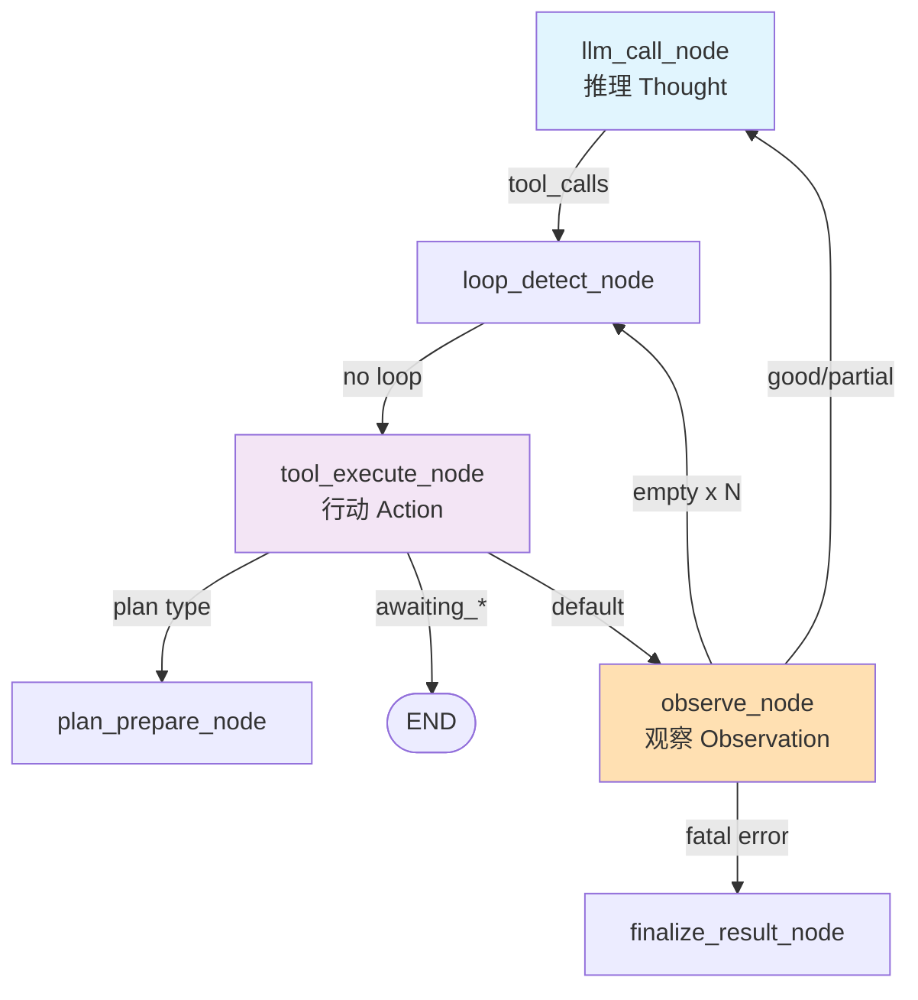
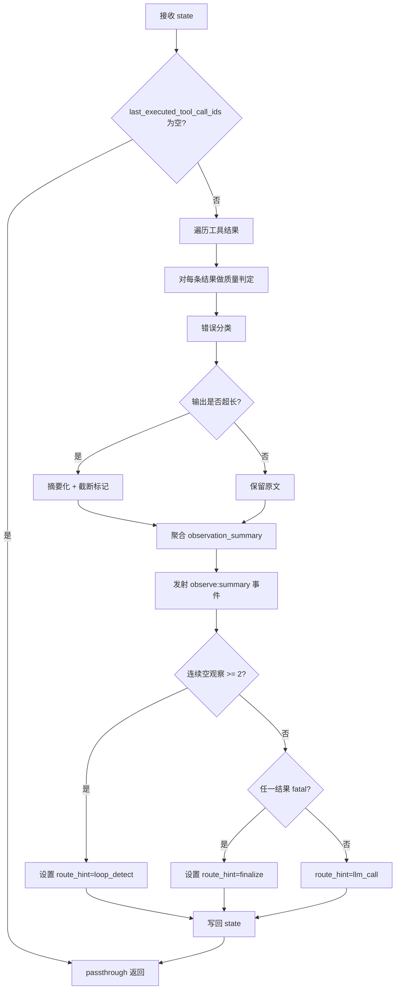
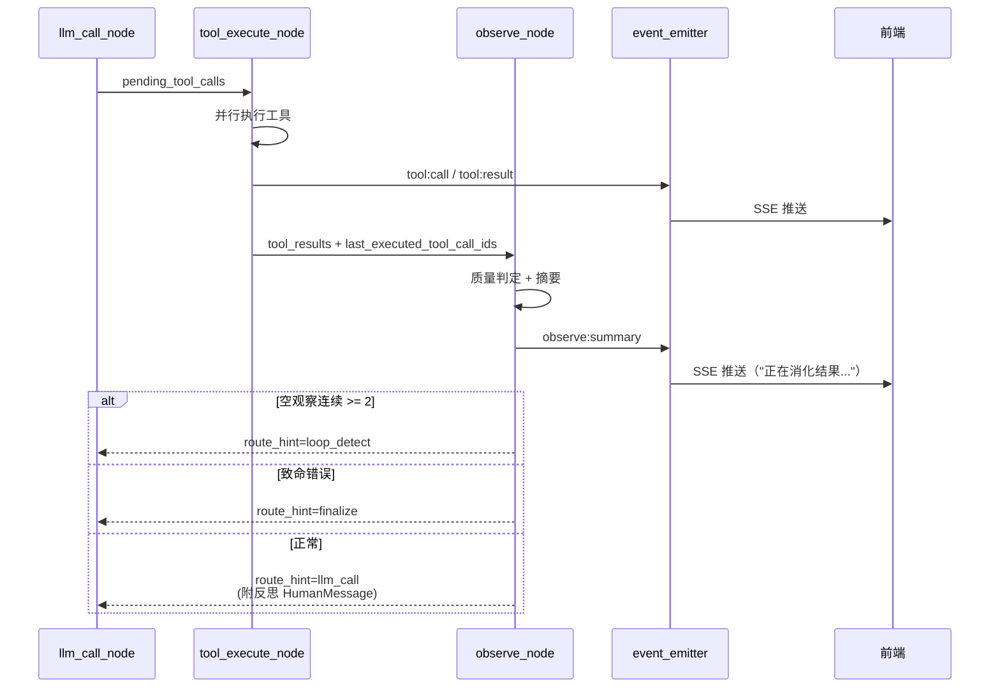
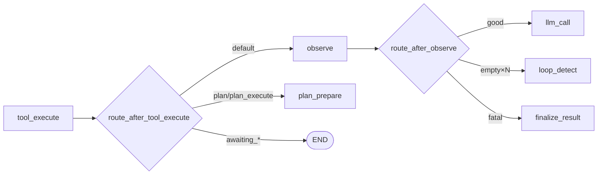

# Observe 节点技术方案

> 为 LangGraph Agent 工作流补齐 ReAct 框架中缺失的 **Observation（观察）** 环节，形成完整的 `Thought → Action → Observation` 闭环。

## 1. 范围

本模块在 `tool_execute_node` 与 `llm_call_node` 之间引入一个独立的 `observe_node`，负责对工具执行结果进行**系统级观察、质量评估、摘要提炼与反思注入**。

**包含的功能：**
- 工具结果质量判定（good / empty / partial / failed）
- 错误分类（timeout / permission / invalid_args / business_error / unknown）
- 超长输出摘要化（截断 + 关键信息保留）
- 观察事件发射（前端可感知"消化结果"过程）
- 反思消息注入（结构化观察总结，辅助下一轮 LLM 决策）
- 连续低质量观察统计（辅助 stuck/loop 判定）

**不包含：**
- 工具执行本身（仍归 `tool_execute_node`）
- 工具结果结构化转换（仍归 `tool_execute_node` 的 `tool_results`）
- 上下文长度压缩（仍归 `context_compact_node`）
- Plan 分支（`plan_prepare_node` / `plan_execute_node` 在 Plan 流程内已各自处理观察，本节点不介入）
- 语义级循环检测升级（后续迭代，本方案仅输出信号位，由 `loop_detect_node` 消费）

## 2. 概要设计

### 2.1 主流程

#### 2.1.1 工作流节点关系图



#### 2.1.2 Observe 节点内部流程



#### 2.1.3 时序图：工具调用-观察-推理闭环



### 2.2 模块说明

#### 2.2.1 质量判定模块

**职责**：判定每条工具结果的观察质量等级。

**判定规则**：

| 质量等级 | 判定条件 |
|---------|---------|
| `good` | `status=success` 且 `output` 非空、非纯空白、长度 > 阈值 |
| `empty` | `status=success` 但 `output` 为空/None/空白/仅含 `"[]"`、`"{}"` 等空结构 |
| `partial` | `status=success` 但 `metadata.truncated=true` 或输出明显不完整 |
| `failed` | `status=error` |
| `skipped` | `status=skipped`（如 Plan 委托跳过，不参与质量统计） |

**涉及文件**：
- `backend/src/infrastructure/agent/nodes/observe_node.py`

#### 2.2.2 错误分类模块

**职责**：将 `status=error` 的工具结果映射到有限的错误类别，便于下游反思与重试策略。

**错误分类**：

| 错误类别 | 识别特征 | 建议策略 |
|---------|---------|---------|
| `timeout` | `error` 字段含 `timed out` / `Timeout` / `deadline` | 可重试 |
| `permission` | 含 `permission denied` / `unauthorized` / `forbidden` | 不可重试，告知用户 |
| `invalid_args` | 含 `ValidationError` / `invalid argument` / `missing required` | 反思后换参数 |
| `not_found` | 含 `not found` / `does not exist` | 反思后换目标 |
| `network` | 含 `connection` / `network` / `DNS` / `unreachable` | 可重试 |
| `business_error` | 工具自身抛出的业务异常（`metadata.error_type` 明示） | 反思后换工具 |
| `unknown` | 其他 | 保守：反思后换策略 |

**涉及文件**：
- `backend/src/infrastructure/agent/nodes/observe_node.py`（分类器）

#### 2.2.3 摘要化模块

**职责**：对超长工具输出进行摘要，避免直接喂给 LLM 引发 token 膨胀。

**策略**：
- 阈值：`OBSERVE_OUTPUT_MAX_CHARS = 4000`（可配置）
- 超长时执行「首尾保留 + 中间省略」：前 1500 字符 + `\n... [truncated N chars] ...\n` + 后 1500 字符
- 摘要后在 `ToolMessage.content` 上追加标记 `[observation_truncated=true]`
- 仅影响**注入给 LLM 的观察文本**，原始 `tool_results[*].output` 保留完整输出供前端展示

**涉及文件**：
- `backend/src/infrastructure/agent/nodes/observe_node.py`

#### 2.2.4 反思注入模块

**职责**：基于观察结果生成结构化反思消息，作为 `HumanMessage` 追加到 `messages`。

**注入策略**：
- **good** + 单工具：不注入，保持原有 ToolMessage 直通（兼容当前行为）
- **good** + 多工具：注入一条轻量总结 `Observed: X tool(s) succeeded. Proceed to the next step.`
- **empty**：注入 `Observed: tool '{name}' returned empty result. Consider refining parameters or trying a different approach.`
- **partial**：注入 `Observed: tool '{name}' returned partial result (truncated). Key content preserved in ToolMessage.`
- **failed / {category}**：注入分类提示，例如 `timeout`：`Observed: tool '{name}' timed out. You may retry once or switch strategy.`

**涉及文件**：
- `backend/src/infrastructure/agent/nodes/observe_node.py`

#### 2.2.5 事件发射模块

**职责**：向 `IEventEmitter` 发射观察事件，前端可感知。

**事件协议**（新增三个事件）：

| 事件名 | payload | 用途 |
|--------|---------|------|
| `phase:changed` | `{ phase: "observing", previousPhase, turn }` | 阶段切换 |
| `observe:summary` | `{ turn, items: [{toolCallId, toolName, quality, errorCategory, truncated}], overallQuality }` | 前端展示"消化结果"面板 |
| `observe:decision` | `{ turn, routeHint: "llm_call"\|"loop_detect"\|"finalize", reason }` | 调试/可观测性 |

**涉及文件**：
- `backend/src/infrastructure/agent/nodes/observe_node.py`
- `backend/src/domain/services/event_emitter.py`（若需要新增便捷方法）
- `frontend/src/infrastructure/api/`（前端事件消费，后续 iteration）

## 3. 详细设计

### 3.1 节点接口设计

#### 3.1.1 Node 签名

遵循现有节点约定：`async def (state, config) -> dict`。

```python
# backend/src/infrastructure/agent/nodes/observe_node.py

async def observe_node(state: AgentState, config: RunnableConfig) -> dict:
    """Observation 节点 — ReAct 闭环中的观察环节
    
    1. 对 last_executed_tool_call_ids 的工具结果做质量判定
    2. 错误分类 + 输出摘要化
    3. 生成反思 HumanMessage 注入 messages
    4. 发射 observe:summary / observe:decision 事件
    5. 写回观察相关状态字段
    
    Returns:
        {
            "messages": [HumanMessage(...)],                 # 可选反思
            "observation_summary": str,
            "observation_quality": "good"|"empty"|"partial"|"failed"|"mixed",
            "observation_items": [...],
            "consecutive_empty_observations": int,
            "last_error_category": Optional[str],
            "phase": "observing",
            "route_hint": "llm_call"|"loop_detect"|"finalize",
        }
    """
```

#### 3.1.2 配置项（通过 RunnableConfig 注入）

| 配置键 | 默认 | 说明 |
|--------|------|------|
| `observe.output_max_chars` | 4000 | 超过则摘要化 |
| `observe.empty_threshold_chars` | 2 | 小于等于则视为 empty |
| `observe.max_consecutive_empty` | 2 | 达到则 route_hint=loop_detect |
| `observe.enable_reflection_inject` | True | 是否注入反思 HumanMessage |

通过 `config["configurable"].get("observe_options", {})` 读取。

### 3.2 状态字段扩展

在 `backend/src/domain/entities/agent_state.py` 新增字段：

```python
class AgentState(TypedDict):
    # ... 既有字段 ...

    # === Observation 状态（新增） ===
    observation_summary: Optional[str]
    """本轮观察文本总结（供调试/前端展示）"""

    observation_quality: Optional[str]
    """本轮观察总体质量：good / empty / partial / failed / mixed"""

    observation_items: List[Dict[str, Any]]
    """每个 tool_call 的观察详情 [{toolCallId, toolName, quality, errorCategory, truncated}]"""

    consecutive_empty_observations: int
    """连续空观察计数（用于触发语义循环检测）"""

    last_error_category: Optional[str]
    """最近一次错误分类"""

    route_hint: Optional[str]
    """observe_node 给出的路由建议（llm_call / loop_detect / finalize）"""
```

### 3.3 路由改造

#### 3.3.1 `route_after_tool_execute` 改动

在 `backend/src/application/use_cases/agent_workflow.py`：

```python
def route_after_tool_execute(state: AgentState) -> str:
    if state.get("awaiting_approval"):
        return END
    if state.get("awaiting_user_input"):
        return END
    # Plan 分支优先（保持现有行为）
    tool_results = state.get("tool_results", {})
    for tool_call_id in state.get("last_executed_tool_call_ids", []):
        result = tool_results.get(tool_call_id, {})
        metadata = result.get("metadata", {})
        if (
            result.get("status") == "success"
            and metadata.get("type") in ("plan", "plan_execute")
        ):
            return "plan_prepare"
    # 非 Plan 分支进入观察节点
    return "observe"
```

#### 3.3.2 新增 `route_after_observe`

```python
def route_after_observe(state: AgentState) -> str:
    """Observe 后路由：由 route_hint 主导"""
    if state.get("should_end"):
        return END
    hint = state.get("route_hint") or "llm_call"
    if hint == "finalize":
        return "finalize_result"
    if hint == "loop_detect":
        return "loop_detect"
    return "llm_call"
```

#### 3.3.3 StateGraph 注册（AgentWorkflowBuilder）

```python
workflow.add_node("observe", observe_node)
workflow.add_conditional_edges(
    "observe",
    route_after_observe,
    {"llm_call": "llm_call", "loop_detect": "loop_detect",
     "finalize_result": "finalize_result", END: END},
)
# route_after_tool_execute 的 mapping 同步增加 "observe": "observe"
```

#### 3.3.4 流程图更新（摘录）



### 3.4 与既有节点的协作关系

| 节点 | 协作方式 |
|------|---------|
| `tool_execute_node` | 不修改其职责；observe 只消费 `tool_results` + `last_executed_tool_call_ids` |
| `llm_call_node` | 不修改；observe 通过 `messages` 追加 `HumanMessage`，自然被下一轮 LLM 读取 |
| `loop_detect_node` | 未来可消费 `consecutive_empty_observations` 升级为"语义级循环"；当前仅在 route_hint 触发时被进入 |
| `stuck_detect_node` | 不直接耦合；`observation_quality` 字段可作为后续 monologue 之外的卡住信号源 |
| `context_compact_node` | 互补：observe 做"单条截断"，compact 做"多条删除"；observe 减少触发 compact 的概率 |
| `plan_prepare_node` | 不介入 Plan 分支，保持现有 `route_after_tool_execute` 的 plan 优先级 |

### 3.5 错误处理与错误分级

#### 3.5.1 observe_node 自身的容错

| 场景 | 处理 |
|------|------|
| `tool_results` 为空 | passthrough：返回 `{"route_hint": "llm_call"}` 不注入任何消息 |
| 单条解析异常 | 捕获后将该 item 标记 `quality=failed`, `errorCategory=unknown`，继续处理其他条目 |
| event_emitter 抛异常 | 仅记日志不打断流程（观察不是关键路径） |

#### 3.5.2 反思注入的边界

- 每轮最多注入 **1 条** `HumanMessage`，避免消息膨胀
- 连续 `empty` 反思文本不重复注入（由 `consecutive_empty_observations` 控制）
- 反思消息长度硬上限 **500 字符**

### 3.6 前端对接（简述）

前端 `AgentEventStream` 已具备事件订阅能力，仅需：
- 新增事件类型 `observe:summary` / `observe:decision` 的类型定义
- 在消息流 UI 插入"观察卡片"组件，展示 `quality`、`errorCategory`、是否截断
- 落地在后续 iteration，不阻塞后端方案实施

## 4. 测试计划

### 4.1 功能测试

#### 场景 1：单工具成功 + 有效输出
- **前置**：`pending_tool_calls=[web_search]`，工具成功返回非空结果
- **期望**：`observation_quality="good"`，不注入反思 `HumanMessage`，`route_hint="llm_call"`
- **验收**：下一轮 LLM 收到 ToolMessage 原文

#### 场景 2：单工具成功但结果为空
- **前置**：`web_search` 返回 `[]`
- **期望**：`observation_quality="empty"`，注入 `HumanMessage("Observed: ... returned empty...")`，`consecutive_empty_observations=1`，`route_hint="llm_call"`

#### 场景 3：连续 2 次空观察
- **前置**：连续两轮都是空结果
- **期望**：第二轮 `consecutive_empty_observations=2`，`route_hint="loop_detect"`，`loop_detect_node` 被触发

#### 场景 4：工具 timeout
- **前置**：工具 `error="Tool execution timed out after 30s"`
- **期望**：`errorCategory="timeout"`，注入分类反思，`route_hint="llm_call"`

#### 场景 5：工具输出超长
- **前置**：工具 `output` 长度 = 10000 字符
- **期望**：`ToolMessage` 内容被截断至 `~3500 字符 + 标记`，`observation_items[0].truncated=true`，原始 `tool_results[*].output` 未被修改

#### 场景 6：Plan 分支直通
- **前置**：工具结果 `metadata.type=plan`
- **期望**：不经过 observe_node，直接进入 `plan_prepare`

#### 场景 7：致命错误
- **前置**：`errorCategory="permission"` 连续 2 次
- **期望**：`route_hint="finalize"`，任务结束，`final_result` 带错误说明

### 4.2 单元测试

```python
# backend/tests/unit/infrastructure/agent/nodes/test_observe_node.py

@pytest.mark.asyncio
async def test_observe_empty_result_injects_reflection():
    state = _make_state(tool_results={
        "tc1": {"tool_name": "web_search", "status": "success",
                "output": "[]", "error": None, "metadata": {}}
    }, last_executed_tool_call_ids=["tc1"])
    result = await observe_node(state, _make_config())
    assert result["observation_quality"] == "empty"
    assert any(isinstance(m, HumanMessage) for m in result["messages"])
    assert result["consecutive_empty_observations"] == 1
    assert result["route_hint"] == "llm_call"

@pytest.mark.asyncio
async def test_observe_truncates_long_output():
    long = "x" * 10000
    state = _make_state(tool_results={
        "tc1": {"tool_name": "read_file", "status": "success",
                "output": long, "error": None, "metadata": {}}
    }, last_executed_tool_call_ids=["tc1"])
    result = await observe_node(state, _make_config())
    assert result["observation_items"][0]["truncated"] is True
    # 原始结果未被修改
    assert len(state["tool_results"]["tc1"]["output"]) == 10000

@pytest.mark.asyncio
async def test_observe_consecutive_empty_triggers_loop_detect():
    state = _make_state(
        tool_results={"tc1": _empty_result()},
        last_executed_tool_call_ids=["tc1"],
        consecutive_empty_observations=1,
    )
    result = await observe_node(state, _make_config())
    assert result["consecutive_empty_observations"] == 2
    assert result["route_hint"] == "loop_detect"

@pytest.mark.asyncio
async def test_observe_classifies_timeout_error():
    state = _make_state(tool_results={
        "tc1": {"tool_name": "web_search", "status": "error",
                "output": None, "error": "Request timed out after 30s", "metadata": {}}
    }, last_executed_tool_call_ids=["tc1"])
    result = await observe_node(state, _make_config())
    assert result["last_error_category"] == "timeout"

@pytest.mark.asyncio
async def test_observe_passthrough_when_no_results():
    state = _make_state(tool_results={}, last_executed_tool_call_ids=[])
    result = await observe_node(state, _make_config())
    assert result.get("route_hint") == "llm_call"
    assert "messages" not in result or result["messages"] == []
```

### 4.3 回归测试

**受影响的既有功能：**
- [x] 常规 `tool_execute → llm_call` 闭环：必须保持事件序列兼容（前端 `tool:result` 之后多一个 `observe:summary`，但不阻断 `llm:chunk`）
- [x] Plan 分支 `tool_execute → plan_prepare`：不经 observe
- [x] 审批分支 `awaiting_approval=true` → END：不经 observe
- [x] `loop_detect` 既有用例：新增 `consecutive_empty_observations` 字段不破坏原路径

**自动化验证：**
```bash
uv run pytest backend/tests/unit/infrastructure/agent/ -v
uv run pytest backend/tests/unit/application/ -k "agent_workflow" -v
```

## 5. 实施步骤

1. **领域层**
   - 扩展 `AgentState`：新增 7 个观察相关字段（见 3.2）
2. **基础设施层**
   - 新建 `backend/src/infrastructure/agent/nodes/observe_node.py`
   - 实现质量判定、错误分类、摘要化、反思注入、事件发射
3. **应用层**
   - 修改 `agent_workflow.py`：注册 `observe` 节点、新增 `route_after_observe`、改造 `route_after_tool_execute` 的 default 分支
   - 清理 `AgentWorkflowBuilder._compiled` 缓存（代码运行时自然失效）
4. **事件/协议**
   - 在事件类型表（`design/8_communication-protocol.md`）追加 `observe:summary` / `observe:decision`
5. **文档**
   - 更新 `docs/langgraph-workflow.md`：流程图加入 observe 节点 + 路由表 + 状态字段
6. **测试**
   - 编写单元测试（见 4.2）
   - 回归跑 `backend/tests/unit/` 全量
7. **前端（后续 iteration）**
   - 订阅新事件
   - UI 观察卡片

## 6. 验收标准

- [ ] `AgentState` 新增 7 个字段，不破坏现有节点
- [ ] `observe_node` 单测覆盖率 ≥ 85%
- [ ] 常规工具调用场景下，端到端响应延迟增加 < 50ms（观察节点为纯 CPU 操作）
- [ ] Plan / 审批 / awaiting_user_input 三条旁路分支**不经过** observe
- [ ] 超长输出（>4000 字符）被截断，原始 `tool_results` 完整保留
- [ ] 连续 2 次空观察触发 `loop_detect`
- [ ] 前端事件流新增 `observe:summary` 可接收
- [ ] `docs/langgraph-workflow.md` 与实现同步
