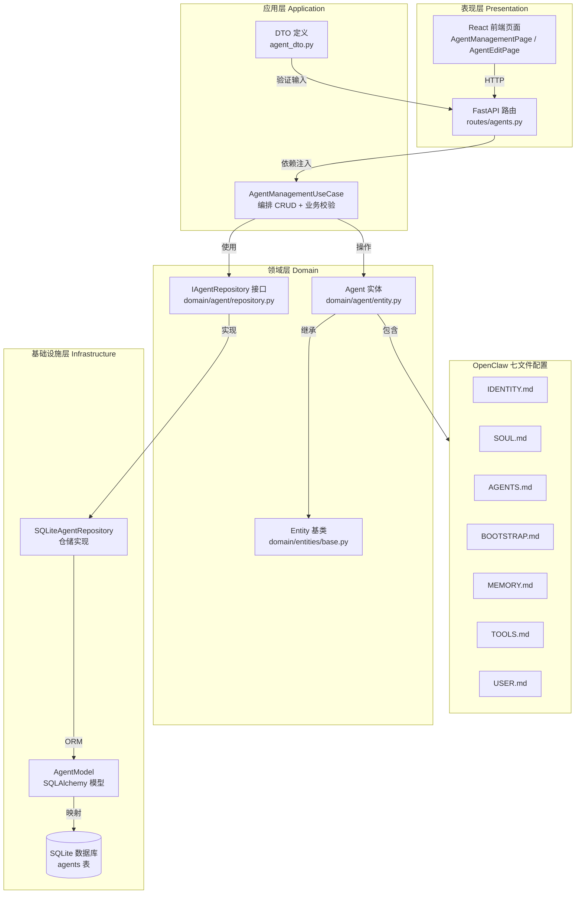

# 1.1 Agent 定义模块技术方案

> **一句话总结**: 基于 DDD 分层架构和 OpenClaw 七文件模式，实现 Agent 定义的 CRUD 管理，包括基本信息、性格标签（vibes）和七个 Markdown 配置文件的存储、版本控制与提示词组装。

## 1. 范围

本模块负责 Agent 定义文件的管理，聚焦于 Agent 的定义域（静态配置），不涉及运行域（动态执行）内容。

参考 OpenClaw 设计理念，Agent 定义由以下七个配置文件组成：

| 配置文件 | 职责 | 说明 |
|----------|------|------|
| `IDENTITY.md` | 代理身份定义与系统边界约束 | 名称、版本、能力描述、职责范围、权限边界 |
| `SOUL.md` | 响应语气、行为特征及输出格式配置 | 语言风格、性格特征、交互偏好、输出格式 |
| `AGENTS.md` | 代理调度规则与标准作业程序 | 任务处理流程、决策规则、SOP 定义 |
| `BOOTSTRAP.md` | 初始化序列与核心系统提示词 | 启动配置、系统级提示词模板、安全约束 |
| `MEMORY.md` | 长期上下文数据与既定规则的持久化存储 | 记忆使用规则、优先级策略、遗忘策略（初始为空） |
| `TOOLS.md` | 工具授权注册表及调用参数规范 | 可用工具列表、调用权限、参数约束 |
| `USER.md` | 用户画像数据与交互限制配置 | 目标用户特征、偏好设定、交互规则 |

**模块职责**：
- 七个配置文件的存储和管理
- Agent 基本信息的 CRUD 操作
- 前端 Agent 管理界面

**不包含**：
- Agent 版本管理（后续迭代）
- 输入输出契约（属于运行域，由任务执行模块定义）
- Agent 执行循环和状态管理（属于运行域）

## 2. 概要设计

### 2.1 主流程

```
用户操作 → 前端界面 → API 调用 → 后端路由 → DTO 验证 → UseCase 编排 → Repository → 数据库
                                                         ↓
                                                     领域实体处理
                                                         ↓
                                                     返回响应 → 前端展示
```

### 2.2 整体架构



### 2.3 模块设计

按照 DDD 分层架构设计：

```
表现层 (Presentation)
├── 后端：FastAPI 路由 (presentation/routes/agents.py)
└── 前端：React 页面 (presentation/pages/, presentation/components/)

应用层 (Application)
├── Agent 管理用例 (application/agent/management.py — AgentManagementUseCase)
├── DTO 定义 (application/dtos/agent_dto.py)
└── 业务异常 (AgentNotFoundError, DuplicateAgentNameError)

领域层 (Domain)
├── Entity 基类 (domain/entities/base.py — Entity)
├── Agent 实体 (domain/agent/entity.py — Agent)
├── Repository 接口 (domain/agent/repository.py — IAgentRepository)
└── 兼容 shim (domain/aggregates/agent/agent.py, domain/repositories/agent_repository.py)

基础设施层 (Infrastructure)
├── SQLAlchemy 模型 (infrastructure/database/models/agent_model.py)
└── Repository 实现 (infrastructure/repositories/sqlite_agent_repo.py)

配置文件结构（OpenClaw 模式）:
├── IDENTITY.md    — 身份与边界（替代原 agent.md + role.md 的身份部分）
├── SOUL.md        — 语气与行为（替代原 soul.md）
├── AGENTS.md      — 调度规则与 SOP（替代原 role.md 的流程部分）
├── BOOTSTRAP.md   — 初始化与系统提示词（替代原 system_prompt_template）
├── MEMORY.md      — 长期记忆与既定规则（初始为空，运行中积累）
├── TOOLS.md       — 工具授权与参数（新增）
└── USER.md        — 用户画像与偏好（新增）
```

### 2.4 模块说明

本模块包含以下功能模块：

#### 2.4.1 Agent 信息管理模块

**职责**：管理 Agent 的基本信息（名称、描述、vibe 标签）

**功能**：
- Agent 创建、更新、删除、查询
- 名称唯一性校验
- 头像风格和 ID 管理
- Vibe 标签管理（最多 3 个）

**涉及文件**：
- 后端：`backend/src/domain/entities/agent.py`（Agent 实体）
- 后端：`backend/src/application/dtos/agent_dto.py`（DTO 定义）
- 后端：`backend/src/infrastructure/database/models/agent_model.py`（数据库模型）
- 后端：`backend/src/presentation/routes/agents.py`（API 路由）

#### 2.4.2 配置文件管理模块

**职责**：管理 Agent 的七个配置文件（IDENTITY.md、SOUL.md、AGENTS.md、BOOTSTRAP.md、MEMORY.md、TOOLS.md、USER.md）

**功能**：
- 配置文件单独读取和更新
- 配置文件内容验证（长度限制 50000 字符）
- 配置文件组装为完整系统提示词（按 BOOTSTRAP → IDENTITY → AGENTS → SOUL → MEMORY → TOOLS → USER 顺序组装）
- 配置版本号管理（每次更新自动递增）

**涉及文件**：
- 后端：`backend/src/domain/entities/agent.py`（build_full_system_prompt 方法）
- 后端：`backend/src/domain/services/agent_config_service.py`（配置验证服务）
- 后端：`backend/src/application/dtos/agent_dto.py`（UpdateAgentConfigDTO）

#### 2.4.3 简化表单创建器模块

**职责**：提供简化的表单界面，自动生成配置文件内容

**功能**：
- 表单输入：名称、头像、描述、vibe
- 实时预览：头像、名称、vibe 标签、座右铭
- 自动生成：根据表单输入生成 IDENTITY.md、SOUL.md、AGENTS.md、BOOTSTRAP.md（MEMORY.md 初始为空，TOOLS.md 和 USER.md 在后续步骤配置或留空）
- Vibe 映射：将 vibe 标签映射为性格描述和语言风格

**涉及文件**：
- 前端：`frontend/src/presentation/components/CreateAgentWizard/`（向导组件）
- 前端：`frontend/src/presentation/components/CreateAgentWizard/AvatarSelector.tsx`（头像选择器）
- 前端：`frontend/src/presentation/components/CreateAgentWizard/VibeSelector.tsx`（Vibe 选择器）
- 前端：`frontend/src/presentation/components/CreateAgentWizard/LivePreview.tsx`（实时预览）
- 前端：`frontend/src/application/services/useAgentGenerator.ts`（自动生成 Hook）

#### 2.4.4 Agent 列表管理模块

**职责**：提供 Agent 列表展示和搜索功能

**功能**：
- 分页查询 Agent 列表
- 按名称搜索
- 按创建时间/更新时间排序
- 显示 Agent 基本信息（名称、头像、vibe 标签）

**涉及文件**：
- 前端：`frontend/src/presentation/pages/AgentManagementPage.tsx`（列表页面）
- 前端：`frontend/src/presentation/components/AgentList.tsx`（列表组件）
- 后端：`backend/src/presentation/routes/agents.py`（列表 API）

#### 2.4.5 Agent 详情编辑模块

**职责**：提供 Agent 详情查看和编辑功能

**功能**：
- 显示 Agent 完整信息
- Tab 切换编辑七个配置文件（IDENTITY.md、SOUL.md、AGENTS.md、BOOTSTRAP.md、MEMORY.md、TOOLS.md、USER.md）
- Markdown 预览
- 保存/取消操作
- 删除确认

**涉及文件**：
- 前端：`frontend/src/presentation/pages/AgentEditPage.tsx`（编辑页面）
- 前端：`frontend/src/presentation/components/ConfigEditor.tsx`（配置编辑器）
- 前端：`frontend/src/presentation/components/DeleteAgentDialog.tsx`（删除确认）

## 3. 详细设计

### 3.1 接口设计

#### 3.1.1 API 端点

| 方法 | 路径 | 说明 | 请求体 | 响应体 | 状态码 |
|------|------|------|--------|--------|--------|
| POST | /api/agents | 创建 Agent | CreateAgentDTO | AgentResponseDTO | 201/409 |
| GET | /api/agents | Agent 列表 | - | AgentListResponseDTO | 200 |
| GET | /api/agents/{id} | Agent 详情 | - | AgentResponseDTO | 200/404 |
| PUT | /api/agents/{id} | 更新 Agent | UpdateAgentDTO | AgentResponseDTO | 200/404/409 |
| DELETE | /api/agents/{id} | 删除 Agent | - | - | 204/404 |
| GET | /api/agents/{id}/config | 获取配置文件 | - | AgentConfigResponseDTO | 200/404 |
| PUT | /api/agents/{id}/config | 更新配置文件 | UpdateAgentConfigDTO | AgentConfigResponseDTO | 200/404 |

#### 3.1.2 DTO 定义

**CreateAgentDTO**：用于创建 Agent 的请求体。必填字段 `name`（1-100 字符），可选字段 `description`（最大 500 字符），七个配置文件字段（identity_md 至 user_md）均为可选，最大 50000 字符。基于 Pydantic BaseModel 进行输入验证。

**UpdateAgentDTO**：用于更新 Agent 基本信息和配置文件（PATCH 语义）。所有字段均可选：`name`（1-100 字符）、`description`（最大 500 字符），七个配置文件字段（identity_md 至 user_md，最大 50000 字符）。

**UpdateAgentConfigDTO**：专门用于仅更新配置文件（不包含 name/description）。七个配置文件字段（identity_md 至 user_md）均为可选，最大 50000 字符。

**AgentResponseDTO**：Agent 的完整响应结构。包含所有字段：`id`、`name`、`description`，七个配置文件字段（identity_md 至 user_md），`config_version`（配置版本号），`created_at` 和 `updated_at`（时间戳字符串）。

**AgentConfigResponseDTO**：仅返回配置文件内容的响应结构。包含七个配置文件字段（identity_md 至 user_md）和 `config_version`。

### 3.2 数据库设计

#### 3.2.1 agents 表完整设计

采用单表设计，所有 Agent 相关字段存储在一张表中。

**字段说明：**

| 字段 | 类型 | 默认值 | 说明 |
|------|------|--------|------|
| `id` | VARCHAR(36) | UUID | 主键，使用 UUID |
| `name` | VARCHAR(100) | - | Agent 名称，唯一索引 |
| `description` | TEXT | '' | Agent 功能描述（简化表单输入） |
| `avatar_style` | VARCHAR(50) | 'pixel_art' | 头像风格：pixel_art/adventurer/robot/lorelei |
| `avatar_id` | VARCHAR(100) | '' | 具体头像 ID |
| `vibes` | TEXT | '[]' | JSON 数组，存储选中的 vibe 标签 |
| `identity_md` | TEXT | '' | IDENTITY.md 内容：身份定义与系统边界约束 |
| `soul_md` | TEXT | '' | SOUL.md 内容：响应语气、行为特征及输出格式 |
| `agents_md` | TEXT | '' | AGENTS.md 内容：调度规则与标准作业程序 |
| `bootstrap_md` | TEXT | '' | BOOTSTRAP.md 内容：初始化序列与核心系统提示词 |
| `memory_md` | TEXT | '' | MEMORY.md 内容：长期上下文数据与既定规则（初始为空） |
| `tools_md` | TEXT | '' | TOOLS.md 内容：工具授权注册表及调用参数 |
| `user_md` | TEXT | '' | USER.md 内容：用户画像数据与交互限制 |
| `config_version` | INTEGER | 1 | 配置版本号，每次更新配置文件时递增 |
| `created_at` | DATETIME | now() | 创建时间 |
| `updated_at` | DATETIME | now() | 更新时间 |

#### 3.2.2 索引设计

- `name` 列：唯一索引（表定义中已包含），用于 Agent 名称唯一性约束和按名称查找。
- `idx_agents_created_at`：在 `created_at` 列上按降序建索引，用于列表按创建时间排序。
- `idx_agents_updated_at`：在 `updated_at` 列上按降序建索引，用于列表按更新时间排序和缓存失效判断。

#### 3.2.3 SQLAlchemy 模型

`AgentModel` 是 SQLAlchemy ORM 模型类，映射到 `agents` 表。列定义与 3.2.1 节的表结构一一对应：`id`（String(36)，主键）、`name`（String(100)，唯一索引）、`description`（Text）、表单字段 `avatar_style`/`avatar_id`/`vibes`、七个配置文件字段 `identity_md` 至 `user_md`（均为 Text，默认空字符串）、`config_version`（Integer，默认 1）、`created_at` 和 `updated_at`（DateTime，使用服务器端默认时间戳函数，updated_at 在更新时自动刷新）。

#### 3.2.4 领域实体

`Agent` 是一个数据类（dataclass），代表 Agent 定义域的核心实体，包含以下字段分组：

**基本信息**：`id`（字符串 UUID）、`name`（Agent 名称）、`description`（功能描述）

**简化表单字段**：`avatar_style`（头像风格，默认 "pixel_art"）、`avatar_id`（具体头像 ID）、`vibes`（列表类型，存储选中的 vibe 标签）

**OpenClaw 七文件内容**：`identity_md`、`soul_md`、`agents_md`、`bootstrap_md`、`memory_md`、`tools_md`、`user_md`，均为字符串类型，默认空字符串。配置文件名称常量 `CONFIG_FILES` 列出这七个字段名。

**版本与时间戳**：`config_version`（整数，默认 1）、`created_at`（datetime）、`updated_at`（可选 datetime）

**关键方法**：

- `set_vibes(vibes)`：设置 vibe 标签，若超过 3 个则抛出 ValueError。
- `get_vibes()`：返回 vibe 列表，处理字符串与列表两种内部表示。
- `update_config(**config_fields)`：接收键值对形式的配置文件字段更新，只允许更新 CONFIG_FILES 中定义的字段且值非 None，更新后自动将 `config_version` 加 1 并刷新 `updated_at`。
- `build_full_system_prompt()`：按 BOOTSTRAP -> IDENTITY -> AGENTS -> SOUL -> MEMORY -> TOOLS -> USER 顺序组装完整系统提示词。每个有内容的配置段以 `# 标题\n内容` 格式输出，段之间以双换行分隔。空的配置段（如初始 MEMORY.md）不出现在输出中。若所有配置均为空，返回空字符串。

#### 3.2.5 Repository 接口

`IAgentRepository` 是一个抽象接口，定义 Agent 持久化的标准协议，所有方法均为异步。接口包含以下方法签名：

- `create(agent) -> Agent`：创建新 Agent 记录。
- `get_by_id(agent_id) -> Optional[Agent]`：按 ID 查找，不存在时返回 None。
- `get_by_name(name) -> Optional[Agent]`：按名称查找（用于唯一性校验）。
- `list(page, page_size) -> tuple[List[Agent], int]`：分页查询，返回 (Agent 列表, 总记录数) 元组。
- `update(agent) -> Agent`：全量更新 Agent 记录。
- `delete(agent_id) -> bool`：按 ID 删除，返回是否删除成功。
- `update_config(agent_id, config_fields) -> Optional[Agent]`：部分更新配置文件字段，由仓储层负责自动递增版本号。

### 3.3 前端设计

#### 3.3.1 页面结构

**AgentManagementPage**（/agents）
- Agent 列表表格
- 创建按钮
- 搜索和过滤
- 操作按钮（编辑、删除）

**AgentEditPage**（/agents/new, /agents/:id/edit）
- 基本信息表单（名称、描述）
- Tab 切换的配置文件编辑器（OpenClaw 七文件）
  - IDENTITY.md Tab — 身份定义与系统边界约束
  - SOUL.md Tab — 响应语气、行为特征及输出格式
  - AGENTS.md Tab — 调度规则与标准作业程序
  - BOOTSTRAP.md Tab — 初始化序列与核心系统提示词
  - MEMORY.md Tab — 长期上下文数据与既定规则（初始为空）
  - TOOLS.md Tab — 工具授权注册表及调用参数
  - USER.md Tab — 用户画像数据与交互限制
- 保存/取消按钮

#### 3.3.2 组件清单

| 组件 | 职责 |
|------|------|
| AgentList | Agent 列表表格展示 |
| AgentForm | 基本信息表单 |
| ConfigEditor | Markdown 配置编辑器（支持预览，七 Tab 切换） |
| DeleteAgentDialog | 删除确认对话框 |

#### 3.3.3 API 客户端

前端 API 客户端 `agentApi` 封装了对后端所有 Agent 相关端点的 HTTP 调用。提供以下方法：

- **基础 CRUD**：`list`（分页查询）、`get`（按 ID 获取）、`create`、`update`、`delete`
- **配置文件管理**：`getConfig`（获取七文件配置）、`updateConfig`（部分更新配置文件）

所有方法通过 HTTP 客户端库（如 axios）与 `/api/agents` 路由交互，请求和响应体对应后端 DTO 结构。

#### 3.3.4 路由配置

前端使用 React Router 进行页面路由。路由映射为：`/` 指向首页，`/agents` 指向 Agent 列表管理页（AgentManagementPage），`/agents/new` 指向新建 Agent 向导页（AgentEditPage），`/agents/:id/edit` 指向指定 Agent 的编辑页（AgentEditPage），其中 `:id` 为动态路由参数。

### 3.4 错误处理

| 场景 | HTTP 状态码 | 错误码 | 说明 |
|------|-------------|--------|------|
| Agent 名称重复 | 409 | DUPLICATE_AGENT_NAME | 创建或更新时名称已存在 |
| Agent 不存在 | 404 | AGENT_NOT_FOUND | 操作的 Agent 不存在 |
| 配置内容超长 | 400 | CONFIG_CONTENT_TOO_LONG | 单个配置文件超过 50000 字符 |
| 请求参数错误 | 422 | VALIDATION_ERROR | Pydantic 验证失败 |

### 3.5 简化表单创建器 UI 设计

#### 3.5.0 界面布局示意图

```
┌─────────────────────────────────────────────────────────────────────────┐
│                        Create Agent Wizard                              │
├─────────────────────────────────────────────────────────────────────────┤
│  ◄ Back                                            Next: Tools ►        │
├─────────────────────────────┬───────────────────────────────────────────┤
│                             │                                           │
│  Identity & Model           │           Live Preview                    │
│  ┌───────────────────────┐  │  ┌─────────────────────────────────────┐ │
│  │ Name                  │  │  │  [Avatar]                           │ │
│  │ [小助手____________]  │  │  │                                     │ │
│  └───────────────────────┘  │  │  小助手                             │ │
│                             │  │  ┌──────────┐                       │ │
│  Agent Avatar               │  │  │Professional│ Friendly │          │ │
│  ┌────┬────┬────┬────┐     │  │  └──────────┘                       │ │
│  │ ◉ │  │  │  │     │     │  │                                     │ │
│  │Pixel│Adv│Rob │Lor │     │  │  "专业成就卓越"                      │ │
│  └────┴────┴────┴────┘     │  │                                     │ │
│  ┌───────────────────────┐  │  │  你是一个专业严谨、友好亲切的       │ │
│  │ [Avatar Grid]         │  │  │  智能助手，帮助你管理日程和提醒。   │ │
│  │  ◉  ◯  ◯  ◯  ◯  ◯   │  │  │                                     │ │
│  │  ◯  ◯  ◯  ◯  ◯  ◯   │  │  │                                     │ │
│  └───────────────────────┘  │  │                                     │ │
│                             │  │                                     │ │
│  Description                │  └─────────────────────────────────────┘ │
│  ┌───────────────────────┐  │                                           │
│  │ 帮助你管理日程和      │  │                                           │
│  │ 提醒的智能助手        │  │                                           │
│  │                       │  │                                           │
│  └───────────────────────┘  │                                           │
│                             │                                           │
│  Vibe (1-3)                 │                                           │
│  ┌─────────┬───────────┐   │                                           │
│  │◉ Profes │◉ Friendly │   │                                           │
│  ├─────────┼───────────┤   │                                           │
│  │◯ Creative│◯ Concise  │   │                                           │
│  ├─────────┼───────────┤   │                                           │
│  │◯ Casual  │◯ Expert   │   │                                           │
│  └─────────┴───────────┘   │                                           │
│                             │                                           │
├─────────────────────────────┴───────────────────────────────────────────┤
│  ◄ Back                                              Next: Tools ►      │
└─────────────────────────────────────────────────────────────────────────┘
```

**布局说明：**
- **左侧（60%宽度）**: 表单输入区域
  - Name: 文本输入框
  - Agent Avatar: 风格选择（横向标签）+ 头像网格（2行×6列）
  - Description: 多行文本区域
  - Vibe: 多选标签网格（2列×3行），最多选3个

- **右侧（40%宽度）**: 实时预览面板
  - 头像展示
  - Agent 名称
  - Vibe 标签徽章
  - 性格描述引用语
  - 座右铭展示

- **底部导航**: Back / Next 按钮

#### 3.5.1 设计目标

用户只需填写最少信息（名称、头像、描述、vibe），系统自动生成七个配置文件内容（核心四个自动生成，MEMORY.md 初始为空，TOOLS.md 和 USER.md 在后续步骤配置或使用默认模板），降低创建门槛。

#### 3.5.2 表单字段设计

**Identity & Model 步骤表单**

| 字段 | 类型 | 必填 | 说明 | 示例值 |
|------|------|------|------|--------|
| `name` | 文本输入 | 是 | Agent 名称 | "小助手" |
| `avatar_style` | 单选 | 是 | 头像风格 | Pixel Art |
| `avatar_id` | 单选 | 是 | 具体头像 | adventurer_01 |
| `description` | 多行文本 | 是 | Agent 功能描述 | "帮助你管理日程和提醒的智能助手" |
| `vibes` | 多选标签 | 是 | 性格特征（1-3个） | Professional, Friendly |

**头像风格选项**

- **Pixel Art**: 像素风格头像
- **Adventurer**: 冒险家风格
- **Robot**: 机器人风格
- **Lorelei**: 角色风格

每种风格下提供 6-8 个预设头像供选择。

**Vibe 选项**

- **Professional**: 专业严谨
- **Friendly**: 友好亲切
- **Creative**: 创意丰富
- **Concise**: 简洁直接
- **Casual**: 轻松随意
- **Expert**: 专家权威

用户可选择 1-3 个 vibe，系统根据选择自动生成 SOUL.md。

#### 3.5.3 自动生成规则

**IDENTITY.md 生成模板**（替代原 agent.md + role.md 身份部分）

```markdown
# {{name}}

## 身份
你是 {{name}}，{{description}}。

## 能力
{{根据描述自动推断能力列表}}

## 边界
- 不提供超出能力范围的服务
- 不存储或泄露用户隐私信息
- 遵守安全规范和法律法规

## 版本
- v1.0.0
```

**SOUL.md 生成模板**（替代原 soul.md）

```markdown
# 人格定义

## 性格特征
{{根据 vibes 选择生成性格描述}}
- {{vibe1}}: {{对应描述}}
- {{vibe2}}: {{对应描述}}

## 语言风格
{{根据 vibes 自动调整语言风格}}

## 交互原则
{{根据性格特征生成交互准则}}

## 座右铭
"{{根据vibe自动生成一句座右铭}}"
```

**AGENTS.md 生成模板**（替代原 role.md 流程部分）

```markdown
# 调度规则与标准作业程序

## 任务处理流程
1. 接收用户请求
2. 分析任务类型和优先级
3. 按能力范围执行任务
4. 返回结构化结果

## 决策规则
- 遇到不确定的需求时，主动澄清
- 涉及高风险操作时，请求用户确认
- 超出能力范围时，明确告知并建议替代方案

## SOP 定义
{{根据描述自动生成标准作业程序}}
```

**BOOTSTRAP.md 生成模板**（替代原 system_prompt_template）

```markdown
# 初始化配置

## 系统约束
- 遵守安全边界，不执行危险操作
- 保护用户隐私，不泄露敏感信息
- 输出内容需准确、有帮助

## 格式要求
- 使用 Markdown 格式输出
- 代码块使用语法高亮
- 分步骤说明复杂操作
```

**MEMORY.md**（初始为空）

创建时默认为空字符串，在 Agent 运行过程中由 memory 系统逐步填充记忆使用规则、优先级策略、遗忘策略等内容。用户也可在编辑页面手动配置。

**TOOLS.md 默认模板**（向导第二步配置或留空）

```markdown
# 工具授权

## 可用工具
{{在 Tools 配置步骤中设定，或留空待后续编辑}}

## 调用约束
- 遵守工具调用频率限制
- 高风险工具需用户确认后执行
```

**USER.md 默认模板**（留空或基础模板）

```markdown
# 用户画像

## 目标用户
{{根据描述推断目标用户群体}}

## 交互偏好
- 语言：中文
- 详细程度：适中
```

#### 3.5.4 Vibe 映射表

| Vibe | 性格描述 | 语言风格 | 示例座右铭 |
|------|----------|----------|------------|
| Professional | 严谨、专业、可靠 | 正式、准确、逻辑清晰 | "专业成就卓越" |
| Friendly | 温暖、亲切、耐心 | 友好、鼓励、平易近人 | "用微笑服务每一位" |
| Creative | 创新、灵活、富有想象 | 生动、有趣、启发式 | "创意无限，想象无界" |
| Concise | 直接、高效、精简 | 简洁、要点明确 | "少即是多" |
| Casual | 轻松、随和、幽默 | 口语化、幽默 | "工作也可以很有趣" |
| Expert | 权威、深入、全面 | 专业术语、详细解释 | "知识就是力量" |

#### 3.5.5 实时预览组件

右侧展示预览面板，包含：
- **头像展示**: 用户选择的头像
- **名称显示**: 实时同步名称输入
- **身份徽章**: 显示 vibe 标签
- **Vibe 描述**: 根据选择的 vibe 显示性格描述
- **引用语**: 展示自动生成的座右铭

预览随表单输入实时更新。

#### 3.5.6 组件架构

```
CreateAgentWizard/
├── WizardContainer.tsx          # 向导容器，管理步骤状态
├── StepIndicator.tsx            # 步骤指示器
├── steps/
│   ├── IdentityModelStep.tsx    # Identity & Model 步骤（本次重点）
│   ├── ToolsStep.tsx            # Tools 配置步骤（后续）
│   └── ReviewStep.tsx           # 预览确认步骤
├── AvatarSelector.tsx           # 头像选择组件
│   ├── StyleSelector.tsx        # 风格选择
│   └── AvatarGrid.tsx           # 头像网格
├── VibeSelector.tsx             # Vibe 多选标签
├── LivePreview.tsx              # 实时预览面板
│   ├── PreviewCard.tsx          # 预览卡片
│   └── QuoteDisplay.tsx         # 座右铭展示
└── hooks/
    ├── useAgentGenerator.ts     # 自动生成 markdown Hook
    └── usePreviewState.ts       # 预览状态管理
```

#### 3.5.7 自动生成服务

**前端 Hook: useAgentGenerator**

`useAgentGenerator` 是一个 React Hook，接收 `GenerationInput` 对象（包含 name、description、avatarStyle、avatarId、vibes 字段）并返回 `generate` 函数。`generate` 依次调用各文件的生成函数，将结果组装为 `GeneratedContent` 对象（包含 identity_md、soul_md、agents_md、bootstrap_md、memory_md、tools_md、user_md 七个字段），其中 memory_md 初始为空字符串。

##### 生成规则

各生成函数接收 `GenerationInput`（名称、描述、头像风格/ID、vibe 列表）并返回对应配置文件的 Markdown 字符串。核心逻辑包括：

- 一个 VIBE_MAP 映射表，将每个 vibe 标签（Professional/Friendly/Creative/Concise/Casual/Expert）关联到性格描述、语言风格和座右铭。
- `generateIdentityMd` 将名称和描述拼入身份模板，附带默认边界声明和版本号。
- `generateSoulMd` 根据所选 vibe 从映射表中取性格特征和语言风格，多个 vibe 以顿号连接，座右铭取自第一个 vibe。
- `generateAgentsMd`、`generateBootstrapMd` 输出固定的 SOP 和系统约束模板。
- `generateToolsMd` 输出占位模板，提示用户在后续步骤配置工具授权。
- `generateUserMd` 输出基础用户画像模板，目标用户默认引用 Agent 名称。
- `generateAll` 聚合上述各函数，返回包含七个文件内容的 `GeneratedContent` 对象，其中 MEMORY.md 初始为空字符串。

#### 3.5.10 数据库迁移

从旧的三文件结构迁移到 OpenClaw 七文件结构时，需新增 `identity_md`、`agents_md`、`bootstrap_md`、`memory_md`、`tools_md`、`user_md` 六个 TEXT 列（默认空字符串）。旧字段映射关系为：`agent_md` -> `identity_md`，`role_md` -> `agents_md`，`system_prompt_template` -> `bootstrap_md`。由于 SQLite 不支持 DROP COLUMN，迁移后需通过重建表移除旧字段；新项目直接使用完整七文件表结构即可。

#### 3.5.11 功能测试计划

**测试场景 1: 简化表单创建 - 正常流程**
- **前置条件**: 无
- **测试步骤**:
  1. 打开创建 Agent 向导
  2. 填写名称、选择头像、输入描述、选择 2 个 vibe
  3. 观察右侧预览面板实时更新
  4. 点击"下一步"
  5. 系统自动生成七个配置文件（MEMORY.md 为空）
- **预期结果**: 
  - 预览面板正确显示头像、名称、vibe 标签、座右铭
  - 生成的 markdown 内容符合模板规则
  - MEMORY.md 为空字符串
  - vibe 标签正确显示性格描述
- **验收标准**: 生成的七个文件内容正确，可提交保存

**测试场景 2: Vibe 选择验证 - 边界条件**
- **前置条件**: 无
- **测试步骤**:
  1. 尝试选择 4 个 vibe
- **预期结果**: 提示"最多选择 3 个"，第 4 个选择被阻止
- **验收标准**: 前端阻止超限选择，显示错误提示

**测试场景 3: 必填字段验证 - 异常流程**
- **前置条件**: 无
- **测试步骤**:
  1. 不填写名称，直接点击下一步
- **预期结果**: 提示"名称为必填项"，阻止进入下一步
- **验收标准**: 表单验证阻止空名称提交

**测试场景 4: 配置文件独立编辑 - 正常流程**
- **前置条件**: 已创建一个 Agent
- **测试步骤**:
  1. 进入 Agent 编辑页面
  2. 切换到 MEMORY.md Tab
  3. 编辑记忆配置内容
  4. 保存
- **预期结果**: 仅 MEMORY.md 内容更新，其他六个文件不变，config_version 递增
- **验收标准**: 单文件更新不影响其他配置文件

#### 3.5.12 单元测试计划

单元测试应覆盖以下核心逻辑，使用标准的 Arrange-Act-Assert 模式：

- **SOUL.md 生成**：验证单 vibe 和多 vibe 组合时性格描述、语言风格、座右铭的正确生成。
- **IDENTITY.md 生成**：验证名称、描述、版本号的正确拼入。
- **MEMORY.md 初始状态**：验证新建 Agent 时 MEMORY.md 为空字符串。
- **系统提示词组装顺序**：验证 `build_full_system_prompt` 按 BOOTSTRAP -> IDENTITY -> AGENTS -> SOUL -> MEMORY -> TOOLS -> USER 顺序组装，且空配置段不出现。
- **配置版本递增**：验证 `update_config` 更新指定文件后 `config_version` 自动加 1，未更新的文件保持不变。

### 3.6 安全措施

1. **输入验证**：所有配置字段使用 Pydantic 进行长度和格式验证
2. **XSS 防护**：前端使用 React 默认转义，Markdown 渲染使用安全的库
3. **SQL 注入**：使用 SQLAlchemy ORM，避免原生 SQL
