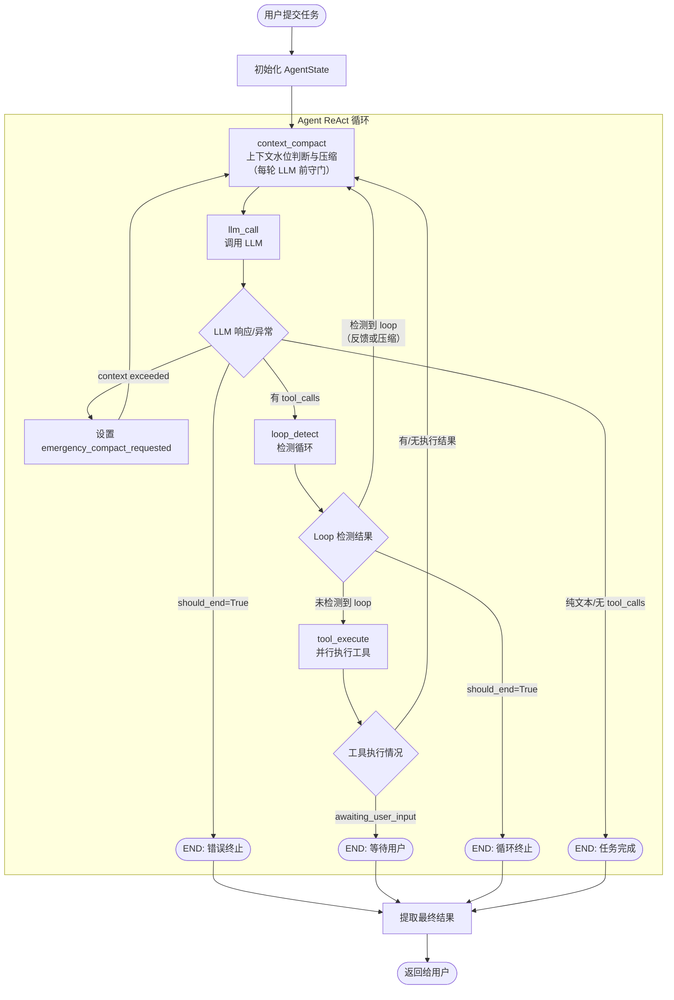
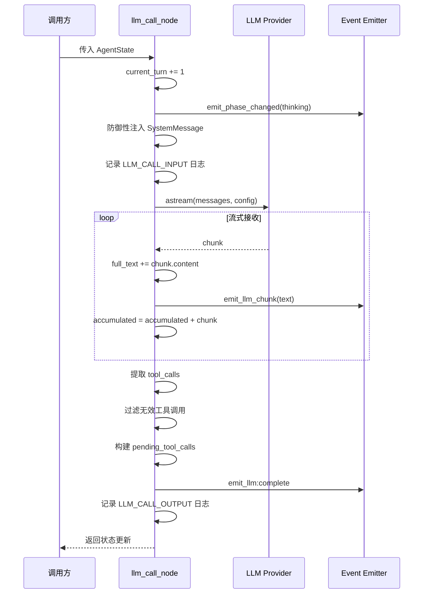
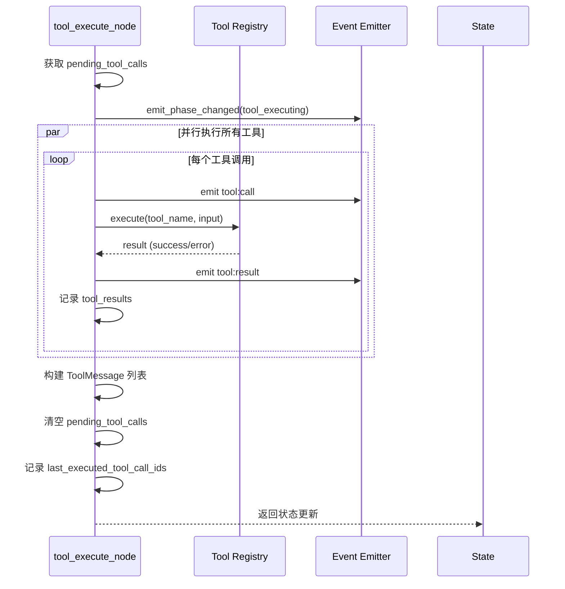
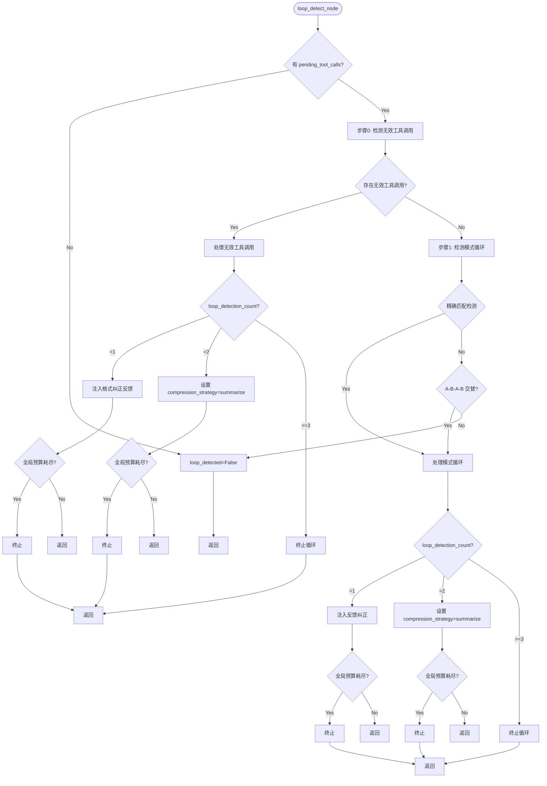

# 1.3 Agent-Loop 详细设计

> **一句话总结**: 基于 LangGraph 的 4 节点 ReAct 执行引擎，以 context_compact 为入口守门，通过 loop_detect 前置拦截和 4 级 token 水位压缩实现可靠的自主推理循环。
>
> 最后更新: 2026-06-07 (文档校审与代码同步)

## 1. 概述

### 1.1 设计目标

本文档定义基于 LangGraph 的 Agent ReAct 循环的终局实现方案，目标是构建一个生产级的、高稳定性的 Agent 执行引擎，具备以下核心能力：

1. **可靠的自驱循环**：Agent 能自主推理、调用工具、观察结果，直到任务完成
2. **多层错误恢复**：HTTP 级重试、语义级自我纠正、边界级兜底策略
3. **智能观察与检测**：Loop 检测与自动恢复，防止死循环
4. **高效上下文管理**：每轮 ReAct 前置上下文守门，支持 soft-prune、micro-compact、emergency-compact 多层压缩
5. **完整的可观测性**：Node 级执行追踪、事件发射、结构化日志

### 1.2 设计原则

| 原则 | 说明 |
| ------ | ------ |
| 纵深防御 | Loop/超时/错误多层保护，任何一层失效都有下一层兜底 |
| 语义恢复优先 | 遇到问题时优先通过 Prompt 引导模型自我纠正，而非直接终止 |
| 可观测性内建 | 每个节点必须发射事件+记录日志，支持外部监控和调试 |
| 路由极简 | 路由函数只做二元/三元判断，复杂评估在节点内完成 |

### 1.3 核心设计哲学

本文档的设计基于以下 5 条核心哲学：

| 哲学 | 说明 | 实现策略 |
|------|------|----------|
| **不要信任 LLM 的自控能力，但要给它一次机会** | LLM 可能不知道自己陷入了循环 | 统一给予 2 次纠正机会，每次明确告知剩余次数 |
| **检测要快（前置拦截），处理要渐进（先软后硬）** | 不要等工具执行完才发现循环 | LLM 调用后立即检测 + 三级响应（反馈→压缩→终止） |
| **覆盖所有循环模式** | 包括 AAAA、ABAB、无效工具调用 | 精确匹配 + A-B-A-B 交替 + 无效工具调用检测 |
| **区分"重复"和"无进展的重复"** | 相同工具调用不一定有问题 | 精确匹配 + Jaccard 语义相似度（>0.92） |
| **可观测性优先** | 让外部系统能看到检测状态，而不是静默终止 | 检测事件 + 结构化日志 + 阶段变更追踪 |

### 1.4 与现有实现的关系

**当前已实现**：
- ✅ 4 个 LangGraph 核心节点（context_compact、llm_call、loop_detect、tool_execute），入口为 context_compact
- ✅ 完整 AgentState TypedDict（~40 个字段，含上下文管理、Sub-Agent 支持等，纯领域层无框架依赖）
- ✅ 精简路由逻辑（3 个路由函数，纯判定不修改 state）
- ✅ SSE 事件发射框架（IEventEmitter 抽象）
- ✅ 结构化日志（Node 级/LLM 调用/工具调用三级日志）
- ✅ 4 级 token 水位上下文压缩（skip / soft_prune / micro_compact / emergency_compact）
- ✅ LLM usage 基准校准（prompt_tokens → baseline → 增量估算）
- ✅ LLM 错误处理器工厂（职责链模式，ContextLimit / Timeout / Default 处理器）
- ✅ 模型上下文窗口注册表（resolve_max_context_tokens）

**当前局限**：
- Loop 检测仅基于工具调用模式（无法检测工具结果质量、空结果等问题）
- Loop 检测在工具执行前进行（优势：提前拦截；限制：无法检查结果）
- ~~上下文压缩需要演进为 token 水位触发的多层策略~~ 已于 2026-05-31 完成重构
- Runner 层 HTTP 重试依赖和错误处理已通过 LLMErrorHandlerRegistry 职责链增强
- 无实时成本追踪

---

## 2. Agent Loop 整体架构

### 2.1 完整流程图



### 2.2 节点流转说明

| 流转路径 | 触发条件 | 说明 |
|---------|---------|------|
| **context_compact → llm_call** | 每轮 ReAct 开始（固定边） | token 水位判断完成或压缩完成 |
| **llm_call → context_compact** | LLM 返回上下文超限错误 | 设置 emergency_compact_requested 后进入紧急压缩 |
| **llm_call → loop_detect** | LLM 返回 tool_calls | 需要检测是否循环 |
| **llm_call → END** | should_end=True 或无 tool_calls（纯文本完成） | 异常终止或任务完成 |
| **loop_detect → tool_execute** | 未检测到 loop | 正常工具调用路径 |
| **loop_detect → context_compact** | 检测到 loop（首次反馈或二次压缩） | 统一路由到上下文守门 |
| **loop_detect → END** | should_end=True（三次检测或预算耗尽） | 终止循环 |
| **tool_execute → context_compact** | 工具执行完毕（无论有无结果） | 每轮 LLM 前先做上下文管理 |
| **tool_execute → END** | awaiting_user_input=True | 等待用户确认 |

> **拓扑变化（2026-05-31）**：`context_compact` 现在是整个工作流的入口节点，每轮 LLM 调用前都必须经过上下文守门。主循环为 `context_compact → llm_call → loop_detect → tool_execute → context_compact`。

### 2.3 三层防护架构

| 层级 | 职责范围 | 处理的问题类型 | 恢复策略 |
|------|---------|--------------|---------|
| **LLM Error Handler 层** | 模型级错误分类处理 | 上下文超限、网络超时、API 限流、未知错误 | 职责链模式，ContextLimitErrorHandler / TimeoutErrorHandler / DefaultErrorHandler |
| **Agent 主循环层** | 语义级恢复 | Loop 检测、循环纠正 | Prompt 引导自我纠正 + 上下文压缩 |
| **Attempt 层** | 超时/边界控制 | 整体超时、用户 Cancel、maxTurns 耗尽 | 优雅退出 + 最佳结果提取 |

**核心机制**：
- **全局纠正预算**：loop_detection_count >= 3 时强制终止
- **max_turns 硬限制**：默认 100 轮，每轮 llm_call 后 current_turn += 1
- **超时保护**：LLM 流式调用默认 300 秒超时
- **LLMErrorHandlerRegistry**：llm_call_node 中的异常委托给职责链处理，解耦错误处理与节点逻辑

---

## 3. AgentState 设计

### 3.1 状态字段定义

AgentState 是一个纯领域层的 TypedDict 数据结构（无框架依赖），用于在 LangGraph 节点间传递共享状态。约 40 个字段按职责分为以下类别：

**消息历史**：`messages` 字段使用 LangGraph 的 `add_messages` reducer 自动合并节点间消息变更。

**任务上下文**（只读）：`task_id`、`workspace`、`user_message`、`task_start_message_count`、`model` 记录任务基本信息和当前使用的 LLM 模型名称（用于解析上下文窗口大小）。

**控制流**：`current_turn`、`max_turns`、`phase`、`should_end`、`is_complete` 控制循环执行的生命周期。`phase` 记录当前阶段（idle/thinking/tool_executing/loop_correcting/context_compacting/complete），`should_end` 为 True 时路由到 END 终止节点。

**工具调用**：`pending_tool_calls` 存储待执行的工具调用列表，`tool_results` 按 tool_call_id 索引执行结果，`awaiting_user_input` 标记需要用户确认的场景，`last_executed_tool_call_ids` 追踪上一轮执行的工具 ID。

**Loop 检测器状态**：`loop_detection_count` 累计检测到循环的次数（达到 3 次触发终止），`loop_detected` 标记当前轮是否检测到循环，`loop_type` 记录循环类型（exact_tool_repeat / alternating_pattern / invalid_tool_call）。

**流式输出与深度思考**：`current_llm_text` 累积 LLM 流式输出的文本，`thinking_text` 存储 LLM 推理内容（如 DeepSeek reasoning_content），`empty_retry_count` 追踪空响应次数。

**上下文管理**：`max_context_tokens` 为当前模型上下文窗口上限（由 `resolve_max_context_tokens()` 解析），`context_token_estimate` 为当前消息列表的 Token 估算值，`context_token_baseline` 和 `context_token_baseline_message_count` 用于基于 LLM usage 返回值的增量估算校准，`emergency_compact_requested` 和 `context_compaction_attempts` 用于紧急压缩流程控制，`last_context_strategy` 记录最近一次实际执行的压缩策略（skip/soft_prune/micro_compact/emergency_compact）。

**结果与错误**：`final_result` 存储最终输出内容，`error` 存储错误信息。

**Sub-Agent 支持**：`is_sub_agent` 和 `parent_task_id` 用于子 Agent 场景的父子关系追踪。

### 3.2 字段分组说明

| 分组 | 字段 | 写入节点 | 说明 |
|------|------|---------|------|
| **消息历史** | messages | 所有节点 | LangGraph 自动合并（add_messages reducer） |
| **任务上下文** | task_id, workspace, user_message | 应用层初始化 | 任务基本信息，只读 |
| **控制流** | current_turn, phase, should_end, is_complete | llm_call, loop_detect | 控制循环执行 |
| **工具调用** | pending_tool_calls, tool_results | llm_call, tool_execute | 工具调用生命周期 |
| **Loop 检测** | loop_detection_count, loop_detected | loop_detect | Loop 检测状态 |
| **上下文管理** | compression_strategy, max_context_tokens, context_token_estimate, context_token_baseline, context_token_baseline_message_count, context_compaction_attempts, emergency_compact_requested, last_context_strategy | context_compact, llm_call | token 水位判断、usage 基准校准、紧急压缩 |

### 3.3 状态流转示例

**正常成功流程**：

| 阶段 | 节点 | 关键状态变化 |
|------|------|------------|
| 初始化 | — | current_turn=0, phase="idle", messages=[user_msg], max_context_tokens=已解析 |
| 上下文守门 | context_compact | context_token_estimate=估算值, last_context_strategy="skip" |
| 思考 | llm_call | phase="thinking", current_turn+=1, current_llm_text=累积文本, context_token_baseline=prompt_tokens |
| 路由 | route_after_llm | pending_tool_calls=解析出的工具调用 |
| 循环检测 | loop_detect | loop_detected=False |
| 执行 | tool_execute | phase="tool_executing", tool_results=执行结果, messages+=tool_msgs |
| 上下文守门 | context_compact | token 水位检查后路由回 llm_call |
| 重复 | — | 回到 llm_call 继续 |
| 完成 | llm_call | is_complete=True, should_end=True (无 tool_calls), phase="complete" |
| 终止 | END | should_end=True |

**Loop 检测触发流程**：

| 阶段 | 节点 | 关键状态变化 |
|------|------|------------|
| 第1次 Loop | loop_detect | loop_detected=True, loop_type="exact_tool_repeat", loop_detection_count=1, messages+=SystemMessage 纠正反馈 |
| 纠正 | route_after_loop_detect | 路由到 context_compact（注入反馈后重试） |
| 上下文守门 | context_compact | token 水位检查（通常 skip），phase="context_compacting" |
| 重试 | llm_call | 正常执行 |
| 第2次 Loop | loop_detect | loop_detected=True, loop_detection_count=2, compression_strategy="summarize" |
| 压缩 | route_after_loop_detect | 路由到 context_compact |
| 压缩 | context_compact | messages=RemoveMessage+摘要, phase="context_compacting", last_context_strategy="micro_compact" |
| 重试 | llm_call | 正常执行 |
| 第3次 Loop | loop_detect | loop_detected=True, loop_detection_count=3 |
| 终止 | route_after_loop_detect | error="Loop detected, terminating after 3 attempts", should_end=True |

---

## 4. 节点详细设计

### 4.1 llm_call 节点

**职责**：调用 LLM，流式输出文本，收集 tool_calls，发射事件。

#### 4.1.1 流程图



#### 4.1.2 AgentState 操作转换

**输入字段**（读取）：
- `messages` — 消息历史
- `system_prompt` — 系统提示词
- `task_id` — 任务 ID
- `phase` — 当前阶段

**输出字段**（写入）：

正常返回时，节点写入以下状态更新：

- 将累积的流式文本和 tool_calls 列表组装为 AIMessage 追加到 messages
- `pending_tool_calls` 记录待执行的工具调用列表（可能包含不完整的工具调用，如缺少 name 或 id，这些将在 loop_detect 节点中校验）
- 清空 `last_executed_tool_call_ids` 以准备新一轮
- `current_llm_text` 和 `thinking_text` 记录本轮输出文本和推理内容
- `phase` 根据是否有 tool_calls 设为 "complete" 或 "thinking"
- `current_turn` 递增 1；若无 tool_calls，则 `should_end` 和 `is_complete` 设为 True
- Token 基准校准：从 LLM usage 提取 prompt_tokens 写入 `context_token_baseline` 和 `context_token_estimate`，同时记录对应的消息数量

**异常处理**（写入）：

异常委托给 LLMErrorHandlerRegistry（职责链模式），三类处理器的状态输出：
- ContextLimitErrorHandler：设置 `emergency_compact_requested=True` 和错误信息，不设 should_end，给紧急压缩一次恢复机会
- TimeoutErrorHandler：设置 `should_end=True` 并附带超时错误信息和已累积的文本作为 AIMessage
- DefaultErrorHandler：重新抛出异常，由 BaseNode._handle_error 兜底处理

#### 4.1.3 核心逻辑说明

**1. 防御性 SystemMessage 注入**：

在构建发送给 LLM 的消息列表前，检查消息头是否已有 SystemMessage。若存在 system_prompt 且消息列表为空或首条不是 SystemMessage，则在消息列表起始位置插入。同时检查内容是否相同以避免重复注入。

**2. 流式调用聚合**：

使用 `AIMessageChunk` 类型的累加器接收流式响应：初始为 None，收到第一个 chunk 时赋值，后续 chunk 通过 LangChain 的 `+` 操作符合并（该运算符自动处理 tool_call_chunks 的增量合并，避免手动拼接导致工具调用信息丢失）。

**3. 工具调用完整性保留**：

llm_call 节点不再静默过滤不完整的工具调用（缺少 name 或 id）。这些调用保留在 pending_tool_calls 中，交由 loop_detect 节点在工具执行前检测"无效工具调用循环"。如果连续出现无效工具调用，loop_detect 会注入纠正反馈，避免将无效数据传递给 tool_execute 节点。

**4. 超时保护**：

在 LLM 流式调用外层包裹 `asyncio.timeout`（默认 300 秒），防止网络异常导致任务永久挂起。超时后由 TimeoutErrorHandler 接管处理，设置 should_end=True。

#### 4.1.4 LLM 错误处理器工厂

`llm_call_node` 不直接处理异常，而是委托给 `LLMErrorHandlerRegistry`（职责链模式），将错误处理逻辑与节点逻辑解耦。

**架构**：

错误处理器采用职责链模式组织，从 `ILLMErrorHandler` 抽象接口派生：

- ContextLimitErrorHandler：识别上下文超限异常，设置 emergency_compact_requested，不终止循环
- TimeoutErrorHandler：识别超时异常，设置 should_end 终止
- DefaultErrorHandler：兜底处理器，重新抛出未匹配的异常

**接口定义**：

ILLMErrorHandler 抽象接口定义两个方法：`can_handle(error)` 判断是否能处理该异常，`handle(error, state, context)` 执行处理并返回状态更新字典。LLMErrorHandlerRegistry 作为职责链容器，按注册顺序遍历处理器列表，委托给第一个 `can_handle` 返回 True 的处理器。支持构造时传入处理器列表或通过 `register()` 方法动态注册。

**ContextLimitErrorHandler**（`infrastructure/agent/error_handlers/context_limit.py`）：
- 通过 `is_context_limit_error()` 识别上下文超限异常
- 识别标记：`context_length_exceeded` / `maximum context length` / `context window` / `input too long` 等
- 返回：`emergency_compact_requested=True`，不设置 `should_end`（给紧急压缩一次机会）

**TimeoutErrorHandler**（`infrastructure/agent/error_handlers/timeout.py`）：
- 识别 `asyncio.TimeoutError` 及 `TimeoutError`
- 返回：`should_end=True`

**DefaultErrorHandler**（`infrastructure/agent/error_handlers/default_handler.py`）：
- `can_handle()` 始终返回 `True`（兜底）
- re-raise 异常，由 `BaseNode._handle_error()` 统一处理

---

### 4.2 tool_execute 节点

**职责**：并行执行工具调用，处理错误，发射事件。

#### 4.2.1 流程图



#### 4.2.2 AgentState 操作转换

**输入字段**（读取）：
- `pending_tool_calls` — 待执行工具列表
- `tool_results` — 已有工具结果（合并）
- `task_id` — 任务 ID
- `workspace` — 工作目录

**输出字段**（写入）：

节点执行完毕后写入以下状态更新：

- 每个工具调用构造一条 ToolMessage 追加到 messages，content 优先使用工具输出，失败时使用错误信息，确保不为 None
- `tool_results` 按 tool_call_id 索引，每个结果记录 tool_name、status（success/error）、output、error 和 metadata
- 清空 `pending_tool_calls`，写入 `last_executed_tool_call_ids` 记录本轮执行的所有工具 ID
- 如有工具的 metadata 标记 awaiting_user_input，则设置该标志为 True 并提取 final_result
- `phase` 设为 "tool_executing"

#### 4.2.3 核心逻辑说明

**1. 并行执行**：

使用 `asyncio.gather` 并发执行所有待执行工具，设置 `return_exceptions=True` 确保单个工具失败不影响其他工具的执行。

**2. 结构化结果存储**：

每个工具执行结果统一存储为包含 tool_name、status（success/error）、output、error、metadata 的字典结构，以 tool_call_id 为键索引。metadata 中可携带 awaiting_user_input 等特殊标志。

**3. ToolMessage 构建**：

优先使用 result.output 作为 ToolMessage 内容，不存在时降级为 result.error，最终兜底为 "No result"。对非字符串类型执行防御性 str() 转换，确保 LLM provider 不会因 None content 报错。

**4. awaiting_user_input 处理**：

检查每个工具结果的 metadata.awaiting_user_input 标志。若任一工具需要用户确认，设置全局 awaiting_user_input=True，将工具输出写入 final_result，路由系统随后将状态路由到 END 等待用户响应。

---

### 4.3 loop_detect 节点

**职责**：检测 Agent 是否陷入重复行为模式（整合了 tool_observe 功能）。

**触发时机**：仅在 `llm_call` 之后、`tool_execute` 之前执行，在工具调用前拦截已知的循环模式。

#### 4.3.1 流程图



#### 4.3.2 AgentState 操作转换

**输入字段**（读取）：
- `pending_tool_calls` — 即将执行的工具调用列表
- `loop_detection_count` — 当前 Loop 检测次数
- `empty_retry_count` — 全局预算计算
- `messages` — 消息历史（模式循环检测）
- `task_start_message_count` — 消息起始位置

**输出字段**（写入）：

**场景 1：未检测到循环** — 设置 `loop_detected=False`，`loop_type=None`，`loop_detection_count=0`。

**场景 2：检测到模式循环**（精确匹配或 A-B-A-B 交替），按检测次数分三级响应：

- 首次（count=1）：设置 `loop_detected=True`，`loop_detection_count=1`，`loop_type` 为 "exact_tool_repeat" 或 "alternating_pattern"，`phase="loop_correcting"`，通过 SystemMessage 注入纠正反馈指导模型更换策略。

- 二次（count=2）：基本同上，`loop_detection_count=2`，同时设置 `compression_strategy="summarize"` 触发上下文压缩（清除可能混淆模型的冗余上下文），不注入 SystemMessage（避免额外消耗 token）。

- 三次（count>=3）或全局纠正预算耗尽：设置 `error` 描述循环信息，`should_end=True` 强制终止。

**场景 2.5：检测到无效工具调用**（INVALID_TOOL_CALL），同样三级响应：

- 首次：注入格式纠正反馈 SystemMessage，告知模型工具调用需包含完整的 name、id 和 input 参数。
- 二次：设置 `compression_strategy="summarize"` 触发压缩（可能上下文中有混淆的格式示例）。
- 三次或预算耗尽：设置 `error="Invalid tool calls loop, terminating after 3 attempts"`，`should_end=True`。

**场景 3：全局纠正预算耗尽**：当各类纠正计数总和达到上限 3 时，设置 `loop_detected=True`、`phase="loop_correcting"`、`error="Global correction budget exhausted"`、`should_end=True`，无论具体检测到何种循环类型均强制终止。

#### 4.3.3 核心逻辑说明

**设计原则**：在工具执行前，基于历史消息检测 LLM 是否要重复之前的工具调用模式。

**优势**：
- 提前拦截已知的循环模式，避免无效的工具执行
- 节省时间、Token 成本和 API 调用
- 在工具调用前就给 LLM 纠正机会

**限制**：
- 无法检测工具结果质量问题（如空结果、错误、partial 等）
- 无法检测空结果循环（需要工具执行后才能知道）
- 依赖历史消息的准确性（如果上下文被压缩可能影响检测）

**检测范围**：基于历史消息中的工具调用签名，不依赖工具执行结果。

**新增：无效工具调用检测**（INVALID_TOOL_CALL）：

**检测逻辑**：

遍历 pending_tool_calls 列表，筛选出缺少 name 或 id 字段的项。若存在这样的无效调用，则设置 `loop_detected=True`、`loop_type="invalid_tool_call"`，并构造格式纠正反馈的 SystemMessage 注入消息列表。

**为什么需要检测无效工具调用**：
- LLM 可能返回格式错误的工具调用（缺少 name、id 或 input）
- 如果不在工具执行前拦截，会导致 tool_execute 节点崩溃或产生无意义错误
- 连续出现无效工具调用说明 LLM 不理解工具调用格式，需要明确纠正
- 避免将无效数据传递给下游节点

**纠正策略**：
- 首次检测：注入格式纠正反馈，给 LLM 一次机会
- 二次检测：压缩上下文（可能上下文中有混淆的格式示例）
- 三次检测：终止循环

#### 精确匹配检测（EXACT_TOOL_REPEAT）

提取最近几轮（通常 3 轮）的工具调用签名（由工具名和参数哈希组成），若所有签名完全相同（取集合后大小为 1），则判定为精确重复循环，设置 `loop_type="exact_tool_repeat"`。

#### A-B-A-B 交替检测（ALTERNATING_PATTERN）

当历史工具调用序列长度至少为 4 时，比较最近 4 次调用的签名。如果呈现 sig4==sig2 且 sig3==sig1 且 sig4!=sig3 的模式，则判定为周期为 2 的交替循环（A-B-A-B 模式），设置 `loop_type="alternating_pattern"`。

#### 为什么需要 A-B-A-B 检测
- 精确匹配只能检测 AAAA 模式，无法检测 ABAB 模式
- ABAB 是最常见的隐性循环（反复在两个工具间切换）
- 典型场景：`read_file` → `grep_search` → `read_file` → `grep_search`（反复读取和搜索）


**2. 全局纠正预算**：

全局纠正预算上限设为 3，计算方式为 `empty_retry_count + loop_detection_count` 的总和。当该总和达到上限时，无论当前具体检测到何种问题，均强制设置 `should_end=True` 并附带 "Global correction budget exhausted" 错误信息，防止各类纠正机制相互叠加导致无限循环。

---

### 4.4 context_compact 节点

**职责**：作为整个 Agent 工作流的**入口节点**，在每一轮 LLM 调用前执行上下文守门。根据当前 token 水位执行 4 级压缩策略，保证模型请求尽量落在目标上下文窗口内。

> 设计调整（2026-05-31）：`context_compact` 现在是 LangGraph StateGraph 的 `entry_point`，不再是 loop 检测后的兜底节点。主循环为：
> `context_compact → llm_call → loop_detect → tool_execute → context_compact`。
> 所有 feedback 路径（loop 纠正、工具结果反馈）统一路由回 `context_compact`，确保每次 LLM 调用前都完成 token 水位判断。

#### 4.5.1 4 级 Token 水位策略

优先级从高到低：

| 级别 | 策略名 | 触发条件 | 处理方式 |
|------|--------|---------|---------|
| **P1** | `emergency_compact` | `emergency_compact_requested=True` 或 `compression_strategy="emergency_compact"` | 保留 SystemMessage + 最近 3 条，摘要旧消息（最多 90 条） |
| **P2** | `micro_compact` | `token > 60% * max_context_tokens` | 保留 SystemMessage + 最近 10 条，摘要旧消息（最多 90 条） |
| **P3** | `soft_prune` | `token > 40% * max_context_tokens` | 裁剪长度 > 20000 字符的 ToolMessage，目标降到 25% |
| **P4** | `skip` | 低于 40% 水线 | 不处理，直接放行 |

流程图：

```mermaid
flowchart TD
    Start([context_compact_node<br/>工作流入口点]) --> ResolveMax[解析 max_context_tokens<br/>via resolve_max_context_tokens]
    ResolveMax --> Estimate[estimate_context_tokens<br/>baseline-aware 增量估算]
    Estimate --> Emergency{emergency_compact_requested<br/>或 compression_strategy=emergency_compact?}
    
    Emergency -->|Yes| EmergencyCompact[emergency_compact<br/>保留最近 3 条 + SystemMessage<br/>摘要旧消息最多 90 条]
    Emergency -->|No| Over60{token > 0.6 * max_context?}
    
    Over60 -->|Yes| MicroCompact[micro_compact<br/>保留最近 10 条 + SystemMessage<br/>摘要旧消息最多 90 条]
    Over60 -->|No| Over40{token > 0.4 * max_context?}
    
    Over40 -->|Yes| SoftPrune[soft_prune<br/>从旧到新裁剪超长 ToolMessage<br/>head(4000) + notice + tail(4000)<br/>目标: token <= 25% max_context]
    Over40 -->|No| Skip[skip<br/>无需处理]
    
    MicroCompact --> SummarizeOld[调用 LLM 生成摘要<br/>_COMPACTION_SUMMARY_PROMPT]
    EmergencyCompact --> SummarizeOld
    
    SummarizeOld --> LLMAvail{LLM 可用?}
    LLMAvail -->|Yes| InjectSummary[RemoveMessage 旧消息<br/>注入 HumanMessage[Context Summary]]
    LLMAvail -->|No| FallbackTrim[降级: 仅 RemoveMessage<br/>不做摘要]
    
    InjectSummary --> InvalidateBaseline[baseline 失效<br/>context_token_baseline=None]
    FallbackTrim --> InvalidateBaseline
    
    SoftPrune --> IfPruned{有裁剪发生?}
    IfPruned -->|Yes| InvalidateBaseline
    IfPruned -->|No| SetStrategy
    
    InvalidateBaseline --> SetStrategy[写入 last_context_strategy]
    Skip --> SetStrategy
    
    SetStrategy --> Emit[emit context:compacting]
    Emit --> End([固定边 → llm_call])
```

**关键设计**：
- 每个策略分支都写入 `last_context_strategy` 字段（`skip` / `soft_prune` / `micro_compact` / `emergency_compact`），便于可观测性
- 一旦消息内容被修改（裁剪或摘要），`context_token_baseline` 设为 `None`，强制后续走全量 char/4 估算
- 摘要失败时降级为纯 `RemoveMessage`（trim），不阻断主流程
- `emergency_compact` 完成后清零 `emergency_compact_requested` 和 `compression_strategy`，防止循环触发

#### 4.5.2 AgentState 操作转换

**输入字段**（读取）：
- `messages` — 消息历史
- `max_context_tokens` — 当前模型上下文窗口上限（由 resolve_max_context_tokens 解析）
- `compression_strategy` — 外部指定压缩策略（loop_detect 可设置）
- `emergency_compact_requested` — LLM 请求超上下文后的紧急压缩标记
- `context_token_estimate` — 当前估算的上下文 token 数
- `context_token_baseline` — 最近一次 LLM usage 返回的 prompt_tokens
- `context_token_baseline_message_count` — baseline 对应的消息数量
- `context_compaction_attempts` — 连续紧急压缩次数

**输出字段**（写入）：

**Skip 策略**：无内容变更，仅设置 `phase="context_compacting"`，保持 `context_token_estimate` 不变，写入 `last_context_strategy="skip"`。

**Soft-prune 策略**：messages 中用同 id 的裁剪后 ToolMessage 替换原消息（LangGraph 的 add_messages reducer 自动处理替换）。设置 `context_token_estimate` 为裁剪后估算值，由于消息内容被修改 `context_token_baseline` 置为 None 使其失效，写入 `last_context_strategy="soft_prune"`。

**Micro-compact / Emergency-compact 策略**：messages 中插入多条 RemoveMessage 移除旧消息，注入一条 HumanMessage（内容为 "[Context Summary]\n{summary_text}"，id 为被压缩的首条消息 id）保持时间线位置，同时保留 SystemMessage 和最近 N 条消息（micro 保留 10 条，emergency 保留 3 条）。由于消息被移除，`context_token_baseline` 置为 None，`context_token_baseline_message_count` 置为 0。`last_context_strategy` 记录为 "micro_compact" 或 "emergency_compact"。Emergency-compact 额外写入：清零 `emergency_compact_requested` 和 `compression_strategy`，递增 `context_compaction_attempts`。

**紧急压缩后仍失败**（由 caller 处理）：设置 `phase="failed"`，`should_end=True`，附带 "Context window exceeded after emergency compaction" 错误信息。

#### 4.5.3 核心逻辑说明

**1. 模型上下文窗口解析**：

上下文窗口通过 `resolve_max_context_tokens(model_name)` 函数解析，不写死在节点逻辑里。该函数位于 `domain/services/token_utils.py`，使用子串匹配按注册表顺序匹配。

| 模型族 / 模型名匹配 | 默认窗口 |
|---------------------|----------|
| `gemini-3-pro` | 2,000,000 |
| `gpt-5.5`, `gpt-5.4` | 1,000,000 |
| `claude-opus-4.7`, `claude-opus-4.6` | 1,000,000 |
| `qwen3` | 1,000,000 |
| `deepseek-v4` | 1,000,000 |
| 未匹配模型 | 128,000 |

> 这些值是本系统的策略默认值，不作为外部供应商规格真值。实际接入时以 `LLMConfig.extra[“max_context_tokens”]` 覆盖为准。解析结果写入 `AgentState.max_context_tokens`。

**2. 当前 token 估算与校准**：

使用 `estimate_context_tokens(messages, baseline, baseline_message_count)` 函数（位于 `domain/services/token_utils.py`），支持两种估算模式：

- **有 baseline**（最近一次 LLM 调用返回了 `prompt_tokens` 且无 RemoveMessage）：`baseline + sum(count_tokens(render_message(m)) for m in new_messages)`
- **无 baseline** 或 baseline 失效（发生 RemoveMessage/裁剪）：全量 `sum(count_tokens(render_message(m)) for m in messages)`

`count_tokens()` 使用混合加权：中文字符 1.5 tokens/char，其他 0.25 tokens/char。

LLM 调用完成后（`llm_call_node`），通过 `_extract_prompt_tokens()` 从 `AIMessageChunk.usage_metadata` 或 `response_metadata.token_usage` 提取真实 `prompt_tokens`，写回 `context_token_baseline` 和 `context_token_baseline_message_count`。

**关键：baseline 失效规则**：
- context_compact 执行 `soft_prune`（修改了消息内容）：`context_token_baseline = None`
- context_compact 执行 `micro_compact`/`emergency_compact`（RemoveMessage + 注入摘要）：`context_token_baseline = None`，`context_token_baseline_message_count = 0`
- 失效后下一次估算自动回退到全量 char/4 模式

**3. Soft-prune：40% 水位轻量裁剪**：

触发条件：当 `context_token_estimate` 超过 `max_context_tokens * 0.4` 时触发。

处理对象：
- 仅处理 `ToolMessage`（含 dict 形式的 tool 消息）。
- 单条 tool result 内容长度 `> 20000` 字符才裁剪。
- 从头到尾顺序处理，优先裁剪最先遇到的超长结果。

裁剪规则：取每条超长 ToolMessage 内容的头 4000 字符和尾 4000 字符，中间用 `[... tool result soft-pruned; middle omitted ...]` 占位符连接，使用相同 msg_id 构造新的 ToolMessage（LangGraph 的 add_messages reducer 自动替换同 id 消息）。

目标：
- 裁剪后实时用 `estimate_context_tokens` 重新估算。
- 当 `new_estimate <= int(max_context_tokens * 0.25)` 时停止。
- 如果遍历完所有消息仍不达标，也停止（避免误删语义内容）。
- soft-prune 不调用 LLM，不处理普通用户/助手消息。

**4. Micro-compact：60% 水位摘要压缩**：

触发条件：当 `context_token_estimate` 超过 `max_context_tokens * 0.6` 时触发。

压缩范围：
- 永远保留首条 `SystemMessage`（如果存在）。
- 完整保留最近 10 条消息。
- 对中间的消息选取最多 90 条进入 summary 压缩。
- 如果中间消息超过 90 条，更老的只做 `RemoveMessage`（不加入摘要输入，避免摘要输入失控）。

处理结果：
- 对被压缩消息执行 `RemoveMessage(id=msg_id)`。
- 注入一条 `HumanMessage(content=”[Context Summary]\n...”, id=first_compacted_id)`，保持时间线位置。
- 摘要失败时降级为纯 `RemoveMessage`（trim），不阻断主流程。

**5. Emergency-compact：超上下文后的紧急压缩**：

触发来源：
- `llm_call_node` 中的 `LLMErrorHandlerRegistry` → `ContextLimitErrorHandler` 识别上下文超限错误。
- `ContextLimitErrorHandler` 设置 `emergency_compact_requested=True` 并路由到 `context_compact`。

处理范围：
- 完整保留首条 `SystemMessage`。
- 完整保留最近 3 条消息。
- 压缩最近 90 条旧消息为 summary。
- `context_compaction_attempts += 1`。

失败规则：
- 第一次超限：`ContextLimitErrorHandler` 设置 `emergency_compact_requested=True`，路由到 `context_compact`。
- 紧急压缩后再次调用 LLM 仍超限：返回失败，`should_end=True`。
- 摘要 LLM 本身超限或失败：降级为保守 trim；如果主调用仍失败，最终失败。

**6. Summary 压缩输入构建**：

摘要输入受预算控制（`summary_budget = min(32000, int(max_tokens * 0.05 * 4))`），防止摘要本身的 token 消耗过大。从最近 90 条待压缩消息中按由近到远的顺序构建摘要输入（摘要有时间局部性），当累计字符数超过 budget 时截断（尾部添加 “...(truncated)” 标记）。`render_message()` 渲染包含 role、tool name、call_id 等元信息，帮助 LLM 理解消息结构。

**关键设计**：
- 摘要输入受 budget 控制，防止摘要本身的 token 消耗过大。
- `render_message()` 渲染包含 role、tool name、call_id 等元信息，帮助 LLM 理解消息结构。
- 摘要 Prompt 聚焦任务连续性：已完成工作、进行中工作、文件/路径/工具信息、关键结果、用户约束、下一步。
- LLM 摘要失败时降级到 trim；trim 必须保留最近窗口。
- 摘要注入为 `HumanMessage`，避免混淆 `SystemMessage`。

**7. 关键信息保留规则**：
- ✅ SystemMessage（第 1 条）— 始终保留
- ✅ 最近消息窗口 — micro 保留 10 条，emergency 保留 3 条
- ✅ 当前用户原始需求 — 若不在最近窗口，摘要中必须显式保留
- ✅ 工具执行结论 — 成功/失败、错误、路径、修改文件必须保留
- ✅ 当前待办 — 哪些已经完成、正在做什么、下一步要做什么必须保留

---

## 5. 路由函数设计

### 5.1 route_after_llm

**职责**：LLM 调用后的路由决策（紧急压缩优先，三分支）。

**逻辑**：

该路由函数按以下优先级检查 AgentState 并返回目标节点名称：

1. 若 `emergency_compact_requested=True`（由 ContextLimitErrorHandler 设置），返回 `"context_compact"` 执行紧急压缩
2. 若 `should_end=True`，返回 `END` 终止（llm_call 超时或错误场景）
3. 若消息列表为空，返回 `END`
4. 从最后一条消息提取 tool_calls：若有 tool_calls，返回 `"loop_detect"` 进行循环检测；否则返回 `END`（纯文本视为任务完成）

**路由决策**：

| 条件 | 路由目标 | 说明 |
|------|---------|------|
| emergency_compact_requested=True | context_compact | LLM 返回上下文超限，优先紧急压缩 |
| should_end=True | END | llm_call 超时/错误时设置 |
| 有 tool_calls | loop_detect | 先检测循环，再决定是否执行工具 |
| 纯文本（无 tool_calls） | END | 任务完成，直接终止 |

> **变更（2026-05-31）**：纯文本（无 tool_calls）直接终止。

### 5.2 route_after_loop_detect

**职责**：Loop 检测后路由（三分支——所有 feedback 路径统一走 context_compact）。

**逻辑**：

该路由函数按以下优先级检查 AgentState 并返回目标节点名称：

1. 若 `loop_detected=False`，返回 `"tool_execute"` 正常执行工具
2. 若 `should_end=True`，返回 `END`（loop_detection_count>=3 或全局预算耗尽）
3. 否则（loop_detected=True 且未达终止条件），返回 `"context_compact"` 统一走上下文守门（count=1 注入反馈后重新估算 token 并进入下一轮 LLM，count=2 触发压缩）

**路由决策**：

| 条件 | 路由目标 | 说明 |
|------|---------|------|
| loop_detected=False | tool_execute | 正常，执行工具 |
| should_end=True | END | count>=3 或预算耗尽 |
| loop_detected=True | context_compact | 统一路由到上下文守门（count==1 重新估算 token + 后续 LLM 调用，count==2 触发压缩） |

> **变更（2026-05-31）**：不再区分 count==1（→ llm_call）和 count==2（→ context_compact）。所有 loop 检测后的 feedback 路径统一走 `context_compact`，确保每次 LLM 调用前都经过 token 水位检查。

### 5.3 route_after_tool_execute

**职责**：工具执行后路由（两分支 —— 回到 context_compact 守门）。

**逻辑**：

该路由函数按以下优先级检查 AgentState 并返回目标节点名称：

1. 若 `awaiting_user_input=True`，返回 `END` 等待用户确认
2. 否则返回 `"context_compact"`，确保工具结果加入 messages 后先进行 token 水位检查，再决定是否需要压缩

**路由决策**：

| 条件 | 路由目标 | 说明 |
|------|---------|------|
| awaiting_user_input=True | END | 工具需要用户确认 |
| 其他 | context_compact | 工具执行完毕，先做上下文守门再进 LLM |

> **变更（2026-05-31）**：不再直接路由到 `llm_call`。改为路由到 `context_compact`，确保工具结果加入 messages 后先进行 token 水位检查，再决定是否需要压缩。

---

## 6. Prompt 模板

**Loop 纠正 Prompt**（模式循环）：

```text
[SYSTEM CORRECTION] You seem to be repeating the same actions. 
Please try a different approach to solve the task. 
Analyze what went wrong and propose a new strategy.
```

**Loop 纠正 Prompt**（无效工具调用）：

```text
[SYSTEM CORRECTION] You provided invalid tool calls with missing information. 
Each tool call must include a valid tool name, tool call ID, and proper input arguments. 
Please fix the tool call format and try again.
```

### 6.2 上下文压缩 Prompt

实际使用的摘要 prompt 为 `_COMPACTION_SUMMARY_PROMPT`（定义于 `context_compact_node.py`），聚焦任务连续性：

```text
You are compacting an agent execution context.

Summarize the older messages so the agent can continue the same task 
without losing operational state.

Focus on:
1. What has already been completed.
2. What is currently in progress.
3. Files, paths, commands, tools, and external resources that were 
   read, created, or modified.
4. Important tool results, including success/failure and exact error 
   messages when relevant.
5. User constraints, preferences, and explicit instructions that still apply.
6. What the agent should do next.

Rules:
- Preserve concrete filenames, IDs, function names, command outputs, 
  and decisions.
- Do not invent work that was not done.
- If something is uncertain, label it as uncertain.
- Keep the summary concise but operationally complete.
- Output only the summary.
```

~~旧通用 prompt（不再使用）：~~

```text
You are a conversation summarizer. Summarize the following conversation messages 
into a concise summary that preserves:
1. Key decisions and actions taken
2. Important tool call results (success/failure)
3. Error messages and what was tried
4. Current task progress

Be concise but preserve critical context. Output only the summary.
```

---

## 7. 可观测性

### 7.1 事件类型定义

| 事件类型 | 数据字段 | 触发节点 |
| --------- | --------- | --------- |
| **phase:changed** | phase, previousPhase, turn | 所有节点 |
| **llm:chunk** | turn, text | llm_call |
| **llm:complete** | turn, fullText, toolCalls | llm_call |
| **tool:call** | toolCallId, toolName, input | tool_execute |
| **tool:result** | toolCallId, toolName, status, output | tool_execute |
| **loop:detected** | loopType, count, action | loop_detect |
| **context:compacting** | strategy, beforeTokens, afterTokens, maxContextTokens, beforeCount, afterCount, removedCount, prunedToolResults (soft_prune), summaryLength (micro/emergency), reason | context_compact |

### 7.2 Node 级监控

每个 LangGraph 节点记录结构化日志：

**llm_call**：
```
[NODE:llm_call] SystemMessage injected | task_id=%s | turn=%d
[NODE:llm_call] LLM_CALL_INPUT | agent_id=%s | task_id=%s | turn=%d | message_count=%d | has_tool_calls=%s
[NODE:llm_call] LLM_CALL_OUTPUT | agent_id=%s | task_id=%s | turn=%d | response_length=%d | tool_call_count=%d | tool_calls=%s
[NODE:llm_call] COMPLETE | agent_id=%s | task_id=%s | turn=%d | phase=%s | pending_tools=%d | should_end=%s
# Token 基准校准通过 metadata/config 透传到 LLMCallLogger，不在 node 层独立记录
```

**loop_detect**：
```
[NODE:loop_detect] START | agent_id=%s | task_id=%s | turn=%d | pending_tools_count=%d
[NODE:loop_detect] PATTERN_LOOP_DETECTED | loop_type=%s | detection_count=%d | action=%s
[NODE:loop_detect] COMPLETE | loop_detected=%s | loop_type=%s
```

**tool_execute**：
```
[NODE:tool_execute] START | pending_tools_count=%d | pending_tools=%s
[NODE:tool_execute] TOOL_CALL_INPUT | tool_name=%s | input=%s
[NODE:tool_execute] TOOL_CALL_SUCCESS | status=%s | output_preview=%s
[NODE:tool_execute] COMPLETE | total_tools=%d | success=%d | error=%d | awaiting_user_input=%s
```

**context_compact**：
```
[NODE:context_compact] WATERMARK | tokens=%d/%d | strategy=skip | reason=below_watermark
[NODE:context_compact] SOFT_PRUNE_COMPLETE | before_tokens=%d | after_tokens=%d | pruned=%d
[NODE:context_compact] COMPACT_SKIP | reason=too_few_messages | count=%d
[NODE:context_compact] MICRO_COMPACT_COMPLETE | before_count=%d | after_count=%d | removed=%d | summary_length=%d
[NODE:context_compact] EMERGENCY_COMPACT_COMPLETE | before_count=%d | after_count=%d | removed=%d | summary_length=%d
[NODE:context_compact] EMERGENCY_COMPACT | attempt=%d | before_tokens=%d
[NODE:context_compact] LLM_SUMMARIZE_INPUT | input_length=%d | messages_to_summarize=%d | budget=%d
[NODE:context_compact] LLM_SUMMARIZE_OUTPUT | summary_length=%d
[NODE:context_compact] LLM_UNAVAILABLE | fallback=trim
[NODE:context_compact] LLM_SUMMARIZE_ERROR | error=%s | fallback=trim
[NODE:context_compact] COMPLETE | phase=context_compacting | last_context_strategy=%s
```

### 7.3 LLM 调用日志

由 `infrastructure.llm.callback.LLMCallLogger` 负责：

```
[LLM] START | agent_id=%s | task_id=%s | turn=%d | node_name=%s
[LLM] INPUT | message_count=%d | system_prompt=%s
[LLM] COMPLETE | response_length=%d | duration_ms=%d
```

### 7.4 工具调用日志

```
[TOOL] TOOL_CALL_INPUT | task_id=%s | tool_call_id=%s | tool_name=%s | input=%s
[TOOL] TOOL_CALL_SUCCESS | tool_name=%s | status=%s | output_preview=%s
[TOOL] TOOL_CALL_ERROR | tool_name=%s | error=%s
```

---

## 8. 与现有实现的差异与演进路径

### 8.1 已实现的核心能力

- ✅ 4 节点 LangGraph 工作流（context_compact 为入口节点）
- ✅ Loop 检测（前置拦截，在工具执行前检测）
  - ✅ 精确匹配检测（exact_tool_repeat）
  - ✅ A-B-A-B 交替检测（alternating_pattern）
  - ✅ 无效工具调用检测（INVALID_TOOL_CALL）
- ✅ 4 级 token 水位上下文压缩（skip / soft_prune / micro_compact / emergency_compact）
- ✅ LLM usage 基准校准（prompt_tokens → baseline → 增量估算）
- ✅ 模型上下文窗口注册表（resolve_max_context_tokens）
- ✅ LLM 错误处理器工厂（职责链模式：ContextLimit / Timeout / Default）
- ✅ 全局纠正预算（3 次）
- ✅ 结构化日志（Node/LLM/Tool）
- ✅ SSE 事件发射
- ✅ 超时保护

### 8.2 待增强的能力

**P0（高价值低成本）**：
- [x] ALTERNATING 检测代码实现（设计完成，待编码）
- [x] 无效工具调用检测（INVALID_TOOL_CALL）

**P1（高价值中成本）**：
- [x] Token 计数触发压缩（2026-05-31 完成：4 级水位策略 + baseline 校准）
- [ ] 实时成本追踪

**P2（中价值）**：
- [ ] LLM 辅助 Loop 检测（语义分析）
- [ ] Checkpoint 持久化
- [ ] 模型回退链

---

## 附录 A：Prompt 模板索引

| Prompt 名称 | 使用节点 | 模板位置 |
|------------|---------|---------|
| LLM 主调用 Prompt | llm_call_node | PromptBuilder (2_prompt-builder.md) |
| Loop 纠正 Prompt (模式循环) | loop_detect_node | 6 节 |
| Loop 纠正 Prompt (无效工具调用) | loop_detect_node | 6 节 |
| 上下文压缩 Prompt | context_compact_node | 6.3 节 |
| 上下文摘要 Prompt（任务聚焦） | context_compact_node | `_COMPACTION_SUMMARY_PROMPT` in context_compact_node.py |

## 附录 B：终止条件汇总

| 触发源 | 条件 | 最终状态 |
| -------- | ------ | --------- |
| llm_call | LLM 超时（TimeoutErrorHandler） | should_end=True, error = timeout |
| llm_call | 无 tool_calls（任务完成） | should_end=True, is_complete=True, final_result=LLM 文本 |
| llm_call | 未处理异常（DefaultErrorHandler re-raise） | 由 BaseNode._handle_error 兜底 |
| route_after_llm | emergency_compact_requested=True | 路由到 context_compact（非终止） |
| route_after_llm | should_end=True（llm_call 设置） | END |
| loop_detect | Invalid tool call loop count >= 3 | error = "Invalid tool calls loop, terminating after 3 attempts" |
| loop_detect | Pattern loop count >= 3 | error = "Loop detected, terminating after 3 attempts" |
| loop_detect | 全局纠正预算耗尽 | error = "Global correction budget exhausted" |
| context_compact | 紧急压缩后仍超限 | error = "Context window exceeded after emergency compaction" |
| tool_execute | awaiting_user_input=True | END, final_result = 工具输出 |

> **2026-05-31 变更**：`route_after_llm` 中纯文本直接路由到 END。新增 context_compact 紧急压缩失败终止条件。
