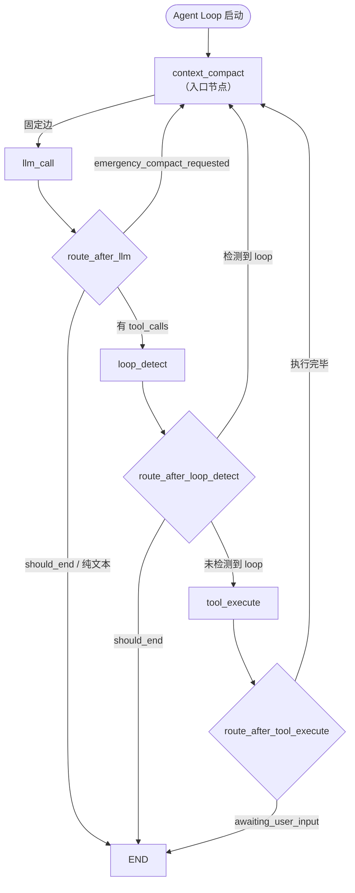

# Agent Loop 上下文管理设计

> **一句话总结**: 上下文管理是 Agent Loop 的前置守门机制，通过 Baseline 感知的 Token 估算系统驱动 4 级渐进式压缩策略（skip → soft_prune → micro_compact → emergency_compact），确保每轮 LLM 调用前消息历史始终控制在模型上下文窗口安全水位内。

> 最后更新: 2026-06-07

## 1. 概述

### 1.1 设计定位

上下文管理模块是 Agent 执行循环的**前置守门**机制，不是事后清理工具。它在**每一轮 LLM 调用之前**执行，确保消息历史的 Token 量始终控制在模型上下文窗口可接受的范围内。

核心特征：

1. **主动守门**：`context_compact` 是 LangGraph StateGraph 的入口节点，所有路径在进入 `llm_call` 之前都必须经过它。
2. **水位触发**：基于 Token 估算值与模型上下文窗口的比例，执行 4 级渐进式压缩策略。
3. **Baseline 校准**：利用 LLM 返回的真实 `prompt_tokens` 进行增量 Token 估算，避免每次全量重算。
4. **不修改持久层**：`tool_results`（持久化的工具执行结果）始终保持完整，仅压缩 `messages`（发送给 LLM 的上下文）。

### 1.2 与 Agent Loop 的关系

上下文管理与 Agent Loop 主文档的关系：

- [3_agent-loop-design.md](./3_agent-loop-design.md) 定义了完整的 Agent 执行循环（节点、路由、状态、可观测性），上下文管理是其 4 个核心节点之一。
- 本文档聚焦于上下文管理的内部设计：Token 估算系统、4 级压缩策略、错误处理集成、路由配合。

### 1.3 核心设计原则

| 原则 | 说明 |
|------|------|
| **守门前置** | 入口设为 `context_compact`，每次 LLM 调用前强制执行水位检查 |
| **渐进式压缩** | 从轻量裁剪到深度摘要，根据水位逐步升级，不越级处理 |
| **Baseline 校准** | 利用 LLM 真实 usage 数据驱动增量估算，提升估算精度 |
| **不丢关键信息** | SystemMessage 和最近消息窗口永远保留，工具结果仅裁剪不删除 |
| **降级兜底** | 摘要 LLM 不可用时降级为纯 trim，不阻断主流程 |

---

## 2. 架构

### 2.1 工作流拓扑

`context_compact` 作为 StateGraph 入口节点，与 `llm_call` 之间是**固定边**，其他节点通过条件路由回到 `context_compact`。



### 2.2 节点注册与边定义

StateGraph 注册四个节点：`llm_call`、`tool_execute`、`loop_detect`、`context_compact`。入口设为 `context_compact`，通过固定边连接到 `llm_call`。其他三个节点通过条件路由最终都回到 `context_compact`，形成"每次 LLM 调用前必经过守门节点"的拓扑结构。

### 2.3 流转路径

| 流转路径 | 触发条件 | 说明 |
|---------|---------|------|
| **context_compact -> llm_call** | 每轮 ReAct 开始（固定边） | 水位判断/压缩完成后进 LLM |
| **llm_call -> context_compact** | LLM 返回上下文超限错误 | 紧急压缩路径 |
| **llm_call -> loop_detect** | LLM 返回 tool_calls | 正常工具调用路径 |
| **loop_detect -> context_compact** | 检测到循环（反馈或压缩） | 注入纠正反馈后先做水位检查 |
| **tool_execute -> context_compact** | 工具执行完毕 | 工具结果加入后先做水位检查 |

---

## 3. Token 估算系统

Token 估算系统提供纯函数用于 Token 计数、消息渲染、上下文窗口解析和超限识别。

### 3.1 `count_tokens()` -- 字符级 Token 估算

采用混合加权策略，对中文字符和其他字符使用不同权重：

| 字符类型 | 权重 | 说明 |
|---------|------|------|
| 中文字符 (U+4E00 至 U+9FFF) | 1.5 tokens/char | 中文 token 效率较低 |
| 其他字符 (英文、标点、空白) | 0.25 tokens/char | 近似 char/4 估算 |

### 3.2 `render_message()` -- 消息规范文本化

将 LangChain 消息对象渲染为统一的文本表示，便于 Token 估算。渲染格式包含 `[role_label]`、`[tool:name]`、`[call_id:id]`、`[tool_calls:names]` 等元信息标签，后跟消息正文内容，帮助 Token 估算覆盖消息的完整开销。

### 3.3 `estimate_context_tokens()` -- Baseline 感知的增量估算

支持两种估算模式，根据是否持有有效的 LLM usage baseline 自动切换：

| 模式 | 触发条件 | 计算方式 | 精度 |
|------|---------|---------|------|
| **增量估算** | baseline 有效 且 消息数>=baseline_message_count（无 RemoveMessage） | `baseline + 新增消息的估算 Token` | 高（baseline 来自 LLM 真实 usage） |
| **全量估算** | baseline 为 None，或消息数<baseline_message_count（发生 RemoveMessage/裁剪） | 对所有消息执行 `count_tokens(render_message(msg))` 求和 | 低（纯 char/4 估算） |

**Baseline 失效规则**：

| 操作 | 对 baseline 的影响 |
|------|-------------------|
| `llm_call` 成功返回 | `context_token_baseline = prompt_tokens`，`baseline_message_count = 发送消息数` |
| `soft_prune` 裁剪消息内容 | `context_token_baseline = None` |
| `micro_compact` / `emergency_compact` 执行 RemoveMessage | `context_token_baseline = None`，`baseline_message_count = 0` |
| loop 纠正注入反馈 | baseline 保持有效（新增消息走增量估算） |

### 3.4 `resolve_max_context_tokens()` -- 模型上下文窗口解析

根据模型名称子串匹配解析最大上下文窗口 Token 数，未匹配时回退到默认值 128,000：

| 模型族 | 上下文窗口 | 说明 |
|--------|-------------|------|
| `gemini-3-pro` | 2,000,000 | Gemini 3 Pro |
| `gpt-5.5` / `gpt-5.4` | 1,000,000 | GPT 5 系列 |
| `claude-opus-4.7` / `claude-opus-4.6` | 1,000,000 | Claude Opus 4 系列 |
| `qwen3` | 1,000,000 | Qwen3 |
| `deepseek-v4` | 1,000,000 | DeepSeek V4 |
| 未匹配 | 128,000 | 兜底默认值 |

> 这些值是本系统的策略默认值，不作为外部供应商规格真值。实际接入时以配置覆盖为准。解析结果写入 `AgentState.max_context_tokens`。

### 3.5 Baseline 校准流程

每次 LLM 调用成功后，`llm_call_node` 从 `AIMessageChunk` 的 usage metadata 中提取真实 `prompt_tokens`：

- **LangChain 0.3+**：从 `usage_metadata` 中取 `input_tokens`
- **旧版 LangChain**：从 `response_metadata.token_usage` 中取 `prompt_tokens`
- **提取失败**：降级为全量 char/4 估算

写回 AgentState 的字段：

- 成功时：写入 `context_token_baseline`（LLM 真实 prompt_tokens）、`context_token_baseline_message_count`（发送消息数）、`context_token_estimate`（同步为 prompt_tokens）
- 提取失败时：仅写入 `context_token_estimate`（全量估算值）

### 3.6 `is_context_limit_error()` -- 上下文超限识别

通过异常文本中的关键字判断是否为上下文超限错误，匹配关键字包括：`context_length_exceeded`、`maximum context length`、`context window`、`input too long`、`prompt is too long`、`token limit`、`request too large`。

---

## 4. 四级压缩策略

### 4.1 策略总览

| 优先级 | 策略名 | 触发条件 | 处理方式 | 保留内容 |
|--------|--------|---------|---------|---------|
| **P1** | `emergency_compact` | `emergency_compact_requested=True` 或上下文超限 | 摘要旧消息 + RemoveMessage | SystemMessage + 最近 3 条 |
| **P2** | `micro_compact` | Token > 60% * max_context_tokens | 摘要旧消息 + RemoveMessage | SystemMessage + 最近 10 条 |
| **P3** | `soft_prune` | Token > 40% * max_context_tokens | 裁剪超长 ToolMessage 内容 | 所有消息（内容被裁剪） |
| **P4** | `skip` | Token <= 40% * max_context_tokens | 不处理，记录事件 | 全部保留 |

### 4.2 执行流程图

```mermaid
flowchart TD
    Start([context_compact 入口]) --> ResolveMax[解析 max_context_tokens]
    ResolveMax --> Estimate[estimate_context_tokens<br/>baseline-aware 增量估算]
    Estimate --> Emergency{emergency_compact_requested<br/>或 compression_strategy=emergency?}
    
    Emergency -->|Yes| EmergencyCompact["P1: emergency_compact<br/>保留最近 3 条 + SystemMessage<br/>摘要旧消息 (最多 90 条)"]
    Emergency -->|No| Over60{token > 0.6 * max?}
    
    Over60 -->|Yes| MicroCompact["P2: micro_compact<br/>保留最近 10 条 + SystemMessage<br/>摘要旧消息 (最多 90 条)"]
    Over60 -->|No| Over40{token > 0.4 * max?}
    
    Over40 -->|Yes| SoftPrune["P3: soft_prune<br/>裁剪 >20000 字符的 ToolMessage<br/>head(4000) + notice + tail(4000)<br/>目标: token <= 0.25 * max"]
    Over40 -->|No| Skip["P4: skip<br/>不处理"]
    
    MicroCompact --> Summarize[调用 LLM 生成摘要]
    EmergencyCompact --> Summarize
    
    Summarize --> LLMAvail{LLM 可用?}
    LLMAvail -->|Yes| InjectSummary[RemoveMessage 旧消息<br/>注入 HumanMessage [Context Summary]]
    LLMAvail -->|No| FallbackTrim[降级: 仅 RemoveMessage<br/>不做摘要]
    
    InjectSummary --> InvalidateBaseline[baseline = None]
    FallbackTrim --> InvalidateBaseline
    SoftPrune -->|曾裁剪| InvalidateBaseline
    
    InvalidateBaseline --> Emit[emit context:compacting]
    Skip --> Emit
    SoftPrune -->|未裁剪| Emit
    
    Emit --> End([固定边 → llm_call])
```

### 4.3 P4: Skip (< 40%)

**触发条件**：`current_tokens <= max_context_tokens * 0.4`

**处理逻辑**：不做任何消息修改，记录 WATERMARK 日志，发射 `context:compacting` 事件（strategy = `skip`），写入 `last_context_strategy = "skip"`。

**事件 Payload 结构**：包含 strategy、beforeTokens、afterTokens、maxContextTokens、消息数量、removedCount(=0)、reason（= "below_watermark"）。

**AgentState 写入**：`phase = context_compacting`，`context_token_estimate`，`last_context_strategy = "skip"`。

### 4.4 P3: Soft-Pruning (40%-60%)

**触发条件**：`current_tokens > max_context_tokens * 0.4` 且 `<= max_context_tokens * 0.6`

**处理逻辑**：

1. 只处理 `ToolMessage`（含 dict 形式的 tool 消息），不触碰普通用户/助手消息。
2. 单条 tool result 内容长度 <= 20000 字符时跳过。
3. 对超长 ToolMessage 裁剪：保留前 4000 字符和后 4000 字符，中间替换为省略标记。
4. 从旧到新顺序处理，每裁剪一条后重新估算 Token。
5. 当估算值 <= `max_context_tokens * 0.25`（目标 25% 水线）时停止。
6. 遍历完所有消息仍不达标也停止（避免误删语义内容）。

**关键设计**：

- 不调用 LLM，纯文本裁剪，零额外成本
- 同 id 的 ToolMessage 替换，`tool_results`（持久层）不受影响
- 基线被修改后 `context_token_baseline` 设为 `None`，后续走全量估算

**事件 Payload 结构**：包含 strategy、beforeTokens、afterTokens、maxContextTokens、消息数量、removedCount(=0)、prunedToolResults（裁剪条数）、reason（= "watermark_40"）。

**AgentState 写入**：`messages`（裁剪后的消息列表）、`phase = context_compacting`、`context_token_estimate`、`last_context_strategy = "soft_prune"`；发生裁剪时 `context_token_baseline = None`。

### 4.5 P2: Micro-Compact (> 60%)

**触发条件**：`current_tokens > max_context_tokens * 0.6`

**处理逻辑**：

1. 识别 SystemMessage（如果消息列表第一条为 SystemMessage，索引记为 0；否则为 -1）。
2. 消息数不足保留窗口 + 1 时跳过压缩。
3. 保留：SystemMessage + 最近 10 条消息。
4. 中间消息取最近 90 条做 LLM 摘要（优先保留时间局部性）。
5. 中间消息超过 90 条时，更老的消息只做 `RemoveMessage`，不加入摘要输入。
6. 摘要注入为 `HumanMessage(content="[Context Summary]\n...", id=first_compacted_id)`。
7. 对被压缩消息执行 `RemoveMessage`。

**压缩范围示意**：

```
[SystemMessage] ... [old_msg_0] ... [old_msg_N] ... [last_10...]
                     ^--- Remove 和/或 摘要 ---^        ^--- 保留 ---^
```

**AgentState 写入**：`messages`（包含 RemoveMessage、摘要 HumanMessage、保留的 SystemMessage + 最近 10 条）、`phase = context_compacting`、`context_token_estimate`、`context_token_baseline = None`、`context_token_baseline_message_count = 0`、`last_context_strategy = "micro_compact"`。

### 4.6 P1: Emergency-Compact (上下文超限)

**触发来源**：

```
llm_call → LLM 返回 context window exceeded
    → LLMErrorHandlerRegistry
        → ContextLimitErrorHandler 识别
            → 设置 emergency_compact_requested=True, compression_strategy="emergency_compact"
                → route_after_llm 检测到标志 → 路由到 context_compact
                    → P1: emergency_compact 执行
```

**处理逻辑**：

与 `micro_compact` 相似，但有三个关键区别：

1. **保留窗口更小**：保留最近 3 条消息（vs micro 的 10 条）。
2. **计数追踪**：`context_compaction_attempts += 1`，防止无限紧急压缩。
3. **标志清零**：执行后设置 `emergency_compact_requested = False`，`compression_strategy = None`，避免循环触发。

**失败处理（两次超限规则）**：

- 第一次上下文超限（`context_compaction_attempts == 0`）：执行 emergency-compact，再次尝试 llm_call。
- 第二次上下文超限（`context_compaction_attempts >= 1`）：`ContextLimitErrorHandler` 直接设置 `should_end=True`，终止任务。

**AgentState 写入**：与 micro_compact 相同的基础字段，额外写入 `context_compaction_attempts += 1`、`emergency_compact_requested = False`、`compression_strategy = None`。

### 4.7 关键信息保留规则

所有压缩策略共同遵守：

| 保留内容 | micro_compact | emergency_compact | soft_prune |
|---------|--------------|-------------------|------------|
| SystemMessage（首条） | 始终保留 | 始终保留 | 始终保留 |
| 最近消息窗口 | 10 条 | 3 条 | 全部保留（内容可能被裁剪） |
| 用户原始需求 | 在摘要中显式保留 | 在摘要中显式保留 | 保留（非 ToolMessage） |
| 工具执行结论 | 在摘要中保留 | 在摘要中保留 | 裁剪超长内容 |
| 当前待办 | 在摘要中保留 | 在摘要中保留 | 保留 |

> `tool_results`（持久层字段）不被压缩节点修改，仅 `messages`（LLM 上下文）被压缩。这确保持久化的工具结果始终完整，供后续节点或外部系统使用。

### 4.8 配置常量

| 常量 | 值 | 说明 |
| ------ | ----- | ------ |
| `SOFT_PRUNE_WATERMARK` | 0.4 | 轻量裁剪触发水线（占上下文窗口比例） |
| `MICRO_COMPACT_WATERMARK` | 0.6 | 摘要压缩触发水线（占上下文窗口比例） |
| `SOFT_PRUNE_TARGET` | 0.25 | 裁剪目标水线（占上下文窗口比例） |
| `SOFT_PRUNE_MIN_CONTENT_LENGTH` | 20000 | 最小裁剪阈值（字符数） |
| `SOFT_PRUNE_HEAD_TAIL` | 4000 | 保留头尾长度（字符数） |
| `MICRO_COMPACT_KEEP_RECENT` | 10 | 微压缩保留最近消息数 |
| `EMERGENCY_COMPACT_KEEP_RECENT` | 3 | 紧急压缩保留最近消息数 |
| `MICRO_COMPACT_SUMMARY_MAX_MSGS` | 90 | 摘要最大处理消息数 |
| `SUMMARY_MAX_INPUT_CHARS` | 32000 | 摘要输入字符上限 |
| `SUMMARY_MAX_TOKEN_FRACTION` | 0.05 | 摘要输入占上下文窗口比例上限 |

---

## 5. 摘要 Prompt

### 5.1 Prompt 全文

`_COMPACTION_SUMMARY_PROMPT` 聚焦任务连续性，通用摘要 Prompt 已被替换：

```text
You are compacting an agent execution context.

Summarize the older messages so the agent can continue the same task
without losing operational state.

Focus on:
1. What has already been completed.
2. What is currently in progress.
3. Files, paths, commands, tools, and external resources that were
read, created, or modified.
4. Important tool results, including success/failure and exact error
messages when relevant.
5. User constraints, preferences, and explicit instructions that still apply.
6. What the agent should do next.

Rules:
- Preserve concrete filenames, IDs, function names, command outputs,
and decisions.
- Do not invent work that was not done.
- If something is uncertain, label it as uncertain.
- Keep the summary concise but operationally complete.
- Output only the summary.
```

### 5.2 摘要输入构建

**字符预算控制**：摘要输入预算取 `min(SUMMARY_MAX_INPUT_CHARS, max_tokens * SUMMARY_MAX_TOKEN_FRACTION * 4)`。以 deepseek-v4（1,000,000 Token）为例：5% Token 预算 = 50,000 Token，字符估算为 50,000 * 4 = 200,000 字符，实际取 min(32,000, 200,000) = **32,000 字符**。

**消息渲染**：摘要输入使用 `render_message()` 渲染每条消息，包含 role、tool name、tool_call_id、content 等元信息，帮助摘要 LLM 理解消息结构和来源。

**截断策略**：从最近的消息开始向后组装，字节预算用尽时截断最后一条，并追加截断标记。

### 5.3 LLM 调用

摘要 LLM 接收 SystemMessage（摘要 Prompt）和 HumanMessage（待压缩消息文本），返回摘要文本。

**降级策略**：

- LLM 不可用（config 无 llm）：返回空，压缩降级为纯 `RemoveMessage`（trim）。
- LLM 调用异常：捕获所有异常，返回空，同样降级为纯 trim。

降级行为保证上下文压缩不成为主流程的阻塞点。

---

## 6. LLM 错误处理器工厂

### 6.1 职责链模式

`llm_call_node` 不直接处理异常，而是委托给 `LLMErrorHandlerRegistry`（职责链模式），将错误分类处理逻辑与节点调用逻辑解耦。

**接口定义**（`ILLMErrorHandler`）：

- `can_handle(error)` — 判断是否能处理该错误
- `handle(error, state, context)` — 处理错误并返回状态更新

**注册器**（`LLMErrorHandlerRegistry`）：按注册顺序遍历处理器列表，第一个 `can_handle()` 返回 `True` 的处理器处理错误；所有处理器都不匹配时 re-raise 异常。

### 6.2 处理器列表

按注册顺序遍历，第一个 `can_handle()` 返回 `True` 的处理器处理错误：

| 序号 | 处理器 | 匹配条件 | 处理策略 |
|------|--------|---------|---------|
| 1 | `ContextLimitErrorHandler` | `is_context_limit_error()` 返回 True | 首次: 设置 `emergency_compact_requested=True`；二次: `should_end=True` |
| 2 | `TimeoutErrorHandler` | `asyncio.TimeoutError` 或 `TimeoutError` | 设置 `should_end=True`，保留已收到的 partial text |
| 3 | `DefaultErrorHandler` | 始终匹配（兜底） | re-raise 异常，由统一错误处理机制接管 |

### 6.3 ContextLimitErrorHandler

**两次超限规则**：

| 次数 | `context_compaction_attempts` | 行为 |
|------|------------------------------|------|
| 第 1 次 | 0 (处理前) / 1 (处理后) | 设置 `emergency_compact_requested=True`，路由到 `context_compact` 执行紧急压缩 |
| 第 2 次 | >= 1 | 设置 `should_end=True`，终止任务 |

### 6.4 TimeoutErrorHandler

将已有的 partial text 保存为 AIMessage，避免完全丢失已生成的文本。设置 `should_end=True` 终止任务。

### 6.5 DefaultErrorHandler

兜底处理器，始终返回 `can_handle() = True`，行为为 re-raise 异常，交由上层统一错误处理。

### 6.6 注入方式

在 `AgentLoopRunner` 中通过 `graph_config` 注入 `LLMErrorHandlerRegistry` 实例（包含三个处理器），`llm_call_node` 通过 config 获取并在异常时委托处理。

---

## 7. AgentState 上下文管理字段

### 7.1 字段定义

| 字段 | 类型 | 描述 | 写入节点 |
|------|------|------|---------|
| `max_context_tokens` | `int` | 当前模型上下文窗口 Token 数上限 | 应用层初始化 |
| `context_token_estimate` | `int` | 当前 messages 的 Token 估算值 | `context_compact`、`llm_call` |
| `context_token_baseline` | `Optional[int]` | 最近一次成功 LLM 调用返回的 `prompt_tokens` | `llm_call` |
| `context_token_baseline_message_count` | `int` | baseline 对应的消息数量，用于判断增量/全量估算 | `llm_call` |
| `context_compaction_attempts` | `int` | 连续紧急压缩次数，防止无限 emergency loop | `context_compact`、`ContextLimitErrorHandler` |
| `emergency_compact_requested` | `bool` | LLM 调用发生上下文超限后置为 True | `ContextLimitErrorHandler` |
| `last_context_strategy` | `Optional[str]` | 最近一次实际执行的压缩策略 | `context_compact` |

### 7.2 字段交互关系

```
llm_call (正常返回)                        llm_call (上下文超限异常)
    │                                           │
    │ 写入 baseline + baseline_message_count       │ ContextLimitErrorHandler
    │                                           │
    ├──> context_token_baseline = prompt_tokens  ├──> emergency_compact_requested = True
    ├──> context_token_baseline_message_count = N ├──> context_compaction_attempts = 1
    └──> context_token_estimate = prompt_tokens   └──> compression_strategy = "emergency_compact"
                                                    │
context_compact (下一轮)                               │ route_after_llm
    │                                           │
    │ estimate_context_tokens(messages,            └──> context_compact (P1: emergency)
    │     baseline, baseline_count)                    │
    │                                           │
    │ 有 baseline 且消息数 >= baseline_count          ├──> context_compaction_attempts += 1
    │   → 增量估算 (高精度)                        ├──> emergency_compact_requested = False
    │                                           └──> compression_strategy = None
    │
    │ 执行压缩 (soft_prune / micro / emergency)
    │   → context_token_baseline = None (失效)
    │   → 下一轮走全量估算
```

**核心交互规则**：

- `context_token_baseline` 和 `context_token_baseline_message_count` 成对使用，共同决定增量/全量估算模式。
- 一旦消息内容被修改（裁剪、RemoveMessage），baseline 即失效，强制全量重算。
- `context_compaction_attempts` 防止紧急压缩无限循环（>= 1 时 ContextLimitErrorHandler 直接终止）。
- `emergency_compact_requested` 是跨节点通信标志，由 error handler 设置，路由函数读取，`context_compact` 执行后清零。

### 7.3 应用层初始化

在 `AgentLoopRunner` 构建初始状态时，初始化所有上下文管理字段：`max_context_tokens`（通过 `resolve_max_context_tokens` 解析）、`context_token_estimate = 0`、`context_token_baseline = None`、`context_token_baseline_message_count = 0`、`context_compaction_attempts = 0`、`emergency_compact_requested = False`、`last_context_strategy = None`。

---

## 8. 路由集成

### 8.1 路由函数与 context_compact 的配合

三个路由函数中，`context_compact` 是核心枢纽：

**`route_after_llm`**：优先级最高为 `emergency_compact_requested`（直接路由到 `context_compact`），其次为 `should_end`（终止），再次为 tool_calls（路由到 `loop_detect`），纯文本则终止。

| 状态 | 路由目标 | 如何回到 context_compact |
|------|---------|------------------------|
| `emergency_compact_requested=True` | `context_compact` | 直接进入紧急压缩 |
| 有 tool_calls | `loop_detect` | 经 loop_detect/tool_execute 回到 context_compact |
| should_end / 纯文本 | END | 不经过（已终止） |

**`route_after_loop_detect`**：未检测到 loop 时路由到 `tool_execute`（最终回到 context_compact），检测到 loop 时直接路由到 `context_compact`（注入反馈后重试），`should_end` 时终止。

| 状态 | 路由目标 | 如何回到 context_compact |
|------|---------|------------------------|
| 未检测到 loop | `tool_execute` | 工具执行后回到 context_compact |
| loop_detected (count 1/2) | `context_compact` | 直接进入（注入反馈后重试） |
| should_end (count >=3) | END | 不经过（已终止） |

**`route_after_tool_execute`**：等待用户输入时终止，否则路由到 `context_compact`（工具结果加入后先守门）。

### 8.2 紧急压缩完整路径

```
llm_call → LLM 抛出 context window exceeded
    → LLMErrorHandlerRegistry.handle()
        → ContextLimitErrorHandler.can_handle() = True
        → handle() 返回:
            emergency_compact_requested = True
            compression_strategy = "emergency_compact"
            context_compaction_attempts = 1

→ route_after_llm(state):
    state["emergency_compact_requested"] is True
    → return "context_compact"

→ context_compact.execute():
    is_emergency = True (emergency_compact_requested 或 compression_strategy)
    → _emergency_compact():
        keep_recent = 3
        context_compaction_attempts = attempts + 1 (= 2)
        emergency_compact_requested = False
        compression_strategy = None

→ 固定边 → llm_call (使用压缩后的 messages 重试)
    → 如果仍超限:
        ContextLimitErrorHandler: context_compaction_attempts >= 1
        → should_end = True (终止)
    → 如果成功:
        继续正常循环
```

---

## 9. 初始历史预算

### 9.1 设计变更

初始历史消息的 Token 预算从硬编码的 `8000` 改为基于模型上下文窗口的动态计算：`initial_history_budget = max_context_tokens * 0.25`。

| 模型 | 上下文窗口 | 历史预算 (25%) | 旧值 (8000) |
|------|----------|--------------|-----------|
| `deepseek-v4` | 1,000,000 | 250,000 | 8,000 |
| `claude-opus-4.7` | 1,000,000 | 250,000 | 8,000 |
| `gpt-5.5` | 1,000,000 | 250,000 | 8,000 |
| `qwen3` | 1,000,000 | 250,000 | 8,000 |
| `gemini-3-pro` | 2,000,000 | 500,000 | 8,000 |
| 未匹配 | 128,000 | 32,000 | 8,000 |

### 9.2 设计理由

选择 25% 作为历史预算占比的原因：

1. **系统提示词空间**：系统提示词通常占用 10%-15% 的上下文窗口，25% 的历史预算留出足够头部空间。
2. **工具 Schema 空间**：工具定义（name、description、parameters schema）在每次 LLM 调用时都会携带，大型工具集可能占用数千 Token。
3. **输出 Token 余量**：LLM 的输出也需要在上下文窗口内，25% 的历史预算不会挤占输出空间。
4. **后续压缩容错**：即使初始历史偏大，`context_compact` 的 `soft_prune`（40% 水线）会在第一轮 LLM 调用前介入裁剪。

### 9.3 使用方式

在 `AgentLoopRunner` 构建初始状态时，通过 `PromptContextInterface.build_messages()` 传入 `max_tokens = initial_history_budget` 参数进行历史消息的 Token 预算裁剪，超过预算的旧消息被裁剪或丢弃。

---

## 附录 A：事件 Payload 汇总

| 策略 | 事件类型 | 关键字段 |
|------|---------|---------|
| skip | `context:compacting` | strategy=skip, beforeTokens, afterTokens, reason=below_watermark |
| soft_prune | `context:compacting` | strategy=soft_prune, beforeTokens, afterTokens, prunedToolResults, reason=watermark_40 |
| micro_compact | `context:compacting` | strategy=micro_compact, beforeTokens, afterTokens, removedCount, summaryLength, reason=watermark_60 |
| emergency_compact | `context:compacting` | strategy=emergency_compact, beforeTokens, afterTokens, removedCount, summaryLength, reason=context_overflow |

## 附录 B：日志格式汇总

```
# Skip
[NODE:context_compact] WATERMARK | task_id=... | turn=... | tokens=100000/1000000 | strategy=skip | reason=below_watermark

# Soft-prune
[NODE:context_compact] SOFT_PRUNE_COMPLETE | task_id=... | before_tokens=... | after_tokens=... | pruned=3 | target=250000

# Micro-compact
[NODE:context_compact] MICRO_COMPACT_COMPLETE | task_id=... | before_count=50 | after_count=12 | removed=38 | before_tokens=... | after_tokens=... | summary_length=1200

# Emergency-compact
[NODE:context_compact] EMERGENCY_COMPACT | task_id=... | attempt=2 | before_tokens=...
[NODE:context_compact] EMERGENCY_COMPACT_COMPLETE | task_id=... | before_count=80 | after_count=6 | removed=74 | summary_length=800

# Compact skip (too few messages)
[NODE:context_compact] COMPACT_SKIP | task_id=... | reason=too_few_messages | count=5

# LLM summarize
[NODE:context_compact] LLM_SUMMARIZE_INPUT | task_id=... | input_length=15000 | messages_to_summarize=45 | budget=32000
[NODE:context_compact] LLM_SUMMARIZE_OUTPUT | task_id=... | summary_length=1200
[NODE:context_compact] LLM_UNAVAILABLE | task_id=... | fallback=trim
[NODE:context_compact] LLM_SUMMARIZE_ERROR | task_id=... | error=... | fallback=trim

# Context limit errors (in llm_call)
[NODE:llm_call] CONTEXT_OVERFLOW | task_id=... | error=... | action=emergency_compact
[NODE:llm_call] CONTEXT_OVERFLOW_FATAL | task_id=... | error=... | attempts=2
```
