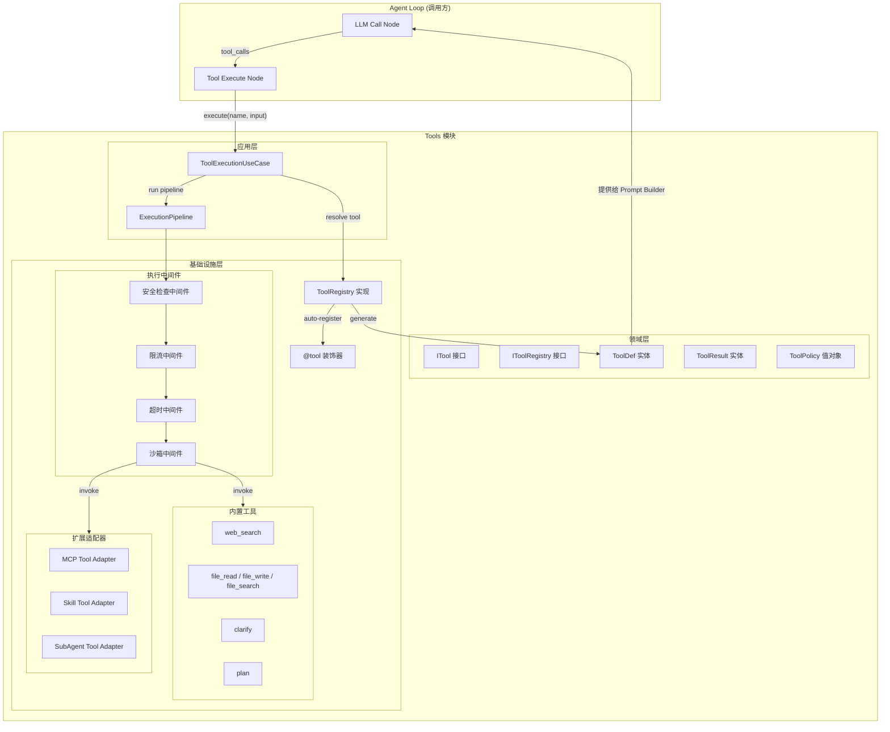
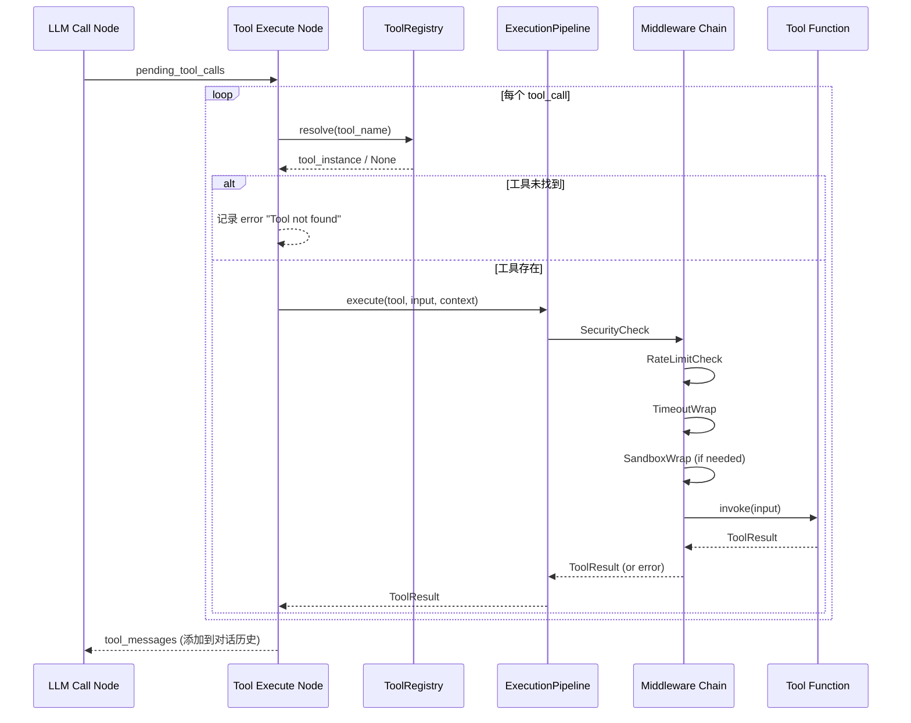

# 1.4 Tools 模块技术方案

> **一句话总结**: Tools 模块提供声明式工具定义（@tool 装饰器）、统一注册发现（ToolRegistry）和管道式执行（Security→RateLimit→Timeout→Sandbox→Invoke），支撑 Agent 的工具调用全生命周期。

## 1. 范围

本模块负责 Agent 工具系统的完整框架设计与实现，提供统一的工具定义、注册、发现和执行机制：

- **工具定义框架**：基于装饰器的工具声明式定义（参数 Schema、功能描述）
- **工具注册中心**：统一的工具注册表，支持动态注册和发现
- **工具执行管道**：安全检查 → 限流 → 超时控制 → 沙箱隔离 → 执行 → 结果返回
- **内置工具实现**：web_search、file（读写搜索grep）、shell、clarify、web_fetch、session_spawn、task_create/task_update、team_tools
- **扩展机制**：MCP 集成、Skills 系统、Sub-Agent 委派的工具化封装

**不包含**：
- MCP Server 的具体实现（属于 MCP 模块，本模块只定义 MCP 工具适配器接口）
- Skills 的具体业务逻辑实现（属于 Skills 模块，本模块只定义 Skill 工具包装器）
- Sub-Agent 的编排策略（属于 Multi-Agent 模块，本模块只定义委派接口）
- 前端工具管理 UI（后续迭代）
- 工具执行结果的持久化存储（属于会话管理模块）

**与其他模块的关系**：
- **Prompt Builder（1.2）**：本模块提供 `ToolDef` 列表，Prompt Builder 将其渲染到 Layer 5 Tooling Section
- **Agent Loop（1.3）**：`tool_execute_node` 节点通过 `ToolRegistry` 调用本模块执行工具
- **Memory 系统（1.5）**：部分工具可能读写 Memory，通过依赖注入获取 Memory 服务

---

## 2. 概要设计

### 2.1 核心设计理念

Tools 模块采用**声明式定义 + 管道式执行**的设计：

1. **声明式定义**：开发者通过 `@tool` 装饰器声明工具的名称、描述、参数 Schema，框架自动提取元数据
2. **自动注册**：装饰器标记的工具函数在模块加载时自动注册到全局 Registry
3. **管道式执行**：工具调用经过安全检查、限流、超时、沙箱等中间件管道后执行
4. **ToolDef 对齐**：从装饰器元数据自动生成 `ToolDef` 实体，供 Prompt Builder 使用

### 2.2 模块架构图



### 2.3 工具执行时序图



### 2.4 模块说明

#### 2.4.1 工具定义与注册模块

**职责**：提供 `@tool` 装饰器和 `ToolRegistry`，实现工具的声明式定义和自动注册。

**核心能力**：
- 装饰器解析函数签名，自动提取参数 Schema
- 支持类型注解到 JSON Schema 的映射
- 自动生成 `ToolDef` 供 Prompt Builder 使用
- 支持按类别（category）分组管理工具

**涉及文件**：
- `backend/src/domain/entities/tool/context.py` — ToolResult, ToolContext
- `backend/src/domain/entities/tool/definition.py` — ToolDef, ToolParameter
- `backend/src/domain/entities/tool/registered.py` — RegisteredTool
- `backend/src/domain/entities/tool/__init__.py` — 统一 re-export
- `backend/src/domain/repositories/tool_registry.py` — IToolRegistry 接口
- `backend/src/infrastructure/tools/registry.py` — ToolRegistry 实现
- `backend/src/infrastructure/tools/decorator.py` — @tool 装饰器

#### 2.4.2 工具执行管道模块

**职责**：提供中间件管道，对工具调用进行安全检查、限流、超时控制和沙箱隔离。

**核心能力**：
- 可插拔的中间件架构
- 安全策略（白名单/黑名单、参数校验）
- 令牌桶限流（per-tool 和 global）
- asyncio.wait_for 超时控制
- 可选的 subprocess 沙箱隔离

**涉及文件**：
- `backend/src/application/use_cases/tool_execution.py` — 执行用例
- `backend/src/infrastructure/tools/middleware/` — 中间件实现

#### 2.4.3 内置工具模块

**职责**：实现 Agent 核心内置工具集。

**工具清单**：

| 工具名 | 分类 | 默认提供商 | 说明 |
| ---- | ---- | ---- | ---- |
| `web_search` | web_search | **Tavily** | 网络搜索，获取实时信息；针对 LLM/Agent 场景优化，返回结构化结果与 AI 摘要 |
| `file_read` | file | 本地 FS | 读取文件内容 |
| `file_write` | file | 本地 FS | 写入文件内容 |
| `file_search` | file | 本地 FS | 搜索文件（glob/grep） |
| `clarify` | clarify | — | 向用户发起澄清提问 |
| `plan` | plan | — | 生成/更新任务规划 |
| `shell` | system | 本地 Shell | 执行 shell 命令，支持工作目录设置、超时控制和输出限制 |

> `web_search` 默认使用 [Tavily](https://tavily.com) 作为搜索提供商：为 LLM/Agent 专门设计，返回已清洗的结构化内容 + 可选 AI 摘要，LangChain 生态有原生适配。通过 `SEARCH_PROVIDER` 环境变量可扩展其他提供商（Serper、Brave、Exa 等）。

**涉及文件**：
- `backend/src/infrastructure/tools/builtin/web_search.py`
- `backend/src/infrastructure/tools/builtin/file_ops.py`
- `backend/src/infrastructure/tools/builtin/clarify.py`
- `backend/src/infrastructure/tools/builtin/plan.py`
- `backend/src/infrastructure/tools/builtin/shell.py`

#### 2.4.4 扩展适配器模块

**职责**：将 MCP 工具、Skills、Sub-Agent 包装为统一的 Tool 接口。

**涉及文件**：
- `backend/src/infrastructure/tools/adapters/mcp_adapter.py`
- `backend/src/infrastructure/tools/adapters/skill_adapter.py`
- `backend/src/infrastructure/tools/adapters/sub_agent_adapter.py`

---

## 3. 详细设计

### 3.1 领域层设计

#### 3.1.1 核心实体：ToolResult 与 ToolContext

**ToolResult** 是工具执行结果的统一数据结构，包含四个字段：

- `output`（str）：文本输出，作为 tool message content 返回给 LLM
- `success`（bool，默认 True）：标识执行是否成功
- `error`（Optional[str]）：失败时的错误信息
- `metadata`（Dict[str, Any]）：附加元数据（如 token 消耗、执行耗时等），不返回给 LLM

**ToolContext** 是传递给工具的运行时上下文信息，包含 `task_id`、`workspace`、`user_id`、`agent_id` 和一个可扩展的 `extra` 字典。工具可按需使用这些上下文信息。

#### 3.1.2 IToolRegistry 接口

`IToolRegistry` 是定义在领域层的抽象接口，遵循 DDD 原则（接口在领域层，实现在基础设施层）。它定义了工具注册、发现和执行的完整契约：

- `register(tool)` / `unregister(name)`：工具注册与注销
- `resolve(name)`：按名称查找工具，返回 RegisteredTool 或 None
- `list_tools(category)`：列出已注册工具，可按分类筛选
- `get_tool_defs(category)`：获取所有工具的 ToolDef 列表，供 Prompt Builder 使用
- `execute(name, input, context)`：异步执行指定工具，返回 ToolResult

#### 3.1.3 ToolPolicy 值对象

`ToolPolicy` 是一个不可变值对象（frozen dataclass），定义单个工具的执行约束策略。包含以下字段：

| 字段 | 类型 | 默认值 | 说明 |
| ---- | ---- | ------ | ---- |
| `timeout_ms` | int | 30000 | 执行超时时间（毫秒） |
| `max_calls_per_minute` | int | 60 | 每分钟最大调用次数 |
| `requires_approval` | bool | false | 是否需要用户审批才能执行 |
| `sandboxed` | bool | false | 是否需要沙箱隔离执行 |
| `allowed_paths` | List[str] | [] | 允许访问的文件路径前缀（file 类工具使用） |
| `risk_level` | str | "low" | 风险等级：low / medium / high |

`ToolPolicy` 作为 `RegisteredTool` 的不可变属性，在工具注册时即确定其执行约束。

#### 3.1.4 RegisteredTool 实体

`RegisteredTool` 是将工具函数、元数据定义和执行策略绑定在一起的聚合实体。它由 `@tool` 装饰器自动创建，或由扩展适配器手动构建。

核心属性：

| 属性 | 类型 | 说明 |
| ---- | ---- | ---- |
| `name` | str | 工具唯一名称 |
| `description` | str | 功能描述（供 LLM 理解何时调用） |
| `func` | ToolFunction | 实际执行函数，签名为 `async (Dict, Optional[ToolContext]) -> ToolResult` |
| `parameters` | List[ToolParameter] | 参数定义列表 |
| `returns` | str | 返回值描述 |
| `category` | str | 工具分类（默认 "general"） |
| `policy` | ToolPolicy | 执行策略（默认 ToolPolicy()） |

`RegisteredTool` 提供 `to_tool_def()` 方法，将自身转换为 `ToolDef` 实体供 Prompt Builder 使用，确保与 1.2 设计对齐。

---

### 3.2 基础设施层设计 — 装饰器框架

#### 3.2.1 @tool 装饰器

`@tool` 是整个工具系统的核心入口。开发者通过装饰器声明工具，装饰器自动完成以下工作：

1. **名称推导**：优先使用显式指定的 `name` 参数，否则使用函数名
2. **描述提取**：优先使用 `description` 参数，否则从 docstring 首行提取
3. **参数解析**：调用 `_extract_parameters(func)` 从函数签名中提取参数定义：
   - 从类型注解（`get_type_hints`）提取参数类型并映射到 JSON Schema 类型（str->"string", int->"integer", float->"number", bool->"boolean", list->"array", dict->"object"）
   - 从 Google-style docstring 的 Args 段落提取参数描述
   - 跳过 `self`、`context`、`ctx` 等内部参数
4. **策略构建**：根据装饰器参数创建 `ToolPolicy` 值对象
5. **函数包装**：通过 `_wrap_tool_function` 将原始函数包装为统一的异步调用接口，支持：同步/异步函数的自动适配（同步函数通过 `asyncio.to_thread` 执行），统一的 `Dict + ToolContext -> ToolResult` 签名，以及返回值规范化（str/dict 自动包装为 ToolResult）
6. **全局收集**：将构建好的 `RegisteredTool` 加入全局收集器 `_tool_collector` 列表
7. **元数据附加**：在包装后的函数上附加 `_registered_tool` 属性，便于测试和内省

装饰器参数列表：

| 参数 | 类型 | 默认值 | 说明 |
| ---- | ---- | ---- | ---- |
| `name` | Optional[str] | 函数名 | 工具唯一名称 |
| `description` | str | docstring 首行 | 功能描述 |
| `category` | str | "general" | 工具分类 |
| `returns` | str | "" | 返回值描述 |
| `timeout_ms` | int | 30000 | 超时时间（毫秒） |
| `max_calls_per_minute` | int | 60 | 每分钟最大调用次数 |
| `requires_approval` | bool | false | 是否需要审批 |
| `sandboxed` | bool | false | 是否沙箱执行 |
| `risk_level` | str | "low" | 风险等级 |

#### 3.2.2 使用示例

使用 `@tool` 装饰器定义一个工具的典型模式如下：

```text
@tool(
    name="web_search",
    description="搜索互联网获取实时信息。当需要获取最新资讯、查找事实或验证信息时使用。",
    category="web_search",
    returns="搜索结果摘要文本",
    timeout_ms=15000,
    max_calls_per_minute=20,
)
async def web_search(query: str, max_results: int = 5, context: ToolContext = None) -> ToolResult:
    """网络搜索工具
    
    Args:
        query: 搜索关键词或问题
        max_results: 最大返回结果数量（1-10）
    """
    # 具体实现：调用搜索 API，返回 ToolResult
    ...
```

装饰器自动提取函数签名中的类型信息（`query: str` -> string，`max_results: int` -> integer）和 docstring 中的参数描述，构建完整的工具元数据，无需手动编写 Schema。

---

### 3.3 基础设施层设计 — ToolRegistry 实现

`ToolRegistry` 是 `IToolRegistry` 接口的具体实现，负责管理所有已注册工具的生命周期。

核心设计要点：

- **内部存储**：使用 `Dict[str, RegisteredTool]` 以工具名为键存储已注册工具
- **执行委托**：`execute()` 方法首先通过 `resolve()` 查找工具，若未找到则返回包含 "Tool not found" 错误信息的 `ToolResult`；若找到则委托给 `ExecutionPipeline` 执行
- **自动注册**：`auto_register_collected()` 方法从全局收集器批量导入所有通过 `@tool` 装饰器标记的工具
- **ToolDef 生成**：`get_tool_defs()` 遍历已注册工具并调用各自的 `to_tool_def()` 方法，生成供 Prompt Builder Layer 5 使用的 ToolDef 列表
- **分类筛选**：`list_tools()` 和 `get_tool_defs()` 均支持可选的 `category` 参数进行筛选
- **重复注册处理**：同名工具重复注册时记录警告并覆盖旧定义
- **管道注入**：构造时接受可选的 `ExecutionPipeline` 实例，未提供时使用默认空管道

---

### 3.4 应用层设计 — ExecutionPipeline

`ExecutionPipeline` 是工具执行的编排核心，采用洋葱模型（Onion Model）组织中间件链。

**中间件协议**：每个中间件遵循统一协议 -- `async def process(tool, input, context, next_handler) -> ToolResult`，其中 `next_handler` 是调用链中的下一个处理器。中间件可在调用 `next_handler` 前后执行逻辑（前置/后置处理）。

**执行流程**：

1. 记录起始时间
2. 以 `final_handler`（直接调用 `tool.func`）为内层，逆序遍历中间件列表，逐层构建洋葱调用链：每个中间件包裹下一个 handler
3. 执行最外层 handler，中间件按注册顺序依次处理
4. 成功时在 `result.metadata` 中记录 `duration_ms` 并记录 info 日志
5. 任意异常被捕获后返回统一的失败 `ToolResult`，记录 error 日志

**默认中间件顺序**：Security -> RateLimit -> Timeout -> Sandbox -> Invoke（即工具实际执行）。

管道支持构造时传入中间件列表或通过 `add_middleware()` 动态添加，支持灵活配置不同的中间件组合。

---

### 3.5 中间件实现

#### 3.5.1 超时中间件

`TimeoutMiddleware` 基于 `asyncio.wait_for` 实现工具执行超时控制。它从 `tool.policy.timeout_ms` 读取每个工具的超时阈值。当 `next_handler` 在指定时间内未完成时，捕获 `asyncio.TimeoutError` 并返回一个包含 "timed out" 消息和 `error="timeout"` 的失败 `ToolResult`，而非向上层抛出异常。

#### 3.5.2 限流中间件

`RateLimitMiddleware` 基于滑动窗口实现 per-tool 调用频率限制。每次调用前清理 60 秒窗口外的过期记录，然后检查当前窗口内的调用次数是否超过 `tool.policy.max_calls_per_minute`。超限时直接返回 `error="rate_limited"` 的失败 `ToolResult`，不执行实际调用；未超限则记录本次调用时间戳后放行。支持构造时设置 `global_max_per_minute` 全局上限（当前仅预留接口）。

#### 3.5.3 安全检查中间件

`SecurityMiddleware` 负责工具执行前的安全检查，包含三层防护：

1. **工具白名单**：构造时传入 `allowed_tools` 列表（`None` 表示不限制），不在白名单中的工具调用返回 `error="permission_denied"`
2. **文件路径校验**：对 file 类工具，检查请求路径（从 `input` 中的 `path` 或 `file_path` 字段提取）是否在 `tool.policy.allowed_paths` 范围内，通过绝对路径前缀匹配实现，越权访问返回 `error="path_not_allowed"`
3. **审批检查**：检查 `tool.policy.requires_approval` 标志，预留 HITL（Human-in-the-Loop）审批流程集成点

#### 3.5.4 沙箱中间件

`SandboxMiddleware` 为标记了 `sandboxed=True` 的工具提供隔离执行环境。当前阶段实现为标记检查：非 sandboxed 工具直接放行；sandboxed 工具执行后在 `result.metadata` 中记录 `sandboxed=True` 标记。后续可扩展为 subprocess + seccomp 或容器（Docker）级别的沙箱隔离。

---

### 3.6 内置工具实现

#### 3.6.1 web_search

**默认提供商：Tavily**

Tavily 是专为 LLM / AI Agent 设计的搜索 API，具备以下特点：
- 返回已清洗、去噪的网页正文片段（Content），对 LLM 友好
- 可选 `include_answer=True` 直接返回 AI 生成的简明摘要
- 支持 `search_depth=basic|advanced` 控制检索深度与成本
- 提供 `include_domains` / `exclude_domains` 精确控制信源
- 每月 1000 次免费额度，适合开发与中小规模生产

**依赖与配置**：

- 依赖包：`tavily-python`（通过 `uv add tavily-python` 安装）
- 环境变量配置：

| 环境变量 | 必填 | 默认值 | 说明 |
| ---- | ---- | ---- | ---- |
| `SEARCH_PROVIDER` | 否 | tavily | 搜索提供商标识 |
| `TAVILY_API_KEY` | 是 | — | Tavily API 密钥 |
| `TAVILY_SEARCH_DEPTH` | 否 | basic | 搜索深度：basic 或 advanced |
| `TAVILY_INCLUDE_ANSWER` | 否 | true | 是否返回 AI 生成的摘要 |

**工具设计要点**：

`web_search` 工具通过 `@tool` 装饰器声明，核心设计要点如下：

- **装饰器配置**：`category="web_search"`、`timeout_ms=15000`、`max_calls_per_minute=20`、`risk_level="low"`
- **参数设计**：接受 `query`（搜索关键词，必填）、`max_results`（1-10，默认 5）、`search_depth`（basic/advanced，默认 basic）、`include_domains` 和 `exclude_domains`（可选域名过滤）
- **输入验证**：空查询直接返回 `error="invalid_input"`；`max_results` 约束到 [1, 10] 范围；无效 `search_depth` 回退到 "basic"
- **多提供商架构**：通过 `SEARCH_PROVIDER` 环境变量选择提供商（当前仅实现 Tavily），不支持的提供商返回 `error="unsupported_provider"`

**Tavily 提供商实现要点**：

- **配置检查**：构造时验证 `TAVILY_API_KEY` 环境变量是否存在，缺少时抛出 `_TavilyConfigError`；验证 `tavily-python` 包是否已安装
- **同步 SDK 适配**：Tavily SDK 的 `client.search` 是同步调用，通过 `asyncio.to_thread` 包装以在线程池中执行，避免阻塞事件循环
- **搜索参数**：透传 `query`、`max_results`、`search_depth`、`include_answer`（从 `TAVILY_INCLUDE_ANSWER` 环境变量读取）、`include_domains` 和 `exclude_domains`

**结果格式化**：`_format_tavily_results` 将 Tavily 返回的 JSON 结构格式化为 LLM 可读的 Markdown 文本：

- 优先展示 AI 摘要（`answer` 字段，如果有）
- 逐条展示搜索结果，包含序号、标题（加粗）、URL、正文摘要（限制 500 字符）、相关性评分
- 单条内容截断到 500 字符，避免 context 窗口溢出

#### 3.6.2 file 操作工具

文件操作模块包含三个工具，均通过 `@tool` 装饰器声明，共享一个路径解析辅助函数 `_resolve_path`（绝对路径直接使用，相对路径基于 `workspace` 拼接）。

**file_read**：

- 装饰器配置：`category="file"`、`timeout_ms=10000`、`risk_level="low"`
- 参数：`path`（文件路径）、`offset`（起始行号，0 起）、`limit`（最大行数，默认 2000）
- 行为：UTF-8 编码读取，解码错误用替换字符；文件不存在返回 `error="file_not_found"`；输出包含文件位置信息头（"File: ... lines X-Y of Z"）
- metadata 包含 `total_lines` 和 `read_lines`

**file_write**：

- 装饰器配置：`category="file"`、`timeout_ms=10000`、`requires_approval=True`、`risk_level="medium"`
- 参数：`path`、`content`
- 行为：自动创建父目录（`os.makedirs(exist_ok=True)`）；覆盖写入；返回写入字符数和字节数
- 因为 `requires_approval=True`，执行前需通过 SecurityMiddleware 审批检查

**file_search**：

- 装饰器配置：`category="file"`、`timeout_ms=15000`、`risk_level="low"`
- 参数：`pattern`（glob 模式）、`search_content`（可选关键词）、`max_results`（默认 20）
- 行为：使用 `glob` 递归匹配文件路径；若提供 `search_content`，则在匹配文件中逐行搜索关键词；结果截断到 `max_results`；跳过二进制/不可读文件
- 路径解析基于 `context.workspace` 或当前工作目录

#### 3.6.3 clarify 工具

`clarify` 工具用于在任务需求不明确时向用户发起澄清提问。装饰器配置：`category="clarify"`、`timeout_ms=5000`、`risk_level="low"`。参数包括 `question`（必填，提给用户的问题）和 `options`（可选列表，提供选项降低用户回答负担）。空问题返回 `error="invalid_input"`。输出格式为 Markdown 结构（加粗的 Question + 带编号的 Options 列表），metadata 中标记 `type="clarify"` 和 `awaiting_user_input=True`，由事件系统识别并推送给前端等待用户回复。

#### 3.6.4 plan 工具

`plan` 工具用于将复杂任务分解为可执行的步骤计划。装饰器配置：`category="plan"`、`timeout_ms=5000`、`risk_level="low"`。参数包括 `goal`（任务目标描述，必填）和 `steps`（步骤列表，必填）。空目标或空步骤均返回 `error="invalid_input"`。输出格式为 Markdown 二级标题 + 带 checkbox 的编号步骤列表（`- [ ] Step N: ...`），metadata 中记录 `type="plan"`、`goal` 和 `step_count`。

---

### 3.7 扩展适配器设计

#### 3.7.1 MCP 工具适配器

`MCPToolAdapter` 将 MCP Server 暴露的工具转换为 `RegisteredTool` 格式，使其可注册到 `ToolRegistry` 中被 Agent 统一调用。

核心设计：

- **构造**：接受一个 MCP 客户端实例（负责与 MCP Server 通信）
- **工具发现**：`discover_tools()` 调用客户端 `list_tools()` 获取 MCP 工具列表，逐个转换为 `RegisteredTool`
- **命名策略**：MCP 工具名加 `mcp_` 前缀避免与内置工具冲突
- **参数转换**：`_convert_parameters()` 将 MCP 的 `inputSchema`（JSON Schema 格式）中的 `properties` 和 `required` 字段转换为 `ToolParameter` 列表
- **调用包装**：为每个 MCP 工具创建闭包 `invoke` 函数，调用客户端 `call_tool()` 并处理异常
- **策略默认**：MCP 工具默认超时 60 秒（长于内置工具的 30 秒），分类为 `"mcp"`

#### 3.7.2 Skill 工具适配器

`SkillToolAdapter` 将 Skill 系统中的技能包装为 `RegisteredTool`，使 Agent 通过统一的工具调用接口触发 Skill 执行。

核心设计：

- **构造**：接受一个 Skill 注册表实例（提供 Skill 列表和执行能力）
- **批量包装**：`wrap_skills()` 遍历 Skill 注册表，将每个 Skill 包装为工具
- **命名策略**：Skill 名加 `skill_` 前缀区分来源
- **调用委托**：为每个 Skill 创建闭包 `invoke` 函数，调用 Skill 注册表的 `execute()` 方法并处理异常
- **策略默认**：Skill 工具默认超时 120 秒（Skill 通常耗时较长），分类为 `"skill"`

#### 3.7.3 Sub-Agent 工具适配器

`SubAgentToolAdapter` 将任务委派给子 Agent 的能力包装为一个名为 `delegate_task` 的工具。Agent 可通过此工具将特定子任务委派给专门的 Sub-Agent。

核心设计：

- **工具生成**：`create_delegate_tool(available_agents)` 根据当前可用的子 Agent 列表动态创建委派工具
- **参数**：`agent_name`（目标 Agent 名称，必填）+ `task`（任务描述，必填）
- **校验**：执行时检查 `agent_name` 是否在可用列表中，无效时返回 `error="unknown_agent"` 并列出可用选项
- **委派逻辑**：当前为占位实现，标记 TODO 待对接 Multi-Agent 模块进行实际委派
- **策略**：`timeout_ms=300000`（5 分钟，子 Agent 执行耗时较长），`risk_level="medium"`，分类为 `"sub_agent"`

---

### 3.8 与 Agent Loop 的集成

#### 3.8.1 tool_execute_node 对接

现有 `tool_execute_node` 已通过 `config["configurable"]["tool_registry"]` 获取 Registry 实例。本模块只需确保 `ToolRegistry` 实现了 `execute(name, input)` 接口即可无缝对接。

**集成方式**（在 Agent 启动时注入）：在 `create_tool_registry()` 工厂函数中完成以下步骤：

1. 创建 `ExecutionPipeline` 实例并按顺序添加中间件：`SecurityMiddleware` -> `RateLimitMiddleware` -> `TimeoutMiddleware` -> `SandboxMiddleware`
2. 创建 `ToolRegistry` 并注入 Pipeline
3. 调用 `auto_register_collected()` 自动注册所有通过 `@tool` 装饰器标记的工具
4. 通过 import 语句触发内置工具模块加载（`web_search`、`file_ops`、`clarify`、`plan`、`shell`），使用 `# noqa: F401` 标记避免 linter 告警

#### 3.8.2 tool_execute_node 返回值兼容

现有 `tool_execute_node` 期望 `execute()` 返回 `dict`，新实现返回 `ToolResult`。兼容方案为：`tool_execute_node` 调用 `tool_registry.execute()` 获取 `ToolResult` 后，取 `result.output` 字段作为 tool message content 存入结果字典。这样下游代码仅需改动一行取值逻辑，其余不变。

#### 3.8.3 ToolDef 集成到 Prompt Builder

在 Agent 执行前，通过 `registry.get_tool_defs()` 获取 `List[ToolDef]`，传递给 `prompt_assembler.assemble()` 方法，由 Prompt Builder 将其渲染到 Layer 5 Tooling Section 中，最终嵌入 system prompt 供 LLM 理解可用工具。

---

### 3.9 目录结构总览

```
backend/src/
├── domain/
│   ├── entities/
│   │   └── tool/                  # Tool 聚合子包（按 DDD 聚合边界组织）
│   │       ├── __init__.py        # 统一 re-export：from src.domain.entities.tool import ...
│   │       ├── context.py         # ToolResult, ToolContext
│   │       ├── definition.py      # ToolDef, ToolParameter
│   │       ├── policy.py          # ToolPolicy（VO）
│   │       ├── registered.py      # RegisteredTool, ToolFunction
│   │       └── call.py            # ToolCall, ToolCallState
│   └── repositories/
│       └── tool_registry.py       # IToolRegistry 接口
├── application/
│   └── use_cases/
│       └── tool_execution.py      # ToolExecutionUseCase（可选，当前逻辑在 Pipeline）
├── infrastructure/
│   └── tools/
│       ├── __init__.py
│       ├── decorator.py           # @tool 装饰器
│       ├── registry.py            # ToolRegistry 实现
│       ├── pipeline.py            # ExecutionPipeline
│       ├── middleware/
│       │   ├── __init__.py
│       │   ├── timeout.py         # 超时中间件
│       │   ├── rate_limit.py      # 限流中间件
│       │   ├── security.py        # 安全检查中间件
│       │   └── sandbox.py         # 沙箱中间件
│       ├── builtin/
│       │   ├── __init__.py
│       │   ├── web_search.py      # 网络搜索（Tavily）
│       │   ├── file_ops.py        # 文件操作
│       │   ├── clarify.py         # 澄清提问
│       │   ├── plan.py            # 任务规划
│       │   └── shell.py           # Shell 命令执行
│       └── adapters/
│           ├── __init__.py
│           ├── mcp_adapter.py     # MCP 工具适配器
│           ├── skill_adapter.py   # Skill 工具适配器
│           └── sub_agent_adapter.py  # Sub-Agent 适配器
└── presentation/
    └── dependencies.py            # 工具注册表依赖注入
```

> **分包约定**：Tool 相关实体文件较多（5+），按 DDD 聚合对 `domain/entities/tool/` 分包，其他聚合（agent/task/llm）当前仍平铺，待单模块≥ 4 个实体时再重构。所有外部 import 统一用 `from src.domain.entities.tool import X`，不暴露子模块路径。

---

## 4. 设计决策记录

### 决策 1: 为什么用装饰器而非配置文件定义工具

**选项**：
- A) 装饰器（代码即配置）
- B) YAML/JSON 配置文件 + 函数映射
- C) 类继承（每个工具一个类）

**选择**: A — 装饰器

**理由**：
- 函数签名即 Schema，避免定义和实现不一致
- 开发体验最佳，一个文件完成定义 + 实现
- Python 生态常见模式（FastAPI、Click 等），团队熟悉
- 类型注解可自动推断参数类型

### 决策 2: 为什么用中间件管道而非 if-else 链

**选择**: 洋葱模型中间件

**理由**：
- 各关注点解耦（安全、限流、超时独立实现）
- 易于新增/移除中间件，不修改核心逻辑
- 中间件可复用、可测试
- 支持前置/后置处理（洋葱模型）

### 决策 3: ToolResult vs Dict 返回值

**选择**: 强类型 ToolResult dataclass

**理由**：
- 统一的返回结构，下游处理无需猜测字段
- 明确的 success/error 语义
- metadata 字段支持扩展而不污染主输出
- 与现有 tool_execute_node 兼容（取 `.output` 作为 content）

### 决策 4: web_search 默认提供商选择 Tavily

**选项**：
- A) Tavily — 专为 LLM/Agent 设计，返回结构化内容 + 可选 AI 摘要
- B) Serper.dev — Google 搜索代理，价格低，返回原始 SERP
- C) Brave Search API — 独立索引，隐私友好
- D) SerpAPI — 多引擎支持，生态成熟但偏贵
- E) Perplexity Sonar — 直接返回带引用的 AI 答案

**选择**: A — Tavily

**理由**：
- 返回已清洗的正文片段（`content` 字段），相比 SERP snippet 对 LLM 更友好
- 原生支持 `include_answer`，可省去自建 RAG 环节
- LangChain / LangGraph 生态有官方集成，与本项目 Agent Loop 贴合
- 免费额度 1000 次/月，开发测试无门槛
- 保留 `SEARCH_PROVIDER` 环境变量开关，后续可平滑切换 Serper / Brave 等

### 决策 5: 全局收集器 vs 显式注册

**选择**: 全局收集器 + 显式注册两阶段

**理由**：
- 装饰器执行时仅收集元数据，不依赖 Registry 实例
- Registry 创建时统一注册，支持按需过滤
- 测试时可创建独立 Registry，不受全局状态影响
- 适配器注册的工具（MCP/Skill）不经过全局收集器，直接注册

---

## 5. 后续演进

### Phase 1（当前）
- 完成框架核心（装饰器 + Registry + Pipeline）
- 实现 4 个内置工具（web_search/file/clarify/plan）
- `web_search` 首版对接 **Tavily**，支持 API Key 缺失时降级为可用错误提示
- 基础中间件（timeout/rate_limit/security）

### Phase 2
- MCP 适配器完整实现
- Skill 适配器对接 Skills 模块
- 沙箱中间件增强（subprocess 隔离）
- 工具执行结果持久化
- `web_search` 扩展多提供商：Serper / Brave / Exa，通过 `SEARCH_PROVIDER` 切换
- 搜索结果缓存（相同 query 的短期缓存，降低成本）

### Phase 3
- Sub-Agent 委派完整流程
- 工具调用分析和优化建议
- 工具使用频率统计仪表盘
- 自定义工具热加载（无需重启）
