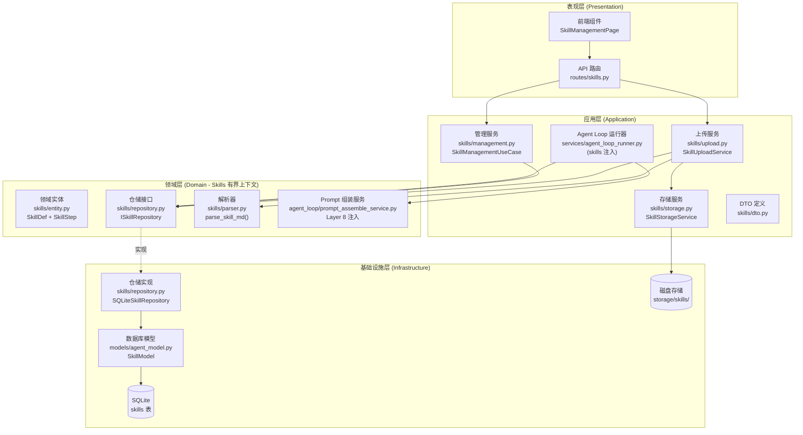
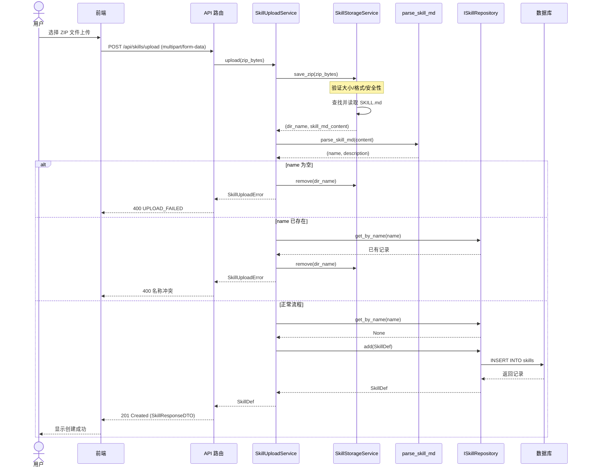
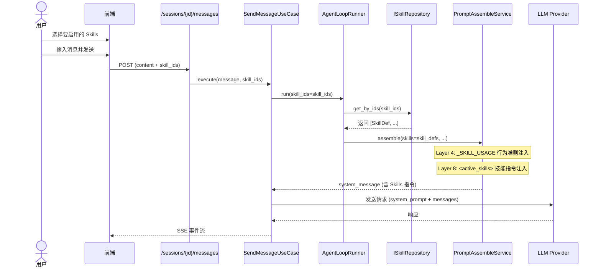
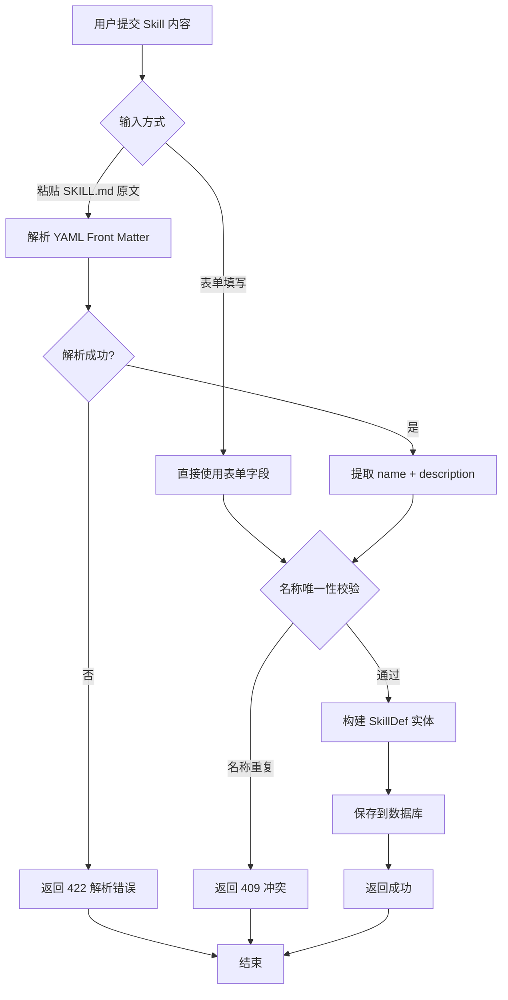

# Skills 模块技术方案

> **一句话总结**: Skills 模块采用 DDD 有界上下文设计，通过 ZIP 上传创建技能，自动解析 SKILL.md 提取元数据，并在对话时通过 Prompt Layer 8 `<active_skills>` 标签将选中的技能指令注入 LLM 系统提示词。

## 1. 范围

本模块负责 **Skills（技能）的上传、维护和对话注入**，聚焦于以下领域：

- Skills CRUD 管理（创建、查看、编辑、删除）
- Skills 内容解析与验证（SKILL.md 格式）
- Skills 列表展示与详情查看
- 对话时 Skills 选择与 Prompt 注入

**不包含**：
- Skill 执行引擎（即 LLM 调用 Skill 后的实际步骤编排执行）
- SkillToolAdapter 的工具注册与绑定（后续迭代）
- Skill 版本管理和发布机制
- Skill 市场/商店

**与现有系统的关系**：
- 本模块提供 `SkillDef` 实例列表，注入到 `PromptAssembleService.assemble(skills=...)` 的 Layer 8
- 注入逻辑已在 `send_message.py:401` 处预留（当前 `skills=[]`）

---

## 2. 概要设计

### 2.1 主流程

#### 2.1.1 模块架构图



#### 2.1.2 Skills ZIP 上传主流程



#### 2.1.3 对话时 Skills 选择与注入流程



#### 2.1.4 Skill 内容解析流程



### 2.2 模块说明

#### 2.2.1 Skill 管理模块

**职责**：提供 Skills 的 CRUD 管理能力

**功能**：
- 创建 Skill（表单填写 / SKILL.md 内容粘贴）
- 查看 Skill 列表（分页、按分类筛选）
- 查看 Skill 详情
- 编辑 Skill 内容
- 删除 Skill
- 切换 Skill 启用/禁用状态

**涉及文件**：
- 后端：`backend/src/domain/entities/skill_def.py`（扩展）
- 后端：`backend/src/domain/repositories/skill_repository.py`（新建）
- 后端：`backend/src/application/dtos/skill_dto.py`（新建）
- 后端：`backend/src/infrastructure/database/models/agent_model.py`（新增 SkillModel）
- 后端：`backend/src/infrastructure/repositories/sqlite_skill_repo.py`（新建）
- 后端：`backend/src/presentation/routes/skills.py`（新建）
- 前端：`frontend/src/domain/entities/skill.ts`（新建）
- 前端：`frontend/src/infrastructure/api/skillApi.ts`（新建）
- 前端：`frontend/src/application/services/useSkillManagement.ts`（新建）
- 前端：`frontend/src/presentation/pages/SkillManagementPage.tsx`（新建）
- 前端：`frontend/src/presentation/pages/SkillEditPage.tsx`（新建）

#### 2.2.2 对话 Skill 选择模块

**职责**：在对话时允许用户选择要激活的 Skills，并注入到 Prompt

**功能**：
- 对话界面展示可用 Skills 列表（仅启用状态的）
- 用户选择/取消选择 Skills
- 发送消息时携带选中的 skill_ids
- SendMessageUseCase 中根据 skill_ids 查询并注入到 Prompt Layer 8

**涉及文件**：
- 后端：`backend/src/application/use_cases/send_message.py`（修改，填充 skills 参数）
- 后端：`backend/src/presentation/routes/sessions.py`（修改 SendMessageRequest 增加 skill_ids）
- 前端：`frontend/src/domain/entities/session.ts`（修改 SendMessageRequest）
- 前端：`frontend/src/presentation/components/chat/SkillSelector.tsx`（新建）
- 前端：`frontend/src/presentation/components/chat/MessageInput.tsx`（修改，集成选择器）

---

## 3. 详细设计

### 3.1 接口设计

#### 3.1.1 API 端点

| 方法 | 路径 | 说明 | 请求体 | 响应体 | 状态码 |
|------|------|------|--------|--------|--------|
| POST | /api/skills | 创建 Skill | CreateSkillDTO | SkillResponseDTO | 201/409/422 |
| GET | /api/skills | Skill 列表 | - (query: page, page_size, category, enabled) | SkillListResponseDTO | 200 |
| GET | /api/skills/{id} | Skill 详情 | - | SkillResponseDTO | 200/404 |
| PUT | /api/skills/{id} | 更新 Skill | UpdateSkillDTO | SkillResponseDTO | 200/404/409 |
| DELETE | /api/skills/{id} | 删除 Skill | - | - | 204/404 |
| PATCH | /api/skills/{id}/toggle | 切换启用状态 | - | SkillResponseDTO | 200/404 |
| GET | /api/skills/enabled | 获取所有启用的 Skills（对话选择用） | - | SkillListResponseDTO | 200 |

**对话消息接口修改**：

| 方法 | 路径 | 说明 | 修改点 |
|------|------|------|--------|
| POST | /api/agents/{agent_id}/sessions/{session_id}/messages | 发送消息 | 请求体增加 `skill_ids: list[str]` 可选字段 |

#### 3.1.2 DTO 定义

**SkillStepDTO** -- 定义一个执行步骤，包含三个字段：
- `name` (必填, 1-100 字符)：步骤名称
- `description` (必填, 1-500 字符)：步骤描述
- `tool_name` (可选, 最多 100 字符)：关联的工具名称

**CreateSkillDTO** -- 创建 Skill 的请求体，包含以下字段：

- `name` (必填, 1-100 字符)：Skill 唯一名称标识
- `description` (必填, 1-1000 字符)：Skill 功能描述
- `content` (可选, 默认空字符串, 最多 50000 字符)：Skill 完整 Markdown 内容
- `trigger_keywords` (可选, 默认空列表)：触发关键词列表
- `steps` (可选, 默认空列表)：执行步骤列表，每个元素为 SkillStepDTO
- `category` (可选, 默认 "general", 最多 50 字符)：分类标签

**UpdateSkillDTO** -- 更新 Skill 的请求体（PATCH 语义），所有字段均为可选。字段集合与 CreateSkillDTO 相同，但每项可为 null 表示不修改。

**SkillResponseDTO** -- Skill 的响应体，包含所有字段：id, name, description, content, trigger_keywords, steps, category, enabled, created_at, updated_at（可能为空）。

**SkillListResponseDTO** -- 分页列表响应，包含 `data`（SkillResponseDTO 数组）和 `total`（总数）两个字段。

### 3.2 数据库设计

#### 3.2.1 表结构

`skills` 表设计如下：

| 字段 | 类型 | 约束 | 默认值 | 说明 |
| ------ | ------ | ------ | ------ | ------ |
| `id` | VARCHAR(36) | PRIMARY KEY | - | UUID 主键 |
| `name` | VARCHAR(100) | NOT NULL, UNIQUE | - | Skill 唯一名称 |
| `description` | TEXT | NOT NULL | `''` | 功能描述 |
| `content` | TEXT | NOT NULL | `''` | 完整 Markdown 内容 |
| `trigger_keywords` | TEXT | NOT NULL | `'[]'` | 触发关键词（JSON 数组） |
| `steps` | TEXT | NOT NULL | `'[]'` | 执行步骤（JSON 数组） |
| `category` | VARCHAR(50) | NOT NULL | `'general'` | 分类标签 |
| `enabled` | INTEGER | NOT NULL | `1` | 启用状态（0/1） |
| `created_at` | DATETIME | NOT NULL | `datetime('now')` | 创建时间 |
| `updated_at` | DATETIME | - | NULL | 更新时间 |

#### 3.2.2 字段说明

| 字段 | 类型 | 默认值 | 说明 |
|------|------|--------|------|
| `id` | VARCHAR(36) | UUID | 主键 |
| `name` | VARCHAR(100) | - | Skill 名称，唯一 |
| `description` | TEXT | '' | Skill 功能描述 |
| `content` | TEXT | '' | Skill 完整 Markdown 内容 |
| `trigger_keywords` | TEXT (JSON) | '[]' | 触发关键词 JSON 数组 |
| `steps` | TEXT (JSON) | '[]' | 执行步骤 JSON 数组 |
| `category` | VARCHAR(50) | 'general' | 分类标签 |
| `enabled` | INTEGER | 1 | 是否启用（0/1） |
| `created_at` | DATETIME | now() | 创建时间 |
| `updated_at` | DATETIME | NULL | 更新时间 |

#### 3.2.3 索引设计

索引设计：`name` 字段通过 UNIQUE 约束自动创建唯一索引；额外创建以下查询索引：

- `idx_skills_category`：按分类筛选查询
- `idx_skills_enabled`：按启用状态过滤（对话注入场景）
- `idx_skills_created_at`：按创建时间倒序排列（列表页默认排序）

#### 3.2.4 SQLAlchemy 模型

在 `agent_model.py` 中新增 `SkillModel` 类，映射到 `skills` 表。字段与表结构一一对应：id (String/36, 主键)、name (String/100, 唯一索引)、description (Text)、content (Text)、trigger_keywords (Text, JSON 存储)、steps (Text, JSON 存储)、category (String/50)、enabled (Integer, 0/1)、created_at (DateTime)、updated_at (DateTime, 可为空)。

#### 3.2.5 领域实体扩展

现有 `SkillDef` 实体需扩展以支持持久化：

`SkillDef` 是 Skills 有界上下文的核心领域实体（dataclass），扩展后包含以下字段：

- **核心字段**（已有）：`name`、`description`、`steps`（SkillStep 列表）、`trigger_keywords`（字符串列表）、`category`（默认 "general"）
- **新增持久化字段**：`id`（主键 UUID）、`content`（完整 Markdown 原始内容）、`enabled`（布尔，默认 true）、`created_at`（创建时间）、`updated_at`（更新时间，可为空）

实体提供两个关键行为方法：

- `to_prompt_section()` -- 生成注入 LLM 系统提示词的技能描述段落。策略：若 `content` 非空（即用户上传了完整 SKILL.md 内容），直接返回原始内容；否则根据 `steps` 和 `trigger_keywords` 结构化拼装摘要文本。
- `toggle_enabled()` -- 切换启用状态并更新 `updated_at` 时间戳。

#### 3.2.6 Repository 接口

`ISkillRepository` 是 Skills 有界上下文的仓储接口（抽象类），定义了以下数据访问方法：

| 方法 | 参数 | 返回值 | 用途 |
|------|------|--------|------|
| `add` | `SkillDef` | `SkillDef` | 新增 Skill 记录 |
| `get_by_id` | `skill_id: str` | `Optional[SkillDef]` | 按 ID 查询单条 |
| `get_by_name` | `name: str` | `Optional[SkillDef]` | 按名称查询（唯一性校验） |
| `list_all` | `limit, offset, category, enabled` | `(list[SkillDef], int)` | 分页 + 条件筛选列表 |
| `get_enabled` | 无 | `list[SkillDef]` | 获取所有启用的 Skills（对话注入用） |
| `get_by_ids` | `skill_ids: list[str]` | `list[SkillDef]` | 批量按 ID 查询（对话注入用） |
| `update` | `SkillDef` | `SkillDef` | 更新 Skill 记录 |
| `remove` | `skill_id: str` | `bool` | 删除 Skill 记录 |

所有方法均为异步（`async`）。具体实现类 `SQLiteSkillRepository` 使用 SQLAlchemy 将 `SkillModel` 与 `SkillDef` 互转。

### 3.3 前端设计

#### 3.3.1 页面结构

**SkillManagementPage**（`/skills`）
- 顶部标题 + 创建按钮
- 分类筛选 Tab（全部 / general / development / ...）
- Skill 卡片网格列表
  - 卡片内容：名称、描述、分类标签、触发关键词、启用开关
  - 操作按钮：编辑、删除

**SkillEditPage**（`/skills/new`、`/skills/:id/edit`）
- 基本信息表单（名称、描述、分类）
- 触发关键词输入（Tag 输入组件）
- 步骤编辑器（可增删步骤，每步包含名称、描述、可选工具名）
- Skill 内容编辑器（Markdown 文本域，支持粘贴 SKILL.md 内容）
- 保存/取消按钮

**对话页面 Skills 选择器**（集成到 `AgentSessionPage`）
- 在消息输入框上方或侧边，展示可用 Skills 列表
- 支持勾选/取消 Skills
- 显示已选中 Skills 的 badge

#### 3.3.2 组件清单

| 组件 | 职责 |
|------|------|
| `SkillManagementPage` | Skills 管理列表页 |
| `SkillEditPage` | Skill 创建/编辑页 |
| `SkillCard` | 单个 Skill 卡片展示 |
| `SkillStepEditor` | 步骤列表编辑器 |
| `SkillSelector` | 对话中的 Skill 选择组件 |
| `DeleteSkillDialog` | 删除确认弹窗 |

#### 3.3.3 前端实体类型

前端实体类型定义（TypeScript interfaces）：

- `Skill` -- 与后端 `SkillResponseDTO` 对应，包含 id, name, description, content, trigger_keywords, steps, category, enabled, created_at, updated_at
- `SkillStep` -- 步骤子结构，包含 name, description, tool_name（可为 null）
- `CreateSkillRequest` -- 创建请求体，name 和 description 必填，其余字段可选
- `UpdateSkillRequest` -- 更新请求体，所有字段可选（PATCH 语义）
- `SkillListResponse` -- 列表响应，包含 data 数组和 total 总数

分类常量 `SKILL_CATEGORIES` 定义中文映射：general（通用）、development（开发）、analysis（分析）、writing（写作）、design（设计）。

#### 3.3.4 API 客户端

前端 API 客户端 `skillApi` 封装对 `/api/skills` 端点的所有 HTTP 调用，使用项目统一的 `apiClient` 实例：

| 方法 | HTTP 方法 | 路径 | 说明 |
| ------ | ------ | ------ | ------ |
| `list` | GET | `/skills` | 分页列表，支持 page/pageSize/category/enabled 查询参数 |
| `get` | GET | `/skills/:id` | 获取单条详情 |
| `create` | POST | `/skills` | 创建新 Skill |
| `update` | PUT | `/skills/:id` | 更新已有 Skill |
| `delete` | DELETE | `/skills/:id` | 删除 Skill |
| `toggle` | PATCH | `/skills/:id/toggle` | 切换启用/禁用状态 |
| `listEnabled` | GET | `/skills/enabled` | 获取所有启用 Skills（对话选择器用） |

#### 3.3.5 对话消息接口修改

前端 `SendMessageRequest` 接口扩展：在现有字段（`content`, `model`, `max_turns`, `workspace`）基础上新增可选字段 `skill_ids: string[]`，用于携带用户在对话页选择的 Skill ID 列表发送到后端。

### 3.4 错误处理

| 场景 | HTTP 状态码 | 错误码 | 说明 |
|------|-------------|--------|------|
| 名称重复 | 409 | DUPLICATE_SKILL_NAME | 创建或更新时名称已存在 |
| Skill 不存在 | 404 | SKILL_NOT_FOUND | 操作的 Skill 不存在 |
| 参数错误 | 422 | VALIDATION_ERROR | 请求参数验证失败 |
| 内容解析失败 | 422 | SKILL_PARSE_ERROR | SKILL.md 格式解析失败 |

---

## 4. 对话注入实现方案

### 4.1 后端修改点

#### 4.1.1 SendMessageRequest 扩展

`SendMessageRequestDTO` 扩展：在现有字段基础上新增 `skill_ids: list[str]`（默认空列表），由前端对话页传递用户选中的 Skill ID 列表。

#### 4.1.2 SendMessageUseCase 修改

`SendMessageUseCase._run_agent_loop()` 修改要点：将原来硬编码的 `skills=[]` 替换为运行时逻辑——若请求携带 `skill_ids`，则通过 `skill_repo.get_by_ids(skill_ids)` 查询对应的 `SkillDef` 列表，传入 `assemble_service.assemble(skills=skill_defs, ...)` 完成 Layer 8 注入。不传 `skill_ids` 时维持空列表行为，确保向后兼容。

### 4.2 前端交互设计

#### 4.2.1 SkillSelector 组件

位于消息输入框上方，显示方式：
- 默认折叠，显示 "Skills (N)" 按钮
- 点击展开，显示所有启用的 Skills 列表
- 每个 Skill 可勾选/取消
- 选中的 Skills 以 badge 形式显示在输入框上方

```text
┌─────────────────────────────────────────────────────────────┐
│ [Skills ▾]  已选: [code_review ×] [debug_assistant ×]      │
├─────────────────────────────────────────────────────────────┤
│ ┌──────────────────────────────────────────────────────┐   │
│ │ ☑ code_review    - 系统化代码审查                    │   │
│ │ ☑ debug_assistant - 交互式调试辅助                   │   │
│ │ ☐ ddd_designer   - DDD 模块技术方案设计             │   │
│ └──────────────────────────────────────────────────────┘   │
├─────────────────────────────────────────────────────────────┤
│ [输入消息...]                                    [发送]     │
└─────────────────────────────────────────────────────────────┘
```

---

## 5. 路由注册

**后端路由注册**：在 `app.py` 中导入 `skills_router` 并通过 `app.include_router(skills_router)` 注册到 FastAPI 应用。

**前端路由注册**：在 `App.tsx` 中新增三条路由映射：

- `/skills` 渲染 `SkillManagementPage`（列表页）
- `/skills/new` 渲染 `SkillEditPage`（新建页）
- `/skills/:id/edit` 渲染 `SkillEditPage`（编辑页，路径参数传递 skill ID）

---

## 6. 测试计划

### 6.1 功能测试

#### 测试场景 1: 创建 Skill - 正常流程

- **前置条件**: 数据库为空
- **测试步骤**:
  1. POST /api/skills，携带合法的 CreateSkillDTO
  2. 验证响应码 201
  3. GET /api/skills/{id} 验证数据持久化
- **预期结果**: Skill 创建成功并可查询
- **验收标准**: 响应包含完整字段，enabled 默认为 true

#### 测试场景 2: 创建 Skill - 名称重复

- **前置条件**: 已存在名为 "code_review" 的 Skill
- **测试步骤**:
  1. POST /api/skills，name="code_review"
- **预期结果**: 返回 409，错误码 DUPLICATE_SKILL_NAME
- **验收标准**: 不创建重复记录

#### 测试场景 3: 对话注入 Skills

- **前置条件**: 存在启用状态的 Skill
- **测试步骤**:
  1. POST /api/agents/{id}/sessions/{sid}/messages，携带 skill_ids
  2. 验证 system_prompt 中包含 `<active_skills>` 标签
- **预期结果**: LLM 收到的 system_prompt 包含选中的 Skills 内容
- **验收标准**: Layer 8 正确注入

#### 测试场景 4: 切换启用状态

- **前置条件**: 已存在启用状态的 Skill
- **测试步骤**:
  1. PATCH /api/skills/{id}/toggle
  2. GET /api/skills/enabled 验证不在列表中
- **预期结果**: enabled 变为 false，不再出现在启用列表中
- **验收标准**: 状态正确切换

### 6.2 单元测试

单元测试策略聚焦 `SkillDef` 实体的核心行为方法，覆盖以下场景：

- `to_prompt_section()` 有 content 时 -- 验证优先返回原始 content
- `to_prompt_section()` 无 content 时 -- 验证结构化生成包含 triggers 和 steps 的正确格式
- `toggle_enabled()` -- 验证状态翻转及 `updated_at` 时间戳更新

### 6.3 回归测试

#### 受影响的现有功能

- [ ] Prompt 组装：确认 skills=[] 时行为不变
- [ ] 发送消息 API：确认不传 skill_ids 时向后兼容
- [ ] 数据库初始化：确认 init_db() 能正确创建 skills 表

#### 自动化验证

自动化验证将通过两条 pytest 命令执行：一是运行所有 skill 相关的测试用例（按名称过滤 `-k "skill"`），二是单独验证 Prompt 组装服务的现有行为未被破坏。

---

## 7. 验收标准

- [ ] Skills CRUD API 全部端点可用
- [ ] 前端管理界面支持 Skill 的创建、编辑、删除、启用/禁用
- [ ] 对话界面可选择 Skills，发送消息时正确注入到 Prompt Layer 8
- [ ] 不传 skill_ids 时系统行为与当前一致（向后兼容）
- [ ] 所有单元测试通过
- [ ] 所有功能测试通过
- [ ] 测试覆盖率 >= 80%
