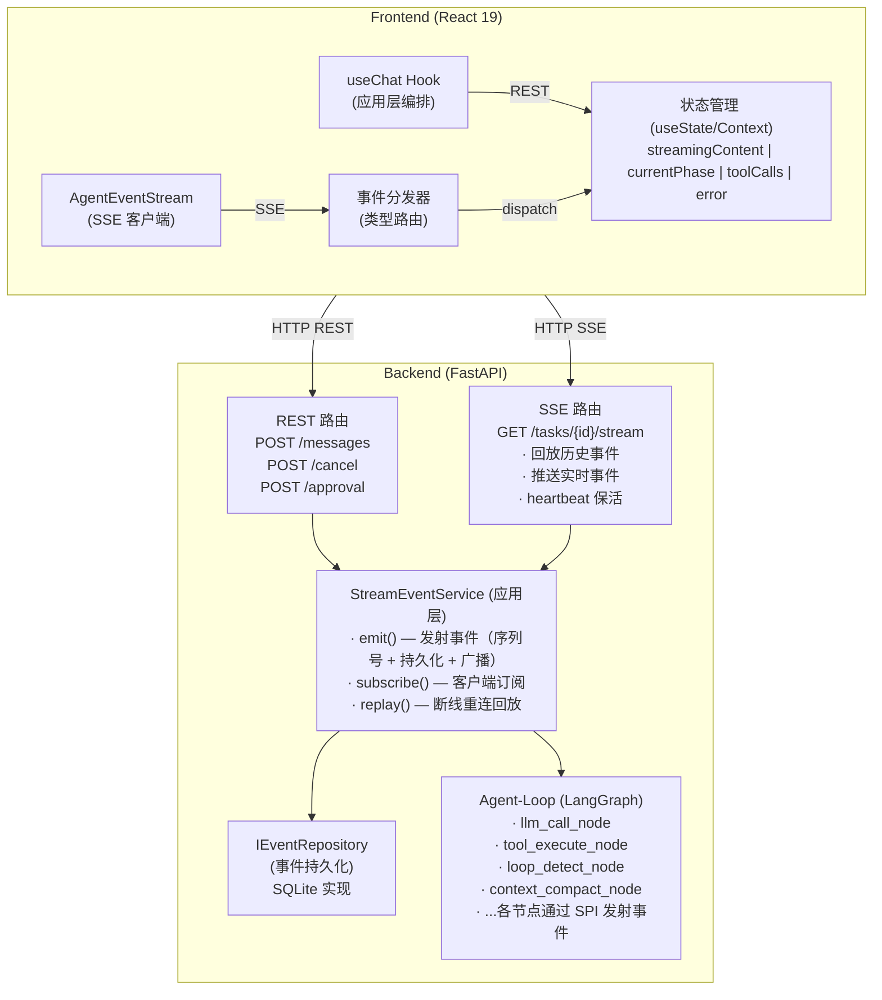
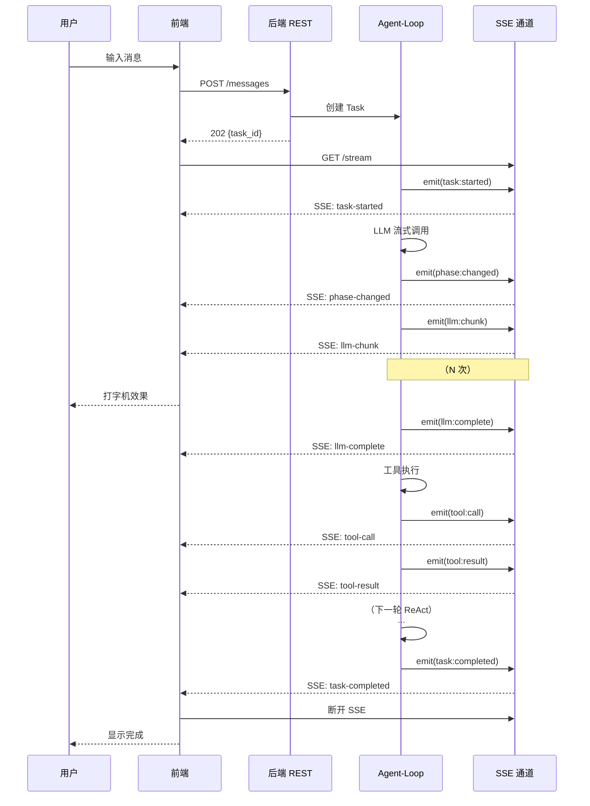
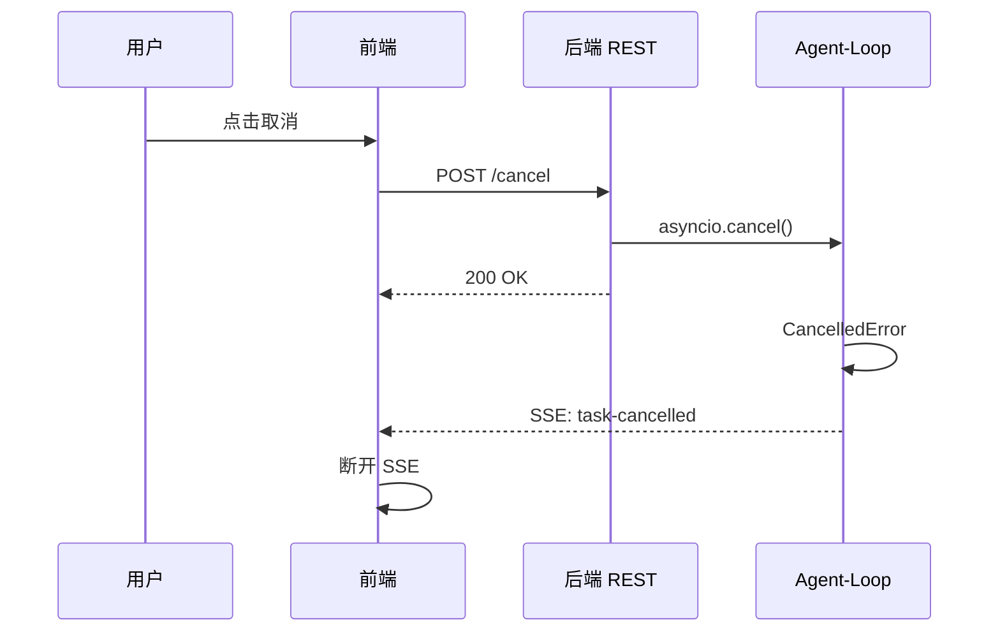
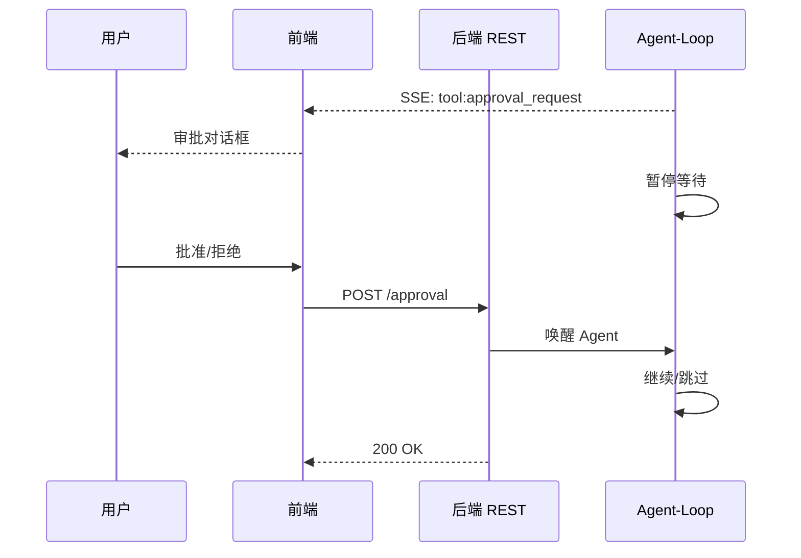
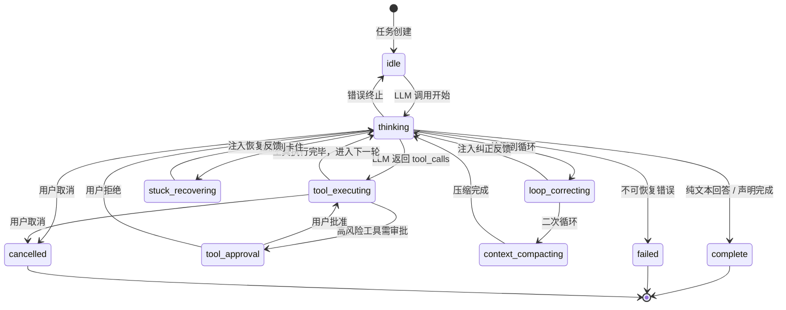
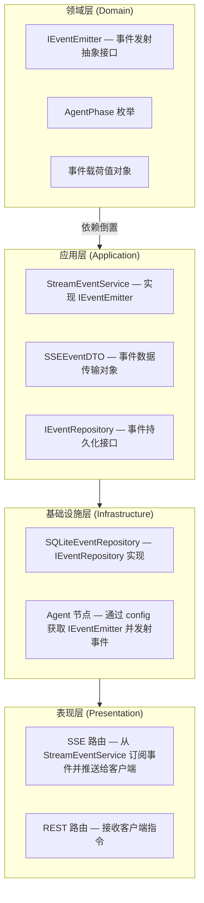
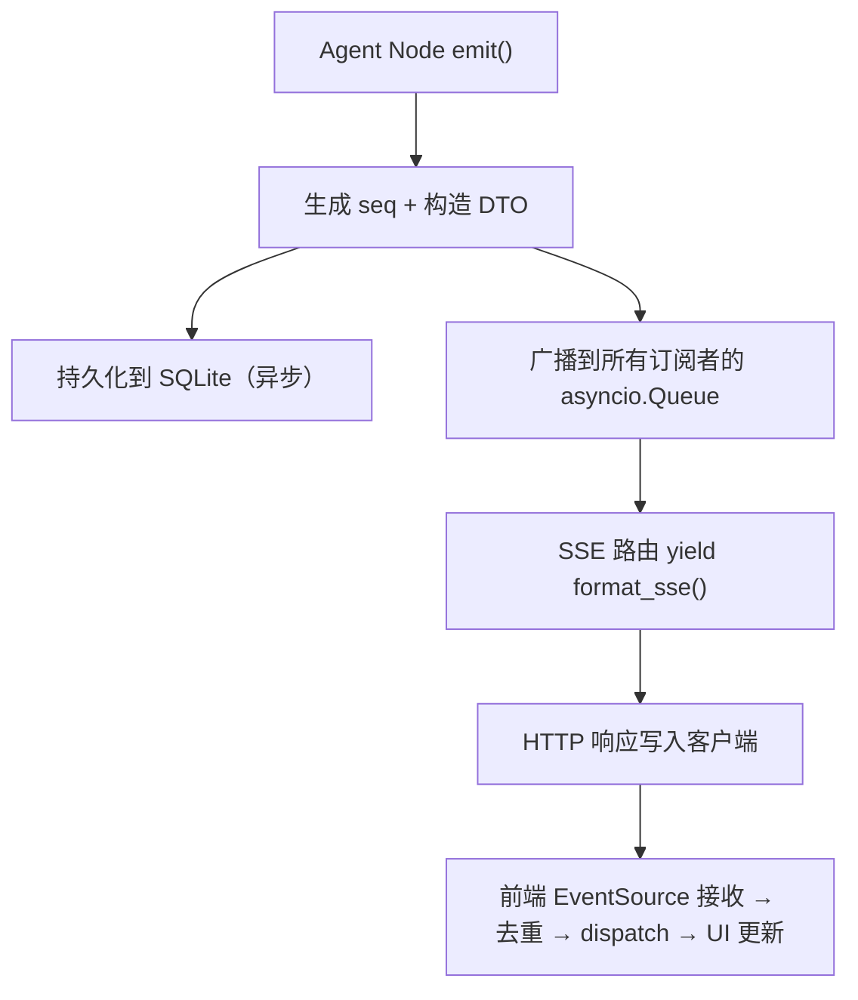

# 3. 通信协议设计

> 对应 `0_outline.md` 第 3 章「通信协议」  
> 参考研究：`research/frontend-interaction-design.md`（12 款主流 Coding Agent 前端交互分析）

---

## 一、概要设计

### 1.1 设计目标

为 Agent-Loop 的 **流式执行过程** 与 **前端实时渲染** 之间建立一套可靠的通信协议，满足以下核心需求：

| 需求 | 说明 |
|------|------|
| 流式输出 | LLM token 逐字推送，前端实时渲染打字机效果 |
| 阶段感知 | 前端实时显示 Agent 当前执行阶段（思考/工具调用/检测等） |
| 工具调用可视化 | 工具调用过程与结果实时展示 |
| 人机交互 | 支持工具审批、任务取消等用户干预 |
| 断线恢复 | 网络断开后自动重连并补发丢失事件 |
| 可扩展 | 新增事件类型无需修改传输层 |

### 1.2 协议选型：SSE + REST 混合架构

**核心决策：采用 SSE（Server-Sent Events）作为主推送通道，REST API 处理所有客户端指令。**

#### 选型依据

在研究了 12 款主流产品的技术方案后，我们对比了三种主要传输方案：

| 维度 | SSE + REST | WebSocket + JSON-RPC | Socket.IO |
|------|-----------|---------------------|-----------|
| 数据流向匹配度 | **高** — Agent 场景 95% 是 server→client | 中 — 双向能力冗余 | 中 — 双向能力冗余 |
| 浏览器原生支持 | **EventSource 原生** | 原生 WebSocket | 需引入库 |
| 自动重连 | **浏览器内置** | 需自行实现 | 库内置 |
| Last-Event-ID | **HTTP 标准** | 需自行实现 | 无 |
| FastAPI 集成 | **StreamingResponse 天然支持** | 需额外库 (websockets) | 需 python-socketio |
| HTTP/2 兼容 | **完全兼容，可复用连接** | 独立 TCP 连接 | 降级到轮询 |
| 代理/CDN 穿透 | **标准 HTTP，透明穿透** | 可能被拦截 | 有降级策略 |
| 实现复杂度 | **低** | 高（心跳/帧解析/重连） | 中 |

**关键判断：** Coding Agent 的核心交互模式是「客户端发指令，服务端流式推送执行过程」。SSE 天然匹配这一单向流模式，WebSocket 的双向能力在此场景下收益有限但代价显著（实现复杂度、运维复杂度）。客户端的少量上行操作（发消息、取消、审批）通过 REST API 即可高效处理。

> **与参考方案的差异说明：** `frontend-interaction-design.md` 推荐 WebSocket + JSON-RPC，该方案适合需要高频双向交互的产品（如 OpenClaw 的实时协作编辑）。本项目聚焦于 Agent 流式输出场景，SSE + REST 是更简洁且可靠的选择。OpenHands 在 V0→V1 的演进中也证明了 WebSocket 的维护成本高于预期。

### 1.3 整体架构



### 1.4 主链路设计

#### 1.4.1 核心交互时序



#### 1.4.2 取消任务链路



#### 1.4.3 工具审批链路（未来扩展）



### 1.5 Agent 阶段状态机

Agent-Loop 在执行过程中经历的阶段，通过 `phase:changed` 事件推送给前端：



**阶段枚举定义：**

| 阶段 | 说明 | 前端表现 |
|------|------|----------|
| `idle` | 空闲，等待任务 | 无特殊显示 |
| `thinking` | LLM 推理中 | 显示「思考中...」+ 流式文本 |
| `tool_executing` | 工具执行中 | 显示工具调用卡片 |
| `tool_approval` | 等待用户审批 | 弹出审批对话框 |
| `loop_correcting` | 循环纠正中 | 显示「检测到循环，正在纠正...」 |
| `stuck_recovering` | 卡住恢复中 | 显示「Agent 恢复中...」 |
| `context_compacting` | 上下文压缩中 | 显示「压缩上下文...」 |
| `complete` | 任务完成 | 显示完成状态 |
| `failed` | 任务失败 | 显示错误信息 |
| `cancelled` | 用户取消 | 显示已取消 |

### 1.6 事件分类体系

所有事件按职责分为 5 大类：

```
AgentEvent
├── 1. 生命周期事件 (Lifecycle)
│   ├── task:started       — 任务开始执行
│   ├── task:completed     — 任务成功完成
│   ├── task:failed        — 任务执行失败
│   └── task:cancelled     — 任务被取消
│
├── 2. 阶段事件 (Phase)
│   └── phase:changed      — Agent 阶段切换（携带 phase/previousPhase/turn）
│
├── 3. LLM 交互事件 (LLM)
│   ├── llm:chunk          — LLM 流式输出增量文本（高频，~50-200/s）
│   └── llm:complete       — LLM 单轮输出完成（含完整文本 + tool_calls）
│
├── 4. 工具事件 (Tool)
│   ├── tool:call          — 工具调用开始
│   ├── tool:result        — 工具执行结果
│   └── tool:approval_request — 高风险工具审批请求（未来扩展）
│
└── 5. 系统事件 (System)
    ├── context:compacting — 上下文压缩（含 before/after token 数）
    ├── loop:detected      — 循环检测触发
    ├── stuck:detected     — 卡住检测触发
    └── session:message:saved — 最终消息落库（前端替换占位消息）
```

**事件优先级分级（用于背压控制）：**

| 优先级 | 事件 | 策略 |
|--------|------|------|
| **Critical** | task:started/completed/failed/cancelled, session:message:saved | 必达，绝不丢弃 |
| **High** | phase:changed, tool:call, tool:result, llm:complete | 必达 |
| **Normal** | context:compacting, loop:detected, stuck:detected | 可延迟 |
| **Best-effort** | llm:chunk | 高频事件，客户端过慢时可合并/跳过 |

---

## 二、详细设计

### 2.1 SSE 传输协议

#### 2.1.1 SSE 事件格式

遵循 [SSE 标准](https://html.spec.whatwg.org/multipage/server-sent-events.html)：

```
id: <seq>
event: <event-type>
data: <json-payload>

```

**协议约定：**

- `id` — 单调递增的序列号（整数），用于断线重连的 `Last-Event-ID`
- `event` — 事件类型名，**冒号(`:`)替换为连字符(`-`)**，因 SSE event 字段不支持冒号
  - 后端发射 `llm:chunk` → SSE 协议层为 `llm-chunk` → 前端接收后还原为 `llm:chunk`
- `data` — JSON 格式的事件信封，包含完整事件信息

**示例：**

```
id: 42
event: llm-chunk
data: {"id":"42","event_type":"llm:chunk","data":{"taskId":"t-123","turn":2,"text":"Hello","delta":true},"timestamp":"2026-04-30T10:00:00.123Z"}

```

#### 2.1.2 连接保活

- 后端每 **15 秒** 发送一次 SSE 注释作为心跳：

```
: heartbeat

```

- 前端 `EventSource` 在连接丢失时自动触发重连（浏览器内置行为）
- 重连间隔由浏览器控制，通常 3-5 秒

#### 2.1.3 断线重连与事件补发

利用 SSE 标准的 `Last-Event-ID` 机制：

```
1. 前端 EventSource 自动在重连时发送 Last-Event-ID HTTP 头
2. 后端 SSE 路由读取 Last-Event-ID
3. 从 EventRepository 查询 seq > Last-Event-ID 的事件
4. 按序回放缺失事件
5. 切换到实时推送
```

**关键实现细节：**

- 首次连接（无 Last-Event-ID）：回放该 task 的全部已有事件
- 重连（有 Last-Event-ID）：仅补发缺失事件
- 先订阅队列再回放，防止回放期间产生的新事件丢失
- 用 `max_replayed_seq` 标记跳过已回放事件，避免重复推送

#### 2.1.4 背压控制

SSE 本身基于 HTTP 长连接，TCP 流控天然提供背压。额外策略：

| 场景 | 策略 |
|------|------|
| `llm:chunk` 高频发射 | 后端每 N 个 chunk 批量写入 DB（减少 I/O），但实时推送不受影响 |
| 前端处理慢 | TCP 缓冲区满 → 后端 `yield` 自然阻塞 → 上游 LLM 流式暂停 |
| 前端渲染卡顿 | 前端用 `requestAnimationFrame` 节流渲染，事件接收不受影响 |

### 2.2 事件数据模型（后端）

#### 2.2.1 事件信封 — SSEEventDTO

所有事件共享统一的信封结构：

```python
# application/dtos/event_dto.py

class SSEEventDTO(BaseModel):
    """SSE 事件统一信封 — 应用层 DTO"""

    id: str = Field(..., description="事件序列号（单调递增整数的字符串形式）")
    event_type: str = Field(
        ...,
        description="事件类型（冒号分隔），如 llm:chunk、tool:result",
        examples=["task:started", "llm:chunk", "tool:result"],
    )
    data: Dict[str, Any] = Field(..., description="事件载荷（各事件类型不同）")
    timestamp: str = Field(..., description="ISO 8601 时间戳")
```

#### 2.2.2 事件载荷定义

每种事件的 `data` 字段结构：

**生命周期事件：**

```python
# task:started
{"taskId": "t-abc123"}

# task:completed
{"taskId": "t-abc123", "result": "任务执行结果文本"}

# task:failed
{"taskId": "t-abc123", "error": "错误描述"}

# task:cancelled
{"taskId": "t-abc123"}
```

**阶段事件：**

```python
# phase:changed
{
    "taskId": "t-abc123",
    "phase": "thinking",           # 新阶段
    "previousPhase": "idle",       # 前一阶段
    "turn": 3                      # 当前轮次
}
```

**LLM 交互事件：**

```python
# llm:chunk（高频事件）
{
    "taskId": "t-abc123",
    "turn": 2,
    "text": "Hello",               # 增量文本片段
    "delta": true                   # 标识为增量（非全量）
}

# llm:complete
{
    "taskId": "t-abc123",
    "turn": 2,
    "fullText": "I need to read the file...",  # 本轮完整文本
    "toolCalls": [                              # 工具调用列表（可为空）
        {"id": "tc-1", "name": "read_file", "args": {"path": "/src/main.py"}}
    ]
}
```

**工具事件：**

```python
# tool:call
{
    "taskId": "t-abc123",
    "toolCallId": "tc-1",
    "toolName": "read_file",
    "input": {"path": "/src/main.py"}
}

# tool:result
{
    "taskId": "t-abc123",
    "toolCallId": "tc-1",
    "toolName": "read_file",
    "status": "success",            # "success" | "error"
    "output": "文件内容...",         # 成功时的输出
    "error": null                    # 失败时的错误信息
}

# tool:approval_request（未来扩展）
{
    "taskId": "t-abc123",
    "toolCallId": "tc-2",
    "toolName": "execute_command",
    "input": {"command": "rm -rf /tmp/old"},
    "risk": "high",
    "reason": "该命令会删除文件",
    "timeout": 60000                # 超时自动拒绝（ms）
}
```

**系统事件：**

```python
# context:compacting
{
    "taskId": "t-abc123",
    "beforeTokens": 12000,
    "afterTokens": 4000
}

# loop:detected
{
    "taskId": "t-abc123",
    "loopType": "tool_repeat",      # "tool_repeat" | "content_repeat"
    "count": 1,                      # 第几次检测到
    "action": "feedback_injected"    # 采取的恢复措施
}

# stuck:detected
{
    "taskId": "t-abc123",
    "stuckType": "monologue",       # "monologue" | "no_progress"
    "count": 1,
    "action": "feedback_injected"
}

# session:message:saved
{
    "taskId": "t-abc123",
    "message": {                     # 完整的 SessionMessage 对象
        "id": "msg-456",
        "session_id": "sess-789",
        "task_id": "t-abc123",
        "role": "assistant",
        "content": "完整的回答内容...",
        "tool_calls": [...],
        "tool_results": [...],
        "status": "completed",
        "error": null,
        "cost": {},
        "created_at": "2026-04-30T10:00:05.000Z"
    }
}
```

### 2.3 事件数据模型（前端）

#### 2.3.1 TypeScript 类型定义

```typescript
// domain/entities/events.ts

/** 所有事件 payload 都包含的基础字段 */
interface BaseEventPayload {
  taskId: string;
}

/** 事件名 → payload 类型的映射 */
interface AgentEventMap {
  // — 生命周期 —
  'task:started':    BaseEventPayload;
  'task:completed':  BaseEventPayload & { result?: string };
  'task:failed':     BaseEventPayload & { error: string };
  'task:cancelled':  BaseEventPayload;

  // — 阶段 —
  'phase:changed':   BaseEventPayload & {
    phase: AgentPhase;
    previousPhase: AgentPhase;
    turn: number;
  };

  // — LLM —
  'llm:chunk':       BaseEventPayload & { turn: number; text: string; delta: boolean };
  'llm:complete':    BaseEventPayload & {
    turn: number;
    fullText: string;
    toolCalls: Array<{ id: string; name: string; args: Record<string, unknown> }>;
  };

  // — 工具 —
  'tool:call':       BaseEventPayload & { toolCallId: string; toolName: string; input: Record<string, unknown> };
  'tool:result':     BaseEventPayload & { toolCallId: string; toolName: string; status: string; output?: string; error?: string };

  // — 系统 —
  'context:compacting': BaseEventPayload & { beforeTokens: number; afterTokens: number };
  'loop:detected':      BaseEventPayload & { loopType: string; count: number; action: string };
  'stuck:detected':     BaseEventPayload & { stuckType: string; count: number; action: string };
  'session:message:saved': BaseEventPayload & { message: SessionMessage };
}

/** Agent 执行阶段 */
type AgentPhase =
  | 'idle'
  | 'thinking'
  | 'tool_executing'
  | 'tool_approval'
  | 'loop_correcting'
  | 'stuck_recovering'
  | 'context_compacting'
  | 'complete'
  | 'failed'
  | 'cancelled';
```

#### 2.3.2 SSE 协议层事件名映射

后端事件名（冒号分隔）→ SSE 协议层（连字符）→ 前端还原（冒号分隔）：

```typescript
/** SSE 协议层使用的事件名列表（连字符格式） */
const SSE_EVENT_TYPES: readonly string[] = [
  'task-started',
  'task-completed',
  'task-failed',
  'task-cancelled',
  'phase-changed',
  'llm-chunk',
  'llm-complete',
  'tool-call',
  'tool-result',
  'context-compacting',
  'loop-detected',
  'stuck-detected',
  'session-message-saved',
];
```

### 2.4 SPI 设计：Agent-Loop 事件发射接口

SPI（Service Provider Interface）是 Agent-Loop 各节点与通信层之间的契约。设计目标：Agent-Loop 节点只依赖抽象接口，不感知 SSE/WebSocket 等传输细节。

#### 2.4.1 DDD 分层归属



#### 2.4.2 IEventEmitter 接口定义

```python
# domain/services/event_emitter.py

from abc import ABC, abstractmethod
from typing import Any, Dict


class IEventEmitter(ABC):
    """事件发射器接口 — 领域层 SPI

    Agent-Loop 各节点通过此接口发射事件，不感知传输层实现。
    所有节点通过 LangGraph config['configurable']['event_emitter'] 获取实例。
    """

    @abstractmethod
    async def emit(self, task_id: str, event_type: str, payload: Dict[str, Any]) -> None:
        """发射一个事件

        Args:
            task_id: 关联的任务 ID
            event_type: 事件类型（冒号分隔），如 "llm:chunk"、"tool:result"
            payload: 事件载荷，必须包含 "taskId" 字段

        实现约定：
            1. 生成单调递增的 seq 序列号
            2. 构造 SSEEventDTO 信封
            3. 持久化到 EventRepository
            4. 广播给所有订阅者
        """
        pass

    @abstractmethod
    async def emit_phase_changed(
        self,
        task_id: str,
        new_phase: str,
        previous_phase: str,
        turn: int,
    ) -> None:
        """发射阶段变更事件（便捷方法）

        高频操作，提供类型安全的快捷入口。
        """
        pass

    @abstractmethod
    async def emit_llm_chunk(
        self,
        task_id: str,
        turn: int,
        text: str,
    ) -> None:
        """发射 LLM 流式增量文本（便捷方法）

        高频操作，优化路径：
        - 实时推送给订阅者
        - 批量写入 DB（每 N 条合并写一次）
        """
        pass
```

#### 2.4.3 StreamEventService 实现 IEventEmitter

```python
# application/use_cases/stream_event.py

class StreamEventService(IEventEmitter):
    """SSE 事件服务 — 应用层

    实现 IEventEmitter 接口，提供：
    1. 事件发射（seq 生成 + 持久化 + 广播）
    2. 订阅管理（多客户端订阅同一 task）
    3. 事件回放（支持断线重连）
    """

    def __init__(self, event_repo: IEventRepository):
        self.event_repo = event_repo
        self._subscribers: Dict[str, List[asyncio.Queue]] = defaultdict(list)
        self._sequences: Dict[str, int] = defaultdict(int)
        self._chunk_buffer: Dict[str, List] = defaultdict(list)  # llm:chunk 批量写入缓冲

    async def emit(self, task_id: str, event_type: str, payload: Dict[str, Any]) -> None:
        self._sequences[task_id] += 1
        seq = self._sequences[task_id]

        event = SSEEventDTO.create(task_id, seq, event_type, payload)

        # 持久化策略：llm:chunk 批量写入，其他立即写入
        if event_type == "llm:chunk":
            self._chunk_buffer[task_id].append(event)
            if len(self._chunk_buffer[task_id]) >= 10:
                await self._flush_chunks(task_id)
        else:
            # 非 chunk 事件：先 flush 残留 chunks，再写入当前事件
            await self._flush_chunks(task_id)
            await self.event_repo.save(task_id, event)

        # 实时广播（不受批量写入影响）
        event_json = event.model_dump_json()
        for queue in self._subscribers.get(task_id, []):
            await queue.put(event_json)

    async def emit_phase_changed(self, task_id, new_phase, previous_phase, turn):
        await self.emit(task_id, "phase:changed", {
            "taskId": task_id,
            "phase": new_phase,
            "previousPhase": previous_phase,
            "turn": turn,
        })

    async def emit_llm_chunk(self, task_id, turn, text):
        await self.emit(task_id, "llm:chunk", {
            "taskId": task_id,
            "turn": turn,
            "text": text,
            "delta": True,
        })

    async def _flush_chunks(self, task_id: str) -> None:
        """批量写入缓冲的 llm:chunk 事件"""
        chunks = self._chunk_buffer.pop(task_id, [])
        if chunks:
            await self.event_repo.save_batch(task_id, chunks)

    # --- 订阅管理 ---

    async def subscribe(self, task_id: str) -> asyncio.Queue:
        queue: asyncio.Queue = asyncio.Queue()
        self._subscribers[task_id].append(queue)
        return queue

    async def unsubscribe(self, task_id: str, queue: asyncio.Queue) -> None:
        if task_id in self._subscribers:
            self._subscribers[task_id].remove(queue)
            if not self._subscribers[task_id]:
                del self._subscribers[task_id]

    # --- 回放 ---

    async def get_all_events(self, task_id: str) -> List[str]:
        await self._flush_chunks(task_id)
        events = await self.event_repo.get_by_task_id(task_id)
        return [e.model_dump_json() for e in events]

    async def get_events_after(self, task_id: str, last_event_id: str) -> List[str]:
        await self._flush_chunks(task_id)
        events = await self.event_repo.get_after(task_id, last_event_id)
        return [e.model_dump_json() for e in events]
```

#### 2.4.4 Agent-Loop 节点如何使用 SPI

各 LangGraph 节点通过 `config["configurable"]` 获取 `IEventEmitter` 实例：

```python
# infrastructure/agent/nodes/llm_call_node.py

async def llm_call_node(state: AgentState, config: RunnableConfig) -> dict:
    # 从 config 获取 SPI 实例
    event_emitter: IEventEmitter = config["configurable"]["event_emitter"]
    task_id = state["task_id"]
    current_turn = state.get("current_turn", 0) + 1

    # 使用便捷方法发射阶段变更
    await event_emitter.emit_phase_changed(
        task_id=task_id,
        new_phase="thinking",
        previous_phase=state.get("phase", "idle"),
        turn=current_turn,
    )

    # 流式调用 LLM
    async for chunk in llm.astream(messages):
        if chunk.content:
            # 使用便捷方法发射流式文本
            await event_emitter.emit_llm_chunk(
                task_id=task_id,
                turn=current_turn,
                text=chunk.content,
            )

    # 使用通用 emit 发射 LLM 完成事件
    await event_emitter.emit(task_id, "llm:complete", {
        "taskId": task_id,
        "turn": current_turn,
        "fullText": full_text,
        "toolCalls": tool_calls_list,
    })
```

**初始化时注入 SPI：**

```python
# application/use_cases/send_message.py

graph_config = {
    "configurable": {
        "llm": llm,
        "event_emitter": self.event_service,  # StreamEventService 实现了 IEventEmitter
        "tool_registry": self.tool_registry,
        "agent_id": agent_id,
    }
}
```

### 2.5 事件持久化

#### 2.5.1 IEventRepository 接口

```python
# domain/repositories/event_repository.py

class IEventRepository(ABC):
    """事件仓储接口 — 领域层"""

    @abstractmethod
    async def save(self, task_id: str, event: SSEEventDTO) -> None:
        """保存单个事件"""

    @abstractmethod
    async def save_batch(self, task_id: str, events: List[SSEEventDTO]) -> None:
        """批量保存事件（用于 llm:chunk 批量写入优化）"""

    @abstractmethod
    async def get_by_task_id(self, task_id: str) -> List[SSEEventDTO]:
        """获取任务的全部事件（首次连接回放）"""

    @abstractmethod
    async def get_after(self, task_id: str, last_event_id: str) -> List[SSEEventDTO]:
        """获取指定序列号之后的事件（断线重连补发）"""

    @abstractmethod
    async def cleanup(self, max_age_hours: int = 24) -> int:
        """清理过期事件，返回删除的事件数"""
```

#### 2.5.2 存储模型

```sql
CREATE TABLE agent_events (
    id INTEGER PRIMARY KEY,              -- 序列号（全局自增）
    task_id TEXT NOT NULL,               -- 关联任务 ID
    event_type TEXT NOT NULL,            -- 事件类型（冒号分隔）
    event_data TEXT NOT NULL,            -- JSON 格式的完整事件信封
    created_at TEXT DEFAULT (datetime('now')),
    
    -- 索引：按 task_id 查询 + 按 seq 范围查询
    CONSTRAINT idx_task_seq UNIQUE (task_id, id)
);

CREATE INDEX idx_agent_events_task_id ON agent_events(task_id);
CREATE INDEX idx_agent_events_created_at ON agent_events(created_at);
```

### 2.6 REST API 端点

| 方法 | 路径 | 说明 | 请求体 | 响应 |
|------|------|------|--------|------|
| POST | `/api/sessions/{sid}/messages` | 发送消息并触发 Agent Loop | `{content, model?, max_turns?}` | `202 {task_id, user_message}` |
| GET | `/api/tasks/{tid}/stream` | SSE 事件流 | — | `text/event-stream` |
| POST | `/api/tasks/{tid}/cancel` | 取消任务 | — | `200` |
| POST | `/api/tasks/{tid}/approval` | 提交审批结果 | `{toolCallId, approved, reason?}` | `200` |
| GET | `/api/tasks/{tid}` | 查询任务状态 | — | `200 {Task}` |
| GET | `/api/tasks/{tid}/events` | 查询历史事件（分页） | `?after_seq=&limit=` | `200 {events[], has_more}` |

### 2.7 前端集成方案

#### 2.7.1 AgentEventStream 客户端

```typescript
// infrastructure/api/eventStream.ts

class AgentEventStream {
  private es: EventSource | null = null;
  private handlers = new Map<string, Set<(data: unknown) => void>>();
  private processedEventIds = new Set<string>();

  constructor(private baseUrl: string, private taskId: string) {}

  /** 连接 SSE 流 */
  connect(): void {
    const url = `${this.baseUrl}/api/tasks/${this.taskId}/stream`;
    this.es = new EventSource(url);

    // 为每种事件类型注册监听
    for (const type of SSE_EVENT_TYPES) {
      this.es.addEventListener(type, this.handleEvent);
    }
    this.es.addEventListener('error', this.handleError);
  }

  /** 类型安全的事件订阅 */
  on<K extends keyof AgentEventMap>(
    eventType: K,
    handler: (data: AgentEventMap[K]) => void,
  ): () => void {
    if (!this.handlers.has(eventType)) {
      this.handlers.set(eventType, new Set());
    }
    this.handlers.get(eventType)!.add(handler as (data: unknown) => void);
    return () => this.handlers.get(eventType)?.delete(handler as (data: unknown) => void);
  }

  /** 断开连接 */
  disconnect(): void {
    this.es?.close();
    this.es = null;
    this.handlers.clear();
    this.processedEventIds.clear();
  }

  private handleEvent = (e: MessageEvent): void => {
    const evt = JSON.parse(e.data) as SSEEvent;

    // O(1) 去重（回放 + 实时可能重复）
    if (this.processedEventIds.has(evt.id)) return;
    this.processedEventIds.add(evt.id);

    // 还原事件名：连字符 → 冒号
    const eventType = evt.event_type.replace(/-/g, ':');
    this.dispatch(eventType, evt.data);
  };
}
```

#### 2.7.2 useChat Hook 集成模式

```typescript
// application/services/useChat.ts

const useChat = ({ agentId, sessionId, ... }) => {
  // 1. 发送消息（REST）
  const sendMessage = async (content: string) => {
    const { task_id } = await sessionApi.sendMessage(agentId, sessionId, { content });

    // 2. 连接 SSE 订阅
    const stream = new AgentEventStream(window.location.origin, task_id);

    // 3. 注册事件处理器
    stream.on('llm:chunk', (data) => {
      // 增量追加文本
      updateStreamingContent(prev => prev + data.text);
    });

    stream.on('phase:changed', (data) => {
      setCurrentPhase(data.phase);
    });

    stream.on('tool:call', (data) => {
      appendToolCall(data);
    });

    stream.on('tool:result', (data) => {
      updateToolResult(data);
    });

    stream.on('session:message:saved', (data) => {
      // 用落库消息替换流式占位
      replaceStreamingMessage(data.message);
    });

    stream.on('task:completed', () => {
      setPhase('complete');
      stream.disconnect();
    });

    stream.on('task:failed', (data) => {
      setError(data.error);
      stream.disconnect();
    });

    stream.connect();
  };

  // 4. 取消任务（REST）
  const cancelExecution = async () => {
    await taskApi.cancelTask(currentTaskId);
    stream.disconnect();
  };
};
```

### 2.8 可靠性保障

#### 2.8.1 事件顺序保证

- 后端 `StreamEventService` 为每个 task 维护独立的 `seq` 计数器（单调递增）
- 所有事件按 `emit()` 调用顺序生成 seq
- 前端通过 seq 去重，如遇乱序可按 seq 排序

#### 2.8.2 消息必达机制

| 步骤 | 机制 |
|------|------|
| 后端发射 | `emit()` 先持久化再广播，确保事件不丢失 |
| 传输层 | SSE 长连接 + TCP 可靠传输 |
| 断线重连 | `Last-Event-ID` + EventRepository 补发 |
| 前端去重 | `processedEventIds` Set O(1) 检查 |

#### 2.8.3 事件生命周期



### 2.9 事件清理策略

```python
# 定期清理超过 24 小时的事件
async def cleanup_old_events(event_repo: IEventRepository):
    deleted = await event_repo.cleanup(max_age_hours=24)
    logger.info(f"Cleaned up {deleted} old events")
```

- 已完成的任务：事件保留 24 小时后清理
- 运行中的任务：事件永不清理
- 可通过配置调整保留时间

---

## 三、与现有实现的对比

| 维度 | 当前实现 | 新设计 | 变更说明 |
|------|---------|--------|----------|
| 传输协议 | SSE | SSE | **保持不变**，SSE 已是最佳选择 |
| SPI 接口 | 直接依赖 `StreamEventService` | 抽取 `IEventEmitter` 接口到领域层 | 符合 DDD 依赖倒置 |
| 事件类型 | 11 种 | 14 种（新增 loop:detected, stuck:detected, tool:approval_request） | 覆盖更多 Agent 状态 |
| 阶段枚举 | 7 种 | 10 种（新增 tool_approval, loop_correcting, stuck_recovering） | 更细粒度的阶段展示 |
| chunk 持久化 | 逐条写入 | 批量写入（每 10 条） | 减少 90% DB 写入 |
| 便捷方法 | 无 | `emit_phase_changed()`, `emit_llm_chunk()` | 减少节点代码冗余 |
| 事件清理 | 无 | 24 小时自动清理 | 防止 DB 膨胀 |
| 背压控制 | 无 | TCP 自然背压 + 前端 rAF 节流 | 防止渲染卡顿 |

---

## 四、适用场景

本通信协议设计适用于以下场景：

1. **Web UI 对话式 Agent** — 用户通过浏览器与 Agent 进行多轮对话，实时查看执行过程
2. **流式输出场景** — LLM 逐 token 输出需要实时推送到前端
3. **工具调用可视化** — 前端需要展示 Agent 的工具调用过程和结果
4. **单用户单任务** — 当前设计面向单用户操作单个 Agent 任务的场景
5. **人机协作 (HITL)** — 通过工具审批机制支持用户在执行过程中干预

**不适用的场景（需要额外扩展）：**

- 多用户实时协作编辑（需要 WebSocket 或 CRDT）
- 高频双向通信（如实时游戏）
- 多 Agent 间通信（需要 Agent-to-Agent 协议，不走前端通道）
