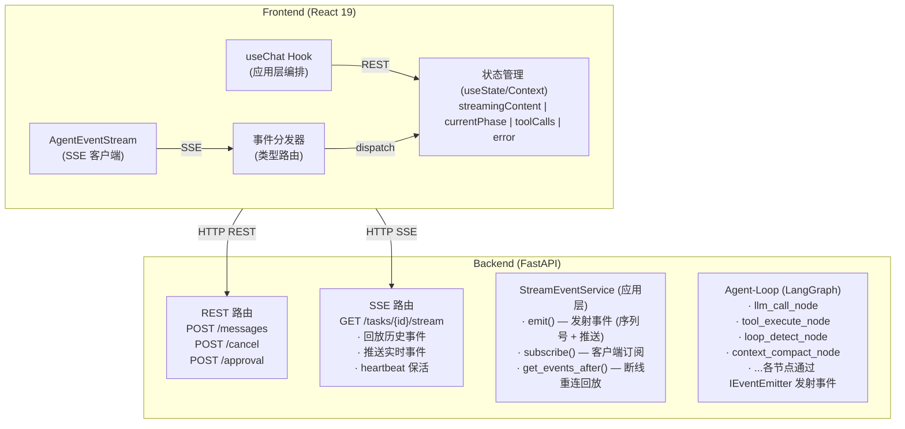
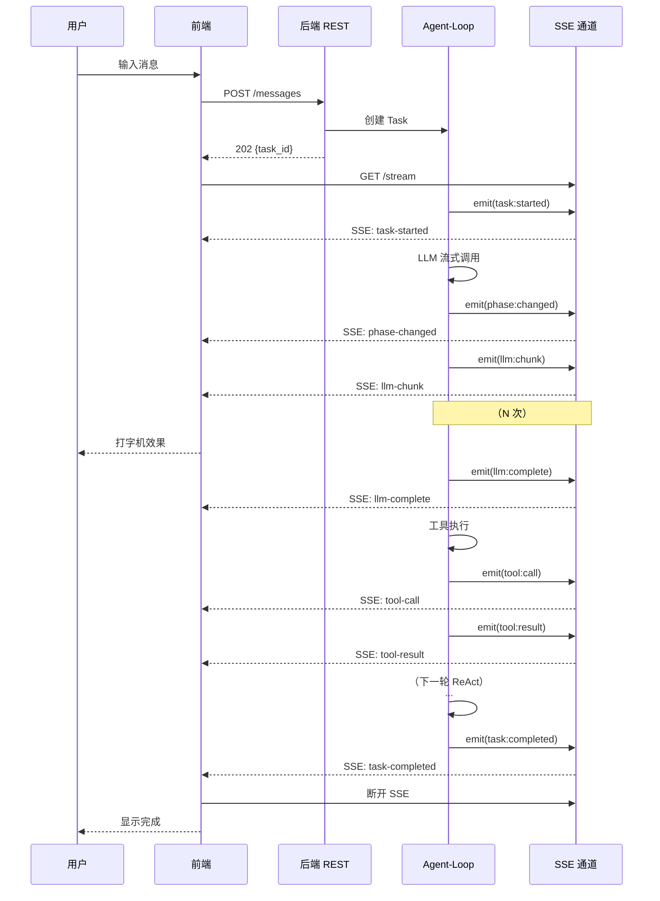
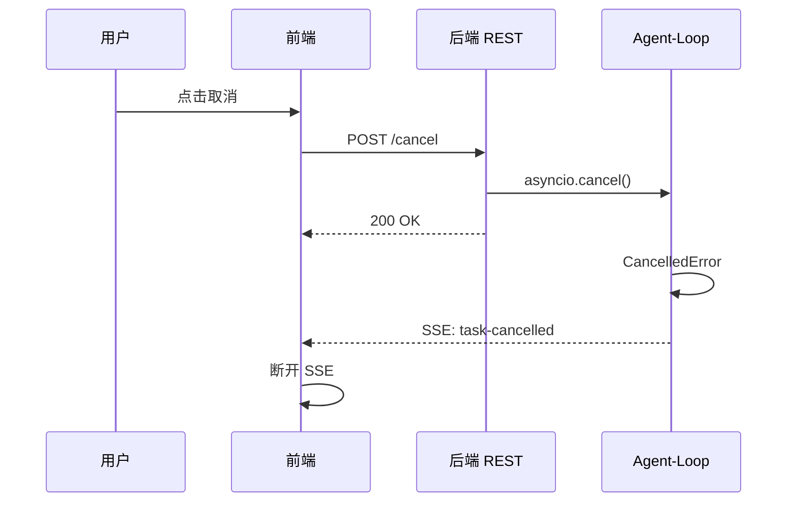
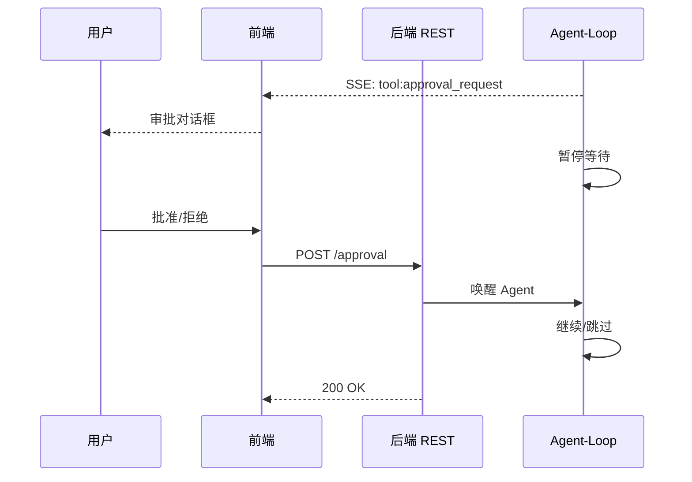
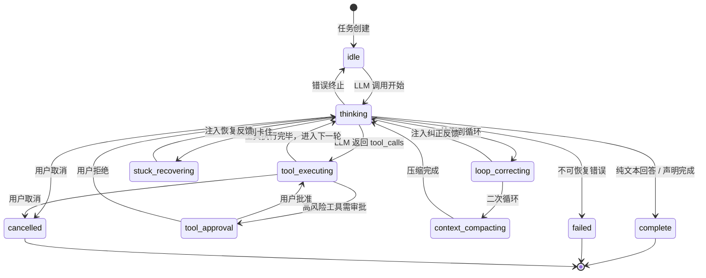
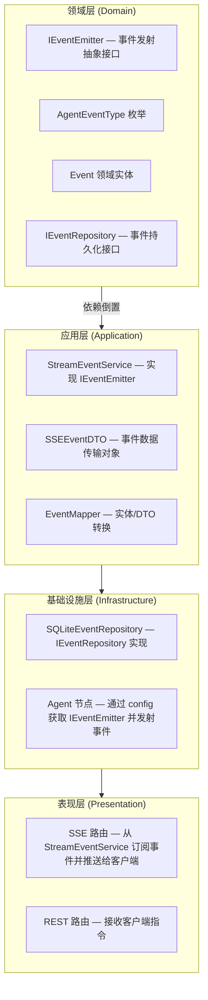
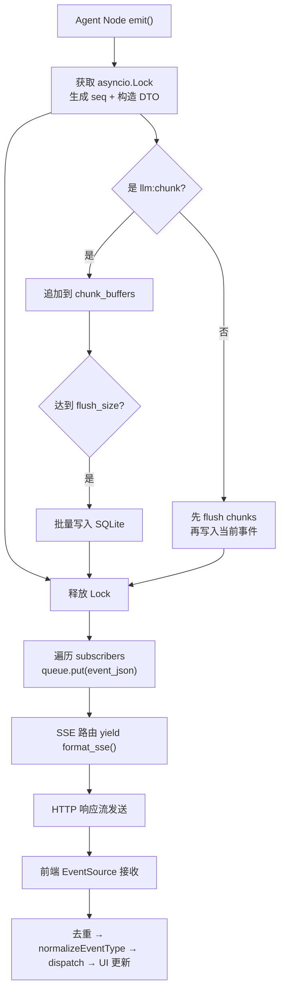

# 3. 通信协议设计

> 对应 `0_outline.md` 第 3 章「通信协议」  
> 参考研究：`research/frontend-interaction-design.md`（12 款主流 Coding Agent 前端交互分析）  
> 最后更新: 2026-05-31 (对照实际代码更新)

---

## 一、概要设计

### 1.1 设计目标

为 Agent-Loop 的 **流式执行过程** 与 **前端实时渲染** 之间建立一套可靠的通信协议，满足以下核心需求：

| 需求 | 说明 |
|------|------|
| 流式输出 | LLM token 逐字推送，前端实时渲染打字机效果 |
| 阶段感知 | 前端实时显示 Agent 当前执行阶段（思考/工具调用/检测等） |
| 工具调用可视化 | 工具调用过程与结果实时展示 |
| 人机交互 | 支持工具审批、任务取消等用户干预 |
| 断线恢复 | 网络断开后自动重连并补发丢失事件 |
| 可扩展 | 新增事件类型无需修改传输层 |

### 1.2 协议选型：SSE + REST 混合架构

**核心决策：采用 SSE（Server-Sent Events）作为主推送通道，REST API 处理所有客户端指令。**

#### 选型依据

在研究了 12 款主流产品的技术方案后，我们对比了三种主要传输方案：

| 维度 | SSE + REST | WebSocket + JSON-RPC | Socket.IO |
|------|-----------|---------------------|-----------|
| 数据流向匹配度 | **高** — Agent 场景 95% 是 server->client | 中 — 双向能力冗余 | 中 — 双向能力冗余 |
| 浏览器原生支持 | **EventSource 原生** | 原生 WebSocket | 需引入库 |
| 自动重连 | **浏览器内置** | 需自行实现 | 库内置 |
| Last-Event-ID | **HTTP 标准** | 需自行实现 | 无 |
| FastAPI 集成 | **StreamingResponse 天然支持** | 需额外库 (websockets) | 需 python-socketio |
| HTTP/2 兼容 | **完全兼容，可复用连接** | 独立 TCP 连接 | 降级到轮询 |
| 代理/CDN 穿透 | **标准 HTTP，透明穿透** | 可能被拦截 | 有降级策略 |
| 实现复杂度 | **低** | 高（心跳/帧解析/重连） | 中 |

**关键判断：** Coding Agent 的核心交互模式是「客户端发指令，服务端流式推送执行过程」。SSE 天然匹配这一单向流模式，WebSocket 的双向能力在此场景下收益有限但代价显著（实现复杂度、运维复杂度）。客户端的少量上行操作（发消息、取消、审批）通过 REST API 即可高效处理。

> **与参考方案的差异说明：** `frontend-interaction-design.md` 推荐 WebSocket + JSON-RPC，该方案适合需要高频双向交互的产品（如 OpenClaw 的实时协作编辑）。本项目聚焦于 Agent 流式输出场景，SSE + REST 是更简洁且可靠的选择。OpenHands 在 V0->V1 的演进中也证明了 WebSocket 的维护成本高于预期。

### 1.3 整体架构



> **注：** 实际实现中，事件通过 `asyncio.Queue` 订阅/广播，不依赖持久化事件存储做实时分发。`IEventRepository` 用于事件的持久化存储（SQLite），但当前实时推送链路不依赖它——事件通过内存队列直接推送给订阅者。历史事件回放和断线重连补发通过 `get_events_after()` / `get_all_events()` 从仓储中查询。

### 1.4 主链路设计

#### 1.4.1 核心交互时序



#### 1.4.2 取消任务链路



#### 1.4.3 工具审批链路（未来扩展）



### 1.5 Agent 阶段状态机

Agent-Loop 在执行过程中经历的阶段，通过 `phase:changed` 事件推送给前端：



**阶段枚举定义：**

| 阶段 | 说明 | 前端表现 |
|------|------|----------|
| `idle` | 空闲，等待任务 | 无特殊显示 |
| `thinking` | LLM 推理中 | 显示「思考中...」+ 流式文本 |
| `tool_executing` | 工具执行中 | 显示工具调用卡片 |
| `tool_approval` | 等待用户审批 | 弹出审批对话框 |
| `loop_correcting` | 循环纠正中 | 显示「检测到循环，正在纠正...」 |
| `stuck_recovering` | 卡住恢复中 | 显示「Agent 恢复中...」 |
| `context_compacting` | 上下文压缩中 | 显示「压缩上下文...」 |
| `complete` | 任务完成 | 显示完成状态 |
| `failed` | 任务失败 | 显示错误信息 |
| `cancelled` | 用户取消 | 显示已取消 |

### 1.6 事件分类体系

所有事件按职责分为 7 大类，共 21 种事件类型（定义于 `backend/src/domain/entities/event_types.py` 中的 `AgentEventType` 枚举）：

```
AgentEvent
├── 1. 任务生命周期 (Task Lifecycle)
│   ├── task:started       — 任务开始执行
│   ├── task:completed     — 任务成功完成
│   ├── task:failed        — 任务执行失败
│   ├── task:cancelled     — 任务被取消
│   ├── task:paused        — 任务暂停
│   └── task:resumed       — 任务恢复
│
├── 2. 阶段事件 (Phase)
│   └── phase:changed      — Agent 阶段切换
│
├── 3. LLM 流式事件 (LLM Streaming)
│   ├── llm:chunk          — LLM 流式输出增量文本（高频，~50-200/s）
│   ├── llm:complete       — LLM 单轮输出完成（含完整文本 + tool_calls）
│   └── thinking:chunk     — 深度思考流式输出（思维链增量文本）
│
├── 4. 工具事件 (Tool)
│   ├── tool:call          — 工具调用开始
│   └── tool:result        — 工具执行结果
│
├── 5. 系统事件 (System)
│   ├── context:compacting — 上下文压缩（含 strategy/beforeTokens/afterTokens 等完整载荷）
│   └── loop:detected      — 循环检测触发
│
├── 6. 多步骤任务事件 (Multi-Step)
│   ├── step:created       — 步骤计划创建
│   ├── step:started       — 步骤开始执行
│   ├── step:completed     — 步骤执行完成
│   ├── step:parallel_group_started  — 并行步骤组开始
│   ├── step:parallel_group_completed — 并行步骤组完成
│   └── step:all_completed — 所有步骤完成
│
└── 7. Sub-Agent 事件 (Sub-Agent)
    ├── sub_agent:started  — Sub-Agent 启动
    ├── sub_agent:completed — Sub-Agent 完成
    ├── sub_agent:failed   — Sub-Agent 失败
    └── session:message:saved — 最终消息落库（前端替换占位消息）
```

> **注意：** 原设计文档中列出的 `stuck:detected` 和 `tool:approval_request` 事件在 `AgentEventType` 枚举中**不存在**，属于未来扩展项。`task:paused` / `task:resumed` 已在枚举中定义但尚未在 Agent Loop 运行时的节点中被 emit。

---

## 二、详细设计

### 2.1 SSE 传输协议

#### 2.1.1 SSE 事件格式

遵循 [SSE 标准](https://html.spec.whatwg.org/multipage/server-sent-events.html)：

```
id: <seq>
event: <event-type>
data: <json-payload>

```

**协议约定：**

- `id` — 单调递增整数序列号（字符串形式），用于断线重连的 `Last-Event-ID`
- `event` — 事件类型名，**冒号(`:`)替换为连字符(`-`)**，转换逻辑见 `to_sse_event_name()`（`backend/src/application/dtos/event_dto.py`）
  - 后端发射 `llm:chunk` → SSE 协议层为 `llm-chunk` → 前端接收后还原为 `llm:chunk`
- `data` — JSON 格式的事件信封 DTO，结构见下

**实际实现（`backend/src/presentation/routes/sse_stream.py`）**：`format_sse()` 函数负责将内存中的 event JSON 序列化为 SSE 协议字符串。

**示例：**

```
id: 42
event: llm-chunk
data: {"id":"42","event_type":"llm:chunk","data":{"taskId":"t-123","turn":2,"text":"Hello","delta":true},"timestamp":"2026-04-30T10:00:00.123Z"}

```

#### 2.1.2 连接保活

- 后端 `event_generator()` 中 `asyncio.wait_for(queue.get(), timeout=15.0)` 超时时发送 SSE 注释作为心跳：

```
: heartbeat

```

- 前端 `EventSource` 在连接丢失时自动触发重连（浏览器内置行为）
- 前端 `AgentEventStream` 额外实现了指数退避重连（见 `handleError`），最大重试 10 次

#### 2.1.3 断线重连与事件补发

利用 SSE 标准的 `Last-Event-ID` 机制（完整实现在 `backend/src/presentation/routes/sse_stream.py` 的 `event_generator()` 中）：

```
1. 前端 EventSource 自动在重连时发送 Last-Event-ID HTTP 头
2. 后端 SSE 路由读取 request.headers.get("last-event-id")
3. 若有 last-event-id：调用 event_service.get_events_after(task_id, last_event_id) 查询补发事件
4. 若无 last-event-id（首次连接）：调用 event_service.get_all_events(task_id) 回放全部已有事件
5. 按序回放缺失事件后，切换到实时队列推送
```

**关键实现细节：**

- 先订阅队列再回放，防止回放期间产生的新事件丢失
- 用 `max_replayed_seq` 标记跳过已回放事件，避免重复推送
- 前端 `AgentEventStream` 用 `processedEventIds` Set 做 O(1) 去重

> ~~**已知局限：** 事件持久化到 SQLite，但 `IEventRepository` 的 `cleanup()` 方法未在设计中列出，实际也未在代码中调用定时清理逻辑，长期运行可能导致存储膨胀。~~

#### 2.1.4 背压控制

> ~~**注意：** 以下内容为设计意图，当前实现中**未落地**。~~

SSE 本身基于 HTTP 长连接，TCP 流控天然提供背压。额外策略：

| 场景 | 策略 | 实现状态 |
|------|------|----------|
| `llm:chunk` 高频发射 | `StreamEventService` 中 chunk 事件批量写入 DB（每 `chunk_flush_size` 条一次，默认 5 条） | 已实现 |
| 前端处理慢 | TCP 缓冲区满 → 后端 `yield` 自然阻塞 → 上游 LLM 流式暂停 | 理论成立，未验证 |
| 前端渲染卡顿 | ~~前端用 `requestAnimationFrame` 节流渲染~~ | ~~未实现~~ |

### 2.2 事件数据模型（后端）

#### 2.2.1 事件信封 — SSEEventDTO

定义于 `backend/src/application/dtos/event_dto.py`：

```python
class SSEEventDTO(BaseModel):
    """SSE 事件数据传输对象"""

    id: str                    # 事件序列号（整数转字符串）
    event_type: str            # 事件类型（冒号分隔），如 "llm:chunk"
    data: dict[str, Any]       # 事件载荷（各事件类型不同，自动注入 taskId）
    timestamp: str             # ISO 8601 时间戳

    @classmethod
    def create(cls, task_id, seq, event_type, payload) -> "SSEEventDTO":
        """创建事件 DTO，自动规范化事件名并注入 taskId"""
```

领域实体 `backend/src/domain/entities/event.py`：

```python
class Event:
    event_type: str
    payload: dict[str, Any]
    sequence: int
    task_id: str
    timestamp: datetime

    @property
    def id(self) -> str:
        return str(self.sequence)
```

`StreamEventService` 内部在持久化时通过 `EventMapper`（`backend/src/application/services/event_mapper.py`）在 DTO 与实体之间转换。

#### 2.2.2 事件载荷定义

**任务生命周期事件：**

```python
# task:started
{"taskId": "t-abc123"}

# task:completed
{"taskId": "t-abc123", "result": "任务执行结果文本"}

# task:failed
{"taskId": "t-abc123", "error": "错误描述"}

# task:cancelled
{"taskId": "t-abc123"}

# task:paused（已定义，尚未在 Agent Loop 节点中 emit）
{"taskId": "t-abc123"}

# task:resumed（已定义，尚未在 Agent Loop 节点中 emit）
{"taskId": "t-abc123"}
```

**阶段事件：**

```python
# phase:changed
{
    "taskId": "t-abc123",
    "phase": "thinking",
    "previousPhase": "idle",
    "turn": 3
}
```

**LLM 流式事件：**

```python
# llm:chunk（高频事件）
{
    "taskId": "t-abc123",
    "turn": 2,
    "text": "Hello",
    "delta": True
}

# thinking:chunk（深度思考流式，由 emit_thinking_chunk() 发射）
{
    "taskId": "t-abc123",
    "turn": 2,
    "text": "Let me analyze...",
    "delta": True
}

# llm:complete
{
    "taskId": "t-abc123",
    "turn": 2,
    "fullText": "I need to read the file...",
    "thinkingText": "...",      # 可选，完整思考内容
    "hasThinking": True,        # 可选
    "toolCalls": [
        {"id": "tc-1", "name": "read_file", "args": {"path": "/src/main.py"}}
    ]
}
```

**工具事件：**

```python
# tool:call
{
    "taskId": "t-abc123",
    "toolCallId": "tc-1",
    "toolName": "read_file",
    "input": {"path": "/src/main.py"}
}

# tool:result
{
    "taskId": "t-abc123",
    "toolCallId": "tc-1",
    "toolName": "read_file",
    "status": "success",
    "output": "文件内容...",
    "error": null,
    "metadata": {}              # 可选
}
```

**系统事件：**

```python
# context:compacting
# 注意：实际实现中包含丰富载荷字段，远超设计文档中的简单 before/after token
# 完整字段取决于策略（"skip"/"soft_prune"/"compact" + 对应子策略名）：
{
    "taskId": "t-abc123",
    "strategy": "soft_prune",           # "skip" | "soft_prune" | "llm_summarize" | "trim"
    "beforeTokens": 12000,              # 压缩前 token 估计值
    "afterTokens": 4000,                # 压缩后 token 估计值
    "maxContextTokens": 10000,          # 上下文上限
    "beforeCount": 42,                  # 压缩前消息数
    "afterCount": 30,                   # 压缩后消息数
    "removedCount": 12,                 # 移除的消息数
    "prunedToolResults": 3,            # (仅 soft_prune) 裁剪的工具结果数
    "summaryLength": 250,              # (仅 llm_summarize) 摘要文本长度
    "reason": "watermark_40"           # 触发原因
}

# loop:detected
{
    "taskId": "t-abc123",
    "loopType": "tool_repeat",          # "tool_repeat" | "content_repeat"
    "count": 1,
    "action": "feedback_injected"
}
```

**多步骤任务事件：**

```python
# step:created
{"taskId": "t-abc123", "plan_id": "plan-1", "goal": "...", "execution_order": [...]}

# step:started
{"taskId": "t-abc123", "step_id": 1, "description": "..."}

# step:completed
{"taskId": "t-abc123", "step_id": 1, "status": "completed", "result": "...", "error": null, "sub_agent_task_id": null}

# step:parallel_group_started
{"taskId": "t-abc123", "step_ids": [2, 3, 4]}

# step:parallel_group_completed
{"taskId": "t-abc123", "step_ids": [2,3,4], "results": {...}}

# step:all_completed
{"taskId": "t-abc123", "plan_id": "plan-1", "summary": "...", "step_results": {...}}
```

**Sub-Agent 事件：**

```python
# sub_agent:started
{"taskId": "t-abc123", "sub_task_id": "sub-1", "step_id": 1, "description": "..."}

# sub_agent:completed
{"taskId": "t-abc123", "sub_task_id": "sub-1", "status": "completed", "result": "..."}

# sub_agent:failed
{"taskId": "t-abc123", "sub_task_id": "sub-1", "status": "failed", "error": "..."}
```

**会话事件：**

```python
# session:message:saved
{
    "taskId": "t-abc123",
    "message": { ... }          # 完整的 SessionMessage 对象
}
```

### 2.3 事件数据模型（前端）

#### 2.3.1 TypeScript 类型定义

定义于 `frontend/src/domain/entities/events.ts`：

```typescript
// 所有事件 payload 都包含的基础字段
interface BaseEventPayload {
  taskId: string;
  sub_task_id?: string;         // Sub-agent 事件会携带此字段
}

// 完整的事件映射（共 22 种事件类型）
interface AgentEventMap {
  // — 生命周期 (6) —
  'task:started':    TaskStartedPayload;
  'task:completed':  TaskCompletedPayload;
  'task:failed':     TaskFailedPayload;
  'task:cancelled':  TaskCancelledPayload;
  'task:paused':     TaskPausedPayload;
  'task:resumed':    TaskResumedPayload;

  // — 阶段 —
  'phase:changed':  PhaseChangedPayload;

  // — LLM (3) —
  'thinking:chunk':   ThinkingChunkPayload;
  'llm:chunk':        LLMChunkPayload;
  'llm:complete':     LLMCompletePayload;

  // — 工具 (2) —
  'tool:call':     ToolCallPayload;
  'tool:result':   ToolResultPayload;

  // — 系统 (2) —
  'context:compacting': ContextCompactingPayload;   // 注意：payload 内 beforeTokens/afterTokens 和后端 beforeCount/afterCount 并存
  'loop:detected':      LoopDetectedPayload;
  'stuck:detected':     StuckDetectedPayload;       // 定义存在但后端未 emit

  // — 多步骤 (6) —
  'step:created':                     StepCreatedPayload;
  'step:started':                     StepStartedPayload;
  'step:completed':                   StepCompletedPayload;
  'step:parallel_group_started':      StepParallelGroupStartedPayload;
  'step:parallel_group_completed':    StepParallelGroupCompletedPayload;
  'step:all_completed':               StepAllCompletedPayload;

  // — Sub-Agent (3) —
  'sub_agent:started':   SubAgentPayload;
  'sub_agent:completed': SubAgentPayload;
  'sub_agent:failed':    SubAgentPayload;

  // — 会话 —
  'session:message:saved': SessionMessageSavedPayload;
}
```

#### 2.3.2 前后端 payload 字段差异说明

`ContextCompactingPayload` 存在字段不完全对齐：

| 字段 | 后端 emit | 前端 `ContextCompactingPayload` |
|------|-----------|-------------------------------|
| `beforeTokens` | 有 | 有 |
| `afterTokens` | 有 | 有 |
| `beforeCount` | 有 | **无** |
| `afterCount` | 有 | **无** |
| `maxContextTokens` | 有 | **无** |
| `strategy` | 有 | **无** |
| `removedCount` | 有 | **无** |
| `reason` | 有 | **无** |

前端仅关注 `beforeTokens`/`afterTokens`，其余字段在 SSE JSON 中存在但 TypeScript 类型未声明，运行时仍可访问。

#### 2.3.3 SSE 协议层事件名

定义于 `frontend/src/domain/entities/events.ts` 中的 `SSE_EVENT_TYPES`。后端 `to_sse_event_name()` 将冒号统一替换为连字符。注意：部分多步骤事件名在后端实际 emit 使用的 SSE event 字段与前端列表中的名称存在差异（如 `step:step_started` vs `step-started`），当前前端 `SSE_EVENT_TYPES` 数组中包含 `step-step_started` 等条目，可能与后端 `event` 字段不完全匹配。因为前端 `normalizeEventType()` 会将连字符还原为冒号后分发给 handler，SSE_EVENT_TYPES 仅用于注册 EventSource 监听，如果协议层 event 名不完全一致会导致该事件类型的监听未注册。此外，`AgentEventStream.handleEvent` 也会 fallback 到 `e.type`，提供一定的容错。

#### 2.3.4 AgentEventStream 客户端

定义于 `frontend/src/infrastructure/api/eventStream.ts`：

- 封装 `EventSource`，提供类型安全的事件监听（基于 `AgentEventMap`）
- 自动重连：指数退避（max 10 attempts, max delay 30s）
- 断线补发：浏览器自动发送 `Last-Event-ID`
- 事件 ID 去重：`processedEventIds` Set（回放 + 实时流可能重复）
- 重放模式（`enableReplayMode`）：事件入队后按固定间隔（默认 50ms）逐个分发，模拟流式体验
- 前后端事件名自动转换：`normalizeEventType()` 将连字符还原为冒号

### 2.4 SPI 设计：Agent-Loop 事件发射接口

SPI（Service Provider Interface）是 Agent-Loop 各节点与通信层之间的契约。

#### 2.4.1 DDD 分层归属



#### 2.4.2 IEventEmitter 接口定义

实际定义于 `backend/src/domain/services/event_emitter.py`：

```python
class IEventEmitter(ABC):
    """Agent Loop 事件发射器接口。"""

    @abstractmethod
    async def emit(self, task_id: str, event_type: str, payload: dict[str, Any]) -> None:
        """发射一个事件。"""

    @abstractmethod
    async def emit_phase_changed(self, task_id, new_phase, previous_phase, turn) -> None:
        """发射阶段变更事件。"""

    @abstractmethod
    async def emit_llm_chunk(self, task_id, turn, text) -> None:
        """发射 LLM 流式增量文本。"""

    @abstractmethod
    async def emit_thinking_chunk(self, task_id, turn, text) -> None:
        """发射 LLM 深度思考流式增量文本。"""

    async def emit_safe(self, task_id, event_type, payload) -> None:
        """安全地发射事件，忽略异常。"""
        try:
            await self.emit(task_id, event_type, payload)
        except Exception as exc:
            logger.warning("event emit failed: %s", exc)
```

`emit_safe()` 是有默认实现的非抽象方法，属于模板方法模式。

#### 2.4.3 ProxyEventEmitter

定义于同一文件 `backend/src/domain/services/event_emitter.py`：

```python
class ProxyEventEmitter(IEventEmitter):
    """代理事件发射器 - 用于转发 sub-agent 事件到父 stream

    将所有事件转发到父 event_emitter，并在 payload 中自动添加 sub_task_id 字段。
    装饰器模式实现，用于事件转发和增强。
    """

    def __init__(self, parent_emitter: IEventEmitter, parent_task_id: str, sub_task_id: str):
        ...

    async def emit(self, task_id, event_type, payload):
        payload = {**payload, "sub_task_id": self._sub_task_id}
        await self._parent_emitter.emit(self._parent_task_id, event_type, payload)
    # emit_phase_changed, emit_llm_chunk, emit_thinking_chunk 同理
```

这样 Sub-Agent 的事件会通过父 task 的 SSE 通道发送，前端通过 `sub_task_id` 字段区分来源。

#### 2.4.4 StreamEventService 实现

定义于 `backend/src/application/use_cases/stream_event.py`：

```python
class StreamEventService(IEventEmitter):
    def __init__(self, event_repo_factory: EventRepoFactory, chunk_flush_size: int = 10):
        self._event_repo_factory = event_repo_factory   # 工厂函数，每次创建新 repo 实例
        self._subscribers: dict[str, list[asyncio.Queue]] = defaultdict(list)
        self._sequences: dict[str, int] = defaultdict(int)
        self._chunk_buffers: dict[str, list[SSEEventDTO]] = defaultdict(list)
        self._locks: dict[str, asyncio.Lock] = {}
        self._chunk_flush_size = chunk_flush_size       # app.py 中设为 5
```

**emit() 流程：**

1. 获取 task 级别的 `asyncio.Lock`（保证 seq 生成和 chunk buffer 操作的线程安全）
2. `_sequences[task_id] += 1` 生成新的 seq
3. `SSEEventDTO.create()` 构造事件 DTO（自动注入 taskId）
4. 如果 `event_type == "llm:chunk"`：追加到 `_chunk_buffers`，达到 `chunk_flush_size` 时批量写入 SQLite
5. 如果是其他事件：先 flush 残留的 chunk 缓冲区，再立即写入当前事件
6. **锁外**广播：将 event JSON 放入所有订阅者的 `asyncio.Queue`

**订阅管理：**

- `subscribe(task_id)` — 创建 `asyncio.Queue`，注册到订阅列表
- `unsubscribe(task_id, queue)` — 移除订阅，清理空列表
- `get_all_events(task_id)` — 从 SQLite 读取全部事件（首次连接回放）
- `get_events_after(task_id, last_event_id)` — 从 SQLite 读取 `id > last_event_id` 的事件（断线重连补发）

### 2.5 事件持久化

#### 2.5.1 IEventRepository 接口

定义于 `backend/src/domain/repositories/event_repository.py`：

```python
class IEventRepository(ABC):
    @abstractmethod
    async def save(self, task_id: str, event: Event) -> None:
        """保存事件（领域实体）"""
    @abstractmethod
    async def save_batch(self, task_id: str, events: list[Event]) -> None:
        """批量保存事件"""
    @abstractmethod
    async def get_after(self, task_id: str, last_event_id: str) -> list[Event]:
        """获取指定序列号之后的事件（断线重连补发）"""
    @abstractmethod
    async def get_by_task_id(self, task_id: str) -> list[Event]:
        """获取任务的所有事件"""
```

> **注意：** `IEventRepository` 中的方法签名使用领域实体 `Event`（`backend/src/domain/entities/event.py`），而非 DTO。`StreamEventService` 在调用持久化前通过 `EventMapper.to_entity()` 转换。

#### 2.5.2 事件生命周期



> ~~**已知局限：** 没有定时清理逻辑。`IEventRepository` 接口中未定义 `cleanup()` 方法，SQLite 实现也未实现过期事件删除。长期运行可能导致存储膨胀。~~

### 2.6 REST API 端点

| 方法 | 路径 | 说明 | 请求体 | 响应 |
|------|------|------|--------|------|
| POST | `/api/sessions/{sid}/messages` | 发送消息并触发 Agent Loop | `{content, model?, max_turns?}` | `202 {task_id, user_message}` |
| GET | `/api/tasks/{tid}/stream` | SSE 事件流 | — | `text/event-stream` |
| POST | `/api/tasks/{tid}/cancel` | 取消任务 | — | `200` |
| POST | `/api/tasks/{tid}/approval` | 提交审批结果 | `{toolCallId, approved, reason?}` | `200` |
| GET | `/api/tasks/{tid}` | 查询任务状态 | — | `200 {Task}` |
| GET | `/api/tasks/{tid}/events` | 查询历史事件（分页） | `?after_seq=&limit=` | `200 {events[], has_more}` |

### 2.7 前端集成方案

#### 2.7.1 AgentEventStream 客户端

```typescript
// frontend/src/infrastructure/api/eventStream.ts

class AgentEventStream {
  private es: EventSource | null = null;
  private reconnectAttempts = 0;
  private maxReconnectAttempts = 10;
  private handlers = new Map<string, Set<(data: unknown) => void>>();
  private processedEventIds = new Set<string>();

  // 重放模式
  private replayMode = false;
  private replayIntervalMs = 50;        // 重放间隔
  private eventQueue: QueuedEvent[] = [];
  private drainTimer: ReturnType<typeof setTimeout> | null = null;
  private isDraining = false;

  enableReplayMode(intervalMs = 50): void { ... }
  connect(): void { ... }               // 注册所有 SSE_EVENT_TYPES 监听
  on<K>(eventType: K, handler): () => void { ... }
  disconnect(): void { ... }

  private handleEvent(e: MessageEvent): void {
    // JSON 解析 → 去重(processedEventIds) → normalizeEventType(连字符→冒号)
    // → replayMode ? 入队定时分发 : 立即 dispatch
  }

  private handleError(): void {
    // 指数退避重连：Math.min(1000 * 2^attempts, 30000)
    // 超过 maxReconnectAttempts 时 dispatch('task:failed')
  }
}
```

**重放模式（Replay Mode）：** 用于回放历史事件时模拟流式体验，事件入队后按 `replayIntervalMs`（默认 50ms）逐个分发，而非一次性全部推送。

#### 2.7.2 useChat Hook 集成模式

```typescript
const useChat = ({ agentId, sessionId, ... }) => {
  const sendMessage = async (content: string) => {
    const { task_id } = await sessionApi.sendMessage(agentId, sessionId, { content });
    const stream = new AgentEventStream(window.location.origin, task_id);

    stream.on('llm:chunk', (data) => {
      updateStreamingContent(prev => prev + data.text);
    });
    stream.on('thinking:chunk', (data) => {
      updateThinkingContent(prev => prev + data.text);
    });
    stream.on('phase:changed', (data) => {
      setCurrentPhase(data.phase);
    });
    stream.on('tool:call', (data) => appendToolCall(data));
    stream.on('tool:result', (data) => updateToolResult(data));
    stream.on('session:message:saved', (data) => {
      replaceStreamingMessage(data.message);
    });
    stream.on('task:completed', () => { setPhase('complete'); stream.disconnect(); });
    stream.on('task:failed', (data) => { setError(data.error); stream.disconnect(); });

    stream.connect();
  };

  const cancelExecution = async () => {
    await taskApi.cancelTask(currentTaskId);
    stream.disconnect();
  };
};
```

### 2.8 可靠性保障

#### 2.8.1 事件顺序保证

- `StreamEventService` 为每个 task 维护独立的 `_sequences[task_id]`，`asyncio.Lock` 保护递增和 buffer 操作
- 所有事件按 `emit()` 调用顺序生成 seq
- 前端通过 `processedEventIds` Set 去重，如遇乱序可按 seq 排序（当前未实现排序，因为 asyncio 单线程模型下不太可能出现乱序）

#### 2.8.2 消息必达机制

| 步骤 | 机制 | 实现状态 |
|------|------|----------|
| 后端发射 | `emit()` 先持久化，**锁外推送** | 已实现（推送在锁外，不阻塞其他 emit） |
| 传输层 | SSE 长连接 + TCP 可靠传输 | 已实现 |
| 断线重连 | `Last-Event-ID` + `get_events_after()` | 已实现 |
| 前端去重 | `processedEventIds` Set O(1) 检查 | 已实现 |
| 回放不丢新事件 | 先订阅队列 → 再回放 → 用 `max_replayed_seq` 跳过重复 | 已实现 |

#### 2.8.3 前端异常处理

`AgentEventStream.handleError()` 在 `EventSource.CLOSED` 时进入指数退避重连流程：
- 退避延迟：`1000 * 2^attempts`，上限 30 秒
- 最大重试 10 次，超出后分发 `task:failed` 事件
- 浏览器原生自动重连（`EventSource` 内置）先于前端自定义逻辑生效

---

## 三、已知局限与未来扩展

### 3.1 已知局限

| 局限 | 说明 | 影响 |
|------|------|------|
| ~~无背压控制~~ | `asyncio.Queue` 无界，高频事件可能堆积。前端通过 `replayMode` 做了一定程度的节流。TCP 天然流控在代理/CDN 环境下可能失效 | SSE 推送畅通时可忽略 |
| ~~无事件过期清理~~ | `IEventRepository` 未定义 `cleanup()` 方法，SQLite 事件表无定期清理 | 长期运行存储膨胀 |
| 事件无真实持久化 | 事件写入 SQLite，但 `StreamEventService` 和 SSE 路由之间通过 `asyncio.Queue` 通信。SQLite 仅在回放/重连时被查询 | 功能正常，但非 Event Sourcing 架构 |
| 无事件去重存储层 | 事件 seq 仅在内存中递增，服务重启后从 1 重新计数 | 前一日志的 `last-event-id` 在新进程启动后失效 |
| `SSE_EVENT_TYPES` 名对齐 | 部分多步骤事件（如 `step:created`）的后端 SSE event 字段名与前端列表中连字符名不完全一致 | 该事件类型可能未注册监听，但 `handleEvent` 有 `e.type` fallback |
| `ContextCompactingPayload` 字段缺失 | 前端类型仅声明 `beforeTokens`/`afterTokens`，后端实际 payload 含 `strategy`/`beforeCount`/`maxContextTokens` 等 | 运行时仍可访问，不影响功能 |

### 3.2 适用场景

本通信协议设计适用于以下场景：

1. **Web UI 对话式 Agent** — 用户通过浏览器与 Agent 进行多轮对话，实时查看执行过程
2. **流式输出场景** — LLM 逐 token 输出需要实时推送到前端
3. **工具调用可视化** — 前端需要展示 Agent 的工具调用过程和结果
4. **单用户单任务** — 当前设计面向单用户操作单个 Agent 任务的场景
5. **人机协作 (HITL)** — 通过工具审批机制支持用户在执行过程中干预
6. **多步骤规划执行** — 支持 step/sub-agent 层级的事件追踪
7. **深度思考展示** — `thinking:chunk` 事件支持思维链内容的流式渲染

**不适用的场景（需要额外扩展）：**

- 多用户实时协作编辑（需要 WebSocket 或 CRDT）
- 高频双向通信（如实时游戏）
- 多 Agent 间通信（需要 Agent-to-Agent 协议，不走前端通道）
- 事件溯源/审计（需要真实的事件持久化和不可变日志）

### 3.3 与初始设计的主要差异

| 维度 | 初始设计文档 | 当前实现 | 说明 |
|------|-------------|----------|------|
| 事件类型数 | 14 种 | 21 种（AgentEventType 枚举） | 新增多步骤、sub-agent、thinking chunk、task paused/resumed |
| stuck:detected | 设计中有 | AgentEventType 中**未定义** | 未实现 |
| tool:approval_request | 设计中有 | AgentEventType 中**未定义** | 未实现 |
| 事件持久化 | 先持久化再推送 | 先持久化（锁内）再推送（锁外） | 推送不阻塞其他 emit |
| chunk 持久化 | 每 10 条一批 | 每 `chunk_flush_size` 条（app.py 中设为 5） | 更频繁 flush，减少内存驻留 |
| emit_safe() | 未设计 | 已在 IEventEmitter 中实现 | 安全发射，忽略异常 |
| emit_thinking_chunk() | 未设计 | 已实现 | 支持深度思考流式输出 |
| ProxyEventEmitter | 未设计 | 已实现 | Sub-agent 事件转发到父 task 流 |
| EventMapper | 未设计 | 已实现 | 领域实体与 DTO 分离 |
| EventRepoFactory | 未设计 | 已实现 | 工厂函数模式，每次操作创建新 repo 实例 |
| 前端 Replay Mode | 未设计 | 已实现 | 回放历史事件时模拟流式体验 |
| 前端指数退避重连 | 未设计 | 已实现 | 最多 10 次，最大延迟 30s |
| CORS | 未提及 | `app.py` 中配置：`http://localhost:3000` | 仅允许特定前端来源 |
| chunk_flush_size | 10 | 5 | `app.py` 中硬编码 |

---

## 四、实现文件索引

| 层 | 文件 | 说明 |
|---|------|------|
| 领域层 | `backend/src/domain/entities/event_types.py` | `AgentEventType` 枚举（21 种事件） |
| 领域层 | `backend/src/domain/entities/event.py` | `Event` 领域实体 |
| 领域层 | `backend/src/domain/services/event_emitter.py` | `IEventEmitter` 接口 + `ProxyEventEmitter` |
| 领域层 | `backend/src/domain/services/event_utils.py` | `normalize_event_type()` |
| 领域层 | `backend/src/domain/repositories/event_repository.py` | `IEventRepository` 接口 |
| 应用层 | `backend/src/application/use_cases/stream_event.py` | `StreamEventService`（核心实现） |
| 应用层 | `backend/src/application/dtos/event_dto.py` | `SSEEventDTO` + `to_sse_event_name()` |
| 应用层 | `backend/src/application/services/event_mapper.py` | `EventMapper` |
| 表现层 | `backend/src/presentation/routes/sse_stream.py` | SSE 路由（`event_generator` + `format_sse`） |
| 表现层 | `backend/src/presentation/app.py` | FastAPI 应用工厂（CORS + event_service 初始化） |
| 前端 | `frontend/src/domain/entities/events.ts` | 前端事件类型定义 + `SSE_EVENT_TYPES` |
| 前端 | `frontend/src/infrastructure/api/eventStream.ts` | `AgentEventStream` 客户端 |
