# 编码 Agent 项目实施方案

> 基于对 11 个主流编码 Agent 项目（Aider、Claude Code、Cline、Codex CLI、Gemini CLI、Goose、Open Interpreter、OpenClaw、OpenCode、OpenHands、SWE-Agent）的深度源码分析，提炼出本实施方案。

---

## 一、项目概述

### 1.1 项目目标

构建一个生产级编码 Agent 框架，具备以下核心能力：

1. **智能代码理解与生成**：通过 LLM 理解用户意图，生成、修改、调试代码
2. **工具自主调用**：根据任务需要自主调用文件操作、Shell 命令、搜索等工具
3. **自驱循环执行**：自动迭代推理直到任务完成，无需人工干预每一步
4. **安全可控**：多层安全防御，权限分级，沙箱隔离，用户审批
5. **高性能低成本**：Prompt 缓存优化、工具并行、模型分层调度
6. **高稳定性**：三层嵌套恢复、Loop/Stuck 检测、自动纠正

### 1.2 设计原则

| 原则 | 说明 | 参考来源 |
|------|------|---------|
| 纵深防御 | 安全规则不依赖 LLM 遵循，必须在框架侧硬编码 | Goose 五层检查器链、Codex CLI 沙箱 |
| 分层恢复 | 错误处理分层，每层处理特定类型问题，避免一处失败全盘崩溃 | OpenClaw 三层嵌套 |
| 模块化 | Prompt、工具、Loop 各模块独立，支持条件注入和运行时裁剪 | Gemini CLI 9 模块、OpenClaw 15+ sections |
| 渐进式安全 | 沙箱执行失败后自动请求审批并无沙箱重试，平衡安全与可用性 | Codex CLI 升级机制 |
| 缓存优先 | Prompt 稳定内容与动态内容分离，最大化缓存命中 | OpenClaw CACHE BOUNDARY |
| 智能裁剪 | 上下文按需注入，而非全量传递 | Aider Repo Map |

### 1.3 技术选型依据

- **语言**：TypeScript（参考 Cline、OpenCode、OpenClaw 的主流选择）
- **LLM 调用**：支持 OpenAI 兼容 API，适配 Anthropic、OpenAI、Google 等多 Provider
- **工具协议**：MCP（Model Context Protocol），9/11 项目支持
- **状态持久化**：SQLite（参考 OpenCode）
- **沙箱**：Docker 容器（参考 OpenHands、SWE-Agent）

---

## 二、概要设计

### 2.1 系统架构总览

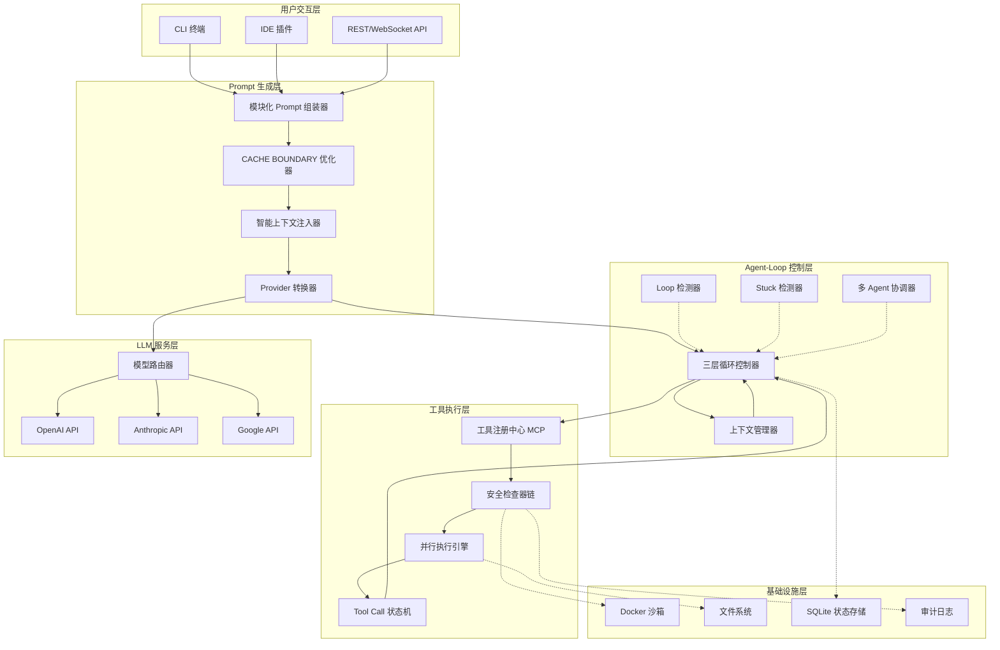

各层职责：

| 层级 | 职责 |
|------|------|
| 用户交互层 | 接收用户输入（CLI/IDE/API），流式输出 Agent 响应 |
| Prompt 生成层 | 将用户意图 + 上下文组装为 LLM 可理解的 Prompt，优化缓存命中 |
| Agent-Loop 控制层 | 驱动 ReAct 循环，检测 Loop/Stuck，管理上下文，协调多 Agent |
| 工具执行层 | 注册/发现工具，安全校验，并行执行，状态追踪 |
| LLM 服务层 | 模型路由，多 Provider 适配，流式响应 |
| 基础设施层 | 沙箱隔离，文件操作，状态持久化，审计 |

### 2.2 核心链路流程图

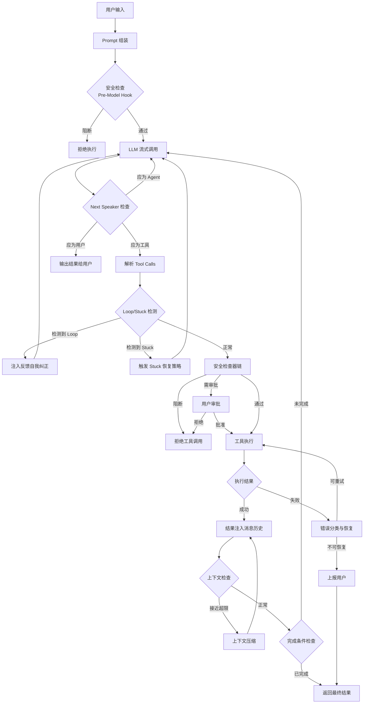

**步骤详细说明**：

| 编号 | 步骤名称 | 输入 | 处理 | 输出 |
|------|---------|------|------|------|
| B | Prompt 组装 | 用户消息 + 上下文 | 模块化组装 8-12 个 Section，应用 CACHE BOUNDARY，Provider 转换 | 完整 System Prompt + 消息历史 |
| C | Pre-Model 安全检查 | 组装后的 Prompt | 检查 Prompt 中是否有对抗性注入、敏感信息泄露风险 | allow/block |
| D | LLM 流式调用 | System Prompt + 消息历史 | 选择模型，发送流式请求，聚合 chunk 为完整响应 | LLM 响应（含 Tool Calls 或文本） |
| E | Next Speaker 检查 | LLM 响应 | 判断下一步应由谁执行：工具、用户、或 Agent 继续 | 路由决策 |
| F | 解析 Tool Calls | LLM 响应 | 解析原生 Function Calling 或回退 XML/文本格式 | ToolCall 对象列表 |
| H | Loop/Stuck 检测 | ToolCall 列表 + 历史轨迹 | 三重 Loop 检测 + 五种 Stuck 模式分析 | 正常/Loop/Stuck |
| I | Loop 自我纠正 | Loop 检测结果 | 注入反馈消息让模型识别并修正重复行为 | 修正后的下一轮 Prompt |
| J | Stuck 恢复 | Stuck 类型 | 根据 Stuck 模式执行对应恢复策略（压缩/重置/提示） | 恢复后的状态 |
| K | 安全检查器链 | ToolCall 对象 | 五层检查：权限/沙箱/网络/对抗/重复，短路优化 | 通过/阻断/需审批 |
| L | 用户审批 | 被标记的 ToolCall | 向用户展示操作详情，等待批准或拒绝 | 批准/拒绝 |
| M | 工具执行 | ToolCall 对象 | 沙箱内或本地执行，支持并行，超时控制 | ToolResult |
| N-P | 结果处理 | ToolResult | 成功则注入消息；失败则分类（可重试/不可恢复） | 下一轮输入或上报 |
| R-S | 上下文压缩 | 消息历史 | 检查 token 使用率，接近超限时触发三层压缩策略 | 压缩后的消息历史 |
| T-U | 完成检查 | 当前状态 + Agent 响应 | Promise 机制 + Hook 验证完成条件 | 完成/继续 |

### 2.3 核心链路时序图

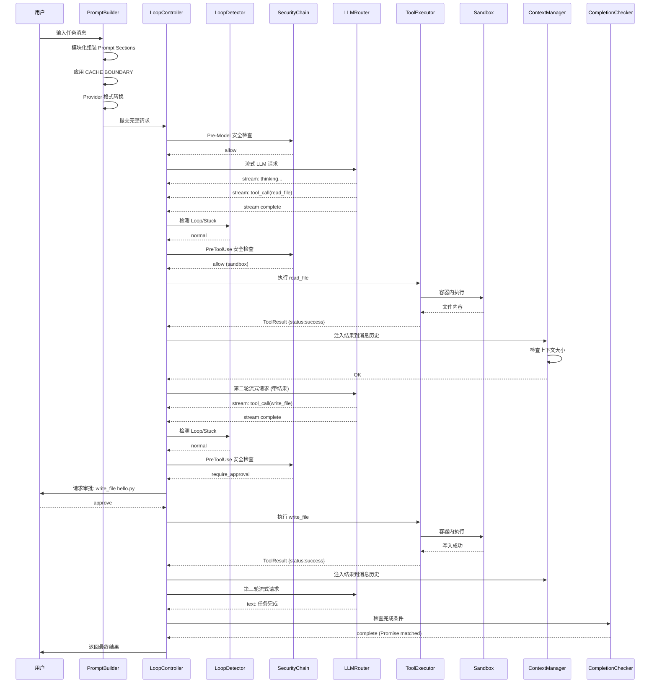

### 2.4 Prompt 生成链路

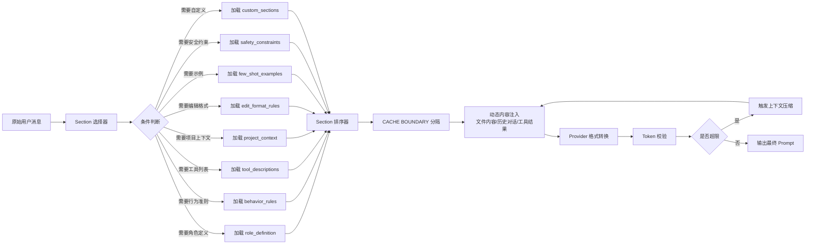

**Prompt 组装步骤说明**：

| 编号 | 步骤 | 说明 | 参考项目 |
|------|------|------|---------|
| B | Section 选择器 | 根据任务类型、Agent 类型、运行时状态选择需要加载的 Sections | Gemini CLI 9 模块 |
| C-L | 条件加载与排序 | 每个 Section 独立判断是否注入，按优先级排序（稳定内容在前） | OpenClaw 15+ sections |
| M | CACHE BOUNDARY | 用显式标记分隔稳定内容（上方）和动态内容（下方） | OpenClaw |
| N | 动态内容注入 | 注入文件内容、历史对话、工具执行结果等运行时数据 | Aider Repo Map |
| O | Provider 转换 | 将通用 Prompt 转换为目标 Provider 特定格式 | OpenCode |
| P-Q | Token 校验与压缩 | 检查总 token 数，超限时触发压缩策略 | 综合 |

### 2.5 安全防御链路

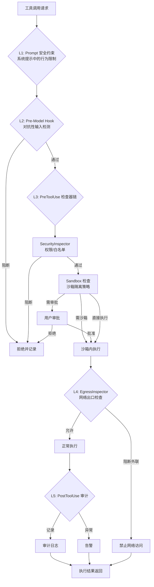

**各层防御机制说明**：

| 层级 | 机制 | 触发时机 | 阻断策略 | 参考项目 |
|------|------|---------|---------|---------|
| L1 | Prompt 安全约束 | 始终生效 | LLM 行为引导 | Goose |
| L2 | Pre-Model Hook | 每次 LLM 调用前 | 拒绝调用 | Gemini CLI BeforeModel |
| L3 | PreToolUse 检查器链 | 每次工具调用前 | 阻断/审批/沙箱 | Goose 五层检查器 |
| L4 | EgressInspector | 沙箱内执行时 | 禁止网络访问 | Goose |
| L5 | PostToolUse 审计 | 每次工具执行后 | 记录/告警 | Gemini CLI AfterToolUse |

---

## 三、详细设计

### 3.1 对象定义

#### 3.1.1 核心对象

**`PromptSection`** — Prompt 模块定义

| 字段 | 类型 | 必填 | 默认值 | 说明 |
|------|------|------|--------|------|
| `id` | `string` | 是 | — | Section 唯一标识，如 `role_definition` |
| `name` | `string` | 是 | — | Section 名称，用于日志和调试 |
| `content` | `string \| () => string` | 是 | — | 模板内容或动态生成函数 |
| `priority` | `number` | 是 | 0 | 排序优先级，数字越小越靠前（稳定内容） |
| `condition` | `(ctx: AgentLoopContext) => boolean` | 否 | `() => true` | 注入条件，返回 false 则跳过 |
| `cacheStrategy` | `'stable' \| 'dynamic' \| 'auto'` | 否 | `'auto'` | 缓存策略：stable=始终缓存，dynamic=不缓存 |
| `version` | `string` | 否 | `'1.0.0'` | Section 版本号，用于追踪变更 |

在流程中的流转：`PromptBuilder` 在步骤 B 创建/选择 Sections → 排序 → 拼接 → 传递给 LLM。

---

**`SystemPrompt`** — 完整系统提示词

| 字段 | 类型 | 必填 | 默认值 | 说明 |
|------|------|------|--------|------|
| `sections` | `PromptSection[]` | 是 | — | 已排序的 Section 列表 |
| `cacheBoundary` | `number` | 否 | — | CACHE BOUNDARY 位置索引 |
| `rawContent` | `string` | 是 | — | 拼接后的完整文本 |
| `tokenCount` | `number` | 否 | 0 | 预估 token 数 |
| `provider` | `string` | 否 | `'openai'` | 目标 Provider 标识 |
| `model` | `string` | 否 | — | 目标模型标识 |
| `metadata` | `Record<string, any>` | 否 | `{}` | 元数据（版本号、生成时间等） |

在流程中的流转：`PromptBuilder` 生成 → `ContextManager` 可能修改（压缩）→ `LLMRouter` 消费。

---

**`Message`** — 消息对象

| 字段 | 类型 | 必填 | 默认值 | 说明 |
|------|------|------|--------|------|
| `id` | `string` | 是 | — | 唯一消息 ID |
| `role` | `'system' \| 'user' \| 'assistant' \| 'tool'` | 是 | — | 消息角色 |
| `content` | `string \| Array<ContentBlock>` | 是 | — | 消息内容，支持文本或多模态块 |
| `toolCalls` | `ToolCall[]` | 否 | — | assistant 角色的工具调用列表 |
| `toolCallId` | `string` | 否 | — | tool 角色关联的工具调用 ID |
| `visibility` | `'agent_visible' \| 'user_visible'` | 否 | `'user_visible'` | 可见性分层 |
| `timestamp` | `number` | 否 | `Date.now()` | 消息创建时间戳 |
| `tokenCount` | `number` | 否 | 0 | 预估 token 数 |

在流程中的流转：用户输入创建 user Message → LLM 返回 assistant Message → 工具执行创建 tool Message → `ContextManager` 管理全生命周期。

---

**`ToolCall`** — 工具调用对象

| 字段 | 类型 | 必填 | 默认值 | 说明 |
|------|------|------|--------|------|
| `id` | `string` | 是 | — | 唯一调用 ID |
| `name` | `string` | 是 | — | 工具名称 |
| `input` | `Record<string, any>` | 是 | — | 工具输入参数 |
| `state` | `ToolCallState` | 是 | `'validating'` | 当前状态 |
| `priority` | `number` | 否 | 0 | 执行优先级 |
| `dependsOn` | `string[]` | 否 | `[]` | 依赖的 ToolCall ID 列表 |
| `retryCount` | `number` | 否 | 0 | 已重试次数 |
| `maxRetries` | `number` | 否 | 3 | 最大重试次数 |
| `timeout` | `number` | 否 | 30000 | 超时时间（ms） |
| `metadata` | `Record<string, any>` | 否 | `{}` | 附加元数据 |

`ToolCallState` 枚举：`'validating' \| 'scheduled' \| 'executing' \| 'success' \| 'error' \| 'cancelled'`

在流程中的流转：LLM 响应解析创建 → 安全检查器链校验 → 并行执行引擎调度 → 执行完成更新状态。

---

**`ToolResult`** — 工具执行结果

| 字段 | 类型 | 必填 | 默认值 | 说明 |
|------|------|------|--------|------|
| `toolCallId` | `string` | 是 | — | 关联的 ToolCall ID |
| `status` | `'success' \| 'error' \| 'timeout' \| 'cancelled'` | 是 | — | 执行状态 |
| `output` | `string` | 是 | — | 工具输出文本 |
| `error` | `string` | 否 | — | 错误信息（失败时） |
| `errorType` | `'recoverable' \| 'fatal' \| 'timeout'` | 否 | — | 错误分类 |
| `exitCode` | `number` | 否 | — | 进程退出码 |
| `metadata` | `Record<string, any>` | 否 | `{}` | 附加元数据（执行时间等） |

在流程中的流转：`ToolExecutor` 生成 → `LoopController` 消费注入消息历史 → 下一轮 LLM 调用。

---

**`AgentState`** — Agent 状态对象

| 字段 | 类型 | 必填 | 默认值 | 说明 |
|------|------|------|--------|------|
| `status` | `'idle' \| 'running' \| 'paused' \| 'completed' \| 'error'` | 是 | `'idle'` | 当前运行状态 |
| `currentTurn` | `number` | 是 | 0 | 当前轮次计数 |
| `maxTurns` | `number` | 否 | 100 | 最大轮次限制 |
| `reflectionCount` | `number` | 否 | 0 | 反射计数 |
| `maxReflections` | `number` | 否 | 3 | 最大反射次数 |
| `toolCallHistory` | `ToolCallRecord[]` | 否 | `[]` | 工具调用历史 |
| `messages` | `Message[]` | 否 | `[]` | 当前消息历史 |
| `contextWindow` | `{ used: number; total: number }` | 否 | — | 上下文窗口使用率 |
| `cost` | `{ total: number; breakdown: Record<string, number> }` | 否 | — | 成本追踪 |
| `startTime` | `number` | 否 | `Date.now()` | 启动时间 |
| `lastActivity` | `number` | 否 | — | 最后活动时间 |

在流程中的流转：`LoopController` 创建并持续更新 → 各层读取判断状态。

---

**`AgentLoopContext`** — Agent Loop 上下文

| 字段 | 类型 | 必填 | 默认值 | 说明 |
|------|------|------|--------|------|
| `taskId` | `string` | 是 | — | 任务唯一标识 |
| `workspace` | `string` | 是 | — | 工作目录路径 |
| `agentState` | `AgentState` | 是 | — | Agent 状态引用 |
| `config` | `AgentConfig` | 是 | — | Agent 配置引用 |
| `abortSignal` | `AbortSignal` | 否 | — | 中止信号 |
| `hooks` | `HookRegistry` | 否 | — | Hook 注册中心 |
| `tools` | `ToolRegistry` | 否 | — | 工具注册中心引用 |
| `promptBuilder` | `PromptBuilder` | 否 | — | Prompt 构建器引用 |
| `contextManager` | `ContextManager` | 否 | — | 上下文管理器引用 |

在流程中的流转：会话初始化创建 → 贯穿整个 Loop 生命周期 → 各组件通过上下文获取彼此引用。

---

**`LoopDetectionResult`** — Loop 检测结果

| 字段 | 类型 | 必填 | 默认值 | 说明 |
|------|------|------|--------|------|
| `isLoop` | `boolean` | 是 | — | 是否检测到 Loop |
| `type` | `'exact_tool_repeat' \| 'content_repeat' \| 'llm_detected'` | 否 | — | Loop 类型 |
| `severity` | `'warning' \| 'critical'` | 否 | `'warning'` | 严重程度 |
| `details` | `string` | 否 | — | 检测详情描述 |
| `correctiveAction` | `'feedback' \| 'compress' \| 'reset' \| 'terminate'` | 否 | — | 建议纠正动作 |
| `loopCount` | `number` | 否 | 0 | 连续检测次数 |

在流程中的流转：`LoopDetector` 在步骤 H 生成 → `LoopController` 消费决定纠正/终止。

---

**`CompletionResult`** — 任务完成结果

| 字段 | 类型 | 必填 | 默认值 | 说明 |
|------|------|------|--------|------|
| `status` | `'completed' \| 'aborted' \| 'timeout' \| 'error' \| 'max_turns'` | 是 | — | 完成状态 |
| `result` | `string` | 是 | — | 最终结果文本 |
| `turns` | `number` | 是 | — | 总轮次数 |
| `toolCalls` | `number` | 是 | — | 总工具调用数 |
| `cost` | `{ total: number; breakdown: Record<string, number> }` | 是 | — | 总成本 |
| `duration` | `number` | 是 | — | 总耗时（ms） |
| `artifacts` | `string[]` | 否 | `[]` | 生成的文件列表 |
| `errors` | `string[]` | 否 | `[]` | 遇到的错误列表 |
| `metadata` | `Record<string, any>` | 否 | `{}` | 附加元数据 |

在流程中的流转：`CompletionChecker` 在步骤 T 生成 → 返回给用户。

---

#### 3.1.2 对象关系图

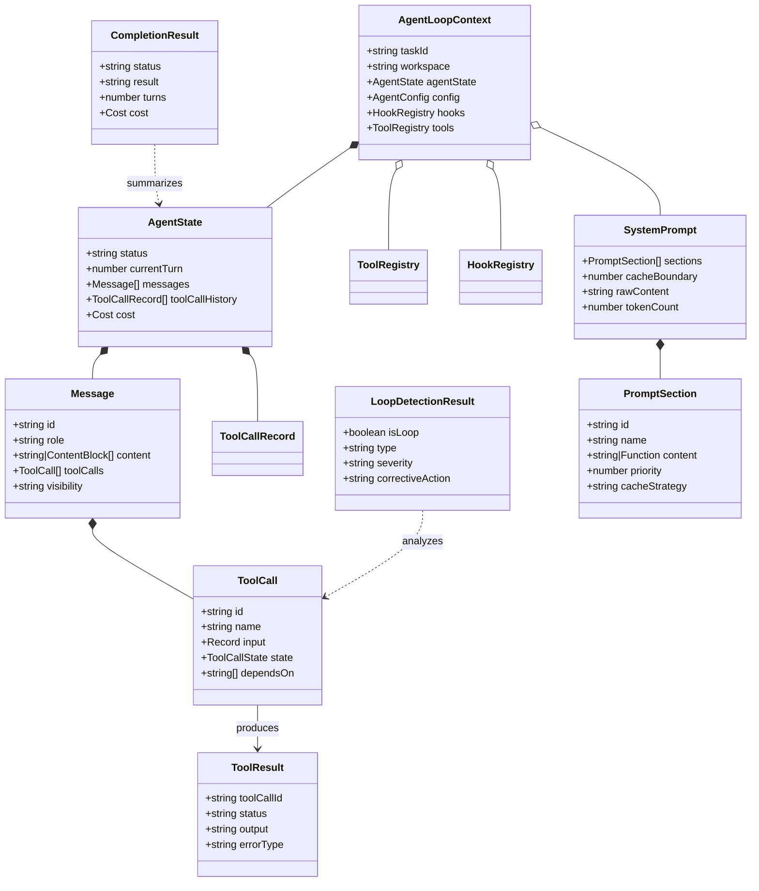

### 3.2 接口设计

#### 3.2.1 Prompt 相关接口

**`IPromptBuilder`** — Prompt 构建器接口

```typescript
interface IPromptBuilder {
  registerSection(section: PromptSection): void;
  build(ctx: AgentLoopContext, userMessage: string): SystemPrompt;
  getSection(id: string): PromptSection | undefined;
  getSections(): PromptSection[];
  estimateTokens(content: string, model: string): number;
}
```

实现要点：Section 按 priority 升序排列后拼接；`cacheBoundary` 标记第一个 `cacheStrategy === 'dynamic'` 的 Section 位置；每个 Section 先判断 `condition(ctx)`，false 则跳过。参考 Gemini CLI 的 9 模块组装、OpenClaw 的 CACHE BOUNDARY。

---

**`IContextInjector`** — 上下文注入接口

```typescript
interface IContextInjector {
  injectContext(workspace: string, taskDescription: string, maxTokens: number): Record<string, string>;
  estimateTokens(context: Record<string, string>, model: string): number;
  updateContextIfNeeded(ctx: AgentLoopContext): boolean;
}
```

实现要点：使用 Tree-sitter 解析代码结构 + PageRank 选择相关文件（参考 Aider Repo Map）；仅在文件内容变化时重新注入。参考 Gemini CLI 的按需注入策略。

---

**`ICacheOptimizer`** — 缓存优化接口

```typescript
interface ICacheOptimizer {
  optimizeSections(sections: PromptSection[]): PromptSection[];
  sortToolsForCache(tools: ToolDescription[]): ToolDescription[];
  getCacheStats(): { hitRate: number; totalRequests: number };
}
```

实现要点：稳定内容放上方，动态内容放下方；工具列表按字母序排列。参考 OpenClaw 的 `[CACHE BOUNDARY]` 标记设计。

---

**`IProviderTransformer`** — Provider 转换接口

```typescript
interface IProviderTransformer {
  transform(systemPrompt: SystemPrompt, messages: Message[], targetProvider: string): LLMRequestParams;
  parseResponse(response: LLMResponse, provider: string): Message;
  getProviderTemplate(baseTemplate: string, provider: string): string;
}
```

实现要点：为 GPT/Claude/Gemini 各定制专属 Prompt（参考 OpenCode Provider 适配）；处理工具描述格式差异。

---

#### 3.2.2 工具相关接口

**`IToolRegistry`** — 工具注册接口

```typescript
interface IToolDefinition {
  name: string;
  description: string;
  parameters: JsonSchema;
  handler: (input: Record<string, any>, ctx: AgentLoopContext) => Promise<ToolResult>;
  permissions: {
    level: 'auto' | 'approval_required' | 'blocked';
    sandboxRequired: boolean;
    allowedPatterns?: string[];
    blockedPatterns?: string[];
  };
  metadata?: { category: string; parallelizable: boolean; timeout?: number; retryable: boolean };
}

interface IToolRegistry {
  register(definition: IToolDefinition): void;
  get(name: string): IToolDefinition | undefined;
  getAllDescriptions(filter?: { agentType?: string }): ToolDescription[];
  registerMcpServer(config: McpServerConfig): Promise<void>;
  unregister(name: string): void;
  getToolSchema(name: string): ToolSchema;
}
```

实现要点：支持 MCP 协议 + 内置工具 + 动态工具三层注册（9/11 项目支持 MCP）。参考 Goose 的 Toolshim 架构、OpenCode 的工具注册。

---

**`IToolExecutor`** — 工具执行接口

```typescript
interface IToolExecutor {
  execute(toolCall: ToolCall, ctx: AgentLoopContext): Promise<ToolResult>;
  executeBatch(toolCalls: ToolCall[], ctx: AgentLoopContext): Promise<ToolResult[]>;
  cancel(toolCallId: string): void;
  getActiveCalls(): ToolCall[];
}
```

实现要点：依赖分析构建 DAG，无依赖的工具并行执行（参考 Codex CLI 异步 Future）。参考 Gemini CLI 的 wait_for_previous 控制。

---

**`IToolInspector`** — 工具检查器接口

```typescript
interface IToolInspector {
  priority: number;
  inspect(toolCall: ToolCall, ctx: AgentLoopContext): InspectionResult;
}

interface InspectionResult {
  status: 'pass' | 'block' | 'require_approval' | 'modify';
  reason?: string;
  modifiedToolCall?: ToolCall;
}
```

实现要点：参考 Goose 五层检查器链（Security -> Egress -> Adversary -> Permission -> Repetition）；短路优化。参考 Gemini CLI 的 PreToolUse Hook 机制。

---

**`IToolCallStateMachine`** — 工具调用状态机接口

```typescript
interface IToolCallStateMachine {
  create(toolCall: ToolCall): void;
  transition(toolCallId: string, newState: ToolCallState): void;
  getState(toolCallId: string): ToolCallState;
  getByState(state: ToolCallState): ToolCall[];
  getHistory(toolCallId: string): StateTransition[];
}
// 合法流转: validating -> scheduled -> executing -> success/error/cancelled
```

实现要点：参考 Gemini CLI 的状态机设计；所有流转记录到审计日志，支持回放调试。

---

#### 3.2.3 Agent-Loop 相关接口

**`IAgentLoopController`** — Agent Loop 控制器接口

```typescript
interface IAgentLoopController {
  start(task: string, config: AgentConfig): Promise<CompletionResult>;
  abort(graceful?: boolean): void;
  pause(): void;
  resume(): void;
  getState(): AgentState;
  sendMessage(message: string): void;
  registerRecoveryStrategy(errorType: string, handler: (error: Error, ctx: AgentLoopContext) => Promise<void>): void;
}
```

实现要点：参考 OpenClaw 三层嵌套循环架构。Runner 层：模型回退 + HTTP 重试；Agent 主循环层：错误分类纠正；Attempt 层：超时控制 + 优雅退出。参考 Cline 的递归驱动 + TaskState 集中管理。

---

**`ILoopDetector`** — Loop 检测接口

```typescript
interface ILoopDetector {
  detect(currentState: AgentState): LoopDetectionResult;
  recordTurn(toolCalls: ToolCall[], responseText: string): void;
  reset(): void;
  generateCorrectiveMessage(result: LoopDetectionResult): Message;
}
```

**三重检测算法**：

| 检测器 | 算法 | 触发条件 | 参考项目 |
|--------|------|---------|---------|
| 相同工具调用检测 | 检查最近 N 轮是否调用相同工具 + 相同参数 | 连续 3 轮完全相同 | Gemini CLI |
| 内容重复检测 | 计算相邻轮次 LLM 响应文本的语义相似度 | 相似度 > 0.85 且连续 2 轮 | Gemini CLI |
| LLM 辅助检测 | 将最近 N 轮轨迹发送给小模型判断是否 Loop | 小模型判定为 Loop | Gemini CLI |

纠正策略：首次检测到注入反馈让模型自我纠正，第二次执行上下文压缩，第三次终止循环。

---

**`IStuckDetector`** — 卡住检测接口

```typescript
interface IStuckDetector {
  detect(currentState: AgentState): StuckDetectionResult | null;
}

enum StuckType {
  REPEATED_ACTION_OBSERVATION = 'repeated_action_observation',
  REPEATED_ACTION_ERROR = 'repeated_action_error',
  MONOLOGUE = 'monologue',
  ALTERNATING = 'alternating',
  CONTEXT_OVERFLOW_CYCLE = 'context_overflow_cycle',
}
```

实现要点：参考 OpenHands 五种 Stuck 模式检测。每种模式有独立的窗口大小和阈值配置。检测到 Stuck 后触发对应恢复策略（非直接终止）。

---

**`IContextManager`** — 上下文管理接口

```typescript
interface IContextManager {
  addMessage(message: Message): number;
  getContextUsage(): { used: number; total: number; ratio: number };
  needsCompaction(threshold?: number): boolean;
  compact(strategy: CompactionStrategy): Message[];
  filterAgentVisible(messages: Message[]): Message[];
}
```

**三层压缩策略**：L1 可见性过滤（零成本常开，参考 Goose）；L2 工具对异步摘要（中等成本，参考 Gemini CLI）；L3 LLM 全文压缩（高成本，接近超限时触发，参考 Goose）。按需触发：仅在 `ratio > threshold` 时执行。

---

**`ICompletionChecker`** — 完成条件检查接口

```typescript
interface ICompletionChecker {
  check(response: Message, ctx: AgentLoopContext): CompletionCheckResult;
  registerPromise(promise: CompletionPromise): void;
  verifyPromises(ctx: AgentLoopContext): boolean;
}

interface CompletionCheckResult {
  isComplete: boolean;
  status: 'completed' | 'aborted' | 'timeout' | 'error' | 'max_turns' | 'continue';
  result?: string;
}
```

实现要点：参考 Claude Code 的 `<promise>` 机制（Agent 声明完成条件，框架侧验证）。参考 Gemini CLI 的 Next Speaker 检查。

---

#### 3.2.4 安全相关接口

**`ISecurityChain`** — 安全检查链接口

```typescript
interface ISecurityChain {
  addInspector(inspector: IToolInspector): void;
  execute(toolCall: ToolCall, ctx: AgentLoopContext): Promise<InspectionResult>;
  getInspectors(): IToolInspector[];
  removeInspector(type: string): void;
}
// 默认五层：SecurityInspector(10) -> SandboxInspector(20) -> EgressInspector(30) -> AdversaryInspector(40) -> RepetitionInspector(50)
```

实现要点：参考 Goose 五层检查器链设计。短路优化：任一检查器返回 block 则终止。

---

**`ISandbox`** — 沙箱接口

```typescript
interface ISandbox {
  initialize(config: SandboxConfig): Promise<boolean>;
  execute(command: SandboxCommand, ctx: AgentLoopContext): Promise<ToolResult>;
  writeFile(path: string, content: string): Promise<void>;
  readFile(path: string): Promise<string>;
  destroy(): Promise<void>;
  getStatus(): SandboxStatus;
}
```

实现要点：参考 OpenHands、SWE-Agent 的 Docker 沙箱。参考 Codex CLI 的渐进式安全：沙箱失败 -> 请求审批 -> 无沙箱重试。

---

**`IApprovalManager`** — 审批管理接口

```typescript
interface IApprovalManager {
  request(request: ApprovalRequest): Promise<ApprovalResult>;
  registerAutoApprove(condition: AutoApproveCondition): void;
  checkAutoApprove(toolCall: ToolCall, ctx: AgentLoopContext): boolean;
}
```

实现要点：只读工具默认自动审批；写操作、Shell 命令需要用户审批。参考 Codex CLI 的分级审批机制。

---

**`IHookRegistry`** — Hook 注册接口

```typescript
enum HookType {
  BeforeAgent = 'before_agent', AfterAgent = 'after_agent',
  BeforeModel = 'before_model', AfterModel = 'after_model',
  BeforeToolUse = 'before_tool_use', AfterToolUse = 'after_tool_use',
  OnLoopDetected = 'on_loop_detected', OnStuckDetected = 'on_stuck_detected',
  OnError = 'on_error',
}

interface IHookRegistry {
  register(hook: Hook): void;
  execute(type: HookType, args: HookArgs): Promise<HookResult[]>;
  unregister(id: string): void;
  getHooks(type: HookType): Hook[];
}
```

实现要点：参考 Gemini CLI 8 种 Hook 类型 + Claude Code 4 种 Hook。覆盖 Agent/Model/Tool 全生命周期。

---

#### 3.2.5 接口关系图

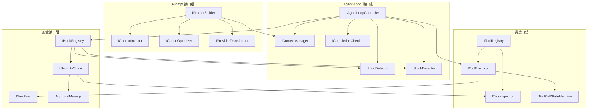

### 3.3 Prompt 定义规范

#### 3.3.1 Prompt 模块划分

定义 10 个标准 Prompt Section（综合 Gemini CLI 9 模块、OpenClaw 15+ sections、Claude Code Markdown 即 Prompt 最佳实践）：

| # | Section 名称 | 优先级 | 触发条件 | 缓存策略 | 内容概要 |
|---|------------|--------|---------|---------|---------|
| 1 | `role_definition` | 10 | 始终 | stable | Agent 角色定义、能力说明 |
| 2 | `behavior_rules` | 20 | 始终 | stable | 行为准则（最小修改、不回归等） |
| 3 | `safety_constraints` | 25 | 始终 | stable | 安全约束（禁止破坏性操作等） |
| 4 | `tool_descriptions` | 30 | 始终 | stable | 工具列表（按字母序排列） |
| 5 | `edit_format_rules` | 35 | 代码编辑时 | stable | SEARCH/REPLACE 格式规范 |
| 6 | `few_shot_examples` | 40 | 支持 few-shot 时 | stable | 2-3 个示例对话 |
| 7 | `project_context` | 50 | 始终 | dynamic | 项目结构、相关文件摘要 |
| 8 | `conversation_history` | 60 | 有历史时 | dynamic | 对话历史（可能经过压缩） |
| 9 | `tool_results` | 70 | 有工具结果时 | dynamic | 最近 N 轮工具执行结果 |
| 10 | `current_task` | 100 | 始终 | dynamic | 当前用户消息/任务 |

**CACHE BOUNDARY 布局**：

```
=== CACHE BOUNDARY (stable content above, dynamic below) ===

[stable]    role_definition        (priority=10)
[stable]    behavior_rules         (priority=20)
[stable]    safety_constraints     (priority=25)
[stable]    tool_descriptions      (priority=30)  ← 按字母序排列
[stable]    edit_format_rules      (priority=35)
[stable]    few_shot_examples      (priority=40)
             ─── CACHE BOUNDARY ───
[dynamic]   project_context        (priority=50)
[dynamic]   conversation_history   (priority=60)
[dynamic]   tool_results           (priority=70)
[dynamic]   current_task           (priority=100)
```

参考 OpenClaw 的 CACHE BOUNDARY 设计：Anthropic 模型 prompt cache 命中率可从 ~30% 提升到 ~70%。

#### 3.3.2 CACHE BOUNDARY 规范

**稳定内容区域规则**（boundary 上方）：不随对话轮次变化的内容；按字母序排列工具描述；内容长度尽量固定。

**动态内容区域规则**（boundary 下方）：随对话轮次变化的内容；按时间顺序排列；被压缩时不影响上方稳定内容。

**工具列表排序规则**：按工具名字母序排列；工具描述格式保持一致。参考 Goose 的工具名排序策略。

#### 3.3.3 Provider 适配规范

| 模型家族 | System Prompt 位置 | 工具描述格式 | 参考项目 |
|---------|-------------------|------------|---------|
| **Claude (Anthropic)** | system prompt 参数 | tools 数组 | OpenClaw、Goose |
| **GPT-4o (OpenAI)** | 第一条消息 | functions 数组 | Cline、OpenCode |
| **Gemini (Google)** | system instruction 字段 | function_declarations | Gemini CLI |
| **开源模型** | 可能需 XML 标签回退 | 文本格式 | SWE-Agent、Cline |

#### 3.3.4 Prompt 版本管理

**版本号格式**：`{major}.{minor}.{patch}`。major=不兼容变更；minor=向后兼容变更；patch=修复/优化。

**A/B 测试机制**：支持同时维护多个 Prompt 版本；按百分比流量分配到不同版本；记录各版本的任务完成率、平均 token 消耗、平均延迟。

#### 3.3.5 核心 Prompt 模板与节点处理

本节定义 Agent-Loop 中每个关键节点使用的完整 Prompt 模板，以及该节点的处理逻辑（输入、处理、输出）。

---

**节点 1：LLM 主调用 Prompt（Agent ReAct 循环核心）**

这是 Agent Loop 中最核心的 Prompt，驱动 LLM 进行 ReAct（Reason + Act）循环。

```markdown
## System Prompt 完整模板

[ROLE DEFINITION - stable]
You are an expert software developer AI assistant. You help users with coding tasks
including reading, writing, modifying, debugging, and understanding code.

[BEHAVIOR RULES - stable]
1. Always analyze before making changes
2. Make the minimal change needed
3. Never introduce regressions
4. Follow existing code style
5. If uncertain, explain before acting
6. After changes, verify they work
7. If ambiguous, ask clarifying questions
8. Do not speculate about unread files

[SAFETY CONSTRAINTS - stable]
- Do NOT execute destructive operations without explicit user approval
- Do NOT access files outside the workspace directory
- Do NOT make network requests unless explicitly requested

[TOOL DESCRIPTIONS - stable, alphabetically sorted]
[TOOL: grep_search] Search for patterns in files. Parameters: pattern, path
[TOOL: list_dir] List directory contents. Parameters: path
[TOOL: read_file] Read file contents. Parameters: path
[TOOL: run_command] Execute shell command. Parameters: command
[TOOL: write_file] Write content to file. Parameters: path, content

=== CACHE BOUNDARY ===

[PROJECT CONTEXT - dynamic]
Workspace: {workspace_path}
Structure:
{tree_output}

[CONVERSATION HISTORY - dynamic]
{compressed_history}

[TOOL RESULTS - dynamic]
{recent_tool_results}

[CURRENT TASK - dynamic]
{user_message}
```

**该节点处理逻辑**：

| 步骤 | 输入 | 处理 | 输出 | 参考来源 |
|------|------|------|------|---------|
| 1. 消息组装 | AgentLoopContext, 用户消息 | `PromptBuilder.build()` 按优先级排序 10 个 Section，应用 CACHE BOUNDARY | SystemPrompt 对象 | OpenClaw（15+ sections 排序）、Gemini CLI（9 模块组装） |
| 2. Provider 转换 | SystemPrompt | `ProviderTransformer.transform()` 根据目标模型格式转换消息结构 | LLMRequestParams | OpenCode（Provider 特定模板）、Cline（多模型适配） |
| 3. Token 估算 | SystemPrompt.rawContent | `estimateTokens()` 使用 tiktoken 或模型 API 估算 | tokenCount 数字 | Aider（check_tokens）、Cline（token 计数） |
| 4. 安全检查 | SystemPrompt.rawContent | `HookRegistry.execute(BeforeModel)` 检测对抗性注入 | allow/block | Gemini CLI（BeforeModel Hook）、Goose（AdversaryInspector） |
| 5. LLM 流式调用 | LLMRequestParams | `LLMRouter.stream()` 发送请求，聚合 chunk | Message (含 toolCalls 或文本) | OpenClaw（模型回退链）、Cline（流式协调） |
| 6. 响应解析 | LLM 原始响应 | 解析 tool_calls 字段或文本内容，映射到内部 Message 格式 | 内部 Message 对象 | Cline（混合格式解析）、SWE-Agent（FC + XML 回退） |
| 7. 后处理校验 | Message | 检查是否为 Planning-only / Empty Response / Reasoning-only | 有效/需要纠正 | OpenClaw（不完美输出纠正）、Gemini CLI（响应校验） |

---

**节点 2：Next Speaker 路由 Prompt**

当 LLM 响应返回后，判断下一步执行者。部分项目（如 Gemini CLI）使用专门的 Prompt 做路由判断。

```markdown
## Next Speaker 判断规则（内嵌于代码逻辑，非独立 Prompt）

给定 LLM 的响应，按以下优先级判断：

1. 如果响应包含 tool_calls -> 下一步执行工具
2. 如果响应包含完成声明（如 "I have completed the task"）-> 验证完成条件
3. 如果响应仅为文本（无 tool_calls）-> 检查是否为：
   a. Planning-only: 只输出计划但没行动 -> 附加 "Now execute the plan" 并重试
   b. Reasoning-only: 只输出分析但没行动 -> 附加 "Please proceed with the next step" 并重试
   c. 正常回答用户 -> 输出给用户，等待下一轮
4. 如果响应为空 -> 附加 "Please continue" 并重试
```

**该节点处理逻辑**：

| 步骤 | 输入 | 处理 | 输出 | 参考来源 |
|------|------|------|------|---------|
| 1. 解析响应 | LLM Message | 检查 toolCalls 数组是否非空 | hasToolCalls: boolean | Cline（响应解析）、OpenCode（processor.ts） |
| 2. 完成声明检测 | Message.content | 正则匹配完成关键词 + Promise 验证 | isClaimingComplete: boolean | Claude Code（`<promise>` 机制）、OpenClaw（完成条件） |
| 3. Planning-only 检测 | Message.content | 检查是否只包含计划列表但无工具调用 | isPlanningOnly: boolean | OpenClaw（Planning-only 纠正）、OpenHands（独白检测） |
| 4. Empty 检测 | Message.content | 检查 content 是否为空或仅空白 | isEmpty: boolean | OpenClaw（Empty Response 纠正） |
| 5. 路由决策 | 上述检测结果 | 决策树判断下一执行者 | route: 'tool' \| 'user' \| 'agent_retry' | Gemini CLI（Next Speaker 检查）、Claude Code（多 Agent 路由） |

---

**节点 3：Loop 纠正 Prompt（首次检测到时注入）**

当 Loop 检测器发现重复行为时，注入反馈让模型自我纠正。

```markdown
## Loop 纠正消息模板

I notice you seem to be repeating the same action without making progress.

Here's what you've done in the last {n} turns:
{recent_action_summary}

The results have been:
{recent_result_summary}

Please try a different approach. Consider:
1. Reading more files to understand the codebase
2. Using a different tool or command
3. Breaking the problem into smaller steps

What would you like to do next?
```

**该节点处理逻辑**：

| 步骤 | 输入 | 处理 | 输出 | 参考来源 |
|------|------|------|------|---------|
| 1. Loop 确认 | LoopDetectionResult | 确认 Loop 类型和严重程度 | 纠正策略选择 | Gemini CLI（三重检测确认）、OpenHands（Stuck 确认） |
| 2. 轨迹摘要 | 最近 N 轮 toolCalls + results | 提取工具调用序列和结果摘要 | 人类可读的描述文本 | Gemini CLI（轨迹摘要生成） |
| 3. 纠正消息生成 | 轨迹摘要 + Loop 类型 | 按模板生成纠正 Prompt | 纠正 Message | Gemini CLI（首次反馈自我纠正）、Aider（反射消息机制） |
| 4. 注入消息历史 | 纠正 Message + 原消息历史 | `ContextManager.addMessage()` | 更新后的消息列表 | Aider（reflected_message 注入）、Cline（消息注入） |
| 5. 重置计数器 | AgentState | 重置 loopCount 但保留总反射计数 | 更新后的 AgentState | Aider（num_reflections 计数）、SWE-Agent（重试计数） |

---

**节点 4：Stuck 纠正 Prompt**

针对五种 Stuck 模式各有专用纠正 Prompt。

```markdown
## MONOLOGUE 纠正（连续多轮无工具调用）

You have been providing analysis without taking action for {n} turns.
Analysis is helpful, but now it's time to act.

Please use an appropriate tool to make progress on the task.
If you need more information, use read_file or grep_search first.

## REPEATED_ACTION_ERROR 纠正（相同工具相同错误）

The command `{command}` has failed {n} times with the same error:
{error_message}

Instead of retrying the same command, consider:
1. What is the root cause of this error?
2. Is there an alternative approach?
3. Do you need to read more context first?

## ALTERNATING 纠正（A->B->A->B 交替模式）

You seem to be alternating between:
- Action A: {action_a_description}
- Action B: {action_b_description}

This pattern has repeated {n} times without progress.
Please break out of this cycle and try a different approach.
```

**该节点处理逻辑**：

| 步骤 | 输入 | 处理 | 输出 | 参考来源 |
|------|------|------|------|---------|
| 1. Stuck 确认 | StuckDetectionResult | 确认 Stuck 类型和匹配的模式序列 | 纠正策略选择 | OpenHands（五种 Stuck 模式检测） |
| 2. 模式提取 | 最近 N 轮轨迹 | 提取触发 Stuck 的具体模式（如交替的两个动作） | 模式描述文本 | OpenHands（重复对检测、交替模式检测） |
| 3. 模板选择 | StuckType | 选择对应的纠正模板 | 模板字符串 | Gemini CLI（纠正消息模板）、Goose（可见性分层消息） |
| 4. 变量填充 | 模式描述 + 错误信息 | 将具体信息填充到模板变量中 | 纠正消息文本 | Aider（格式错误反馈）、SWE-Agent（错误信息注入） |
| 5. 注入 + 标记 | 纠正消息 + AgentState | 注入消息历史，标记已进入纠正模式 | 更新后的状态 | Aider（reflected_message 机制）、OpenClaw（错误分类恢复） |

---

**节点 5：上下文压缩 Prompt（L3 LLM 全文压缩）**

当上下文接近窗口极限时，使用 LLM 将历史对话压缩为摘要。

```markdown
## Context Compression Prompt

You are summarizing a conversation between a user and an AI coding assistant.

The user's original task was: {task_description}

Below is the conversation history. Please create a concise summary that preserves
all information needed to continue the task.

Summary requirements:
1. What files were read and what was learned from each
2. What changes were made (file paths and brief description)
3. What errors were encountered and how they were resolved (or not)
4. What is the current state of the task (completed vs remaining)
5. Any important context that the next turns will need

Conversation to summarize:
{conversation_history}

Provide the summary in a structured format that can replace the full history.
```

**该节点处理逻辑**：

| 步骤 | 输入 | 处理 | 输出 | 参考来源 |
|------|------|------|------|---------|
| 1. 触发判断 | contextUsage.ratio | 检查是否 > 80% 阈值 | 是否需要压缩: boolean | Cline（context window 检查）、OpenCode（compaction 触发） |
| 2. 保留区确定 | 消息列表 | 保留最近 3-5 轮不压缩 | 待压缩消息子集 | Goose（可见性分层）、Cline（滑动窗口策略） |
| 3. 压缩 Prompt 构建 | 任务描述 + 待压缩消息 | 按模板构建压缩请求 | 压缩请求 Message | Gemini CLI（LLM 摘要压缩）、Goose（上下文摘要） |
| 4. LLM 压缩调用 | 压缩请求 | 使用便宜模型（如 Haiku）执行压缩 | 摘要文本 | Claude Code（模型分层调度）、Goose（压缩用低阶模型） |
| 5. 消息替换 | 原消息列表 + 摘要 | 将待压缩消息替换为单条摘要消息 | 压缩后的消息列表 | OpenCode（compaction.ts）、Gemini CLI（context compaction） |
| 6. Token 重算 | 压缩后消息列表 | 重新计算总 token 使用率 | 新的 contextUsage | Cline（token 计数）、OpenClaw（token 检查） |

---

**节点 6：完成条件验证 Prompt（Promise 验证）**

当 LLM 声明完成任务时，使用 Hook + Prompt 验证是否真正完成。

```markdown
## Completion Verification Prompt

The AI assistant claims the task is complete.

Original task: {task_description}
Assistant's final statement: {assistant_statement}

Files that were modified (based on tool call history):
{modified_files_list}

Please verify:
1. Does the assistant's statement address the original task?
2. Were all requested changes actually made?
3. Are there any obvious issues or incomplete work?

Respond with: COMPLETE if the task is truly done, or INCOMPLETE with explanation.
```

**该节点处理逻辑**：

| 步骤 | 输入 | 处理 | 输出 | 参考来源 |
|------|------|------|------|---------|
| 1. 完成声明检测 | LLM Message.content | 检测完成关键词 + `<promise>` 标签 | isClaimingComplete: boolean | Claude Code（`<promise>` 完成条件）、Gemini CLI（Next Speaker 检查） |
| 2. Promise 提取 | Message.content | 提取所有 `<promise>` 声明的条件 | Promise[] | Claude Code（Ralph Loop 完成承诺） |
| 3. Promise 验证 | Promise[] + 文件系统状态 | 逐条验证每个条件是否满足 | allPromisesMet: boolean | Claude Code（文件系统状态验证） |
| 4. LLM 辅助验证 | 任务描述 + 助手声明 | 如需要，调用小模型验证完成声明 | verified: boolean | Gemini CLI（LLM 辅助 Loop 检测，迁移用于验证） |
| 5. 最终决策 | 验证结果 | 全部满足 -> 完成；否则 -> 注入纠正指令继续循环 | CompletionCheckResult | Claude Code（Stop Hook 验证）、OpenClaw（完成条件检查） |

---

**节点 7：工具执行结果注入 Prompt**

工具执行结果需要格式化为 LLM 可理解的格式注入回消息历史。

```markdown
## Tool Result 消息模板（注入到消息历史）

[TOOL_RESULT: {tool_name}]
Input: {tool_input_summary}
Output:
{tool_output}
{error_info_if_any}

{context_hints_if_needed}
```

**该节点处理逻辑**：

| 步骤 | 输入 | 处理 | 输出 | 参考来源 |
|------|------|------|------|---------|
| 1. 结果格式化 | ToolResult | 按模板格式化工具输出文本 | 格式化字符串 | Cline（tool_result XML 标签）、SWE-Agent（observation 格式化） |
| 2. 输出截断 | 格式化字符串 | 如果输出超长（> 4000 字符），截断并附加说明 | 截断后的字符串 | Aider（truncate_output）、Open Interpreter（输出截断） |
| 3. 消息创建 | 格式化结果 + toolCallId | 创建 role='tool' 的 Message 对象 | Message | OpenAI Function Calling 标准、Anthropic Tool Use 标准 |
| 4. 注入历史 | Message | `ContextManager.addMessage()` | 新的 contextUsage | Cline（消息注入）、OpenHands（EventStream 注入） |
| 5. 工具对摘要更新 | tool_call + tool_result | 更新工具对摘要缓存（用于 L2 压缩） | 摘要缓存更新 | Gemini CLI（工具对异步摘要）、Goose（上下文压缩缓存） |

---

**节点 8：任务初始化 Prompt（首次进入 Loop 时）**

用户首次输入任务时的初始化处理。

```markdown
## 任务分析 Prompt（可选，用于复杂任务的路由决策）

Analyze the following task and determine:
1. Complexity level: simple / medium / complex
2. Estimated number of file operations needed
3. Whether parallel sub-tasks are possible
4. Recommended model tier for this task

Task: {user_task}
```

**该节点处理逻辑**：

| 步骤 | 输入 | 处理 | 输出 | 参考来源 |
|------|------|------|------|---------|
| 1. 任务接收 | 用户输入文本 | 创建初始 user Message | Message | 所有项目通用 |
| 2. 上下文注入 | workspace 路径 | `ContextInjector.injectContext()` 注入项目结构 | 上下文字典 | Aider（Repo Map 智能裁剪）、OpenHands（workspace 初始化） |
| 3. 复杂度评估 | 任务文本 | 基于关键词启发式或轻量模型评估复杂度 | complexity: simple/medium/complex | Claude Code（模型分层调度）、OpenCode（Agent 类型分离） |
| 4. 模型路由 | 复杂度 | 根据决策树选择模型 | 选定的模型标识 | Claude Code（Haiku->Sonnet->Opus 分层）、OpenClaw（模型回退链） |
| 5. 成本基线记录 | AgentState | 记录任务开始时的成本快照 | 初始成本记录 | SWE-Agent（cost_limit 追踪）、OpenCode（成本监控） |

### 3.4 Agent-Loop 设计

#### 3.4.1 三层循环架构

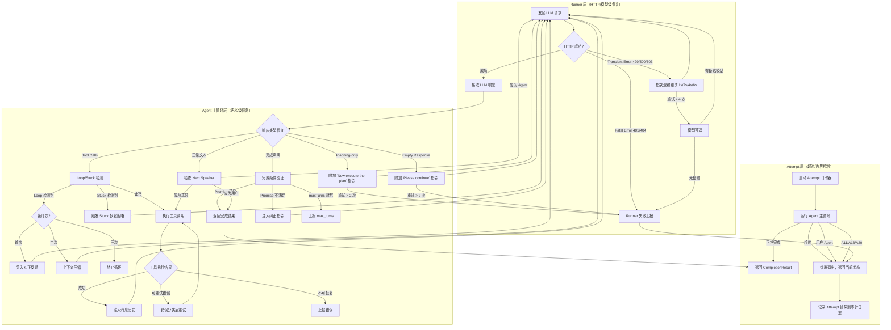

**各层详细定义**：

| 层级 | 职责 | 错误处理策略 | 恢复动作 | 最大重试 | 参考项目 |
|------|------|------------|---------|---------|---------|
| **Runner 层** | HTTP 请求、模型调用、认证 | Transient Error：指数退避重试<br>Model Error：模型回退链（主模型→备选→降级） | 延迟重试 1s/2s/4s/8s | 4 次重试 + 2 次回退 | OpenClaw |
| **Agent 主循环层** | ReAct 循环、工具调度、Loop/Stuck 检测 | Planning-only：附加 act-now 指令<br>Empty Response：附加 continuation 指令<br>Loop：注入反馈纠正<br>Stuck：对应恢复策略 | 自我纠正 / 上下文压缩 / 任务重新聚焦 | 各类型独立 | OpenClaw + Gemini CLI |
| **Attempt 层** | 超时控制、Abort 处理、maxTurns 限制 | 超时：优雅退出<br>Abort：保留状态后退出<br>maxTurns：返回当前最佳结果 | Autosubmission | 一次性边界 | SWE-Agent |

#### 3.4.2 Loop 检测机制

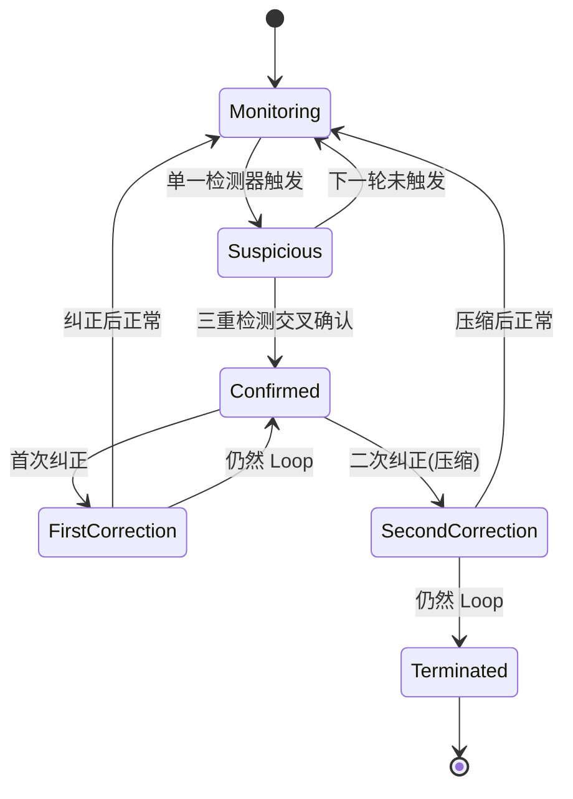

**三重检测算法详细说明**：

| 检测器 | 窗口大小 | 阈值 | 算法描述 | 计算成本 | 误报率 | 参考项目 |
|--------|---------|------|---------|---------|--------|---------|
| 相同工具调用检测 | 最近 5 轮 | 连续 3 轮完全相同 | 精确匹配 tool name + 参数 hash（SHA-256 前 8 位） | O(n) 字符串比较 | 低 | Gemini CLI |
| 内容重复检测 | 最近 4 轮 | TF-IDF 余弦相似度 > 0.85，连续 2 轮 | 将 LLM 响应文本向量化，计算相邻轮次相似度 | O(n²) 向量计算 | 中 | Gemini CLI |
| LLM 辅助检测 | 最近 6 轮 | 小模型判定为 Loop（> 0.7 置信度） | 将最近 6 轮轨迹发送给轻量模型（Haiku）判断 | 一次轻量 LLM 调用 | 最低 | Gemini CLI |

**各检测器的处理流程**：

| 步骤 | 输入 | 处理 | 输出 |
|------|------|------|------|
| 1. 记录轮次 | ToolCall[] + responseText | `LoopDetector.recordTurn()` 追加到滑动窗口 | 更新的窗口数据 |
| 2. 精确匹配检测 | 最近 5 轮 toolCalls | 比较 tool name + 参数 hash 是否完全相同 | matchCount: number |
| 3. 内容相似度检测 | 最近 4 轮 responseText | TF-IDF 向量化 -> 余弦相似度计算 | similarityScore: number |
| 4. LLM 辅助检测（可选） | 最近 6 轮轨迹摘要 | 构建判断 Prompt -> 调用小模型 -> 解析结果 | loopConfidence: number |
| 5. 综合判定 | 三个检测结果 | 任一触发 -> Suspicious；两个以上 -> Confirmed | LoopDetectionResult |
| 6. 纠正动作 | LoopDetectionResult | 根据 loopCount 选择策略（反馈/压缩/终止） | 纠正 Message 或终止信号 |

**纠正策略**：

| 阶段 | 动作 | 注入 Prompt | 后续行为 |
|------|------|-----------|---------|
| 首次 | 注入反馈自我纠正 | "你似乎在重复相同操作，请回顾之前结果，尝试不同方法" | 继续循环，重置计数器 |
| 二次 | 上下文压缩 + 重新聚焦 | "重新聚焦任务目标，当前已完成 X，剩余需要做 Y" | 执行 L2/L3 压缩后继续 |
| 三次 | 终止循环 | — | 返回 error 状态 |

#### 3.4.3 Stuck 检测机制

**五种 Stuck 模式的检测算法和处理流程**：

| 模式 | 检测窗口 | 判定条件 | 算法描述 | 恢复策略 | 参考项目 |
|------|---------|---------|---------|---------|---------|
| REPEATED_ACTION_OBSERVATION | 最近 8 轮 | 相同 tool_call + 相同 tool_result >= 3 次 | (toolName, paramHash, resultHash) 三元组哈希，统计连续出现次数 | 注入反馈 + 建议不同参数 | OpenHands |
| REPEATED_ACTION_ERROR | 最近 8 轮 | 相同 tool_call + 相同 error >= 3 次 | (toolName, paramHash, errorType) 三元组哈希，统计连续出现次数 | 注入反馈 + 错误原因分析 | OpenHands |
| MONOLOGUE | 最近 10 轮 | 连续 >= 5 轮无工具调用 | 检查每轮 toolCalls.length === 0 的连续计数 | 附加"请调用工具"指令 | OpenHands |
| ALTERNATING | 最近 10 轮 | A->B->A->B 模式 >= 3 次 | 将每轮 action 签名存入序列，检测 ABAB 子串 | 任务重新聚焦 + 建议新方法 | OpenHands |
| CONTEXT_OVERFLOW_CYCLE | 整个会话 | 压缩后仍然 Loop | 检查连续 2 次压缩后仍然触发 Loop | 硬重置 + 重新规划 | OpenHands |

**以 REPEATED_ACTION_ERROR 为例的处理流程**：

| 步骤 | 输入 | 处理 | 输出 |
|------|------|------|------|
| 1. 错误记录 | ToolResult (status='error') | 提取 errorType + error 文本前 100 字符 | 错误签名 |
| 2. 模式匹配 | 最近 8 轮错误签名序列 | 查找连续相同签名的子序列 | matchCount: number |
| 3. 阈值判断 | matchCount | 检查是否 >= 3 | isStuck: boolean |
| 4. 根因分析 | 错误文本 + 工具参数 | 生成错误原因的结构化分析 | 根因描述 |
| 5. 纠正消息生成 | 根因描述 + 纠正模板 | 填充 REPEATED_ACTION_ERROR 模板 | 纠正 Message |
| 6. 状态更新 | AgentState | 记录 Stuck 事件到审计日志 | 更新的 AgentState |

#### 3.4.4 上下文管理策略

| 层级 | 策略 | 触发条件 | 压缩率 | 参考项目 |
|------|------|---------|--------|---------|
| L1 | 可见性过滤 | 始终常开 (ratio > 60%) | ~10% | Goose |
| L2 | 工具对异步摘要 | 上下文使用率 > 70% | ~30% | Gemini CLI |
| L3 | LLM 全文压缩 | 上下文使用率 > 80% | ~60% | Goose |

**关键信息保留规则**：用户消息始终保留；最近的错误信息始终保留；最近 3 轮完整保留；文件创建/修改的 tool_result 保留摘要；任务目标始终在 system prompt 中。

#### 3.4.5 多 Agent 协同

**模型分层调度**（参考 Claude Code）：

| 任务类型 | 使用模型 | 成本等级 |
|---------|---------|---------|
| 文件读取/搜索 | Haiku/Flash | 低 |
| 代码分析/修改 | Sonnet/Pro | 中 |
| 架构设计/调试 | Opus/Ultra | 高 |

**共享状态设计**：所有 Agent 共享同一工作目录；子 Agent 写入临时目录，完成后合并；使用 `.agent/{agent_id}/` 目录存储中间状态。参考 Claude Code 的文件系统共享。

---

#### 3.5.1 纵深防御五层

**第一层：SecurityInspector — 权限/白名单检查**

| 项目 | 说明 |
|------|------|
| 职责 | 检查工具调用是否在 Agent 的工具白名单内，参数是否符合安全模式 |
| 检查规则 | 1. 工具名在白名单内<br>2. 文件路径不越出工作区<br>3. 不包含危险命令模式（rm -rf, curl pipe bash, eval 等）<br>4. 参数长度和格式合法 |
| 阻断策略 | 匹配到危险模式直接 block |
| 参考项目 | Goose SecurityInspector |

**第二层：SandboxInspector — 沙箱隔离策略**

| 项目 | 说明 |
|------|------|
| 职责 | 根据工具类型决定是否需要在沙箱内执行 |
| 决策规则 | 1. 只读工具（read_file, list_dir）：不需要沙箱<br>2. 写工具（write_file）：需要沙箱<br>3. 命令执行（run_command）：必须沙箱<br>4. 网络工具：必须沙箱 + 网络审批 |
| 升级策略 | 沙箱不可用时：尝试创建 -> 降级到本地 -> 请求用户审批 |
| 参考项目 | Codex CLI 沙箱升级机制、OpenHands Docker |

**第三层：EgressInspector — 网络出口检查**

| 项目 | 说明 |
|------|------|
| 职责 | 控制沙箱内的网络访问 |
| 默认策略 | 禁止所有外联网络访问 |
| 例外规则 | 1. 用户明确请求的网络操作<br>2. 白名单域名（如包管理器源）<br>3. 本地回环地址（127.0.0.1） |
| 阻断策略 | 匹配到未授权外联直接 block |
| 参考项目 | Goose EgressInspector |

**第四层：AdversaryInspector — 对抗性输入检测**

| 项目 | 说明 |
|------|------|
| 职责 | 检测 LLM 响应中的对抗性模式和 Prompt Injection |
| 检测模式 | 1. 工具参数中包含特殊字符注入（`;`, `&&`, `\|`, `` ` ``）<br>2. 参数尝试覆盖系统指令<br>3. 参数长度异常（可能为 payload）<br>4. 编码/混淆的恶意内容（base64、hex） |
| 阻断策略 | 检测到即 block 并记录到安全日志 |
| 参考项目 | Goose AdversaryInspector |

**第五层：RepetitionInspector — 重复操作检测**

| 项目 | 说明 |
|------|------|
| 职责 | 检测短时间内对同一资源的重复操作 |
| 检测规则 | 1. 同一文件在 3 轮内被修改 >= 3 次 -> 警告<br>2. 同一命令被执行 >= 3 次且输出相同 -> 警告<br>3. 连续 5 次写操作到同一目录 -> 警告 |
| 动作 | 首次警告，二次 block（需用户确认） |
| 参考项目 | Goose RepetitionInspector |

---

#### 3.5.2 Hook 系统

**完整 Hook 类型定义**：

| Hook 类型 | 触发时机 | 输入参数 | 返回值 | 典型用途 | 参考项目 |
|-----------|---------|---------|--------|---------|---------|
| `BeforeAgent` | Agent Loop 启动前 | AgentConfig, TaskDescription | allow/block/modify | 任务预处理、自定义初始化 | Gemini CLI |
| `AfterAgent` | Agent Loop 完成后 | CompletionResult | allow/block（仅审计） | 结果后处理、报告生成 | Gemini CLI |
| `BeforeModel` | LLM 调用前 | SystemPrompt, Messages | allow/block/modify | Prompt 注入检测、安全过滤 | Gemini CLI |
| `AfterModel` | LLM 响应后 | LLM Response | allow/block/modify | 响应校验、输出修正 | Gemini CLI |
| `BeforeToolUse` | 工具调用前 | ToolCall | allow/block/modify | 权限检查、参数修正 | Goose、Claude Code |
| `AfterToolUse` | 工具执行后 | ToolResult | allow/block/modify | 结果校验、副作用处理 | Gemini CLI |
| `OnLoopDetected` | 检测到 Loop 时 | LoopDetectionResult | allow/modify | 自定义 Loop 恢复逻辑 | Gemini CLI |
| `OnStuckDetected` | 检测到 Stuck 时 | StuckDetectionResult | allow/modify | 自定义 Stuck 恢复逻辑 | OpenHands |
| `OnError` | 发生错误时 | Error, AgentState | allow/modify | 错误处理、通知 | Gemini CLI |

**Hook 执行流程**：

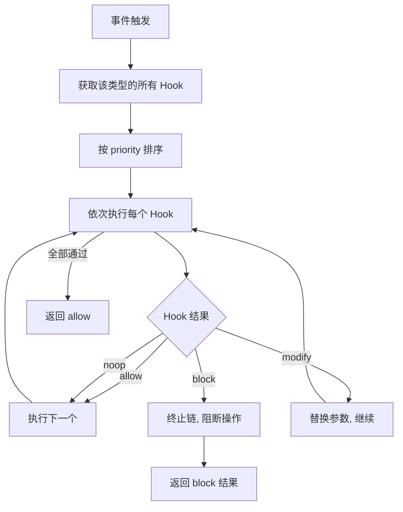

**Hook 注册示例**：

```typescript
// 注册一个 BeforeToolUse Hook，禁止删除操作
hookRegistry.register({
  id: 'block-rm-recursive',
  type: HookType.BeforeToolUse,
  priority: 10,
  enabled: true,
  handler: async (args: HookArgs): Promise<HookResult> => {
    const toolCall = args.toolCall as ToolCall;
    if (toolCall.name === 'run_command') {
      const cmd = toolCall.input.command as string;
      if (/rm\s+(-[a-zA-Z]*r[a-zA-Z]*f|-[a-zA-Z]*f[a-zA-Z]*r)/.test(cmd)) {
        return { action: 'block', reason: 'Recursive delete is not allowed' };
      }
    }
    return { action: 'allow' };
  }
});
```

---

#### 3.5.3 审批策略

**自动审批条件**（参考 Codex CLI 分级审批）：

| 工具 | 自动审批条件 | 风险等级 |
|------|------------|---------|
| `read_file` | 始终自动审批 | 低 |
| `list_dir` | 始终自动审批 | 低 |
| `grep_search` | 始终自动审批 | 低 |
| `write_file` | 新建文件自动审批；修改已有文件需用户审批 | 中 |
| `run_command` | 白名单命令（ls, cat, head, echo）自动审批 | 中 |
| `run_command` | 其他命令始终需用户审批 | 高 |
| 网络操作 | 始终需用户审批 | 高 |
| 包管理器 | install 操作需用户审批 | 中 |

**审批流程**：

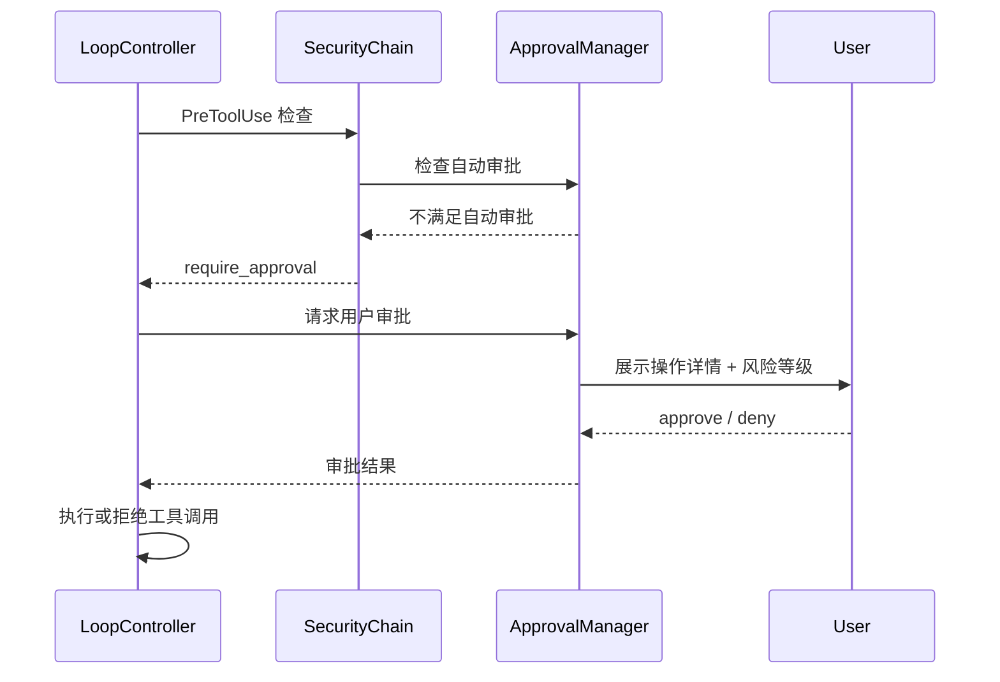

**升级机制**（参考 Codex CLI）：

1. 沙箱内执行 -> 失败
2. 自动请求用户审批（展示失败原因和需要放宽的权限）
3. 用户批准 -> 无沙箱重试一次
4. 无沙箱失败 -> 终止并报告用户

---

### 3.6 性能设计

#### 3.6.1 Prompt Cache 优化

**CACHE BOUNDARY 实现策略**：

| 策略 | 说明 | 预期效果 |
|------|------|---------|
| 稳定内容固定在前 | 角色定义、行为准则、工具列表位置固定 | 相邻请求缓存一致 |
| 工具列表字母序 | 工具按名字母序排列 | 避免工具增删导致整段缓存失效 |
| 动态内容分离 | 文件内容、对话历史放 boundary 下方 | 动态内容变化不影响上方缓存 |
| Section 版本号 | 每个 Section 有独立版本号 | 精确追踪缓存失效原因 |

**缓存命中率监控**：

```typescript
interface CacheMetrics {
  totalRequests: number;
  cacheHitRequests: number;
  cacheMissRequests: number;
  avgLatencyHit: number;   // ms
  avgLatencyMiss: number;  // ms
  avgTokensSaved: number;  // 缓存命中的 token 节省
}
```

目标指标：缓存命中率 > 65%，延迟降低 > 40%。

参考 OpenClaw 的 CACHE BOUNDARY 设计。

---

#### 3.6.2 工具并行执行

**依赖分析算法**：

```typescript
function analyzeDependencies(toolCalls: ToolCall[]): ToolCall[][] {
  // 构建 DAG：每个 ToolCall 为节点，dependsOn 为边
  const graph = new Map<string, Set<string>>();
  const inDegree = new Map<string, number>();

  // 初始化
  for (const tc of toolCalls) {
    graph.set(tc.id, new Set(tc.dependsOn));
    inDegree.set(tc.id, tc.dependsOn.length);
  }

  // 拓扑排序，每层为可并行执行的一组
  const layers: ToolCall[][] = [];
  const queue: string[] = toolCalls
    .filter(tc => tc.dependsOn.length === 0)
    .map(tc => tc.id);

  while (queue.length > 0) {
    const layer: ToolCall[] = [];
    const size = queue.length;
    for (let i = 0; i < size; i++) {
      const id = queue.shift()!;
      const tc = toolCalls.find(t => t.id === id)!;
      layer.push(tc);

      // 减少依赖该节点的节点的入度
      for (const [otherId, deps] of graph) {
        if (deps.has(id)) {
          deps.delete(id);
          inDegree.set(otherId, inDegree.get(otherId)! - 1);
          if (inDegree.get(otherId)! === 0) {
            queue.push(otherId);
          }
        }
      }
    }
    layers.push(layer);
  }

  return layers; // 每层内的工具可并行执行
}
```

**并行度控制**：

| 参数 | 默认值 | 说明 |
|------|--------|------|
| `maxConcurrentTools` | 5 | 最大并发工具数 |
| `maxConcurrentReads` | 10 | 最大并发读取数（纯读取可更高） |
| `maxConcurrentWrites` | 1 | 写入操作串行化（避免竞态） |
| `batchTimeout` | 30s | 批量执行超时 |

**结果聚合策略**：
- 按拓扑排序层顺序聚合结果
- 失败工具的结果在依赖链中传播
- 参考 Codex CLI 的异步 Future + Gemini CLI 的 wait_for_previous 控制

---

#### 3.6.3 上下文压缩

**按需触发条件**（详见 3.4.4）：

| 上下文使用率 | 触发动作 | 预估耗时 |
|------------|---------|---------|
| < 60% | 无操作 | 0ms |
| 60% - 70% | L1 可见性过滤 | < 1ms |
| 70% - 80% | L2 工具对摘要 | < 50ms |
| 80% - 90% | L3 LLM 全文压缩 | ~500-2000ms（一次 LLM 调用） |
| > 90% | 紧急压缩 | ~2000ms |

**压缩策略选择**：

```typescript
function selectCompactionStrategy(ratio: number): CompactionStrategy {
  if (ratio < 0.7) {
    return { type: 'visibility_filter', keepRecentTurns: 20, preserveTypes: [] };
  } else if (ratio < 0.85) {
    return { type: 'tool_pair_summary', keepRecentTurns: 10, preserveTypes: ['error'] };
  } else {
    return { type: 'llm_full', keepRecentTurns: 5, preserveTypes: ['user_message', 'error'] };
  }
}
```

**关键信息保留规则**：
- 用户消息：永不压缩（保留完整原文）
- 错误信息：保留最近 3 个错误的完整内容
- 工具结果：可压缩为摘要（`read_file -> 25 lines`, `run_command -> exit code + first 10 lines`）
- 任务目标：始终在 system prompt 中保留

参考 Goose 三层管理 + Gemini CLI LLM 摘要压缩。

### 3.7 成本设计

#### 3.7.1 模型分层调度

**路由决策树**：

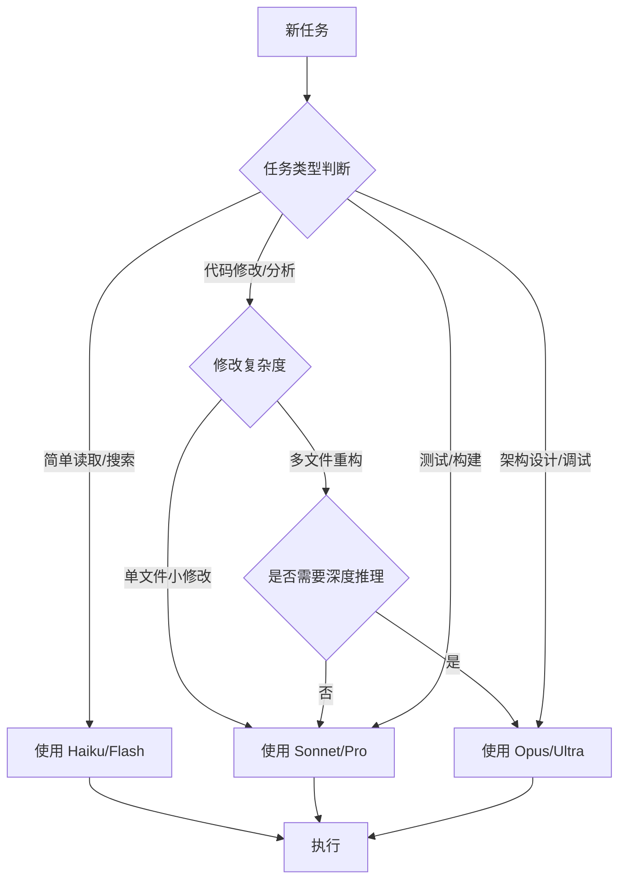

**模型粘性策略**：

| 策略 | 说明 | 效果 |
|------|------|------|
| 最小切换 | 同一任务中不主动切换模型 | 减少缓存失效 |
| 降级仅在错误时 | 仅在主模型 API 错误时降级 | 避免不必要降级 |
| 升级需要阈值 | 连续 3 轮工具调用失败才升级 | 避免过早升级 |
| 首次调用路由 | 根据任务初始评估选择模型 | 从一开始就选对模型 |

参考 Claude Code 的 Haiku -> Sonnet -> Opus 分层调度。

---

#### 3.7.2 成本追踪

**实时成本计算**：

```typescript
interface CostTracker {
  // 实时累计
  totalCost: number;
  inputTokens: number;
  outputTokens: number;
  cacheReadTokens: number;
  cacheWriteTokens: number;

  // 按模型拆分
  breakdown: {
    [model: string]: {
      calls: number;
      inputTokens: number;
      outputTokens: number;
      cost: number;
    };
  };

  // 按组件拆分
  componentBreakdown: {
    mainLoop: number;    // 主循环成本
    compaction: number;  // 上下文压缩成本
    loopDetection: number; // Loop 检测成本（LLM 辅助）
    subAgents: number;   // 子 Agent 成本
  };

  // 预算控制
  budgetLimit?: number;  // 预算上限（美元）
  alertThreshold: number; // 告警阈值（如 80%）
}
```

**预算上限控制**：

| 配置项 | 默认值 | 说明 |
|--------|--------|------|
| `costLimit` | 无限制 | 单次任务最大成本（美元） |
| `alertThreshold` | 0.8 | 触发告警的成本比例 |
| `softLimit` | costLimit * 0.9 | 达到后降级到便宜模型 |
| `hardLimit` | costLimit | 达到后强制终止 |

参考 SWE-Agent 的 cost_limit 配置 + 实时追踪。

### 3.8 稳定性设计

#### 3.8.1 分层恢复策略

| 层级 | 触发条件 | 恢复动作 | 最大重试 | 参考项目 |
|------|---------|---------|---------|---------|
| **HTTP 重试** | 429/500/503 错误 | 指数退避重试（1s, 2s, 4s, 8s） | 4 次 | OpenClaw |
| **模型回退** | 主模型不可用 | 切换到备选模型（Opus -> Sonnet -> Haiku） | 链式回退 | OpenClaw |
| **Planning-only 纠正** | LLM 只输出计划不调用工具 | 附加 "Now execute the plan" 指令 | 2 次 | OpenClaw |
| **Empty Response 纠正** | LLM 返回空内容 | 附加 "Please continue" 指令 | 2 次 | OpenClaw |
| **Loop 纠正** | Loop 检测触发 | 首次注入反馈，二次压缩，三次终止 | 2+1 | Gemini CLI |
| **Stuck 恢复** | Stuck 检测触发 | 根据 Stuck 类型执行对应恢复 | 各类型独立 | OpenHands |
| **上下文溢出** | Token 超限 | 触发三层压缩 | 压缩失败则终止 | Goose |

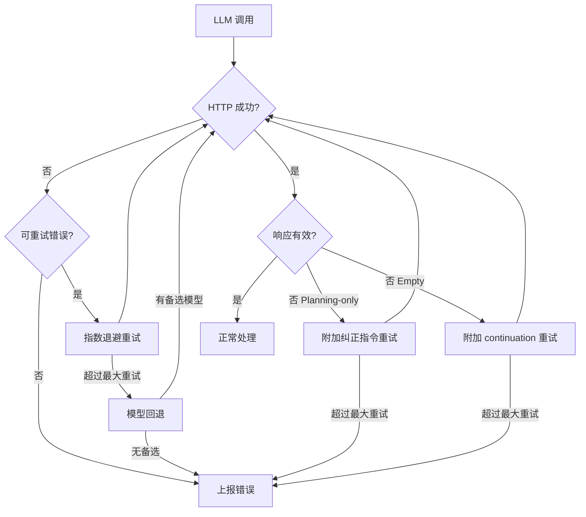

---

#### 3.8.2 兜底机制

**Autosubmission 触发条件**（参考 SWE-Agent）：

| 条件 | 动作 | 返回内容 |
|------|------|---------|
| maxTurns 耗尽 | 返回当前最佳结果 | 最近一次 LLM 回复文本 |
| 预算超限 | 返回当前最佳结果 | 已完成的修改摘要 |
| 超时 | 返回当前最佳结果 | 当前状态描述 |
| 不可恢复错误 | 返回错误详情 | 错误信息 + 已完成的修改 |

**RetryAgent 重试策略**（参考 SWE-Agent）：

```
RetryAgent.run():
  1. 硬重置环境（清空上下文、恢复 Git）
  2. 重新执行任务
  3. 最多重试 N 次（默认 3）
  4. 评审器对每次结果打分
  5. 选择得分最高的结果返回
```

**评审器打分机制**：

| 评分维度 | 权重 | 说明 |
|---------|------|------|
| 任务完成度 | 40% | 是否满足了原始任务目标 |
| 代码质量 | 30% | 修改是否干净、无副作用 |
| 测试通过率 | 20% | 相关测试是否通过 |
| 修改范围 | 10% | 是否最小化修改 |

---

## 四、实施步骤

### 4.1 第一阶段：核心框架（2 周）

**阶段目标**：搭建基础架构，实现 Prompt 组装和单次 LLM 调用。

| 编号 | 任务 | 描述 | 预估工时 |
|------|------|------|---------|
| 1.1 | 项目初始化 | 创建 TypeScript 项目，配置构建、lint、测试 | 4h |
| 1.2 | 核心对象定义 | 实现 PromptSection、Message、SystemPrompt、ToolCall、ToolResult 等对象 | 8h |
| 1.3 | PromptBuilder | 实现 IPromptBuilder 接口：Section 注册、排序、拼接 | 8h |
| 1.4 | CACHE BOUNDARY | 实现 ICacheOptimizer：分隔标记、工具列表排序 | 4h |
| 1.5 | ProviderTransformer | 实现 IProviderTransformer：OpenAI/Anthropic/Google 适配 | 8h |
| 1.6 | LLMRouter | 实现模型路由：多 Provider 注册、流式调用、重试 | 8h |
| 1.7 | 单次调用链路 | 实现从用户输入 -> Prompt -> LLM -> 输出的完整链路 | 8h |
| 1.8 | 单元测试 | 覆盖 PromptBuilder、ProviderTransformer | 8h |

**交付物**：
- 可运行的 CLI，支持单次对话
- 10 个 Prompt Section 模板
- 3 个 Provider 适配器

**验收标准**：
- 支持 OpenAI、Anthropic、Google 三种 API
- Prompt 组装正确应用 CACHE BOUNDARY
- 流式输出正常

---

### 4.2 第二阶段：工具系统（2 周）

**阶段目标**：实现工具注册、安全检查和执行。

| 编号 | 任务 | 描述 | 预估工时 |
|------|------|------|---------|
| 2.1 | ToolRegistry | 实现 IToolRegistry：内置工具注册、MCP 服务器接入 | 8h |
| 2.2 | 内置工具 | 实现 read_file、write_file、run_command、list_dir、grep 等基础工具 | 8h |
| 2.3 | ToolCall 状态机 | 实现 IToolCallStateMachine：状态流转验证、历史记录 | 4h |
| 2.4 | 安全检查器链 | 实现 ISecurityChain + 五层检查器 | 12h |
| 2.5 | Sandbox | 实现 ISandbox：Docker 容器沙箱 | 12h |
| 2.6 | ApprovalManager | 实现 IApprovalManager：自动审批、用户审批 | 4h |
| 2.7 | ToolExecutor | 实现 IToolExecutor：单工具执行 + 批量并行 | 8h |
| 2.8 | HookRegistry | 实现 IHookRegistry：Hook 注册、执行链 | 4h |
| 2.9 | 集成测试 | 工具执行全流程测试 + 安全规则测试 | 8h |

**交付物**：
- 5+ 内置工具
- 五层安全检查器链
- Docker 沙箱
- 审批系统

**验收标准**：
- 工具执行在沙箱内成功
- 危险命令被正确拦截
- 并行工具调用正常工作
- 用户审批流程正常

---

### 4.3 第三阶段：Agent-Loop（2 周）

**阶段目标**：实现完整的 Agent Loop 循环。

| 编号 | 任务 | 描述 | 预估工时 |
|------|------|------|---------|
| 3.1 | LoopController | 实现 IAgentLoopController：while-true 主循环 | 8h |
| 3.2 | Next Speaker 检查 | 实现 LLM 响应路由判断（工具/用户/Agent） | 4h |
| 3.3 | LoopDetector | 实现 ILoopDetector：三重检测算法 | 8h |
| 3.4 | StuckDetector | 实现 IStuckDetector：五种 Stuck 模式检测 | 8h |
| 3.5 | ContextManager | 实现 IContextManager：三层压缩策略 | 12h |
| 3.6 | CompletionChecker | 实现 ICompletionChecker：Promise 机制 + 退出条件 | 4h |
| 3.7 | 三层循环架构 | 整合 Runner/Agent/Attempt 三层 | 8h |
| 3.8 | ContextInjector | 实现 IContextInjector：Repo Map 智能上下文选择 | 8h |
| 3.9 | 集成测试 | Agent Loop 全链路测试 + Loop/Stuck 场景测试 | 8h |

**交付物**：
- 完整的 Agent Loop
- Loop/Stuck 检测
- 三层上下文压缩
- Promise 完成条件

**验收标准**：
- Agent 可自动迭代完成任务
- Loop 检测准确率 > 90%
- 上下文压缩正确触发
- 完成条件验证可靠

---

### 4.4 第四阶段：安全与稳定性（2 周）

**阶段目标**：完善安全体系，增强稳定性。

| 编号 | 任务 | 描述 | 预估工时 |
|------|------|------|---------|
| 4.1 | 安全规则完善 | 完善五层检查器的规则和模式匹配 | 8h |
| 4.2 | 对抗性检测 | 实现 AdversaryInspector 的完整检测规则 | 4h |
| 4.3 | Hook 扩展 | 实现 8 种标准 Hook + 自定义 Hook 示例 | 4h |
| 4.4 | 恢复策略 | 实现 Runner 层恢复：HTTP 重试 + 模型回退 | 8h |
| 4.5 | 自我纠正 | 实现 Agent 层自我纠正：Planning-only、Empty Response | 4h |
| 4.6 | 审计日志 | 实现完整的安全审计日志和调用链追踪 | 4h |
| 4.7 | 多 Agent 协同 | 实现子 Agent 创建、并行执行、结果汇总 | 12h |
| 4.8 | RetryAgent | 实现 RetryAgent 兜底机制 + 评审器打分 | 4h |
| 4.9 | 安全与稳定性测试 | 安全规则测试 + 恢复策略测试 | 8h |

**交付物**：
- 完整的安全防御体系
- 三层嵌套恢复机制
- 多 Agent 协同
- 审计日志系统

**验收标准**：
- 所有危险操作被正确拦截
- HTTP 错误可自动恢复
- Loop 可自我纠正
- 多 Agent 并行正常

---

### 4.5 第五阶段：性能优化与成本（1 周）

**阶段目标**：优化性能和成本。

| 编号 | 任务 | 描述 | 预估工时 |
|------|------|------|---------|
| 5.1 | 缓存监控 | 实现 CacheMetrics 收集和展示 | 4h |
| 5.2 | 工具并行优化 | 调优并行度参数，测试不同场景下的最优配置 | 4h |
| 5.3 | 模型分层调度 | 实现路由决策树 + 模型粘性策略 | 8h |
| 5.4 | 成本追踪 | 实现 CostTracker：实时计算 + 预算控制 | 4h |
| 5.5 | Prompt 版本管理 | 实现 Prompt 版本管理和变更日志 | 4h |
| 5.6 | 性能基准测试 | 建立性能基准，对比优化前后指标 | 4h |

**交付物**：
- 模型分层调度
- 实时成本追踪
- 缓存命中率监控
- Prompt 版本管理

**验收标准**：
- 缓存命中率 > 65%
- 工具调用延迟降低 > 30%
- 成本追踪准确
- 预算告警正常触发

---

### 4.6 第六阶段：测试与验证（1 周）

**阶段目标**：全面测试和验证系统。

| 编号 | 任务 | 描述 | 预估工时 |
|------|------|------|---------|
| 6.1 | 单元测试补充 | 覆盖率目标 > 80% | 8h |
| 6.2 | 集成测试补充 | 覆盖所有核心链路场景 | 8h |
| 6.3 | 端到端测试 | 使用真实编码任务验证完整流程 | 8h |
| 6.4 | 压力测试 | 高并发、大上下文、长时间运行测试 | 4h |
| 6.5 | 安全审计 | 安全规则渗透测试 | 4h |
| 6.6 | 文档完善 | API 文档、使用指南、架构文档 | 8h |

**交付物**：
- 完整的测试套件
- 测试报告
- 用户文档
- 架构文档

**验收标准**：
- 测试覆盖率 > 80%
- 端到端任务完成率 > 85%
- 无高危安全漏洞
- 文档完整

---

## 五、风险与应对

| 编号 | 风险 | 影响 | 概率 | 应对策略 |
|------|------|------|------|---------|
| R1 | LLM API 不稳定 | 高 | 中 | Runner 层重试 + 模型回退链（OpenClaw 模式） |
| R2 | Prompt Injection 攻击 | 高 | 低 | 五层安全检查 + AdversaryInspector（Goose 模式） |
| R3 | 上下文窗口不足导致信息丢失 | 中 | 高 | 三层压缩 + 关键信息保留（Goose + Gemini CLI 模式） |
| R4 | Agent Loop 无限循环 | 中 | 中 | 三重 Loop 检测 + 五种 Stuck 模式 + maxTurns 限制 |
| R5 | 工具执行副作用不可控 | 高 | 低 | 沙箱隔离 + 审批机制 + 审计日志（Codex CLI 模式） |
| R6 | 成本超出预期 | 中 | 中 | 成本追踪 + 预算控制 + 模型分层调度（Claude Code 模式） |
| R7 | 多 Provider 适配维护成本高 | 中 | 高 | 抽象 Provider 接口 + 自动化测试覆盖 |
| R8 | 开源模型不支持 Function Calling | 中 | 高 | XML/文本回退机制（Cline + SWE-Agent 模式） |

---

## 六、参考文档

所有设计决策均基于对以下调研文档的分析：

| 文档 | 路径 |
|------|------|
| Aider Agent Loop 分析 | `docs/aider.md` |
| Claude Code Agent Loop 分析 | `docs/claude-code.md` |
| Cline Agent Loop 分析 | `docs/cline.md` |
| Codex CLI Agent Loop 分析 | `docs/codex-cli.md` |
| Gemini CLI Agent Loop 分析 | `docs/gemini-cli.md` |
| Goose Agent Loop 分析 | `docs/goose.md` |
| Open Interpreter Agent Loop 分析 | `docs/open-interpreter.md` |
| OpenClaw Agent Loop 分析 | `docs/openclaw.md` |
| OpenCode Agent Loop 分析 | `docs/opencode.md` |
| OpenHands Agent Loop 分析 | `docs/openhands.md` |
| SWE-Agent Agent Loop 分析 | `docs/swe-agent.md` |
| Prompt 方案横向对比 | `docs/comparison-prompt-analysis.md` |
| 工具调用方案横向对比 | `docs/comparison-tool-analysis.md` |
| Agent-Loop 链路横向对比 | `docs/comparison-loop-analysis.md` |
| 最终整合总览 | `docs/comparison-final-summary.md` |

---

> **本文档基于对 11 个主流编码 Agent 项目的深度源码分析生成，所有设计决策均有实际项目实现作为参考依据。总预估工时：约 200 小时（10 周）。**
