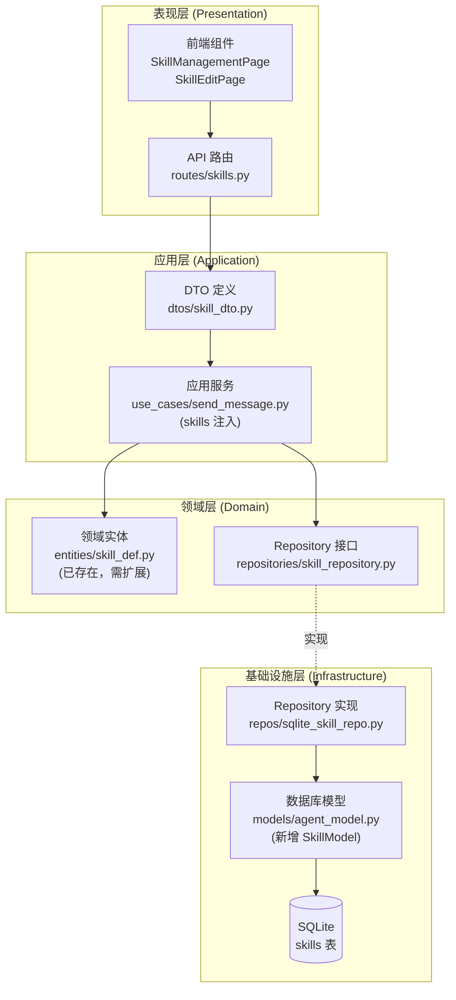
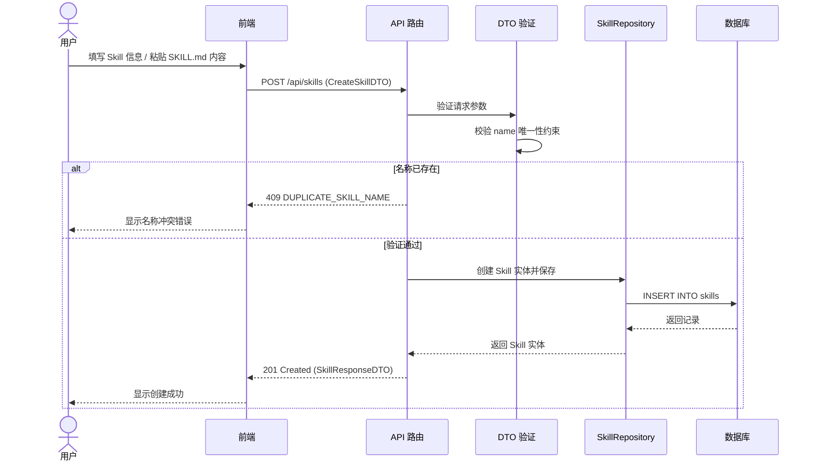
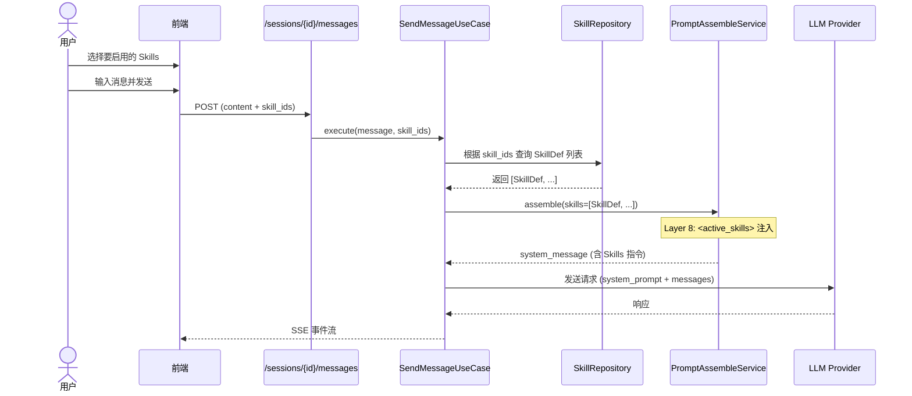
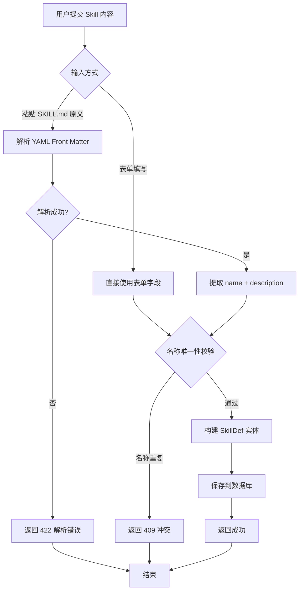

# Skills 模块技术方案

## 1. 范围

本模块负责 **Skills（技能）的上传、维护和对话注入**，聚焦于以下领域：

- Skills CRUD 管理（创建、查看、编辑、删除）
- Skills 内容解析与验证（SKILL.md 格式）
- Skills 列表展示与详情查看
- 对话时 Skills 选择与 Prompt 注入

**不包含**：
- Skill 执行引擎（即 LLM 调用 Skill 后的实际步骤编排执行）
- SkillToolAdapter 的工具注册与绑定（后续迭代）
- Skill 版本管理和发布机制
- Skill 市场/商店

**与现有系统的关系**：
- 本模块提供 `SkillDef` 实例列表，注入到 `PromptAssembleService.assemble(skills=...)` 的 Layer 8
- 注入逻辑已在 `send_message.py:401` 处预留（当前 `skills=[]`）

---

## 2. 概要设计

### 2.1 主流程

#### 2.1.1 模块架构图



#### 2.1.2 Skills 上传主流程



#### 2.1.3 对话时 Skills 选择与注入流程



#### 2.1.4 Skill 内容解析流程



### 2.2 模块说明

#### 2.2.1 Skill 管理模块

**职责**：提供 Skills 的 CRUD 管理能力

**功能**：
- 创建 Skill（表单填写 / SKILL.md 内容粘贴）
- 查看 Skill 列表（分页、按分类筛选）
- 查看 Skill 详情
- 编辑 Skill 内容
- 删除 Skill
- 切换 Skill 启用/禁用状态

**涉及文件**：
- 后端：`backend/src/domain/entities/skill_def.py`（扩展）
- 后端：`backend/src/domain/repositories/skill_repository.py`（新建）
- 后端：`backend/src/application/dtos/skill_dto.py`（新建）
- 后端：`backend/src/infrastructure/database/models/agent_model.py`（新增 SkillModel）
- 后端：`backend/src/infrastructure/repositories/sqlite_skill_repo.py`（新建）
- 后端：`backend/src/presentation/routes/skills.py`（新建）
- 前端：`frontend/src/domain/entities/skill.ts`（新建）
- 前端：`frontend/src/infrastructure/api/skillApi.ts`（新建）
- 前端：`frontend/src/application/services/useSkillManagement.ts`（新建）
- 前端：`frontend/src/presentation/pages/SkillManagementPage.tsx`（新建）
- 前端：`frontend/src/presentation/pages/SkillEditPage.tsx`（新建）

#### 2.2.2 对话 Skill 选择模块

**职责**：在对话时允许用户选择要激活的 Skills，并注入到 Prompt

**功能**：
- 对话界面展示可用 Skills 列表（仅启用状态的）
- 用户选择/取消选择 Skills
- 发送消息时携带选中的 skill_ids
- SendMessageUseCase 中根据 skill_ids 查询并注入到 Prompt Layer 8

**涉及文件**：
- 后端：`backend/src/application/use_cases/send_message.py`（修改，填充 skills 参数）
- 后端：`backend/src/presentation/routes/sessions.py`（修改 SendMessageRequest 增加 skill_ids）
- 前端：`frontend/src/domain/entities/session.ts`（修改 SendMessageRequest）
- 前端：`frontend/src/presentation/components/chat/SkillSelector.tsx`（新建）
- 前端：`frontend/src/presentation/components/chat/MessageInput.tsx`（修改，集成选择器）

---

## 3. 详细设计

### 3.1 接口设计

#### 3.1.1 API 端点

| 方法 | 路径 | 说明 | 请求体 | 响应体 | 状态码 |
|------|------|------|--------|--------|--------|
| POST | /api/skills | 创建 Skill | CreateSkillDTO | SkillResponseDTO | 201/409/422 |
| GET | /api/skills | Skill 列表 | - (query: page, page_size, category, enabled) | SkillListResponseDTO | 200 |
| GET | /api/skills/{id} | Skill 详情 | - | SkillResponseDTO | 200/404 |
| PUT | /api/skills/{id} | 更新 Skill | UpdateSkillDTO | SkillResponseDTO | 200/404/409 |
| DELETE | /api/skills/{id} | 删除 Skill | - | - | 204/404 |
| PATCH | /api/skills/{id}/toggle | 切换启用状态 | - | SkillResponseDTO | 200/404 |
| GET | /api/skills/enabled | 获取所有启用的 Skills（对话选择用） | - | SkillListResponseDTO | 200 |

**对话消息接口修改**：

| 方法 | 路径 | 说明 | 修改点 |
|------|------|------|--------|
| POST | /api/agents/{agent_id}/sessions/{session_id}/messages | 发送消息 | 请求体增加 `skill_ids: list[str]` 可选字段 |

#### 3.1.2 DTO 定义

```python
# backend/src/application/dtos/skill_dto.py

from typing import Optional
from pydantic import BaseModel, Field


class SkillStepDTO(BaseModel):
    """Skill 步骤 DTO"""
    name: str = Field(..., min_length=1, max_length=100)
    description: str = Field(..., min_length=1, max_length=500)
    tool_name: Optional[str] = Field(default=None, max_length=100)


class CreateSkillDTO(BaseModel):
    """创建 Skill 请求 DTO"""
    name: str = Field(
        ...,
        min_length=1,
        max_length=100,
        description="Skill 名称（唯一标识）",
    )
    description: str = Field(
        ...,
        min_length=1,
        max_length=1000,
        description="Skill 功能描述",
    )
    content: str = Field(
        default="",
        max_length=50000,
        description="Skill 完整内容（Markdown 格式）",
    )
    trigger_keywords: list[str] = Field(
        default_factory=list,
        description="触发关键词列表",
    )
    steps: list[SkillStepDTO] = Field(
        default_factory=list,
        description="执行步骤定义",
    )
    category: str = Field(
        default="general",
        max_length=50,
        description="Skill 分类",
    )


class UpdateSkillDTO(BaseModel):
    """更新 Skill 请求 DTO（PATCH 语义）"""
    name: Optional[str] = Field(default=None, min_length=1, max_length=100)
    description: Optional[str] = Field(default=None, min_length=1, max_length=1000)
    content: Optional[str] = Field(default=None, max_length=50000)
    trigger_keywords: Optional[list[str]] = None
    steps: Optional[list[SkillStepDTO]] = None
    category: Optional[str] = Field(default=None, max_length=50)


class SkillResponseDTO(BaseModel):
    """Skill 响应 DTO"""
    id: str
    name: str
    description: str
    content: str
    trigger_keywords: list[str]
    steps: list[SkillStepDTO]
    category: str
    enabled: bool
    created_at: str
    updated_at: Optional[str] = None


class SkillListResponseDTO(BaseModel):
    """Skill 列表响应 DTO"""
    data: list[SkillResponseDTO]
    total: int
```

### 3.2 数据库设计

#### 3.2.1 表结构

```sql
CREATE TABLE skills (
    -- 主键
    id VARCHAR(36) PRIMARY KEY,
    
    -- 基本信息
    name VARCHAR(100) NOT NULL UNIQUE,
    description TEXT NOT NULL DEFAULT '',
    
    -- 内容
    content TEXT NOT NULL DEFAULT '',
    
    -- 结构化数据（JSON）
    trigger_keywords TEXT NOT NULL DEFAULT '[]',
    steps TEXT NOT NULL DEFAULT '[]',
    
    -- 分类与状态
    category VARCHAR(50) NOT NULL DEFAULT 'general',
    enabled INTEGER NOT NULL DEFAULT 1,
    
    -- 时间戳
    created_at DATETIME NOT NULL DEFAULT (datetime('now')),
    updated_at DATETIME
);
```

#### 3.2.2 字段说明

| 字段 | 类型 | 默认值 | 说明 |
|------|------|--------|------|
| `id` | VARCHAR(36) | UUID | 主键 |
| `name` | VARCHAR(100) | - | Skill 名称，唯一 |
| `description` | TEXT | '' | Skill 功能描述 |
| `content` | TEXT | '' | Skill 完整 Markdown 内容 |
| `trigger_keywords` | TEXT (JSON) | '[]' | 触发关键词 JSON 数组 |
| `steps` | TEXT (JSON) | '[]' | 执行步骤 JSON 数组 |
| `category` | VARCHAR(50) | 'general' | 分类标签 |
| `enabled` | INTEGER | 1 | 是否启用（0/1） |
| `created_at` | DATETIME | now() | 创建时间 |
| `updated_at` | DATETIME | NULL | 更新时间 |

#### 3.2.3 索引设计

```sql
-- 唯一索引（建表时 UNIQUE 自动创建）
-- CREATE UNIQUE INDEX idx_skills_name ON skills(name);

-- 查询索引
CREATE INDEX idx_skills_category ON skills(category);
CREATE INDEX idx_skills_enabled ON skills(enabled);
CREATE INDEX idx_skills_created_at ON skills(created_at DESC);
```

#### 3.2.4 SQLAlchemy 模型

```python
# 在 backend/src/infrastructure/database/models/agent_model.py 中新增

class SkillModel(Base):
    """Skill 数据库模型"""

    __tablename__ = "skills"

    id = Column(String(36), primary_key=True)
    name = Column(String(100), nullable=False, unique=True, index=True)
    description = Column(Text, nullable=False, default="")
    content = Column(Text, nullable=False, default="")
    trigger_keywords = Column(Text, nullable=False, default="[]")  # JSON
    steps = Column(Text, nullable=False, default="[]")  # JSON
    category = Column(String(50), nullable=False, default="general")
    enabled = Column(Integer, nullable=False, default=1)
    created_at = Column(DateTime, nullable=False, default=datetime.utcnow)
    updated_at = Column(DateTime, nullable=True)

    def __repr__(self) -> str:
        return f"<SkillModel(id={self.id}, name={self.name}, enabled={self.enabled})>"
```

#### 3.2.5 领域实体扩展

现有 `SkillDef` 实体需扩展以支持持久化：

```python
# backend/src/domain/entities/skill_def.py（扩展）

@dataclass
class SkillDef:
    """技能定义领域实体"""

    name: str
    description: str
    steps: list[SkillStep] = field(default_factory=list)
    trigger_keywords: list[str] = field(default_factory=list)
    category: str = "general"
    
    # === 新增字段（持久化支持） ===
    id: str = ""
    """主键 ID"""
    
    content: str = ""
    """Skill 完整 Markdown 内容（原始内容存储）"""
    
    enabled: bool = True
    """是否启用"""
    
    created_at: datetime = field(default_factory=datetime.now)
    updated_at: Optional[datetime] = None

    def to_prompt_section(self) -> str:
        """生成为 Prompt 中的技能描述段落
        
        如果有 content（完整 SKILL.md 内容），优先使用 content；
        否则使用结构化的 steps 生成摘要。
        """
        # 如果有完整内容，直接使用
        if self.content:
            return self.content
        
        # 否则根据结构化数据生成
        parts = [self.description]

        if self.trigger_keywords:
            parts.append(f"\n**Triggers:** {', '.join(self.trigger_keywords)}")

        if self.steps:
            parts.append("\n**Steps:**")
            for i, step in enumerate(self.steps, 1):
                tool_info = f" (using `{step.tool_name}`)" if step.tool_name else ""
                parts.append(f"{i}. **{step.name}**{tool_info}: {step.description}")

        return "\n".join(parts)
    
    def toggle_enabled(self) -> None:
        """切换启用状态"""
        self.enabled = not self.enabled
        self.updated_at = datetime.now()
```

#### 3.2.6 Repository 接口

```python
# backend/src/domain/repositories/skill_repository.py

from abc import ABC, abstractmethod
from typing import Optional
from src.domain.entities.skill_def import SkillDef


class ISkillRepository(ABC):
    """Skill 仓储接口"""

    @abstractmethod
    async def add(self, skill: SkillDef) -> SkillDef:
        """新增 Skill"""
        pass

    @abstractmethod
    async def get_by_id(self, skill_id: str) -> Optional[SkillDef]:
        """根据 ID 获取 Skill"""
        pass

    @abstractmethod
    async def get_by_name(self, name: str) -> Optional[SkillDef]:
        """根据名称获取 Skill（唯一性校验）"""
        pass

    @abstractmethod
    async def list_all(
        self,
        limit: int = 100,
        offset: int = 0,
        category: Optional[str] = None,
        enabled: Optional[bool] = None,
    ) -> tuple[list[SkillDef], int]:
        """获取 Skill 列表（分页 + 筛选），返回 (列表, 总数)"""
        pass

    @abstractmethod
    async def get_enabled(self) -> list[SkillDef]:
        """获取所有启用的 Skills（对话注入用）"""
        pass

    @abstractmethod
    async def get_by_ids(self, skill_ids: list[str]) -> list[SkillDef]:
        """根据 ID 列表批量获取 Skills（对话注入用）"""
        pass

    @abstractmethod
    async def update(self, skill: SkillDef) -> SkillDef:
        """更新 Skill"""
        pass

    @abstractmethod
    async def remove(self, skill_id: str) -> bool:
        """删除 Skill"""
        pass
```

### 3.3 前端设计

#### 3.3.1 页面结构

**SkillManagementPage**（`/skills`）
- 顶部标题 + 创建按钮
- 分类筛选 Tab（全部 / general / development / ...）
- Skill 卡片网格列表
  - 卡片内容：名称、描述、分类标签、触发关键词、启用开关
  - 操作按钮：编辑、删除

**SkillEditPage**（`/skills/new`、`/skills/:id/edit`）
- 基本信息表单（名称、描述、分类）
- 触发关键词输入（Tag 输入组件）
- 步骤编辑器（可增删步骤，每步包含名称、描述、可选工具名）
- Skill 内容编辑器（Markdown 文本域，支持粘贴 SKILL.md 内容）
- 保存/取消按钮

**对话页面 Skills 选择器**（集成到 `AgentSessionPage`）
- 在消息输入框上方或侧边，展示可用 Skills 列表
- 支持勾选/取消 Skills
- 显示已选中 Skills 的 badge

#### 3.3.2 组件清单

| 组件 | 职责 |
|------|------|
| `SkillManagementPage` | Skills 管理列表页 |
| `SkillEditPage` | Skill 创建/编辑页 |
| `SkillCard` | 单个 Skill 卡片展示 |
| `SkillStepEditor` | 步骤列表编辑器 |
| `SkillSelector` | 对话中的 Skill 选择组件 |
| `DeleteSkillDialog` | 删除确认弹窗 |

#### 3.3.3 前端实体类型

```typescript
// frontend/src/domain/entities/skill.ts

export interface Skill {
  id: string;
  name: string;
  description: string;
  content: string;
  trigger_keywords: string[];
  steps: SkillStep[];
  category: string;
  enabled: boolean;
  created_at: string;
  updated_at: string | null;
}

export interface SkillStep {
  name: string;
  description: string;
  tool_name: string | null;
}

export interface CreateSkillRequest {
  name: string;
  description: string;
  content?: string;
  trigger_keywords?: string[];
  steps?: SkillStep[];
  category?: string;
}

export interface UpdateSkillRequest {
  name?: string;
  description?: string;
  content?: string;
  trigger_keywords?: string[];
  steps?: SkillStep[];
  category?: string;
}

export interface SkillListResponse {
  data: Skill[];
  total: number;
}

/** Skill 分类常量 */
export const SKILL_CATEGORIES: Record<string, string> = {
  general: '通用',
  development: '开发',
  analysis: '分析',
  writing: '写作',
  design: '设计',
};
```

#### 3.3.4 API 客户端

```typescript
// frontend/src/infrastructure/api/skillApi.ts

import { apiClient } from './client';
import type {
  Skill,
  SkillListResponse,
  CreateSkillRequest,
  UpdateSkillRequest,
} from '../../domain/entities/skill';

export const skillApi = {
  /** 获取 Skill 列表 */
  list: async (params?: {
    page?: number;
    pageSize?: number;
    category?: string;
    enabled?: boolean;
  }): Promise<SkillListResponse> => {
    const response = await apiClient.get('/skills', {
      params: {
        page: params?.page ?? 1,
        page_size: params?.pageSize ?? 20,
        category: params?.category,
        enabled: params?.enabled,
      },
    });
    return response.data;
  },

  /** 获取 Skill 详情 */
  get: async (id: string): Promise<Skill> => {
    const response = await apiClient.get(`/skills/${id}`);
    return response.data;
  },

  /** 创建 Skill */
  create: async (data: CreateSkillRequest): Promise<Skill> => {
    const response = await apiClient.post('/skills', data);
    return response.data;
  },

  /** 更新 Skill */
  update: async (id: string, data: UpdateSkillRequest): Promise<Skill> => {
    const response = await apiClient.put(`/skills/${id}`, data);
    return response.data;
  },

  /** 删除 Skill */
  delete: async (id: string): Promise<void> => {
    await apiClient.delete(`/skills/${id}`);
  },

  /** 切换启用状态 */
  toggle: async (id: string): Promise<Skill> => {
    const response = await apiClient.patch(`/skills/${id}/toggle`);
    return response.data;
  },

  /** 获取所有启用的 Skills（对话选择用） */
  listEnabled: async (): Promise<SkillListResponse> => {
    const response = await apiClient.get('/skills/enabled');
    return response.data;
  },
};
```

#### 3.3.5 对话消息接口修改

```typescript
// frontend/src/domain/entities/session.ts（修改 SendMessageRequest）

export interface SendMessageRequest {
  content: string;
  model?: string;
  max_turns?: number;
  workspace?: string;
  skill_ids?: string[];  // 新增：选中的 Skill ID 列表
}
```

### 3.4 错误处理

| 场景 | HTTP 状态码 | 错误码 | 说明 |
|------|-------------|--------|------|
| 名称重复 | 409 | DUPLICATE_SKILL_NAME | 创建或更新时名称已存在 |
| Skill 不存在 | 404 | SKILL_NOT_FOUND | 操作的 Skill 不存在 |
| 参数错误 | 422 | VALIDATION_ERROR | 请求参数验证失败 |
| 内容解析失败 | 422 | SKILL_PARSE_ERROR | SKILL.md 格式解析失败 |

---

## 4. 对话注入实现方案

### 4.1 后端修改点

#### 4.1.1 SendMessageRequest 扩展

```python
# backend/src/application/dtos/session_dto.py（修改）

class SendMessageRequestDTO(BaseModel):
    content: str = Field(..., min_length=1, max_length=10000)
    model: Optional[str] = None
    max_turns: Optional[int] = Field(default=None, ge=1, le=200)
    workspace: Optional[str] = None
    skill_ids: list[str] = Field(default_factory=list, description="选中的 Skill ID 列表")
```

#### 4.1.2 SendMessageUseCase 修改

```python
# backend/src/application/use_cases/send_message.py（修改 _run_agent_loop）

# 原来的:
# skills=[],  # Skills 模块待实现

# 改为:
skill_defs = []
if skill_ids:
    skill_defs = await self.skill_repo.get_by_ids(skill_ids)

assembly_result = assemble_service.assemble(
    template=template,
    tools=tool_defs,
    skills=skill_defs,  # 注入选中的 Skills
    workspace=workspace,
    environment={...},
    memory_enabled=bool(template.memory_md),
)
```

### 4.2 前端交互设计

#### 4.2.1 SkillSelector 组件

位于消息输入框上方，显示方式：
- 默认折叠，显示 "Skills (N)" 按钮
- 点击展开，显示所有启用的 Skills 列表
- 每个 Skill 可勾选/取消
- 选中的 Skills 以 badge 形式显示在输入框上方

```
┌─────────────────────────────────────────────────────────────┐
│ [Skills ▾]  已选: [code_review ×] [debug_assistant ×]      │
├─────────────────────────────────────────────────────────────┤
│ ┌──────────────────────────────────────────────────────┐   │
│ │ ☑ code_review    - 系统化代码审查                    │   │
│ │ ☑ debug_assistant - 交互式调试辅助                   │   │
│ │ ☐ ddd_designer   - DDD 模块技术方案设计             │   │
│ └──────────────────────────────────────────────────────┘   │
├─────────────────────────────────────────────────────────────┤
│ [输入消息...]                                    [发送]     │
└─────────────────────────────────────────────────────────────┘
```

---

## 5. 路由注册

```python
# backend/src/presentation/app.py（新增）
from src.presentation.routes.skills import router as skills_router

app.include_router(skills_router)
```

```typescript
// frontend/src/presentation/App.tsx（新增路由）
import { SkillManagementPage } from './pages/SkillManagementPage';
import { SkillEditPage } from './pages/SkillEditPage';

<Route path="/skills" element={<SkillManagementPage />} />
<Route path="/skills/new" element={<SkillEditPage />} />
<Route path="/skills/:id/edit" element={<SkillEditPage />} />
```

---

## 6. 测试计划

### 6.1 功能测试

#### 测试场景 1: 创建 Skill - 正常流程
- **前置条件**: 数据库为空
- **测试步骤**:
  1. POST /api/skills，携带合法的 CreateSkillDTO
  2. 验证响应码 201
  3. GET /api/skills/{id} 验证数据持久化
- **预期结果**: Skill 创建成功并可查询
- **验收标准**: 响应包含完整字段，enabled 默认为 true

#### 测试场景 2: 创建 Skill - 名称重复
- **前置条件**: 已存在名为 "code_review" 的 Skill
- **测试步骤**:
  1. POST /api/skills，name="code_review"
- **预期结果**: 返回 409，错误码 DUPLICATE_SKILL_NAME
- **验收标准**: 不创建重复记录

#### 测试场景 3: 对话注入 Skills
- **前置条件**: 存在启用状态的 Skill
- **测试步骤**:
  1. POST /api/agents/{id}/sessions/{sid}/messages，携带 skill_ids
  2. 验证 system_prompt 中包含 `<active_skills>` 标签
- **预期结果**: LLM 收到的 system_prompt 包含选中的 Skills 内容
- **验收标准**: Layer 8 正确注入

#### 测试场景 4: 切换启用状态
- **前置条件**: 已存在启用状态的 Skill
- **测试步骤**:
  1. PATCH /api/skills/{id}/toggle
  2. GET /api/skills/enabled 验证不在列表中
- **预期结果**: enabled 变为 false，不再出现在启用列表中
- **验收标准**: 状态正确切换

### 6.2 单元测试

```python
# backend/tests/unit/domain/test_skill_def.py

def test_skill_def_to_prompt_section_with_content():
    """有 content 时优先使用 content"""
    skill = SkillDef(
        name="test",
        description="Test skill",
        content="# Custom Content\nDetailed instructions...",
    )
    assert skill.to_prompt_section() == "# Custom Content\nDetailed instructions..."


def test_skill_def_to_prompt_section_structured():
    """无 content 时使用结构化数据生成"""
    skill = SkillDef(
        name="test",
        description="Test skill",
        trigger_keywords=["test", "check"],
        steps=[
            SkillStep(name="analyze", description="Analyze code", tool_name="read_file"),
            SkillStep(name="report", description="Report issues"),
        ],
    )
    result = skill.to_prompt_section()
    assert "**Triggers:** test, check" in result
    assert "1. **analyze** (using `read_file`): Analyze code" in result
    assert "2. **report**: Report issues" in result


def test_skill_def_toggle_enabled():
    """切换启用状态"""
    skill = SkillDef(name="test", description="desc", enabled=True)
    skill.toggle_enabled()
    assert skill.enabled is False
    assert skill.updated_at is not None
```

### 6.3 回归测试

#### 受影响的现有功能
- [ ] Prompt 组装：确认 skills=[] 时行为不变
- [ ] 发送消息 API：确认不传 skill_ids 时向后兼容
- [ ] 数据库初始化：确认 init_db() 能正确创建 skills 表

#### 自动化验证
```bash
uv run pytest tests/ -k "skill"
uv run pytest tests/unit/domain/test_prompt_assemble_service.py
```

---

## 7. 验收标准

- [ ] Skills CRUD API 全部端点可用
- [ ] 前端管理界面支持 Skill 的创建、编辑、删除、启用/禁用
- [ ] 对话界面可选择 Skills，发送消息时正确注入到 Prompt Layer 8
- [ ] 不传 skill_ids 时系统行为与当前一致（向后兼容）
- [ ] 所有单元测试通过
- [ ] 所有功能测试通过
- [ ] 测试覆盖率 >= 80%
