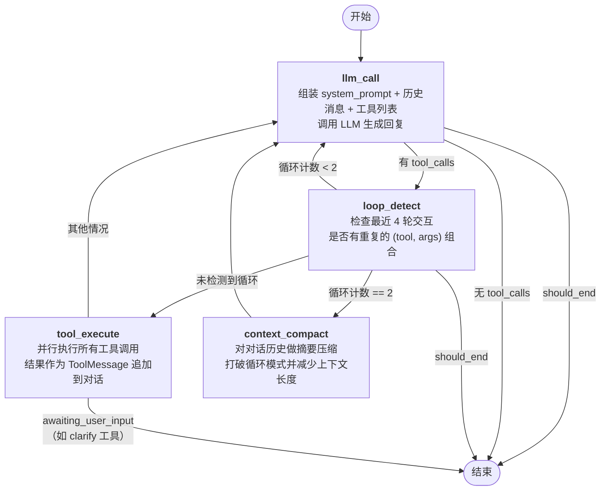

# Agent Loop 工作流



## 节点说明

### llm_call（入口节点）
组装 system_prompt + 历史消息 + 可用工具列表，调用 LLM 生成回复。LLM 的回复可能是纯文本（最终答案）或 tool_calls（请求执行工具）。

### loop_detect
检测最近 4 轮交互中是否出现重复的 `(tool, args)` 组合，防止 LLM 陷入无限工具调用循环。
- 未检测到循环 → 放行到 `tool_execute` 执行工具
- 首次循环 (count=1) → 回到 `llm_call`，注入反循环提示
- 再次循环 (count=2) → 进入 `context_compact` 压缩上下文
- 达到 `should_end` → 强制终止

### tool_execute
并行执行 LLM 请求的所有工具调用，将执行结果作为 ToolMessage 追加到对话历史。如果工具标记了 `awaiting_user_input`（如 clarify），则暂停等待用户回复。

### context_compact
当循环检测达到阈值时触发，对对话历史做摘要压缩，减少上下文长度并打破循环模式。压缩后回到 `llm_call` 继续执行。

## 主循环（Happy Path）

```
开始 → llm_call → loop_detect → tool_execute → llm_call → ... 循环直到最终答案 → 结束
```

## 退出条件

| 条件 | 触发节点 |
|------|---------|
| LLM 返回纯文本（无 tool_calls） | `llm_call` |
| `should_end` 标记（达到最大轮数或显式停止） | `llm_call`、`loop_detect` |
| 工具请求用户输入（如 clarify） | `tool_execute` |
