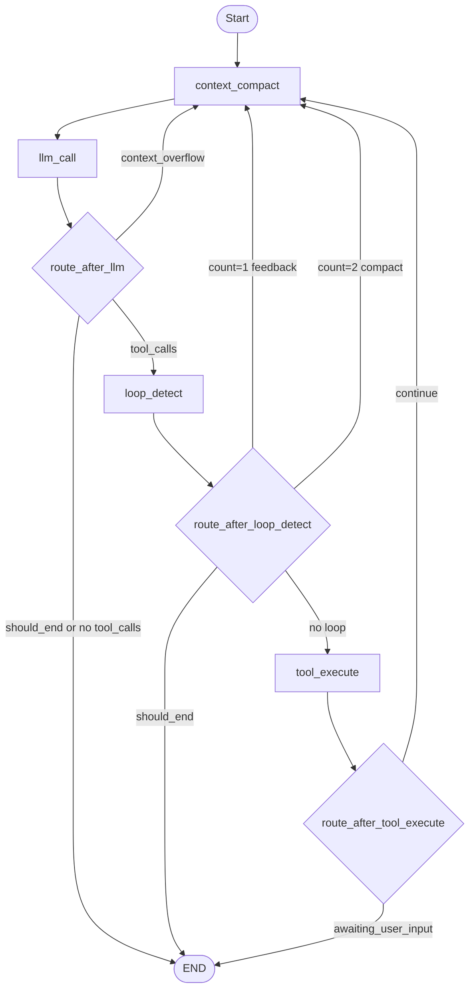

# Agent Loop 上下文管理设计

本文档按当前代码实现设计上下文管理改造，不以旧设计稿为准。

## 1. 当前代码现状

当前 Agent Loop 由 LangGraph 组装，入口在 `AgentWorkflowBuilder.build()`：

- 节点：`llm_call` / `tool_execute` / `loop_detect` / `context_compact`
- 当前入口：`llm_call`
- 当前主路径：`llm_call -> loop_detect -> tool_execute -> llm_call`
- 当前压缩触发：只有 `loop_detection_count == 2` 时路由到 `context_compact`
- 当前 `context_compact_node`：支持 `trim` 和 `summarize`，按消息条数保留最近 10 条，不按 token 水位判断
- 当前初始历史加载：`AgentLoopRunner` 中 `PromptContextInterface.build_messages(..., max_tokens=8000)` 硬编码预算
- 当前 token 工具：`domain.services.token_utils.count_tokens()` 是粗略估算，但不是用户要求的增量 `char/4 + usage baseline`
- 当前 LLM usage：`LLMUsageCallbackHandler` 能累计 usage，但没有把每次调用的 `prompt_tokens` 写回 `AgentState`
- 当前超上下文异常：`llm_call_node` 只显式处理超时，provider 的 context window exceeded 会被 `BaseNode` 作为普通错误终止

结论：现有代码已经有压缩节点和事件类型，但还没有“每轮 ReAct 前置上下文守门”和“多层 token 水位压缩”。

## 2. 目标流程

上下文管理节点成为每轮 LLM 调用前的必经节点。



路由调整：

- `workflow.set_entry_point("context_compact")`
- `tool_execute` 完成后路由到 `context_compact`，再进入 `llm_call`
- `loop_detect` 的反馈重试也先回 `context_compact`
- `route_after_llm` 优先识别 `emergency_compact_requested=True`，路由到 `context_compact`
- `context_compact -> llm_call` 保持固定边

## 3. AgentState 增量字段

建议在 `AgentState` 增加以下字段：

```python
# === 上下文管理 ===
max_context_tokens: int
context_token_estimate: int
context_token_baseline: Optional[int]
context_token_baseline_message_count: int
context_compaction_attempts: int
emergency_compact_requested: bool
last_context_strategy: Optional[str]
```

字段语义：

- `max_context_tokens`：当前模型上下文窗口。由模型名解析，可被配置覆盖。
- `context_token_estimate`：当前 messages 的 token 估算。
- `context_token_baseline`：最近一次成功 LLM 调用返回的 `prompt_tokens`。
- `context_token_baseline_message_count`：baseline 对应的消息数量，用于后续增量估算。
- `context_compaction_attempts`：连续紧急压缩次数。第一次超限后允许紧急压缩，第二次仍超限则失败。
- `emergency_compact_requested`：LLM 调用发生上下文超限后置为 `True`。
- `last_context_strategy`：最近一次实际执行的压缩策略，用于观测和调试。

初始值在 `AgentLoopRunner._build_initial_state()` 中填充。

## 4. 模型上下文窗口

新增 `ModelContextRegistry` 或等价纯函数，避免在节点里写散落判断。

默认窗口按系统策略配置：

| 模型名匹配 | max_context_tokens |
| --- | ---: |
| `gemini-3-pro` | 2,000,000 |
| `gpt-5.5`, `gpt-5.4` | 1,000,000 |
| `claude-opus-4.7`, `claude-opus-4.6` | 1,000,000 |
| `qwen3` | 1,000,000 |
| `deepseek-v4` | 1,000,000 |
| 未匹配 | 128,000 |

这些是项目策略默认值，不作为供应商规格真值。后续可通过环境变量或 LLM 配置覆盖。

`AgentLoopRunner` 中初始历史预算不应继续硬编码 `8000`，而应使用：

```python
initial_history_budget = int(max_context_tokens * 0.25)
```

这样首轮进入图前不会过早丢历史，同时给 tools schema、system prompt 和输出留空间。

## 5. Token 估算与 usage 校准

估算规则：

- 没有 usage baseline：全部 messages 使用 `len(render_message(message)) / 4`
- 有 usage baseline：`baseline + 新增消息 char/4`
- 发生 RemoveMessage 或同 id 覆盖后，重新全量估算，避免 baseline 对错位消息失真

LLM 调用完成后，如果 `AIMessageChunk` 聚合结果或 response metadata 中能拿到 usage，则写回：

```python
{
    "context_token_baseline": prompt_tokens,
    "context_token_baseline_message_count": len(messages_sent_to_llm),
    "context_token_estimate": prompt_tokens,
}
```

如果没有 usage，继续使用估算值。所有水位判断只依赖同一个估算函数。

## 6. 压缩策略

策略优先级：

1. `emergency_compact_requested=True` 或 `compression_strategy="emergency_compact"`：执行 emergency-compact
2. 当前 token `> 0.6 * max_context_tokens`：执行 micro-compact
3. 当前 token `> 0.4 * max_context_tokens`：执行 soft-prune
4. 否则跳过压缩

### 6.1 Soft-prune

触发：`current_tokens > 0.4 * max_context_tokens`

目标：尽量降到 `0.25 * max_context_tokens`

处理规则：

- 只处理 `ToolMessage` 或工具结果形态消息
- 单条 tool result 内容长度 `> 20000` 才裁剪
- 从远到近处理，优先裁剪最旧的大结果
- 保留首尾各 4000 字符
- 不调用 LLM，不压缩普通 user/assistant 消息

裁剪格式：

```text
{head_4000}

[... tool result soft-pruned; middle omitted ...]

{tail_4000}
```

实现注意：

- 使用同 id 的 `ToolMessage` 覆盖原消息，保留 `tool_call_id`
- 只裁剪 `messages` 中进入 LLM 上下文的内容，不修改 `tool_results` 的完整结构化输出，避免影响最终持久化

### 6.2 Micro-compact

触发：`current_tokens > 0.6 * max_context_tokens`

处理规则：

- 保留首条 `SystemMessage`
- 保留最近 10 条消息
- 对旧消息中最近的 90 条做 summary 压缩
- 旧消息超过 90 条时，优先保留已有 `[Context Summary]`，其余更旧消息只保留统计元信息

消息更新方式：

- 用第一条被压缩消息的 id 放置 `HumanMessage("[Context Summary]...")`，保持摘要在原时间线位置
- 对其余被压缩消息使用 `RemoveMessage`
- 这样比“删除旧消息后追加摘要到末尾”更不容易造成时间线错乱

### 6.3 Emergency-compact

触发：

- LLM provider 抛出上下文超限错误
- 或 `compression_strategy="emergency_compact"`

处理规则：

- 保留首条 `SystemMessage`
- 保留最近 3 条消息
- 对旧消息中最近的 90 条做 summary 压缩
- `context_compaction_attempts += 1`

失败规则：

- 第一次超限：`llm_call_node` 设置 `emergency_compact_requested=True`，`should_end=False`
- 紧急压缩后再次调用 LLM 仍超限：返回失败，`should_end=True`
- 摘要 LLM 调用自身失败：降级为保守 trim；如果主 LLM 仍失败，则最终失败

## 7. 摘要 Prompt

摘要要保留任务连续性，而不是泛化聊天记录。

```text
You are compacting an agent execution context.

Summarize the older messages so the agent can continue the same task without losing operational state.

Focus on:
1. What has already been completed.
2. What is currently in progress.
3. Files, paths, commands, tools, and external resources that were read, created, or modified.
4. Important tool results, including success/failure and exact error messages when relevant.
5. User constraints, preferences, and explicit instructions that still apply.
6. What the agent should do next.

Rules:
- Preserve concrete filenames, IDs, function names, command outputs, and decisions.
- Do not invent work that was not done.
- If something is uncertain, label it as uncertain.
- Keep the summary concise but operationally complete.
- Output only the summary.
```

摘要输入预算：

- 默认不超过 `min(32000, 0.05 * max_context_tokens)` tokens 的估算字符量
- 已 soft-pruned 的工具结果不再展开原文
- 单条消息渲染时附带 role、tool name、tool_call_id、成功/失败状态

## 8. LLM 超限识别

`llm_call_node` 需要识别常见上下文超限错误。建议抽一个纯函数：

```python
def is_context_limit_error(error: BaseException) -> bool:
    text = repr(error).lower()
    markers = [
        "context_length_exceeded",
        "maximum context length",
        "context window",
        "input too long",
        "prompt is too long",
        "token limit",
        "request too large",
    ]
    return any(marker in text for marker in markers)
```

处理逻辑：

- 如果是上下文超限且 `context_compaction_attempts == 0`，返回紧急压缩状态，不结束任务
- 如果已经紧急压缩过，返回 `error="Context window exceeded after emergency compaction"` 并结束
- 其他异常沿用当前 `BaseNode` 普通错误处理

## 9. 事件与日志

沿用 `AgentEventType.CONTEXT_COMPACTING`，扩展 payload：

```json
{
  "strategy": "soft_prune | micro_compact | emergency_compact | skip",
  "beforeTokens": 640000,
  "afterTokens": 250000,
  "maxContextTokens": 1000000,
  "beforeCount": 120,
  "afterCount": 31,
  "removedCount": 89,
  "prunedToolResults": 3,
  "summaryLength": 4200,
  "reason": "watermark_40 | watermark_60 | context_overflow | below_watermark"
}
```

日志建议：

- `[NODE:context_compact] WATERMARK`
- `[NODE:context_compact] SOFT_PRUNE_COMPLETE`
- `[NODE:context_compact] MICRO_COMPACT_COMPLETE`
- `[NODE:context_compact] EMERGENCY_COMPACT_COMPLETE`
- `[NODE:llm_call] CONTEXT_OVERFLOW`

## 10. 实施拆分

建议按以下顺序实现：

1. 增加模型窗口解析和 token 估算服务，补单元测试。
2. 扩展 `AgentState` 和 `_build_initial_state()`，移除初始历史 `8000` 硬编码。
3. 改 LangGraph 编排，让 `context_compact` 成为每轮 LLM 前置节点。
4. 重写 `context_compact_node`，实现 skip / soft-prune / micro-compact / emergency-compact。
5. 扩展 `llm_call_node`，写回 usage baseline，并处理上下文超限异常。
6. 更新路由函数和测试。
7. 更新 `docs/langgraph-workflow.md`，以实现后的流程为准。

## 11. 验收标准

- token 低于 40%：`context_compact` 只发 skip 事件，不改消息。
- token 高于 40% 且存在超长工具结果：只裁剪工具结果，目标降到 25% 或无可裁剪项。
- token 高于 60%：保留最近 10 条，旧消息最多 90 条摘要成一条 summary。
- LLM 上下文超限：第一次紧急压缩保留最近 3 条，第二次仍超限返回失败。
- soft-prune 后工具最终持久化仍能保留完整 `tool_results`。
- 摘要 prompt 明确保留：已完成、进行中、修改文件、下一步。
- 所有新增逻辑有单元测试覆盖，现有协议节点测试继续通过。
