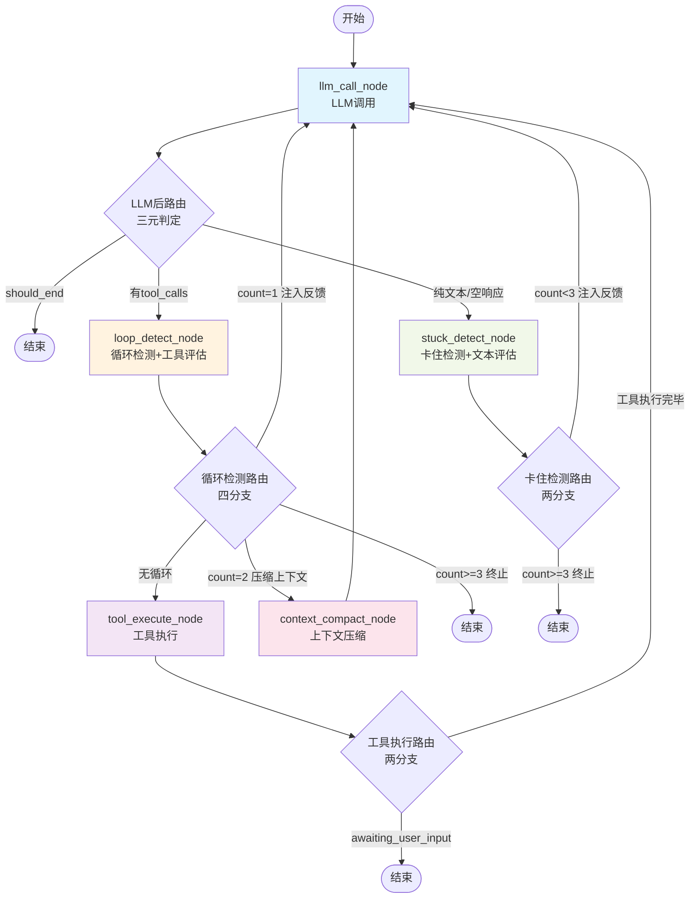

# LangGraph Agent 工作流文档

## 概述

本文档描述了基于 LangGraph 的 Agent 工作流架构。工作流由 **5 个核心节点** 组成,所有评估逻辑采用规则判断,消除 LLM 评估调用。

**核心节点**: `llm_call` / `tool_execute` / `loop_detect` / `stuck_detect` / `context_compact`

## 工作流流程图



### 设计原则

- **极简路由**: `route_after_llm` 只做 "有无 tool_calls" 的三元判断,纯文本直接进入 `stuck_detect`
- **规则替代LLM**: 所有评估逻辑采用规则判断(关键词/正则/阈值),消除 LLM 评估调用
- **检测内聚**: 反馈注入逻辑内聚到各检测节点(loop_detect/stuck_detect)
- **Plan 降级**: `plan_execute` 已降级为闭包工具,不再是图节点
- **工具执行简化**: `route_after_tool_execute` 只有两分支,工具执行后直接回 `llm_call`,由下轮 LLM 返回后再检测循环

### 反馈机制说明

| 检测场景 | 处理位置 | 反馈策略 |
|---------|---------|----------|
| 空响应 | `stuck_detect_node` | 重试 ≤1 次注入提示,超限终止 |
| 纯规划 | `stuck_detect_node` | 重试 ≤2 次注入提示,超限终止 |
| 完成声明 | `stuck_detect_node` | 规则检查 + 实质性验证,通过→complete,不通过→llm_call |
| 用户提问 | `stuck_detect_node` | 识别为完成→complete |
| 循环检测 | `loop_detect_node` 内部 | count=1: 警告; count=2: context_compact; count≥3: 终止 |
| 空结果循环 | `loop_detect_node` 内部 | 工具连续空结果,同样遵循 3 级升级策略 |
| 卡住检测 | `stuck_detect_node` 内部 | count<3: 注入纠正消息; count≥3: 终止 |
| 致命错误 | `loop_detect_node` | permission 等致命错误→terminate |
| 工具质量评估 | `loop_detect_node` | 规则评估质量并记录 → 路由回 llm_call |
| 工具执行完毕 | `route_after_tool_execute` | 直接路由回 llm_call,由下轮 LLM 后再检测循环 |

## 系统提示词（System Prompt）

LLM 调用节点的 system prompt 由 **PromptBuilder** 服务构建，底层由 Agent 实体的 `build_full_system_prompt()` 组装。

当前实现版本采用 **7 文件直接组装** 模式（BOOTSTRAP → IDENTITY → AGENTS → SOUL → MEMORY → TOOLS → USER），设计文档中规划的 11 层结构（含 Universal Behavior、Tooling Section、Environment 等动态层）作为后续迭代方向。

### 当前实现：7 文件组装模式

```
完整 System Prompt =
  # Bootstrap
  {{bootstrap_md}}

  # Identity
  {{identity_md}}

  # Agents
  {{agents_md}}

  # Soul
  {{soul_md}}

  # Memory
  {{memory_md}}

  # Tools
  {{tools_md}}

  # User
  {{user_md}}
```

**组装规则：**
- 顺序：BOOTSTRAP → IDENTITY → AGENTS → SOUL → MEMORY → TOOLS → USER
- 空配置自动跳过（通过 `if content:` 判断）
- 各节以 `# {Section}` 标题 + 内容形式拼接，节之间用双换行（`\n\n`）分隔
- 配置文件最大长度：50000 字符/个
- 组装代码位置：`backend/src/domain/entities/agent.py` → `build_full_system_prompt()`

### 各配置文件含义与提示词示例

| 配置文件 | 用途 | 注入时机 | 提示词示例片段 |
|----------|------|----------|----------------|
| `bootstrap_md` | 初始化序列与核心系统提示词 | Agent 创建时 | `# 初始化配置\n\n## 系统约束\n- 遵守安全边界，不执行危险操作\n- 保护用户隐私，不泄露敏感信息` |
| `identity_md` | 身份定义与系统边界约束 | Agent 创建时 | `# 小助手\n\n## 身份\n你是小助手，帮助你管理日程和提醒的智能助手。` |
| `agents_md` | 调度规则与标准作业程序 | Agent 创建时 | `# 调度规则与标准作业程序\n\n## 任务处理流程\n1. 接收用户请求\n2. 分析任务类型和优先级` |
| `soul_md` | 响应语气、行为特征及输出格式 | Agent 创建时 | `# 人格定义\n\n## 性格特征\n严谨、专业、可靠` |
| `memory_md` | 长期上下文数据与既定规则 | 运行时可更新 | 初始为空，运行时由 memory 系统填充 |
| `tools_md` | 工具授权注册表及调用参数 | Agent 创建时 | `# 工具授权\n\n## 可用工具\n（待配置）` |
| `user_md` | 用户画像数据与交互限制 | Agent 创建时 | `# 用户画像\n\n## 目标用户\n使用小助手的用户` |

### LLM 调用时的完整输入

在 `llm_call_node` 中，LLM 接收的 messages 数组为：

```
[
  SystemMessage(content=system_prompt),    // 上述 7 文件组装
  ...history_messages,                     // 会话历史（最近 20 条）
  HumanMessage(content=user_message),       // 当前用户消息
  ...previous_turns,                       // 本轮之前的工具调用轮次
]
```

同时在 `llm.astream()` 调用时通过 `bind_tools()` 绑定运行时工具 schema（JSON Schema 格式）。**每次调用都重新传递 tools**，因为 OpenAI Chat Completions API 是无状态的。

## 节点说明

### 1. LLM 调用节点 (llm_call_node)
- **文件**: `backend/src/infrastructure/agent/nodes/llm_call_node.py`
- **职责**: 调用大语言模型并流式输出文本到前端
- **功能**:
  1. 发射 `phase:changed` 事件（phase=thinking）
  2. 防御性注入 SystemMessage
  3. 流式调用 LLM，发射每个 token 片段（`llm:chunk`）
  4. 使用 `AIMessageChunk` 聚合流式输出
  5. 从聚合消息中提取 `tool_calls` 并转为 `pending_tool_calls`
  6. 发射 LLM 完成事件（`llm:complete`）
- **返回状态**:
  - `messages`: `[AIMessage(content=full_text, tool_calls=...)]`
  - `pending_tool_calls`: 待执行工具列表
  - `current_llm_text`: 当前 LLM 输出文本
  - `phase`: "thinking"
  - `current_turn`: 当前轮次 +1

### 2. 工具执行节点 (tool_execute_node)
- **文件**: `backend/src/infrastructure/agent/nodes/tool_execute_node.py`
- **职责**: 统一执行所有工具调用并返回结果（含 plan_execute 闭包工具）
- **功能**:
  1. 发射 `phase:changed` 事件（phase=tool_executing）
  2. 遍历 `pending_tool_calls`，为每个工具构建 `ToolContext`
  3. 调用 `tool_registry.execute()` 执行工具
  4. 发射工具结果事件
  5. 构建 `ToolMessage` 列表
  6. 若某工具标记 `awaiting_user_input`，则设置该状态
  7. 记录 `last_executed_tool_call_ids` 供后续使用
- **返回状态**:
  - `messages`: `[ToolMessage(content=..., tool_call_id=...)]`
  - `tool_results`: 结构化结果字典
  - `pending_tool_calls`: `[]`（清空）
  - `awaiting_user_input`: 是否等待用户输入
  - `last_executed_tool_call_ids`: 最近执行的工具调用ID列表
  - `phase`: "tool_executing"
- **路由说明**: 工具执行后直接路由回 `llm_call`，由下一轮 LLM 返回后再进入 `loop_detect` 进行循环检测

### 3. 循环检测节点 (loop_detect_node)
- **文件**: `backend/src/infrastructure/agent/nodes/loop_detect_node.py`
- **职责**: 检测 Agent 是否进入循环模式 + 评估工具结果质量（吸收原 tool_observe）
- **触发条件**: LLM 返回 tool_calls 后（前置守卫）
- **工具结果评估**:
  - 质量判定: good(成功且非空) / empty(成功但空) / failed(错误)
  - 错误分类: permission / timeout / not_found / network / invalid_args / business_error / unknown
  - 致命错误(permission)直接终止
- **检测策略**:
  1. **精确匹配**: 最近 N 轮 `tool_name + 参数 SHA256 hash` 完全一致 → `loop_type="exact_tool_repeat"`
  2. **内容相似度**: 仅在纯文本轮次生效，文本 Jaccard 相似度 > 0.92 → `loop_type="content_repeat"`
  3. **质量循环**: 工具连续空结果 → `loop_type="empty_tool_result"`
- **内部处理**:
  - count=1: 注入纠正 SystemMessage → 路由 `llm_call`
  - count=2: 设置 `compression_strategy="summarize"` → 路由 `context_compact`
  - count≥3 或全局纠正预算熔断: 设置 `error`/`should_end=True` → 终止
- **返回状态**: `loop_detected` / `loop_detection_count` / `loop_type` / `messages` / `observation_summary` / `observation_quality`

### 4. 卡住检测节点 (stuck_detect_node)
- **文件**: `backend/src/infrastructure/agent/nodes/stuck_detect_node.py`
- **职责**: 评估 LLM 文本输出 + 检测 Agent 是否卡住（吸收原 answer_observe）
- **触发条件**: `llm_call` 返回纯文本且无 `tool_calls`
- **LLM文本评估(新增)**:
  - 空响应: 重试≤1次,超限终止
  - 完成声明: 实质性验证,通过→complete,不通过→llm_call
  - 用户提问: 识别为完成→complete
  - 纯规划: 重试≤2次,超限终止
  - 实质性文本: 继续检测 monologue
- **检测模式**: 连续 3 条 assistant 消息无 tool_calls → `stuck_type="monologue"`
- **内部处理**:
  - count<3: 注入纠正 SystemMessage → 路由 `llm_call`
  - count≥3 或全局纠正预算熔断: 设置 `error`/`should_end=True` → 终止
- **返回状态**: `stuck_detected` / `stuck_detection_count` / `stuck_type` / `messages`

### 5. 上下文压缩节点 (context_compact_node)
- **文件**: `backend/src/infrastructure/agent/nodes/context_compact_node.py`
- **职责**: 当上下文消息过多时压缩对话历史
- **压缩策略**:
  | 策略 | 触发条件 | 行为 |
  |------|---------|------|
  | `trim`（默认） | `compression_strategy` 为空或 "trim" | 保留首条+最近 N 条，`RemoveMessage` 删除中间 |
  | `summarize` | `compression_strategy="summarize"` | LLM 生成摘要 + `RemoveMessage` 删除原文 |
- **固定出边**: `context_compact` → `llm_call`
- **返回状态**: `messages`（RemoveMessage 列表）/ `compression_strategy: None`（重置）

## 路由逻辑

### route_after_llm（三分支）

| 条件 | 目标 |
|------|------|
| `should_end=True` | END |
| 有 `tool_calls` | `loop_detect`（前置守卫） |
| 其他（纯文本/空响应） | `stuck_detect`（文本评估+卡住检测） |

### route_after_loop_detect（四分支）

| 条件 | 目标 |
|------|------|
| `loop_detected=False` | `tool_execute` |
| `should_end=True` | END（count≥3 或预算耗尽） |
| `loop_detection_count=2` | `context_compact` |
| count<2（已注入反馈） | `llm_call` |

### route_after_tool_execute（两分支）

| 条件 | 目标 |
|------|------|
| `awaiting_user_input=True` | END |
| 工具执行完毕 | `llm_call`（继续循环，无需循环检测） |

**说明**: 工具执行后直接回到 `llm_call`，由下一轮 LLM 返回后再进入 `loop_detect` 进行循环检测。这种设计避免了重复检测，保持路由逻辑极简。

### route_after_stuck_detect（两分支）

| 条件 | 目标 |
|------|------|
| `should_end=True` | END（count≥3 或预算耗尽） |
| 其他（已注入反馈） | `llm_call` |

### 固定边

`context_compact` → `llm_call`

## Plan 执行（闭包工具）

Plan 执行不再是图节点，而是在 `SendMessageUseCase._create_plan_execute_tool()` 中创建的闭包工具：

- **注册时机**: `_run_agent_loop()` 启动时注册到 `tool_registry`
- **执行方式**: LLM 调用 `plan_execute` 工具 → `tool_execute_node` 统一执行 → 闭包内部创建 `PlanExecutor` → 同步等待所有子 Agent 完成
- **子 Agent 限制**: 子 Agent 不注册 `plan_execute` 工具（避免嵌套 plan）
- **工具定义位置**: `backend/src/application/use_cases/send_message.py` → `_create_plan_execute_tool()`

## 状态管理

Agent 状态定义在 `backend/src/domain/entities/agent_state.py` 中，继承 `TypedDict`：

| 字段 | 类型 | 说明 |
|------|------|------|
| `messages` | `Annotated[list, add_messages]` | 消息历史（LangGraph 自动合并） |
| `task_id` | `str` | 任务 ID |
| `workspace` | `str` | 工作目录 |
| `user_message` | `str` | 用户当前消息 |
| `task_start_message_count` | `int` | 任务开始时的消息数 |
| `current_turn` | `int` | 当前轮次 |
| `max_turns` | `int` | 最大轮次 |
| `phase` | `str` | 当前阶段 |
| `should_end` | `bool` | 是否应终止 |
| `is_complete` | `bool` | 任务是否完成 |
| `pending_tool_calls` | `List[Dict[str, Any]]` | 待执行工具调用 |
| `tool_results` | `Dict[str, Dict[str, Any]]` | 工具执行结果 |
| `awaiting_user_input` | `bool` | 是否等待用户输入 |
| `last_executed_tool_call_ids` | `List[str]` | 最近执行的工具调用ID列表 |
| `loop_detection_count` | `int` | 循环检测连续次数 |
| `loop_detected` | `bool` | 本轮是否检测到循环 |
| `loop_type` | `Optional[str]` | 循环类型 |
| `stuck_detection_count` | `int` | 卡住检测连续次数 |
| `stuck_detected` | `bool` | 本轮是否检测到卡住 |
| `stuck_type` | `Optional[str]` | 卡住类型 |
| `current_llm_text` | `str` | 当前 LLM 输出文本 |
| `empty_retry_count` | `int` | 空响应重试计数 |
| `planning_retry_count` | `int` | 纯规划重试计数 |
| `system_prompt` | `str` | 系统提示词 |
| `final_result` | `Optional[str]` | 最终结果 |
| `error` | `Optional[str]` | 错误信息 |
| `is_sub_agent` | `bool` | 是否为子Agent |
| `parent_task_id` | `Optional[str]` | 父Agent的task_id |
| `observation_summary` | `Optional[str]` | 本轮观察文本总结 |
| `observation_quality` | `Optional[str]` | 本轮观察总体质量 |
| `observation_items` | `List[Dict[str, Any]]` | 每个tool_call的观察详情 |
| `consecutive_empty_observations` | `int` | 连续空观察计数 |
| `last_error_category` | `Optional[str]` | 最近一次错误分类 |
| `compression_strategy` | `Optional[str]` | 压缩策略（trim/summarize） |

## 维护说明

**重要**: 每次修改工作流逻辑时，必须同步更新本文档：
1. 更新流程图（如添加/删除节点或修改路由）
2. 更新节点说明（如修改节点职责或功能）
3. 更新路由逻辑（如修改路由条件）
4. 更新状态管理（如修改状态结构）
