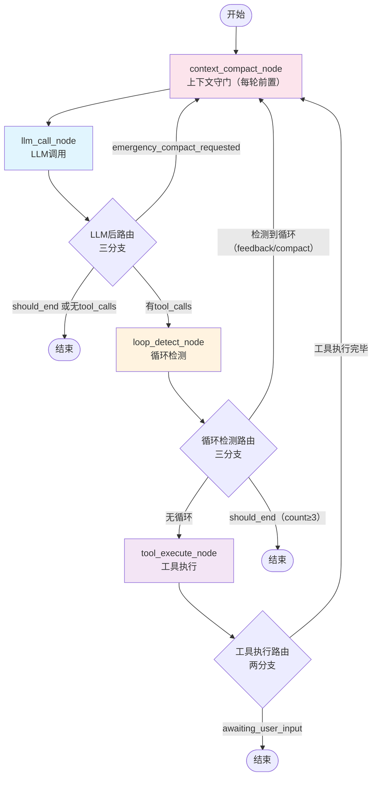

# LangGraph Agent 工作流文档

## 概述

本文档描述了基于 LangGraph 的 Agent 工作流架构。工作流由 **4 个核心节点** 组成，context_compact 作为每轮 LLM 调用的前置守门节点。

**核心节点**: `context_compact` / `llm_call` / `loop_detect` / `tool_execute`

## 工作流流程图



### 设计原则

- **前置守门**: `context_compact` 是入口节点，每轮 LLM 调用前都经过 Token 水位检查
- **多层压缩**: 4 级水位策略（skip / soft-prune / micro-compact / emergency-compact）
- **极简路由**: `route_after_llm` 3 分支；`route_after_loop_detect` 3 分支；`route_after_tool_execute` 2 分支
- **规则替代LLM**: 所有评估逻辑采用规则判断，消除 LLM 评估调用
- **Token 校准**: LLM 返回后写回真实 `prompt_tokens` 作为后续增量估算 baseline

### Token 估算流程

```
初始阶段:  char/4 启发式估算
    ↓
首次 LLM 调用成功:  提取 API 返回的真实 prompt_tokens → 写回 context_token_baseline
    ↓
后续每轮:  baseline + 新增消息 char/4（增量估算）
    ↓
发生 RemoveMessage 或 compact:  baseline 失效 → 回退全量 char/4 估算
```

## 节点说明

### 1. 上下文压缩节点 (context_compact_node) — 入口节点

- **文件**: `backend/src/infrastructure/agent/nodes/context_compact_node.py`
- **职责**: 每轮 LLM 调用前检查 Token 水位，执行对应压缩策略
- **4 级压缩策略**:

| 策略 | 触发条件 | 行为 |
|------|---------|------|
| `skip` | token < 40% 水线 | 发事件，不改消息 |
| `soft_prune` | token 40%–60% | 裁剪 > 20000 字符的 ToolMessage 内容（head 4000 + tail 4000），保留 tool_call_id |
| `micro_compact` | token > 60% | 保留 SystemMessage + 最近 10 条；对最多 90 条旧消息 LLM 摘要 → `HumanMessage`；其余 `RemoveMessage` |
| `emergency_compact` | 上下文超限 | 保留 SystemMessage + 最近 3 条；摘要同 micro-compact；`context_compaction_attempts += 1` |

- **摘要 prompt**: 任务聚焦，保留：已完成任务、进行中任务、文件/路径/命令、工具结果（成功/失败/错误）、用户约束、下一步
- **固化出边**: `context_compact` → `llm_call`
- **返回状态**: `last_context_strategy` / `context_token_estimate` / `context_token_baseline`（compact 后重置为 None）/ `context_compaction_attempts` / `emergency_compact_requested（重置为 False）`
- **事件**: `CONTEXT_COMPACTING`，payload 含 `strategy` / `beforeTokens` / `afterTokens` / `maxContextTokens` / `beforeCount` / `afterCount` / `removedCount` / `prunedToolResults` / `summaryLength` / `reason`

### 2. LLM 调用节点 (llm_call_node)

- **文件**: `backend/src/infrastructure/agent/nodes/llm_call_node.py`
- **职责**: 调用 LLM 并流式输出；写回 usage baseline；异常委托给错误处理器工厂
- **功能**:
  1. 发射 `phase:changed` 事件（phase=thinking）
  2. 防御性注入 SystemMessage
  3. 流式调用 LLM，发射每个 token 片段（`llm:chunk`）
  4. 使用 `AIMessageChunk` 聚合流式输出，提取 tool_calls
  5. 发射 LLM 完成事件（`llm:complete`）
  6. **Token 校准**: 从 `accumulated.usage_metadata.input_tokens` 提取真实 prompt_tokens → 写回 `context_token_baseline` / `context_token_estimate`
  7. **异常处理**: 委托给 `LLMErrorHandlerRegistry`（ContextLimitErrorHandler / TimeoutErrorHandler / DefaultErrorHandler）
- **上下文超限处理**:
  - 首次: `ContextLimitErrorHandler` → `emergency_compact_requested=True, should_end=False` → 路由回 `context_compact` 紧急压缩
  - 二次: `should_end=True` → 终止
- **返回状态**: `messages` / `pending_tool_calls` / `context_token_baseline` / `context_token_baseline_message_count` / `context_token_estimate`

### 3. 循环检测节点 (loop_detect_node)

- **文件**: `backend/src/infrastructure/agent/nodes/loop_detect_node.py`
- **职责**: 检测 Agent 是否进入循环模式
- **检测策略**: 无效工具调用 / 精确匹配 / A-B-A-B 交替模式
- **内部处理**:
  - count=1: 注入纠正 SystemMessage → 路由 `context_compact`
  - count=2: 设置 `compression_strategy="summarize"` → 路由 `context_compact`
  - count≥3 或全局纠正预算熔断: 设置 `error`/`should_end=True` → 终止
- **返回状态**: `loop_detected` / `loop_detection_count` / `loop_type` / `messages`

### 4. 工具执行节点 (tool_execute_node)

- **文件**: `backend/src/infrastructure/agent/nodes/tool_execute_node.py`
- **职责**: 统一执行所有工具调用并返回结果
- **功能**:
  1. 发射 `phase:changed` 事件（phase=tool_executing）
  2. 遍历 `pending_tool_calls`，并发执行工具
  3. 构建 `ToolMessage` 列表
  4. 若某工具标记 `awaiting_user_input`，则设置该状态
- **路由说明**: 工具执行后路由到 `context_compact`（每轮 LLM 前置守门），而非直接回 `llm_call`

## 路由逻辑

### route_after_llm（三分支）

| 条件 | 目标 |
|------|------|
| `emergency_compact_requested=True` | `context_compact`（紧急压缩优先） |
| `should_end=True` **或** 无 `tool_calls`（纯文本/空响应） | END |
| 有 `tool_calls` | `loop_detect`（前置守卫） |

### route_after_loop_detect（三分支）

| 条件 | 目标 |
|------|------|
| `loop_detected=False` | `tool_execute` |
| `should_end=True` | END（count≥3 或预算耗尽） |
| 检测到循环（count=1 或 count=2） | `context_compact`（统一走上下文守门） |

### route_after_tool_execute（两分支）

| 条件 | 目标 |
|------|------|
| `awaiting_user_input=True` | END |
| 工具执行完毕 | `context_compact`（每轮 LLM 前置守门） |

### 固定边

`context_compact` → `llm_call`

## LLM 错误处理工厂

在 `llm_call_node` 中，LLM 调用异常由 `LLMErrorHandlerRegistry`（职责链模式）处理：

| Handler | 触发条件 | 行为 |
|---------|---------|------|
| `ContextLimitErrorHandler` | 上下文超限错误 | 首次: `emergency_compact_requested=True`；二次: 终止 |
| `TimeoutErrorHandler` | 超时 | `should_end=True, error="LLM streaming timed out"` |
| `DefaultErrorHandler` | 其他异常 | re-raise → `BaseNode._handle_error` 处理 |

- **接口**: `domain/interfaces/llm_error_handler.py`
- **实现**: `infrastructure/agent/error_handlers/`
- **注入**: `AgentLoopRunner.run()` 中通过 `graph_config` 注入

## 状态管理

Agent 状态定义在 `backend/src/domain/aggregates/agent/agent_state.py` 中：

### 基础字段

| 字段 | 类型 | 说明 |
|------|------|------|
| `messages` | `Annotated[list, add_messages]` | 消息历史（LangGraph 自动合并） |
| `task_id` | `str` | 任务 ID |
| `workspace` | `str` | 工作目录 |
| `user_message` | `str` | 用户当前消息 |
| `task_start_message_count` | `int` | 任务开始时的消息数 |
| `current_turn` | `int` | 当前轮次 |
| `max_turns` | `int` | 最大轮次 |
| `phase` | `str` | 当前阶段 |
| `should_end` | `bool` | 是否应终止 |
| `is_complete` | `bool` | 任务是否完成 |
| `pending_tool_calls` | `List[Dict[str, Any]]` | 待执行工具调用 |
| `tool_results` | `Dict[str, Dict[str, Any]]` | 工具执行结果 |
| `awaiting_user_input` | `bool` | 是否等待用户输入 |
| `last_executed_tool_call_ids` | `List[str]` | 最近执行的工具调用ID列表 |
| `loop_detection_count` | `int` | 循环检测连续次数 |
| `loop_detected` | `bool` | 本轮是否检测到循环 |
| `loop_type` | `Optional[str]` | 循环类型 |
| `current_llm_text` | `str` | 当前 LLM 输出文本 |
| `system_prompt` | `str` | 系统提示词 |
| `final_result` | `Optional[str]` | 最终结果 |
| `error` | `Optional[str]` | 错误信息 |
| `compression_strategy` | `Optional[str]` | 压缩策略（trim / summarize / emergency_compact） |
| `is_sub_agent` | `bool` | 是否为子Agent |
| `parent_task_id` | `Optional[str]` | 父Agent的task_id |

### 上下文管理字段（新增）

| 字段 | 类型 | 说明 |
|------|------|------|
| `max_context_tokens` | `int` | 当前模型上下文窗口 Token 上限（由 `resolve_max_context_tokens` 解析） |
| `context_token_estimate` | `int` | 当前 messages 的 Token 估算值 |
| `context_token_baseline` | `Optional[int]` | 最近一次成功 LLM 调用返回的真实 `prompt_tokens` |
| `context_token_baseline_message_count` | `int` | baseline 对应的消息数量，用于增量估算 |
| `context_compaction_attempts` | `int` | 连续紧急压缩次数（>=1 时再次超限则终止） |
| `emergency_compact_requested` | `bool` | LLM 调用发生上下文超限后置为 True |
| `last_context_strategy` | `Optional[str]` | 最近一次实际执行的压缩策略 |

## 系统提示词（System Prompt）

LLM 调用节点的 system prompt 由 **PromptAssembleService** 组装，采用 **11 层 Prompt 架构**。
详见: `backend/src/domain/services/prompt_assemble_service.py`

初始历史加载预算：`int(max_context_tokens * 0.25)`，替代原硬编码 `8000`。

## 维护说明

**重要**: 每次修改工作流逻辑时，必须同步更新本文档：
1. 更新流程图（如添加/删除节点或修改路由）
2. 更新节点说明（如修改节点职责或功能）
3. 更新路由逻辑（如修改路由条件）
4. 更新状态管理（如修改状态结构）
5. **确认新节点是否注册**: 代码中写好的节点未必接入工作流，需检查 `workflow_builder.py` 中的 `workflow.add_node()` 和 `add_conditional_edges()` 调用
