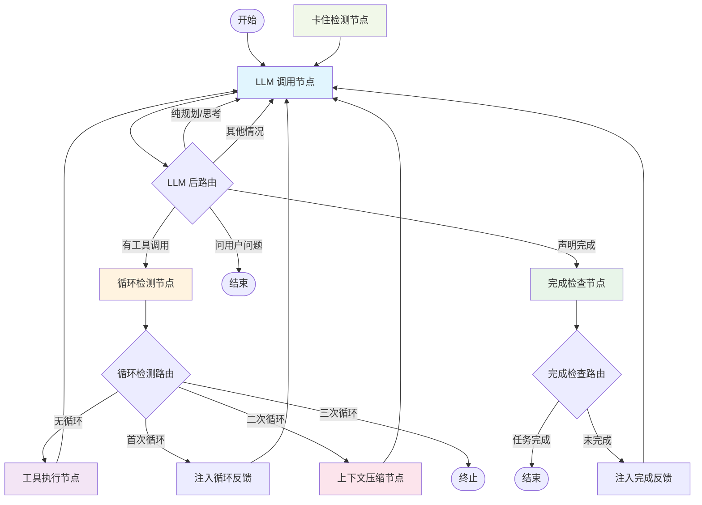

# LangGraph Agent 工作流文档

## 概述

本文档描述了基于 LangGraph 的 Agent 工作流架构，包含所有节点、路由逻辑和状态流转。

## 工作流流程图

## 节点说明

### 1. LLM 调用节点 (llm_call_node)
- **职责**: 调用大语言模型并流式输出文本
- **位置**: `backend/src/infrastructure/agent/nodes/llm_call_node.py`
- **功能**:
  - 发射阶段变更事件
  - 流式调用 LLM
  - 发射每个 token (llm-chunk)
  - 收集工具调用信息

### 2. 工具执行节点 (tool_execute_node)
- **职责**: 执行工具调用并返回结果
- **位置**: `backend/src/infrastructure/agent/nodes/tool_execute_node.py`
- **功能**:
  - 遍历待执行工具调用
  - 执行安全检查
  - 如需审批则等待
  - 执行工具并返回结果

### 3. 循环检测节点 (loop_detect_node)
- **职责**: 检测 Agent 是否进入循环模式
- **位置**: `backend/src/infrastructure/agent/nodes/loop_detect_node.py`
- **检测策略**:
  - 精确匹配：最近 N 轮是否调用相同工具 + 相同参数
  - 内容相似度：LLM 响应文本相似度

### 4. 完成检查节点 (complete_check_node)
- **职责**: 检查 LLM 是否声明任务完成，并验证完成条件
- **位置**: `backend/src/infrastructure/agent/nodes/complete_check_node.py`
- **关键词检测**: "task complete", "i have completed", "the task is done" 等

### 5. 上下文压缩节点 (context_compact_node)
- **职责**: 当上下文接近 token 限制时压缩对话历史
- **位置**: `backend/src/infrastructure/agent/nodes/context_compact_node.py`
- **策略**:
  - 保留系统提示和最近 N 条消息
  - 压缩中间消息为摘要

### 6. 卡住检测节点 (stuck_detect_node)
- **职责**: 检测 Agent 是否卡住（无法推进任务）
- **位置**: `backend/src/infrastructure/agent/nodes/stuck_detect_node.py`
- **检测模式**:
  - 重复 action/error：工具反复失败
  - 单话模式：LLM 只输出文本不采取行动
  - 交替模式：在两个状态间来回切换

## 路由逻辑

### LLM 调用后路由 (route_after_llm)
- 检查是否有工具调用 → 进入循环检测
- 检查是否声明完成 → 进入完成检查
- 检查是否为纯规划/思考 → 回到 LLM 调用
- 检查是否询问用户 → 结束工作流

### 循环检测后路由 (route_after_loop_detect)
- 无循环 → 执行工具
- 首次循环 → 注入反馈并回到 LLM
- 二次循环 → 上下文压缩并回到 LLM
- 三次循环 → 终止工作流

### 完成检查后路由 (route_after_complete_check)
- 任务完成 → 结束工作流
- 未完成 → 注入纠正反馈并回到 LLM

## 状态管理

Agent 状态定义在 `backend/src/domain/entities/agent_state.py` 中，包含：
- 消息历史
- 任务上下文
- 控制流信息
- 工具调用状态
- 检测器状态
- 流式输出
- 结果和错误信息

## 维护说明

**重要**: 每次修改工作流逻辑时，必须同步更新本文档：
1. 更新流程图（如添加/删除节点或修改路由）
2. 更新节点说明（如修改节点职责或功能）
3. 更新路由逻辑（如修改路由条件）
4. 更新状态管理（如修改状态结构）
