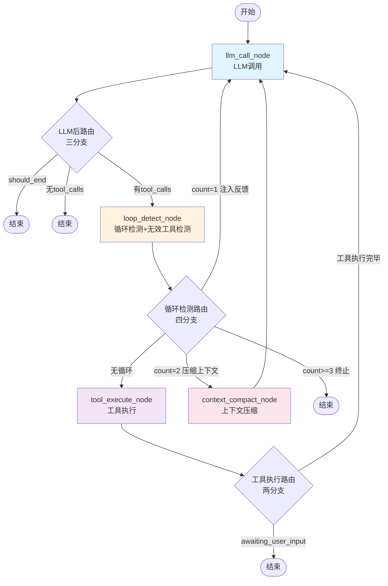
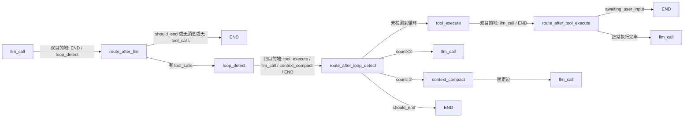

# LangGraph Agent 工作流文档

## 概述

本文档描述了基于 LangGraph 的 Agent 工作流架构。工作流由 **4 个核心节点** 组成，所有循环/异常检测采用规则判断，消除 LLM 评估开销。

**核心节点**: `llm_call` / `loop_detect` / `tool_execute` / `context_compact`

> **注意**: `stuck_detect_node` 代码已实现但当前**未注册到工作流中**（预留实现）。LLM 返回纯文本/空响应时直接走 `route_after_llm` → END 终止。

## 工作流流程图



### 路由概述图



### 设计原则

- **极简路由**: `route_after_llm` 只做 "should_end / 无 tool_calls / 有 tool_calls" 的分支判断，有 tool_calls → `loop_detect`，否则 → END
- **规则替代LLM**: 循环检测采用规则判断（工具名+参数哈希 / A-B-A-B 交替模式 / 无效工具调用字段检查），消除 LLM 评估调用
- **检测内聚**: 无效工具检测、模式循环检测及反馈注入逻辑全部内聚到 `loop_detect_node`
- **3 级升级策略**: 循环/无效工具调用采用 count=1 注入反馈 → count=2 上下文压缩 → count>=3 终止的逐步升级策略
- **全局纠正预算**: 空响应计数 + 循环计数 + 卡住计数的总和达到 `GLOBAL_CORRECTION_BUDGET=3` 时强制终止，防止单一纠正策略耗尽所有轮次
- **Plan 降级**: `plan_execute` 已降级为闭包工具，不再是图节点
- **工具执行简化**: `route_after_tool_execute` 只有两分支，工具执行后直接回 `llm_call`，由下轮 LLM 返回后再检测循环
- **优先级过滤**: `tool_execute` 节点内部对 pending 工具做优先级过滤，`clarify` 和 `task_create` 互斥保留
- **stuck_detect 未注册**: `stuck_detect_node` 代码存在（含 LLM 文本分类评估）但未接入工作流，LLM 返回纯文本时直接终止

### 反馈机制说明

| 检测场景 | 处理位置 | 反馈策略 |
|---------|---------|----------|
| 模式循环检测（精确重复/交替模式） | `loop_detect_node._detect_pattern_loop` | count=1: 注入纠正 SystemMessage; count=2: context_compact; count≥3: terminate |
| 无效工具调用（缺少 name/id） | `loop_detect_node._detect_invalid_tool_calls` | 同上 3 级升级策略 |
| 全局纠正预算耗尽 | `loop_detect_node` | 当 `empty_retry_count + loop_detection_count + stuck_detection_count ≥ 3` 时强制 terminate |
| 工具执行完毕 | `route_after_tool_execute` | 直接路由回 `llm_call`，由下轮 LLM 后再检测循环 |
| awaiting_user_input | `route_after_tool_execute` | 等待用户输入 → 该轮终止 |
| 无 tool_calls | `route_after_llm` | 直接 END 终止 |
| LLM 流式超时 | `llm_call_node` | 设置 `should_end=True` + `error` 字段，终止流程 |

## 系统提示词（System Prompt）

LLM 调用节点的 system prompt 由 **PromptAssembleService** 组装，采用 **11 层 Prompt 架构**。

详见: `backend/src/domain/services/prompt_assemble_service.py`

在 `llm_call_node` 中，LLM 接收的 messages 数组为：

```
[
  SystemMessage(content=system_prompt),    // 上述 11 层组装（由 llm_call_node 防御性注入）
  ...history_messages,                     // 会话历史（最近 20 条，含当前用户消息的 HumanMessage）
  ...previous_turns,                       // 本轮之前的 ToolMessage + AIMessage 工具调用轮次
]
```

同时在 `llm.astream()` 调用时通过 `bind_tools()` 绑定运行时工具 schema（JSON Schema 格式）。**每次调用都重新传递 tools**，因为 OpenAI Chat Completions API 是无状态的。

> **注**: 当前用户消息在 `send_message.py` 中已作为 SessionMessage 持久化，并在加载历史时转为 HumanMessage 包含在 `history_messages` 中，不再额外独立添加。

## 节点说明

### 1. LLM 调用节点 (llm_call_node)
- **文件**: `backend/src/infrastructure/agent/nodes/llm_call_node.py`
- **基类**: `BaseNode`（模板方法模式，自动处理 phase 事件发射、入口/完成日志、异常兜底）
- **职责**: 调用大语言模型并流式输出文本到前端
- **功能**:
  1. 基类 `BaseNode.__call__` 自动发射 `phase:changed` 事件（phase=thinking）
  2. 防御性注入 SystemMessage（如果 messages[0] 不是 SystemMessage）
  3. 流式调用 LLM，发射每个 token 片段（`llm:chunk`）
  4. 支持深度思考内容（`reasoning_content` 字段），发射 `thinking:chunk` 事件
  5. 使用 `AIMessageChunk` 聚合流式输出，正确合并 tool_call_chunks
  6. 从聚合消息中提取 `tool_calls` 并转为 `pending_tool_calls`
  7. 发射 LLM 完成事件（`llm:complete`）
  8. 设置 `should_end` / `is_complete` 状态（无 tool_calls 时标记完成）
  9. 清空 `last_executed_tool_call_ids`（避免下游 observe 误判）
  10. LLM 流式调用超时保护（默认 5 分钟，通过 `llm_timeout_sec` 配置）
- **返回状态**:
  - `messages`: `[AIMessage(content=full_text, tool_calls=tool_calls_list)]`
  - `pending_tool_calls`: 待执行工具列表
  - `last_executed_tool_call_ids`: `[]`（清空，使上一轮工具执行结果失效）
  - `current_llm_text`: 当前 LLM 输出文本
  - `phase`: "complete"（无 tool_calls）/ "thinking"（有 tool_calls）
  - `current_turn`: 当前轮次 +1
  - `should_end`: 无 tool_calls 时 True
  - `is_complete`: 同 `should_end`

### 2. 循环检测节点 (loop_detect_node)
- **文件**: `backend/src/infrastructure/agent/nodes/loop_detect_node.py`
- **基类**: `BaseNode`（`default_phase=None`，自行控制 phase 变更）
- **职责**: 在工具执行前拦截检测无效工具调用和模式循环，内部处理反馈注入与升级策略
- **触发条件**: LLM 返回 tool_calls 后（前置守卫）
- **检测策略**（按优先级）:

  | 优先级 | 检测项 | 方法 | 说明 |
  |--------|--------|------|------|
  | 1 | 无效工具调用 | `_detect_invalid_tool_calls` | 检查 `pending_tool_calls` 是否缺少 `name` 或 `id` 字段 |
  | 2 | 精确匹配循环 | `_detect_pattern_loop` | 最近 3 轮 tool_name + 参数 SHA256 hash 完全一致 |
  | 3 | A-B-A-B 交替模式 | `_detect_alternating_pattern` | 最近 4 轮形成 A→B→A→B 的交替模式 |

- **内部处理 3 级升级策略**:
  - count=1: 注入纠正 SystemMessage 到 messages → 路由 `llm_call`
  - count=2: 设置 `compression_strategy="summarize"` → 路由 `context_compact`
  - count≥3 或全局纠正预算熔断: 设置 `error`/`should_end=True` → 终止
  - turn 预算耗尽: 同样终止
- **重要常量**:
  - `GLOBAL_CORRECTION_BUDGET = 3`: `empty_retry_count + loop_detection_count + stuck_detection_count` 合计上限
- **返回状态**:
  - `loop_detected`: 是否检测到循环
  - `loop_detection_count`: 循环连续检测次数
  - `loop_type`: `"invalid_tool_call"` / `"exact_tool_repeat"` / `"alternating_pattern"`
  - `messages`: `[SystemMessage(content=纠正反馈)]`（count=1 时）
  - `compression_strategy`: `"summarize"`（count=2 时）
  - `error` / `should_end`: 终止时设置
  - `phase`: `"loop_correcting"`（检测到时）/ `"tool_executing"`（未检测到）

### 3. 工具执行节点 (tool_execute_node)
- **文件**: `backend/src/infrastructure/agent/nodes/tool_execute_node.py`
- **基类**: `BaseNode`（自动发射 phase=thinking → tool_executing）
- **职责**: 统一执行所有工具调用并返回结果（含 sub-agent 闭包工具）
- **功能**:
  1. 基类自动发射相位事件（phase=tool_executing）
  2. 遍历 `pending_tool_calls`，为每个工具构建 `ToolContext`（含 sub-agent 依赖注入）
  3. **优先级过滤**: 同时存在 `clarify` 工具时，过滤掉其他工具只保留 `clarify`；存在 `task_create` 工具时同理
  4. 调用 `tool_registry.execute()` 并行执行工具（`asyncio.gather`）
  5. 发射工具调用事件（`tool:call`）和结果事件（`tool:result`）
  6. 构建 `ToolMessage` 列表（content 防御性处理，确保不为 None）
  7. 若某工具标记 `awaiting_user_input`，则设置 `final_result`
  8. 记录 `last_executed_tool_call_ids` 供后续使用
- **返回状态**:
  - `messages`: `[ToolMessage(content=..., tool_call_id=...)]`
  - `tool_results`: 结构化结果字典
  - `pending_tool_calls`: `[]`（清空）
  - `awaiting_user_input`: 是否等待用户输入
  - `last_executed_tool_call_ids`: 最近执行的工具调用 ID 列表
  - `final_result`: 等待用户输入时的输出文本
  - `phase`: "tool_executing"
- **路由说明**: 工具执行后直接路由回 `llm_call`，由下一轮 LLM 返回后再进入 `loop_detect` 进行循环检测

### 4. 卡住检测节点 (stuck_detect_node)
- **文件**: `backend/src/infrastructure/agent/nodes/stuck_detect_node.py`
- **职责**: 评估 LLM 文本输出 + 检测 Agent 是否卡住（吸收原 answer_observe）
- **触发条件**: `llm_call` 返回纯文本且无 `tool_calls`
- **LLM 文本评估**（使用独立分类 LLM，temperature=0.1）:
  - **empty**: 空响应 → 重试 ≤1 次，超限终止
  - **complete**: 完成声明（有实质内容）→ complete
  - **incomplete**: 声称完成但缺少实质内容 → llm_call
  - **user_question**: 向用户提问 → complete
  - **planning_only**: 纯规划 → 重试 ≤2 次，超限终止
  - **substantive_text**: 实质性文本 → 继续检测 monologue
- **monologue 检测**: 连续 3 条 assistant 消息无 tool_calls → `stuck_type="monologue"`
- **内部处理**: count<3 注入纠正 SystemMessage，count≥3 或预算耗尽终止
- **返回状态**: `stuck_detected` / `stuck_detection_count` / `stuck_type` / `messages`

> **注意**: `stuck_detect_node` 代码已实现但**未注册到工作流**，LLM 返回纯文本时由 `route_after_llm` 直接 END 终止。

### 5. 上下文压缩节点 (context_compact_node)
- **文件**: `backend/src/infrastructure/agent/nodes/context_compact_node.py`
- **基类**: `BaseNode`（自动发射 phase=thinking → context_compacting）
- **职责**: 当循环检测 count=2 时压缩对话历史
- **压缩策略**:

  | 策略 | 触发条件 | 行为 |
  |------|---------|------|
  | `trim`（默认） | `compression_strategy` 为空或 "trim" | 保留首条 SystemMessage + 最近 10 条，`RemoveMessage` 删除中间 |
  | `summarize` | `compression_strategy="summarize"` | LLM 生成摘要（独立调用）+ `RemoveMessage` 删除原文 + 注入 `HumanMessage` 摘要 |

- **消息保留规则**: 跳过 messages[0]（SystemMessage），保留尾部 keep_recent=10 条，中间全部移除
- **summarize 降级**: LLM 摘要调用失败时自动降级为 trim 策略
- **固定出边**: `context_compact` → `llm_call`
- **返回状态**: `messages`（RemoveMessage 列表 + 可选摘要 HumanMessage）/ `compression_strategy: None`（重置）/ `phase: "context_compacting"`

## 路由逻辑

### route_after_llm（三分支 → 二目的地）

| 条件 | 目标 |
|------|------|
| `should_end=True` | END |
| 无 `messages` 或最后一条消息无 `tool_calls`（纯文本/空响应） | END |
| 有 `tool_calls` | `loop_detect`（前置守卫） |

**路由函数**: 输出 `END` 或 `"loop_detect"`，两个目的地。

### route_after_loop_detect（四分支）

| 条件 | 目标 |
|------|------|
| `loop_detected=False` | `tool_execute` |
| `should_end=True` | END（count≥3 或预算耗尽） |
| `loop_detection_count=2` | `context_compact` |
| count=1（已注入反馈） | `llm_call` |

### route_after_tool_execute（两分支）

| 条件 | 目标 |
|------|------|
| `awaiting_user_input=True` | END |
| 工具执行完毕 | `llm_call`（继续循环，无需循环检测） |

**说明**: 工具执行后直接回到 `llm_call`，由下一轮 LLM 返回后再进入 `loop_detect` 进行循环检测。这种设计避免了重复检测，保持路由逻辑极简。

### 固定边

`context_compact` → `llm_call`

## Sub-Agent 支持

Sub-Agent 机制已实现并活跃，基于 `SendMessageUseCase` 自身重新创建子 Agent Loop 来实现嵌套执行：

### 启动方式
- **入口**: `send_message.py` 的 `execute()` 方法接收 `is_sub_agent=True` 参数
- **Launcher**: 通过 `sub_agent_launcher` 闭包注入到 `tool_registry`，被 `session_spawn` 工具调用
- **子 Agent 限制**: 子 Agent 不注册 `plan_execute` 和 `session_spawn` 工具（避免嵌套执行）
- **数据隔离**: 子 Agent 的中间对话不写入父 session，最终结果通过 `Task.result` 返回

### 依赖注入
工具执行节点 `tool_execute_node` 会从 config 中读取 sub-agent 相关依赖，注入到 `ToolContext.extra`：

| 字段 | 来源 | 用途 |
|------|------|------|
| `send_message_use_case` | config | 子 Agent 启动器 |
| `task_repo` | config | 任务持久化 |
| `event_emitter` | config | 事件代理转发 |
| `parent_state` | config | 父 Agent 当前状态 |
| `parent_agent_id` / `parent_session_id` | config | 父级上下文 |

### 组件
- **SubAgentOrchestrator**: `domain/services/sub_agent_orchestrator.py`，构建子 Agent system prompt 和工具注册表
- **ProxyEventEmitter**: `domain/services/event_emitter.py`，将子 Agent 事件转发到父 Agent 的 SSE 流
- **session_spawn 工具**: 触发子 Agent 创建，返回结果给主 Agent

## 状态管理

Agent 状态定义在 `backend/src/domain/entities/agent_state.py` 中，继承 `TypedDict`：

| 字段 | 类型 | 说明 |
|------|------|------|
| `messages` | `Annotated[list, add_messages]` | 消息历史（LangGraph 自动合并） |
| `task_id` | `str` | 任务 ID |
| `workspace` | `str` | 工作目录 |
| `user_message` | `str` | 用户当前消息 |
| `task_start_message_count` | `int` | 任务开始时的消息数 |
| `model` | `str` | LLM 模型名称（如 gpt-4, qwen-plus 等） |
| `current_turn` | `int` | 当前轮次 |
| `max_turns` | `int` | 最大轮次 |
| `phase` | `str` | 当前阶段 |
| `should_end` | `bool` | 是否应终止 |
| `is_complete` | `bool` | 任务是否完成 |
| `pending_tool_calls` | `List[Dict[str, Any]]` | 待执行工具调用 |
| `tool_results` | `Dict[str, Dict[str, Any]]` | 工具执行结果 |
| `awaiting_user_input` | `bool` | 是否等待用户输入 |
| `last_executed_tool_call_ids` | `List[str]` | 最近执行的工具调用ID列表 |
| `loop_detection_count` | `int` | 循环检测连续次数 |
| `loop_detected` | `bool` | 本轮是否检测到循环 |
| `loop_type` | `Optional[str]` | 循环类型 |
| `stuck_detection_count` | `int` | 卡住检测连续次数（预留，未接入工作流） |
| `stuck_detected` | `bool` | 本轮是否检测到卡住（预留，未接入工作流） |
| `stuck_type` | `Optional[str]` | 卡住类型（预留，未接入工作流） |
| `current_llm_text` | `str` | 当前 LLM 输出文本 |
| `empty_retry_count` | `int` | 空响应重试计数（预留，stuck_detect 使用） |
| `planning_retry_count` | `int` | 纯规划重试计数（预留，stuck_detect 使用） |
| `system_prompt` | `str` | 系统提示词 |
| `final_result` | `Optional[str]` | 最终结果 |
| `error` | `Optional[str]` | 错误信息 |
| `is_sub_agent` | `bool` | 是否为子Agent |
| `parent_task_id` | `Optional[str]` | 父Agent的task_id（子Agent用） |
| `observation_summary` | `Optional[str]` | 本轮观察文本总结 |
| `observation_quality` | `Optional[str]` | 本轮观察总体质量 |
| `observation_items` | `List[Dict[str, Any]]` | 每个tool_call的观察详情 |
| `consecutive_empty_observations` | `int` | 连续空观察计数 |
| `last_error_category` | `Optional[str]` | 最近一次错误分类 |
| `compression_strategy` | `Optional[str]` | 压缩策略（trim/summarize） |

> **注意**: `stuck_detection_count` / `stuck_detected` / `stuck_type` / `empty_retry_count` / `planning_retry_count` 字段当前**未被工作流使用**，为 `stuck_detect_node` 预留。

## 维护说明

**重要**: 每次修改工作流逻辑时，必须同步更新本文档：
1. 更新流程图（如添加/删除节点或修改路由）
2. 更新节点说明（如修改节点职责或功能）
3. 更新路由逻辑（如修改路由条件）
4. 更新状态管理（如修改状态结构）
5. **确认新节点是否注册**: 代码中写好的节点未必接入工作流，需检查 `agent_workflow.py` 中的 `workflow.add_node()` 和 `add_conditional_edges()` 调用
