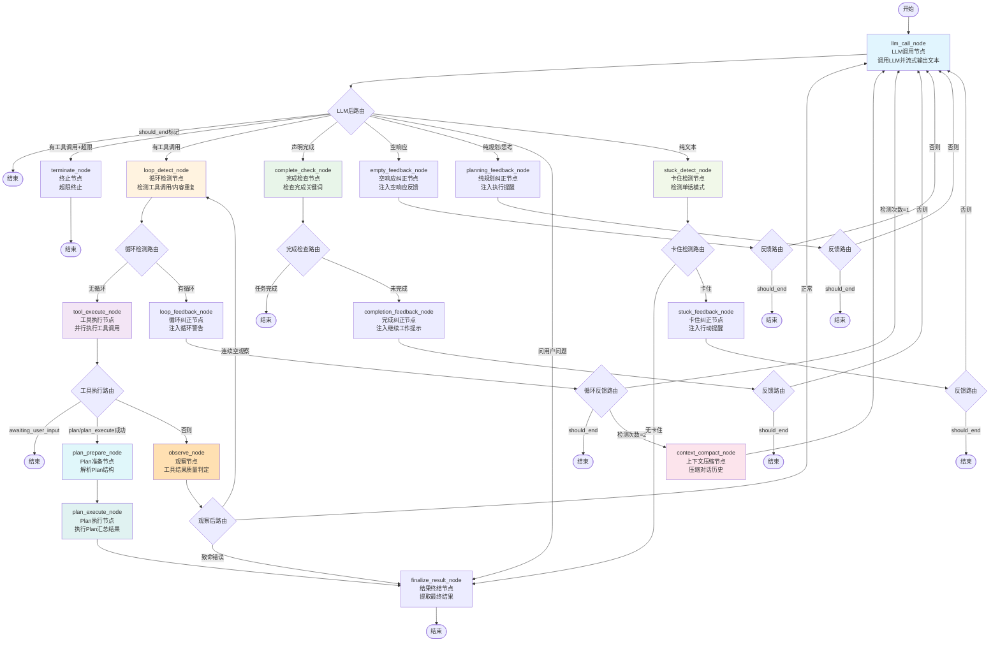

# LangGraph Agent 工作流文档

## 概述

本文档描述了基于 LangGraph 的 Agent 工作流架构，包含所有节点、路由逻辑、状态流转和对应提示词。

## 工作流流程图



## 系统提示词（System Prompt）

LLM 调用节点的 system prompt 由 **PromptBuilder** 服务构建，底层由 Agent 实体的 `build_full_system_prompt()` 组装。

当前实现版本采用 **7 文件直接组装** 模式（BOOTSTRAP → IDENTITY → AGENTS → SOUL → MEMORY → TOOLS → USER），设计文档中规划的 11 层结构（含 Universal Behavior、Tooling Section、Environment 等动态层）作为后续迭代方向。

### 当前实现：7 文件组装模式

```
完整 System Prompt =
  # Bootstrap
  {{bootstrap_md}}

  # Identity
  {{identity_md}}

  # Agents
  {{agents_md}}

  # Soul
  {{soul_md}}

  # Memory
  {{memory_md}}

  # Tools
  {{tools_md}}

  # User
  {{user_md}}
```

**组装规则：**
- 顺序：BOOTSTRAP → IDENTITY → AGENTS → SOUL → MEMORY → TOOLS → USER
- 空配置自动跳过（通过 `if content:` 判断）
- 各节以 `# {Section}` 标题 + 内容形式拼接，节之间用双换行（`\n\n`）分隔
- 配置文件最大长度：50000 字符/个
- 组装代码位置：`backend/src/domain/entities/agent.py` → `build_full_system_prompt()`

### 各配置文件含义与提示词示例

| 配置文件 | 用途 | 注入时机 | 提示词示例片段 |
|----------|------|----------|----------------|
| `bootstrap_md` | 初始化序列与核心系统提示词 | Agent 创建时 | `# 初始化配置\n\n## 系统约束\n- 遵守安全边界，不执行危险操作\n- 保护用户隐私，不泄露敏感信息` |
| `identity_md` | 身份定义与系统边界约束 | Agent 创建时 | `# 小助手\n\n## 身份\n你是小助手，帮助你管理日程和提醒的智能助手。\n\n## 能力\n- 日程管理\n- 提醒设置` |
| `agents_md` | 调度规则与标准作业程序 | Agent 创建时 | `# 调度规则与标准作业程序\n\n## 任务处理流程\n1. 接收用户请求\n2. 分析任务类型和优先级` |
| `soul_md` | 响应语气、行为特征及输出格式 | Agent 创建时 | `# 人格定义\n\n## 性格特征\n严谨、专业、可靠\n\n## 语言风格\n正式、准确、逻辑清晰` |
| `memory_md` | 长期上下文数据与既定规则 | 运行时可更新 | 初始为空，运行时由 memory 系统填充 |
| `tools_md` | 工具授权注册表及调用参数 | Agent 创建时 | `# 工具授权\n\n## 可用工具\n（待配置）\n\n## 调用约束\n- 遵守工具调用频率限制` |
| `user_md` | 用户画像数据与交互限制 | Agent 创建时 | `# 用户画像\n\n## 目标用户\n使用小助手的用户\n\n## 交互偏好\n- 语言：中文` |

### 设计规划：11 层分层结构（后续迭代）

设计文档 `design/1.2_prompt-builder.md` 中规划了更精细的 11 层 Prompt 结构，包含缓存边界和条件注入机制：

```
完整 Prompt = 
  [Layer 1]   IDENTITY              静态前缀 - Agent 身份声明
  [Layer 2]   AGENTS.md             静态前缀 - 用户自定义指令
  [Layer 3]   Base SystemPrompt     静态前缀 - 用户自定义系统提示词
              ── CACHE BOUNDARY ──  缓存边界线（以上可缓存复用）
  [Layer 4]   Universal Behavior    动态 - 8 大行为准则（条件注入）
  [Layer 5]   Tooling Section       动态 - 工具清单和描述
  [Layer 6]   Workspace Section     动态 - 工作目录路径
  [Layer 7]   Memory Section        条件 - 记忆系统读写规则
  [Layer 8]   Skill Instructions    条件 - 已加载的 Skill 指令
  [Layer 9]   Environment           动态 - 平台/日期/时区
              ── STATIC SUFFIX ──   静态后缀线（以下可缓存复用）
  [Layer 10]  SOUL.md               静态后缀 - 行为灵魂文件
  [Layer 11]  USER.md / MEMORY.md   静态后缀 - 用户记忆文件
```

#### Layer 4: Universal Behavior（8 大行为准则，条件注入）

| 序号 | 准则名称 | 类型 | 注入条件 | 提示词示例 |
|------|---------|------|---------|------------|
| 1 | tone_and_style | always_on | 始终注入 | `Respond in the same language as the user's input. Maintain a professional, concise, and friendly tone. Lead with conclusions, then provide detailed explanations.` |
| 2 | professional_objectivity | always_on | 始终注入 | `Present balanced views with pros and cons. Explicitly acknowledge uncertainty rather than guessing. Distinguish between factual statements and recommendations.` |
| 3 | proactiveness | always_on | 始终注入 | `Identify implicit but relevant needs and offer suggestions. Proactively warn about potential issues (security risks, performance concerns). Suggest next steps without imposing them.` |
| 4 | task_management | conditional | 有 `task_*` 工具 | `Create tasks before executing multi-step workflows. Create separate task records for each independent subtask. Update task status promptly upon completion.` |
| 5 | delegation_strategy | conditional | 有 `sessions_*` 工具 | `Delegate independent, parallelizable subtasks to sub-sessions. Provide clear task descriptions and expected outputs when delegating. Never delegate within sub-sessions.` |
| 6 | tool_usage | conditional | 有可用工具 | `Verify parameters are correct and complete before calling tools. Don't call the same tool more than 3 times consecutively without changing parameters. Confirm with users before dangerous operations.` |
| 7 | memory_usage | conditional | 启用 Memory | `Read relevant memories at conversation start. Write important information (preferences, key decisions, action items) to memory promptly. Respect user privacy; never record sensitive information.` |
| 8 | skill_usage | conditional | 有已加载 Skill | `When user requests match skill triggers, use the corresponding skill. Follow skill-defined steps strictly; don't skip critical steps. If multiple skills match, choose the most specific one.` |

#### Layer 5: Tooling Section（动态生成）

工具定义由运行时 `ToolDef` 列表动态生成，使用 XML 格式：

```xml
<tools>
  <tool name="web_search">
    <description>Search the web for current information</description>
    <parameters>
      <param name="query" type="string" required="true">The search query</param>
    </parameters>
    <returns>Search results with titles, URLs, and snippets</returns>
  </tool>
</tools>
```

#### Layer 6: Workspace Section（动态注入）

```
# Workspace

Current working directory: /Users/solarest/project/wordlight-agent
```

#### Layer 9: Environment（动态注入）

```
# Environment

Platform: darwin
Date: 2026-04-30
Timezone: Asia/Shanghai
```

### LLM 调用时的完整输入

在 `llm_call_node` 中，LLM 接收的 messages 数组为：

```
[
  SystemMessage(content=system_prompt),    // 上述 7 文件组装（当前）或 11 层结构（规划）
  ...history_messages,                     // 会话历史（最近 20 条）
  HumanMessage(content=user_message),       // 当前用户消息
  ...previous_turns,                       // 本轮之前的工具调用轮次
]
```

同时在 `llm.astream()` 调用时通过 `bind_tools()` 绑定运行时工具 schema（JSON Schema 格式），包含工具名称、描述、参数定义。**每次调用都重新传递 tools**，因为 OpenAI Chat Completions API 是无状态的。

## 节点说明

## 节点说明

### 1. LLM 调用节点 (llm_call_node)
- **文件**: `backend/src/infrastructure/agent/nodes/llm_call_node.py`
- **职责**: 调用大语言模型并流式输出文本到前端
- **功能**:
  1. 通过 `event_emitter.emit_phase_changed()` 发射 `phase:changed` 事件（phase=thinking）
  2. 防御性注入 SystemMessage（如果 state 中有 system_prompt 且第一条不是 SystemMessage）
  3. 流式调用 LLM（通过 `config.metadata` 将 agent_id/task_id/turn 透传给 LLMCallLogger）
  4. 发射每个 token 片段（`event_emitter.emit_llm_chunk()`，事件名 `llm:chunk`）
  5. 使用 `AIMessageChunk` 聚合流式输出，正确合并 `tool_call_chunks`
  6. 从聚合消息中提取 `tool_calls` 并转为 `pending_tool_calls` 格式
  7. 发射 LLM 完成事件（`event_emitter.emit("llm:complete", ...)`）
- **System Prompt 传入方式**:
  - 在 `send_message.py` 的 `_run_agent_loop()` 中通过 `PromptBuilder.build_system_prompt(agent)` 构建
  - 作为 `system_prompt` 字段存入 `initial_state`，在节点间传递
  - `llm_call_node` 在构建 messages 数组时，若发现第一条不是 SystemMessage，则自动插入：
    ```python
    if system_prompt and (not messages or not isinstance(messages[0], SystemMessage)):
        messages = [SystemMessage(content=system_prompt)] + messages
    ```
- **Tools 传入方式**:
  - 在 `send_message.py` 中通过 `llm.bind_tools(tool_schemas)` 绑定，`tool_schemas` 是从 `ToolRegistry` 转换的 OpenAI function schema 格式
  - `bind_tools()` 返回 `RunnableBinding` 对象，后续每次 `llm.astream()` 调用都会自动透传 tools
  - **OpenAI API 是无状态的**，所以每轮 LLM 调用都需要重新传 tools，LangChain 的 bind_tools 机制自动处理了这一点
- **返回状态**:
  - `messages`: `[AIMessage(content=full_text, tool_calls=...)]`
  - `pending_tool_calls`: 待执行工具列表
  - `current_llm_text`: 当前 LLM 输出文本
  - `phase`: "thinking"
  - `current_turn`: 当前轮次 +1

### 2. 工具执行节点 (tool_execute_node)
- **文件**: `backend/src/infrastructure/agent/nodes/tool_execute_node.py`
- **职责**: 执行工具调用并返回结果
- **功能**:
  1. 通过 `event_emitter.emit_phase_changed()` 发射 `phase:changed` 事件（phase=tool_executing）
  2. 遍历 `pending_tool_calls`，为每个工具构建 `ToolContext`（含 task_id, workspace, agent_id）
  3. 发射工具调用开始事件（`event_emitter.emit("tool:call", ...)`）
  4. 调用 `tool_registry.execute()` 执行工具
  5. 发射工具结果事件（`event_emitter.emit("tool:result", ...)`，含 status/output/error）
  6. 捕获异常并记录为 error 状态
  7. 构建 `ToolMessage` 列表（LangChain 格式，确保与 AIMessage.tool_calls 对应）
  8. 若某工具的 metadata 标记 `awaiting_user_input`，则设置 `awaiting_user_input=True`
- **返回状态**:
  - `messages`: `[ToolMessage(content=..., tool_call_id=...)]`
  - `tool_results`: 结构化结果字典 {tool_call_id: {tool_name, status, output, error, metadata}}
  - `pending_tool_calls`: `[]`（清空）
  - `awaiting_user_input`: 是否等待用户输入
  - `final_result`: 最终结果（如有）
  - `phase`: "tool_executing"

### 3. 循环检测节点 (loop_detect_node)
- **文件**: `backend/src/infrastructure/agent/nodes/loop_detect_node.py`
- **职责**: 检测 Agent 是否进入循环模式
- **检测策略**:
  1. **精确匹配**：从 `task_start_message_count` 位置开始，反向提取最近 N 轮 assistant 消息的 tool_calls；若最近 `threshold=3` 轮的 `tool_name + 参数 SHA256 hash` 完全一致，标记 `loop_detected=True`，`loop_type="exact_tool_repeat"`
  2. **内容相似度**：提取最近 4 轮 assistant 纯文本，计算相邻两轮的 Jaccard 相似度（词袋重叠率）；若全部 > 0.85，标记 `loop_detected=True`，`loop_type="content_repeat"`
- **事件发射**:
  - `event_emitter.emit("loop:detected", {loopType, count, action})` — action 为 `inject_feedback`（1次）/ `compact_context`（2次）/ `terminate`（3次）
  - `event_emitter.emit_phase_changed(...)` — phase=loop_correcting
- **返回状态**:
  - `loop_detected`: true/false
  - `loop_detection_count`: 连续检测次数 +1
  - `loop_type`: "exact_tool_repeat" | "content_repeat" | null
  - `phase`: "loop_correcting"（若检测到循环）

### 4. 完成检查节点 (complete_check_node)
- **文件**: `backend/src/infrastructure/agent/nodes/complete_check_node.py`
- **职责**: 检查 LLM 是否声明任务完成，并验证完成条件
- **关键词检测**（中英文，不区分大小写）:
  - 英文: `"task complete"`, `"i have completed"`, `"i've completed"`, `"the task is done"`, `"everything is done"`, `"all done"`
  - 中文: `"任务完成"`, `"已完成"`, `"全部完成"`, `"任务已完成"`, `"所有步骤已完成"`, `"工作已完成"`
- **逻辑**: 检查 messages 最后一条消息的 content 是否包含上述关键词
- **返回状态**:
  - 命中关键词: `{"is_complete": true, "final_result": text, "phase": "complete"}`
  - 未命中: `{"is_complete": false}`

### 5. 上下文压缩节点 (context_compact_node)
- **文件**: `backend/src/infrastructure/agent/nodes/context_compact_node.py`
- **职责**: 当上下文消息过多时压缩对话历史
- **策略**:
  1. 通过 `event_emitter.emit_phase_changed()` 发射 `phase:changed` 事件（phase=context_compacting）
  2. 保留第一条消息（SystemMessage）和最近 `keep_recent=10` 条消息
  3. 使用 LangGraph 原生 `RemoveMessage` 删除中间消息（与 `add_messages` reducer 兼容）
  4. 发射压缩事件（`event_emitter.emit("context:compacting", {beforeCount, afterCount, removedCount})`）
  5. 若消息总数 ≤ keep_recent + 1，跳过压缩
- **返回状态**:
  - `messages`: `[RemoveMessage(id=...), ...]`（需删除的消息）
  - `phase`: "context_compacting"

### 6. 卡住检测节点 (stuck_detect_node)
- **文件**: `backend/src/infrastructure/agent/nodes/stuck_detect_node.py`
- **职责**: 检测 Agent 是否卡住（无法推进任务）
- **检测模式**:
  1. **单话模式（monologue）**：从 `task_start_message_count` 位置开始，反向提取最近 3 条 assistant 消息；若连续 3 条都没有 `tool_calls`（纯文本输出），认为卡住（`stuck_type="monologue"`）
  2. *注：代码注释提到还支持"重复 action/error"和"交替模式"，但当前实现仅检测 monologue 模式*
- **事件发射**:
  - `event_emitter.emit("stuck:detected", {stuckType, count, action})` — action 为 `inject_feedback`（<3次）/ `terminate`（≥3次）
  - `event_emitter.emit_phase_changed(...)` — phase=stuck_recovering
- **返回状态**:
  - 检测到卡住: `{"stuck_detected": true, "stuck_detection_count": count, "stuck_type": "monologue", "phase": "stuck_recovering"}`
  - 未检测到: `{"stuck_detected": false, "stuck_type": null, "stuck_detection_count": 0}`

### 7. Plan准备节点 (plan_prepare_node)
- **文件**: `backend/src/infrastructure/agent/nodes/plan_prepare_node.py`
- **职责**: 从plan_execute工具的结果中解析plan结构并注入state
- **逻辑**:
  1. 子Agent跳过（`is_sub_agent=true` 时返回错误）
  2. 从 `last_executed_tool_call_ids` 或 `tool_results` 中提取 `plan` 或 `plan_execute` 类型的工具结果
  3. 从metadata中解析 `goal`、`execution_order`、`steps`
  4. 构建 `Plan` 对象并验证结构
  5. 注入state：`plan`、`plan_results={}`、`phase="plan_prepared"`
- **返回状态**:
  - 成功: `{"plan": Plan对象, "plan_results": {}, "phase": "plan_prepared"}`
  - 失败: `{"error": "错误信息"}`

### 8. Plan执行节点 (plan_execute_node)
- **文件**: `backend/src/infrastructure/agent/nodes/plan_execute_node.py`
- **职责**: 执行plan，等待所有子任务完成，汇总结果
- **逻辑**:
  1. 检查state中是否有plan（无则返回空）
  2. 子Agent跳过（`is_sub_agent=true` 时返回空）
  3. 使用 `PlanExecutor` 执行plan（`max_parallel=5`）
  4. 等待所有子任务完成
  5. 汇总结果到 `final_result`
- **返回状态**:
  - 成功: `{"final_result": result["summary"], "plan_results": result["step_results"], "phase": "plan_completed", "is_complete": true}`
  - 失败: `{"error": f"Plan execution failed: {e}", "phase": "plan_failed", "should_end": true}`

### 9. 观察节点 (observe_node)
- **文件**: `backend/src/infrastructure/agent/nodes/observe_node.py`
- **职责**: ReAct 闭环中的“观察”环节。对工具执行结果做质量判定、错误分类、摘要化与反思注入，并给出路由建议
- **质量判定**（每条工具结果）:
  | 质量 | 条件 |
  |------|------|
  | `good` | `status=success` 且输出非空、长度 > `empty_threshold_chars`（默认 2） |
  | `empty` | `status=success` 但输出为空/空白/`[]`/`{}`/`null` 等占位 |
  | `partial` | `status=success` 且 `metadata.truncated=true` |
  | `failed` | `status=error` |
  | `skipped` | `status=skipped`（不计入观察统计） |
- **错误分类**（`_classify_error()`）: `timeout` / `permission` / `invalid_args` / `not_found` / `network` / `business_error` / `unknown`，`metadata.error_type` 显式指定时优先采用
- **摘要化**: 当单条输出 > `output_max_chars`（默认 4000）时标记 `truncated=true`，仅用于观察事件与反思，**`tool_results` 原文不变**
- **反思注入**: 按质量/错误类别生成 `HumanMessage` 追加到 `messages`
  - 单工具 `good`：**不注入**
  - 多工具全成功：注入 `Observed: N tools succeeded. ...`
  - `empty`：注入“结果为空”提示；连续第 N≥2 次不再重复注入
  - `failed`：根据 `errorCategory` 注入分类提示（timeout/permission/…）
  - 开关 `observe_options.enable_reflection_inject=false` 可关闭注入
- **事件发射**:
  - `phase:changed` — phase=observing
  - `observe:summary` — `{turn, items:[{toolCallId, toolName, quality, errorCategory, truncated}], overallQuality}`
  - `observe:decision` — `{turn, routeHint, reason}`
- **路由建议（写入 `route_hint`）**:
  - 任一条目 `errorCategory ∈ {permission}` → `finalize`（终结任务）
  - `overall_quality=empty` 且 `consecutive_empty_observations >= max_consecutive_empty`（默认 2） → `loop_detect`
  - 其他 → `llm_call`
- **返回状态**:
  - `observation_summary` / `observation_quality` / `observation_items`
  - `consecutive_empty_observations`（非空观察时重置为 0）
  - `last_error_category`
  - `route_hint` ∈ `{"llm_call", "loop_detect", "finalize"}`
  - `phase`: `"observing"`
  - `messages`: 如需则为 `[HumanMessage(...)]`

## 路由逻辑

### LLM 调用后路由 (route_after_llm)

**判定优先级（从高到低）：**

| 优先级 | 条件 | 目标节点 |
|--------|------|----------|
| 0 | `should_end` 为 true | END（终止） |
| 1 | 有 `tool_calls` + `current_turn >= max_turns` | terminate（终止节点） |
| 2 | 有 `tool_calls` | loop_detect（循环检测） |
| 3 | 消息包含完成关键词（见 complete_check_node） | complete_check（完成检查） |
| 4 | 消息为空或纯空白 | empty_feedback（空响应纠正） |
| 5 | 消息包含规划关键词（见下方列表） | planning_feedback（纯规划纠正） |
| 6 | 消息最后一行以 `?` 或 `？` 结尾 | finalize_result（结果终结） |
| 7 | 其他纯文本 | stuck_detect（卡住检测） |

### 循环检测后路由 (route_after_loop_detect)
- 无循环（`loop_detected=false`）→ tool_execute（执行工具）
- 有循环 → loop_feedback（循环纠正节点）

### 循环反馈后路由 (route_after_loop_feedback)
- `should_end=true` → END（终止）
- `loop_detection_count == 2` → context_compact（上下文压缩）
- 其他 → llm_call（回到 LLM）

### 卡住检测后路由 (route_after_stuck_detect)
- 无卡住（`stuck_detected=false`）→ finalize_result（结果终结）
- 有卡住 → stuck_feedback（卡住纠正节点）

### 完成检查后路由 (route_after_complete_check)
- 任务完成（`is_complete=true`）→ END
- 未完成 → completion_feedback（完成纠正节点）

### 工具执行后路由 (route_after_tool_execute)
- `awaiting_user_input=true` → END（等待用户输入）
- 工具结果为 `plan` 或 `plan_execute` 类型且成功 → plan_prepare（Plan准备节点）
- 否则 → **observe（观察节点）**

### 观察后路由 (route_after_observe)
- `should_end=true` → END
- `route_hint="finalize"` → finalize_result（结果终结）
- `route_hint="loop_detect"` → loop_detect（循环检测）
- 其他 → llm_call（回到LLM）

### 通用反馈后路由 (route_after_feedback)
适用于 `empty_feedback`、`planning_feedback`、`stuck_feedback`、`completion_feedback`：
- `should_end=true` → END
- 否则 → llm_call

## 反馈注入节点

反馈注入节点在检测到异常行为时向对话历史注入 HumanMessage，引导 LLM 采取正确行动。

### empty_feedback_node（空响应纠正）
- **触发条件**: LLM 返回空响应（`route_after_llm` 优先级 4）
- **最大重试次数**: `_EMPTY_MAX_RETRY = 2`
- **注入提示词**: `"Your previous response was empty. Please continue working on the task. If you're unsure about the next step, read relevant files first."`
- **行为**:
  - 计数 ≤ 2 且未超限：注入上述 HumanMessage
  - 计数 > 2 或已耗尽 turn 预算：设置 `error` + `should_end=true`

### planning_feedback_node（纯规划纠正）
- **触发条件**: LLM 返回纯规划/思考内容（`route_after_llm` 优先级 5）
- **最大重试次数**: `_PLANNING_MAX_RETRY = 2`
- **注入提示词**: `"You outlined a plan but haven't taken action yet. Please proceed with executing the plan using the available tools."`
- **行为**:
  - 计数 ≤ 2 且未超限：注入上述 HumanMessage
  - 计数 > 2 或已耗尽 turn 预算：设置 `error` + `should_end=true`

### loop_feedback_node（循环纠正）
- **触发条件**: loop_detect_node 检测到循环（`route_after_loop_detect` 有循环）
- **注入提示词**（首次检测）: `"WARNING: You seem to be repeating the same actions. Please try a different approach to solve the task. Analyze what went wrong and propose a new strategy."`
- **行为**:
  - 计数 ≥ 3：设置 `error="Loop detected, terminating after 3 attempts"` + `should_end=true`
  - 计数 == 2：返回空 dict（由 `route_after_loop_feedback` 路由到 context_compact）
  - 已耗尽 turn 预算：设置 `error` + `should_end=true`
  - 计数 == 1：注入上述 HumanMessage

### stuck_feedback_node（卡住纠正）
- **触发条件**: stuck_detect_node 检测到卡住（`route_after_stuck_detect` 有卡住）
- **注入提示词**（monologue 模式）: `"You have been providing analysis without taking action. Please use an appropriate tool to make progress on the task. If you need more information, use the available tools first."`
- **注入提示词**（其他模式）: `"You appear to be stuck. Please try a different approach to make progress on the task."`
- **行为**:
  - 计数 ≥ 3：设置 `error="Stuck detected ({stuck_type}), unrecoverable"` + `should_end=true`
  - 已耗尽 turn 预算：设置 `error` + `should_end=true`
  - 其他：注入对应 HumanMessage

### completion_feedback_node（完成纠正）
- **触发条件**: complete_check_node 判定任务未完成（`route_after_complete_check` 未完成）
- **注入提示词**: `"You claimed the task is complete, but it appears there is still work to do. Please continue working on the task."`
- **行为**:
  - 已耗尽 turn 预算：设置 `error` + `should_end=true`
  - 其他：注入上述 HumanMessage

### finalize_result_node（结果终结）
- **触发条件**: `route_after_llm` 判定为问用户问题，或 `route_after_stuck_detect` 无卡住
- **行为**: 从最后一条消息提取 `final_result`

### terminate_node（终止）
- **触发条件**: `route_after_llm` 判定为有 tool_calls 但已耗尽 turn 预算
- **行为**: 设置 `error="Max turns ({max_turns}) reached before tool execution follow-up"` + `should_end=true`

## 状态管理

Agent 状态定义在 `backend/src/domain/entities/agent_state.py` 中，继承 `TypedDict`：

| 字段 | 类型 | 说明 |
|------|------|------|
| `messages` | `Annotated[list, add_messages]` | 消息历史（LangGraph 自动合并） |
| `task_id` | `str` | 任务 ID |
| `workspace` | `str` | 工作目录 |
| `user_message` | `str` | 用户当前消息 |
| `task_start_message_count` | `int` | 任务开始时的消息数（用于隔离本轮消息） |
| `current_turn` | `int` | 当前轮次 |
| `max_turns` | `int` | 最大轮次 |
| `phase` | `str` | 当前阶段 |
| `should_end` | `bool` | 是否应终止 |
| `is_complete` | `bool` | 任务是否完成 |
| `pending_tool_calls` | `List[Dict[str, Any]]` | 待执行工具调用 |
| `tool_results` | `Dict[str, Dict[str, Any]]` | 工具执行结果 |
| `awaiting_user_input` | `bool` | 是否等待用户输入 |
| `last_executed_tool_call_ids` | `List[str]` | 最近执行的工具调用ID列表 |
| `loop_detection_count` | `int` | 循环检测连续次数 |
| `loop_detected` | `bool` | 本轮是否检测到循环 |
| `loop_type` | `Optional[str]` | 循环类型 |
| `stuck_detection_count` | `int` | 卡住检测连续次数 |
| `stuck_detected` | `bool` | 本轮是否检测到卡住 |
| `stuck_type` | `Optional[str]` | 卡住类型 |
| `current_llm_text` | `str` | 当前 LLM 输出文本 |
| `empty_retry_count` | `int` | 空响应重试计数 |
| `planning_retry_count` | `int` | 纯规划重试计数 |
| `system_prompt` | `str` | 系统提示词 |
| `final_result` | `Optional[str]` | 最终结果 |
| `error` | `Optional[str]` | 错误信息 |
| `plan` | `Optional[Dict[str, Any]]` | 当前plan结构 |
| `plan_results` | `Dict[int, Dict[str, Any]]` | 各步骤执行结果 {step_id: result} |
| `is_sub_agent` | `bool` | 是否为子Agent |
| `parent_task_id` | `Optional[str]` | 父Agent的task_id(子Agent用) |
| `observation_summary` | `Optional[str]` | 本轮观察文本总结 |
| `observation_quality` | `Optional[str]` | 本轮观察总体质量：good/empty/partial/failed/mixed |
| `observation_items` | `List[Dict[str, Any]]` | 每个tool_call的观察详情 |
| `consecutive_empty_observations` | `int` | 连续空观察计数 |
| `last_error_category` | `Optional[str]` | 最近一次错误分类 |
| `route_hint` | `Optional[str]` | observe给出的路由建议 |

## 维护说明

**重要**: 每次修改工作流逻辑时，必须同步更新本文档：
1. 更新流程图（如添加/删除节点或修改路由）
2. 更新节点说明（如修改节点职责或功能）
3. 更新路由逻辑（如修改路由条件）
4. 更新状态管理（如修改状态结构）
